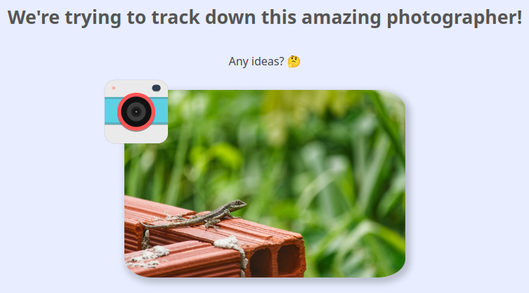
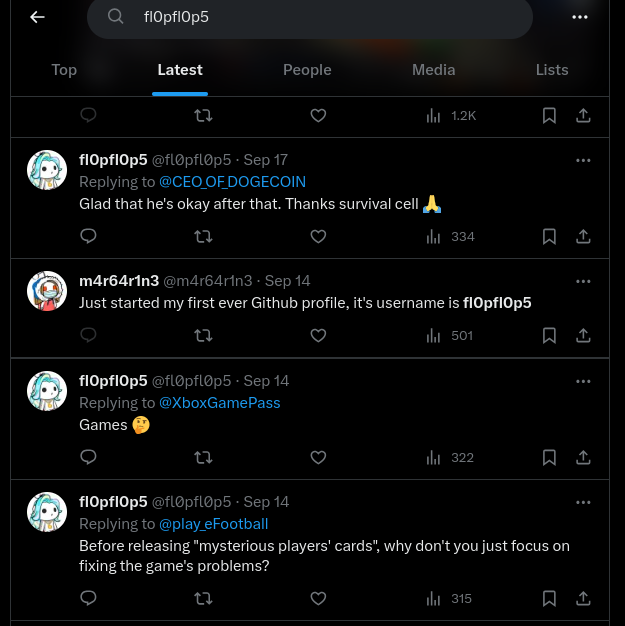
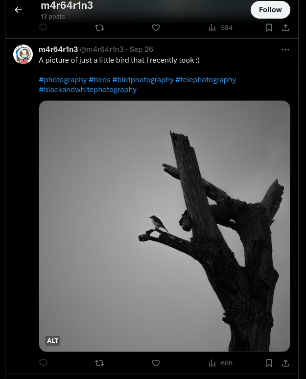
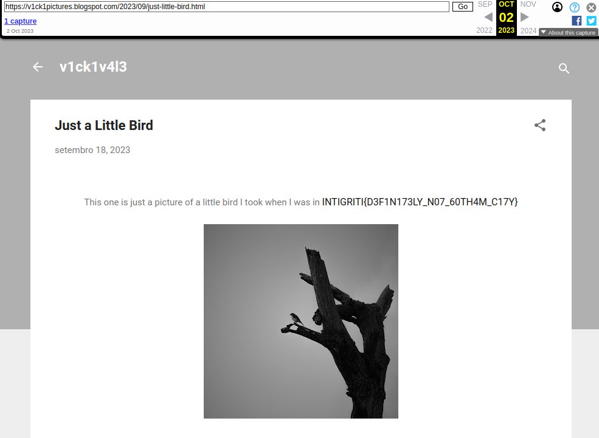

# Photographs [58 Solves]

## Description

> Can you help us track down this photographer? 📸
>
> Author: therealbrenu
>
> <https://photographs.ctf.intigriti.io> || <https://photographs2.ctf.intigriti.io>

## Flag

INTIGRITI{D3F1N173LY_N07_60TH4M_C17Y}

## Solution

<https://photographs.ctf.intigriti.io>:



I should track down the photographer of this photo.
I downloaded this image and save it with the name picture.jpg, and executed [exiftool](https://github.com/exiftool/exiftool).

```console
$ exiftool picture.jpg
(snip)
Creator                         : fl0pfl0p5
(snip)
```

I got image creator fl0pfl0p5.

Used [sherlock](https://github.com/sherlock-project/sherlock) due to search fl0pfl0p5's social media account.

```console
$ sherlock fl0pfl0p5
[*] Checking username fl0pfl0p5 on:

[+] About.me: https://about.me/fl0pfl0p5
[+] Fiverr: https://www.fiverr.com/fl0pfl0p5
[+] G2G: https://www.g2g.com/fl0pfl0p5
[+] GitHub: https://www.github.com/fl0pfl0p5
[+] Lolchess: https://lolchess.gg/profile/na/fl0pfl0p5
[+] Reddit: https://www.reddit.com/user/fl0pfl0p5
[+] TikTok: https://tiktok.com/@fl0pfl0p5
[+] Twitter: https://twitter.com/fl0pfl0p5
[+] Virgool: https://virgool.io/@fl0pfl0p5
[+] Whonix Forum: https://forums.whonix.org/u/fl0pfl0p5/summary
[+] metacritic: https://www.metacritic.com/user/fl0pfl0p5

[*] Search completed with 11 results
```

Found fl0pfl0p5's Twitter account <https://twitter.com/fl0pfl0p5>.
Looking at their Twitter account posts, but couldn't find any useful information.

Searched fl0pfl0p5 on Twitter, found m4r64r1n3.
According to the the post, it can be guessed that it is the same person.



- search URL: <https://twitter.com/search?q=fl0pfl0p5&f=live>
- Post URL: <https://twitter.com/m4r64r1n3/status/1702327471239225654>
- m4r64r1n3's Twitter account: <https://twitter.com/m4r64r1n3>

Looking at the posts on m4r64r1n3's Twitter, I found the bird photo.
According to the post, this photo was taken by them.



- Post URL: <https://twitter.com/m4r64r1n3/status/1706488480753242352>

They seem to have an interest in photography and may have posted this photo on other accounts or on different social media account.

Used Google Image Search and searched this photo, found reddit post in r/AmateurPhotography and v1ck1v4l3 user.

- Reddit Post URL: <https://www.reddit.com/r/AmateurPhotography/comments/16sb8ov/just_a_little_bird_picture_i_took/k2n6hlx/?context=3>
- v1ck1v4l3: <https://www.reddit.com/user/v1ck1v4l3/>

I used sherlock and Google Search v1ck1v4l3 user, but couldn't find any useful account.
I used DuckDuckGo to search for v1ck1v4l3, found their blog.

- DuckDuckGo Search URL: <https://duckduckgo.com/?t=h_&q=v1ck1v4l3&ia=web>
- v1ck1v4l3 Blog: <https://v1ck1pictures.blogspot.com/>

They post only one post, but I couldn't find any useful information.
I used Wayback Machine (archive.org) to look at past post and found the flag.

- Blog Post: <https://v1ck1pictures.blogspot.com/2023/09/just-little-bird.html>
- archive.org URL: <https://web.archive.org/web/20231002010103/https://v1ck1pictures.blogspot.com/2023/09/just-little-bird.html#comments>


