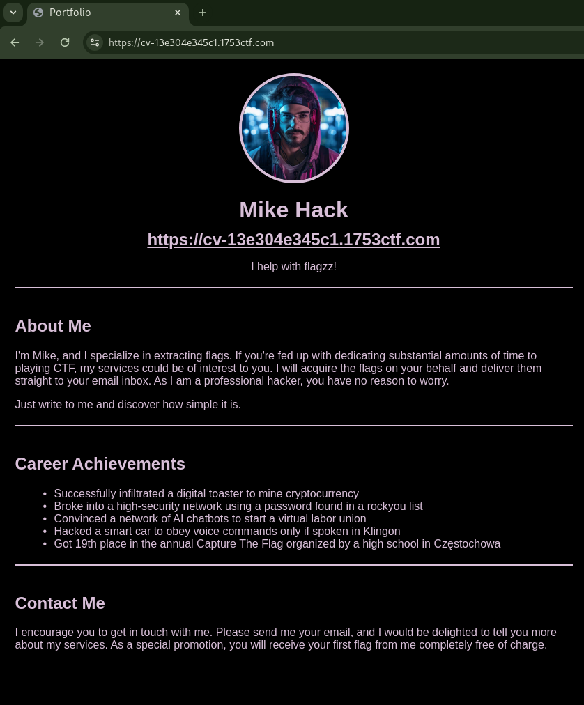
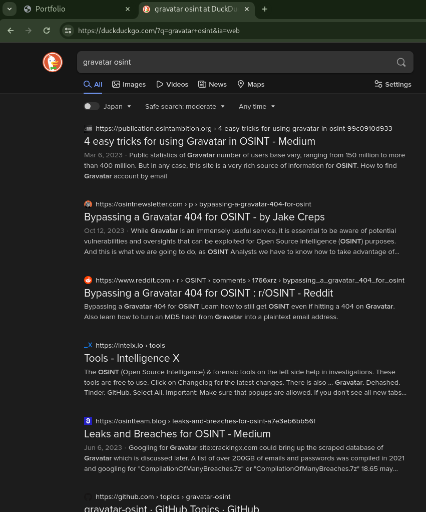

# ✉️ Resume (Score: 330 / Solves: 17)

## Description

> Hi, I'm Mike and this is my resume. Drop me an email if you want to get some flags, cause I got them all...
>
> <https://cv-13e304e345c1.1753ctf.com/>

## Flag

1753c{i_have_dizzz_flagzz_baby}

## Summary

- Identify the MD5 hash of the email address by Gravatar URL path
- Crack the MD5 hash to get the email address

## Solution

Looking at the provided URL:



According to the information provided, it seems like we can obtain the flag by sending them an email.
However, the email address is not on this page.
Therefore, I believe it is necessary to identify their email address.

Their icon URL is <https://www.gravatar.com/avatar/2471b1362bace767fdc0bb9c7e4df686?s=150> and this is hosted in [Gravatar](https://gravatar.com/).
Searching with `gravatar osint`, a certain article came up:



According to [this article](https://publication.osintambition.org/4-easy-tricks-for-using-gravatar-in-osint-99c0910d933?gi=3d9645ddd7cb), the URL path of the avatar consists of the MD5 hash of the email address.
e.g. `https://www.gravatar.com/avatar/MD5`.
In this case, the MD5 hash of their email address is `2471b1362bace767fdc0bb9c7e4df686`.

Furthermore, it is mentioned that information can also be retrieved from `https://en.gravatar.com/MD5_hash.json`.

```console
$ curl -s https://en.gravatar.com/2471b1362bace767fdc0bb9c7e4df686.json | jq
{
  "entry": [
    {
      "hash": "2471b1362bace767fdc0bb9c7e4df686",
      "requestHash": "2471b1362bace767fdc0bb9c7e4df686",
      "profileUrl": "https://gravatar.com/keeponrocking7920420bb4",
      "preferredUsername": "keeponrocking7920420bb4",
      "thumbnailUrl": "https://2.gravatar.com/avatar/2471b1362bace767fdc0bb9c7e4df686",
      "photos": [
        {
          "value": "https://2.gravatar.com/avatar/2471b1362bace767fdc0bb9c7e4df686",
          "type": "thumbnail"
        }
      ],
      "last_profile_edit": "2024-02-12 09:20:28",
      "displayName": "Mike Hack",
      "urls": [],
      "profileBackground": [],
      "share_flags": {
        "search_engines": true
      }
    }
  ]
}
```

I found their username is `keeponrocking7920420bb4` but no email address.
It says `keeponrocking`, I interpreted this as a hint to crack it with rockyou.
The MD5 hash of the email address is `2471b1362bace767fdc0bb9c7e4df686`.
I don't know the domain of the email address, but it seems like `1753ctf.com` could be used.
Actually, I think it would be more thorough to create a list with variations like `keeponrocking7920420bb4@gmail.com` or `keeponrocking@yahoo.com` and crack it with hashcat.

```console
$ echo -n keeponrocking@1753ctf.com | md5sum
2471b1362bace767fdc0bb9c7e4df686  -
```

The hash matched.
`keeponrocking@1753ctf.com` is their email address, so sending an email to this address resulted in a response message, allowing us to obtain the flag.

The received message:

```text
Hey, this is your buddy Mike

Got too many inquiries right now to reply to all, but please feel free to use this first sample flag I’m happy to share with you for free

1753c{i_have_dizzz_flagzz_baby}

I’ll be in touch soon
Mike!
```
