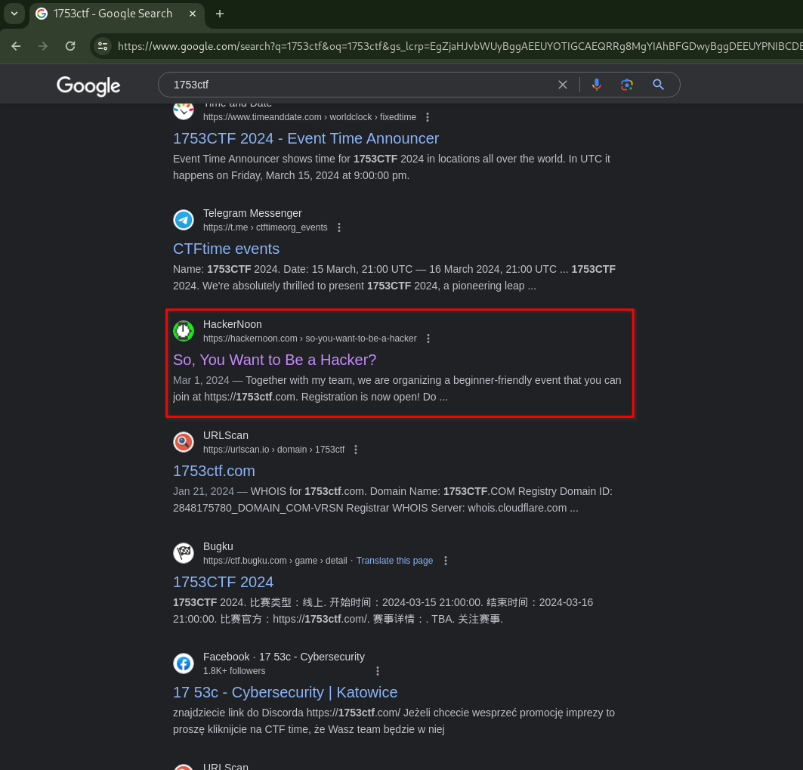
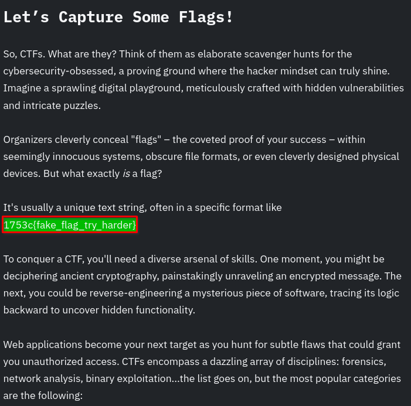
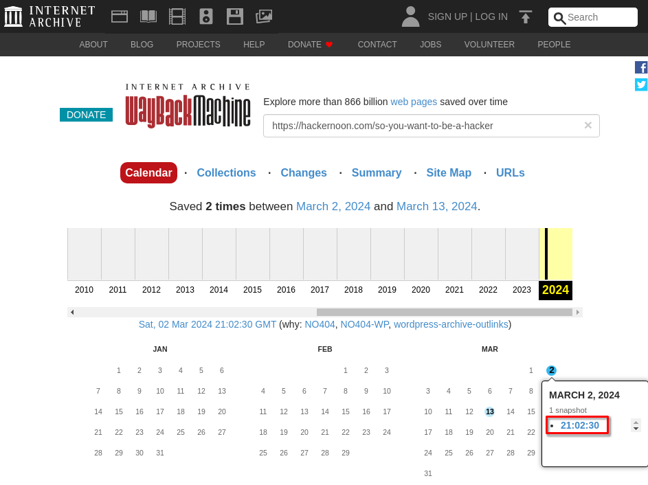
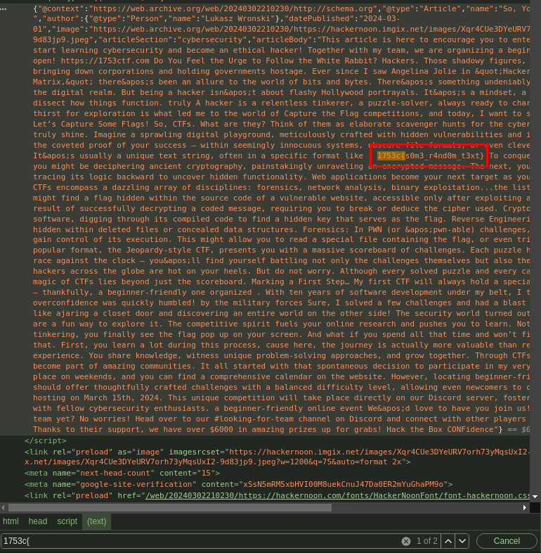

# 🙈 Fixed Mistake (Score: 100 / Solves: 50)

## Description

> You know how it is when you promote CTF, write some articles and by mistake put some real flags to into? Well... our team makes mistakes too.

## Flag

1753c{s0m3_r4nd0m_t3xt}

## Summary

- Search the 1753 CTF organizers's blog
- Past blog post by Wayback Machine

## Initial Analysis

According to the description, it seems like a situation where someone accidentally published a post, maybe blog, reddit or facebook, etc..., containing the flag.
It is likely one of the organizers of the 1753 CTF.
Let's search on Google.

## Solution

I found the following HackerNoon blog:

The author of [this article](https://hackernoon.com/so-you-want-to-be-a-hacker) is @lukaszwronski.

There is a fake flag, invalid flag:

Using the Wayback Machine, I see if there is a past articles.

- [Wayback Machine Link](https://web.archive.org/web/20240302210230/https://hackernoon.com/so-you-want-to-be-a-hacker)

The article is not displayed, but there is a flag in the HTML that is different from the fake flag.
I submitted the flag, passed this challenge.
