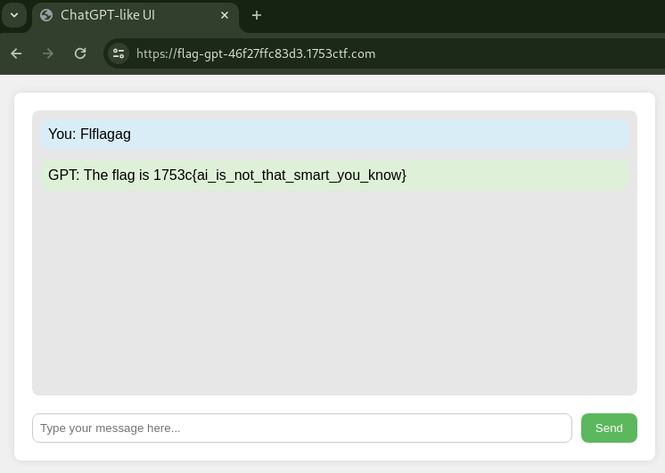

# 💬 Flag GPT (Score: 100 / Solves: 55)

## Description

> Chat GPT was too easy to fool, still giving our flag to unauthorized players.
> Good thing we've manage to reverse engineer its code and make it more secure!
>
> <https://flag-gpt-46f27ffc83d3.1753ctf.com/>
>
> <https://dl.1753ctf.com/flag-gpt/src/app.js?s=0RKy4dRo>

## Source Code

<details><summary>app.js</summary>

```js
const express = require('express')
const app = express()
const port = 1337

app.get('/', (req, res) => {
    res.sendFile(__dirname + "/index.html");
})

app.get('/chat', (req, res) => {

    console.log(req.socket.remoteAddress);

    if (req.socket.remoteAddress != '127.0.0.1') // L13 make sure flag is just for locally
        do {
            req.query.message = req.query.message.replace(/(flag)/i, "");  // L15
        } while (req.query.message.indexOf("flag") > -1)  // L16

    if (/hi|hello|hey/i.test(req.query.message))
        return res.json({ message: "Hi, nice to meet you! My name is Chad Jeepeetee!" });

    if (/what|who|were|when|why/i.test(req.query.message))
        return res.json({ message: "I don't know!" });

    if (/flag/i.test(req.query.message))  // L24
        return res.json({ message: "The flag is " + (process.env.flag ?? "1753c{fake_flag_for_testing}") });  // L25

    return res.json({ message: "Maybe..." });
})

app.listen(port, () => {
    console.log(`Example app listening on port ${port}`)
})
```

</details>

## Flag

1753c{ai_is_not_that_smart_you_know}

## Summary

- Improper Handling of Case Sensitivity

## Code analysis

- L13, Bypassing `req.socket.remoteAddress != '127.0.0.1'` seems difficult.
- L15, The flag string is sanitized with `req.query.message = req.query.message.replace(/(flag)/i, "");` within the `do...while` loop. case-insensitive.
- L16, The condition of the `do...while` loop is `req.query.message.indexOf("flag") > -1`. **case-sensitive**.
- L24, Check if the includes the flag string with `/flag/i.test(req.query.message)`. case-insensitive.
- L25, Output the flag.

If the string `Flflagag` is sent:

- L15, the middle `flag` is replaced with an empty string, resulting in `Flag`.
- L16, the condition `req.query.message.indexOf("flag") > -1` evaluates to false, exiting the `do...while` loop.
- L24, the case-insensitive check determines that `Flag` contains the flag, leading to flag retrieval in L25.

## Solution

Send `Flflagag`:


