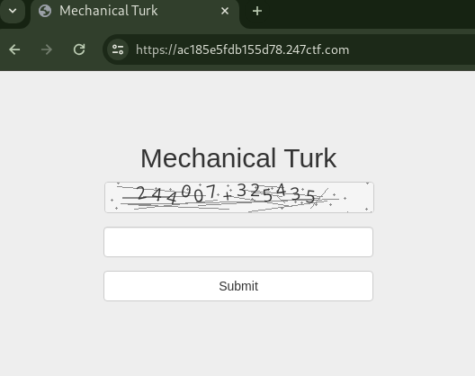

# MECHANICAL TURK [HARD]

## Description

> If you can solve our custom CAPTCHA addition equation 100 times in 30 seconds you will be rewarded with a flag.

## Source Code

No source code.

## Short Solution Description / Tags

Mathematical-based CAPTCHA Breaking

## Initial Analysis



In this challenge, by calculating and submitting a result of an image formula 100 times within 30 seconds, which is the mathematical-based CAPTCHA, we can get the flag.
We need to complete one attempt in 300 ms (30 seconds / 100 attemps).

Manual calculation cannot be completed in time so it is necessary to recognize characters using automation methods such as OCR or machine learning.

## Performance Bottleneck

The CAPTCHA image can be got by /mturk.php URL path.

```console
$ time curl -s -D- https://417e1323e9e25cf4.247ctf.com/mturk.php -o /dev/null

real    0m1.355s
user    0m0.041s
sys     0m0.001s
```

In my location, Japan, it takes more than 1 second to download the image.
Since one attempt needs to be completed in 300 ms or less, it's required to reduce the bottleneck in image download first.

```console
$ dig +noall +answer ac185e5fdb155d78.247ctf.com
ac185e5fdb155d78.247ctf.com. 206 IN     A       144.76.74.118
$ curl -w '\n' -s http://ipinfo.io/144.76.74.118
{
  "ip": "144.76.74.118",
  "hostname": "static.118.74.76.144.clients.your-server.de",
  "city": "Falkenstein",
  "region": "Saxony",
  "country": "DE",
  "loc": "50.4779,12.3713",
  "org": "AS24940 Hetzner Online GmbH",
  "postal": "08223",
  "timezone": "Europe/Berlin",
  "readme": "https://ipinfo.io/missingauth"
}
```

The challenge server is hosted in Germany.
I'll try to download the image on [AWS CloudShell](https://aws.amazon.com/cloudshell/) in a nearby region, Europe (Frankfurt) eu-central-1 region.

```console
[cloudshell-user@ip-10-4-76-7 ~]$ curl -w '\n' -s http://ipinfo.io/
{
  "ip": "3.69.45.180",
  "hostname": "ec2-3-69-45-180.eu-central-1.compute.amazonaws.com",
  "city": "Frankfurt am Main",
  "region": "Hesse",
  "country": "DE",
  "loc": "50.1155,8.6842",
  "org": "AS16509 Amazon.com, Inc.",
  "postal": "60306",
  "timezone": "Europe/Berlin",
  "readme": "https://ipinfo.io/missingauth"
}

[cloudshell-user@ip-10-4-76-7 ~]$ time curl -s -o /dev/null https://ac185e5fdb155d78.247ctf.com/mturk.php

real    0m0.091s
user    0m0.031s
sys     0m0.005s
```

Running it several times, I confirmed to be able to download the image in around 100 ms.
This resolves the bottleneck in image download.

## Character Recognition Automation

Refered with [Adam Geitgey's blog post](https://medium.com/@ageitgey/how-to-break-a-captcha-system-in-15-minutes-with-machine-learning-dbebb035a710), I scripted [train_and_solve.ipynb](train_and_solve.ipynb) to train and test a machine learning model, and [solver.py](solver.py) to predict characters by the trained model and send a CAPTCHA calculation to the challenge server.
Used Python Pillow to generate images for each character, extracted them using OpenCV Contours for training data, and trained the model.
Similarly, by OpenCV Contours, extracted each character from downloaded CAPTCHA image and predict them.

While it was not be fast in a local environment, it worked without any issues.
Additionally, it took around 100 ms to recognize the a equation formula of an image so it seems possible to keep one attempt within 300 ms.

## Solution

Archive the trained model and the solver.py into a zip file, and upload it to AWS CloudShell environment in the eu-central-1 region.

In local:

```bash
zip -q mturk.zip -r requirements.txt solver.py model.keras model_labels.dat
```

In CloudShell:

```bash
sudo su -
cd /tmp
mv /home/cloudshell-user/mturk.zip .
unzip -q mturk.zip 
yum install libglvnd-glx -y
pip3 install -r requirements.txt --no-cache-dir
time python3 solver.py
```

Output:

```text
...
[+] download time: 0.020607471466064453
[+] predict time: 0.09108734130859375
Valid CAPTCHA! 0 to go!
[+] All processing time: 0.1268775463104248

[+] download time: 0.02163100242614746
[+] predict time: 0.0735926628112793
247CTF{[REDACTED]}

real    0m20.068s
user    0m9.569s
sys     0m1.089s
```
