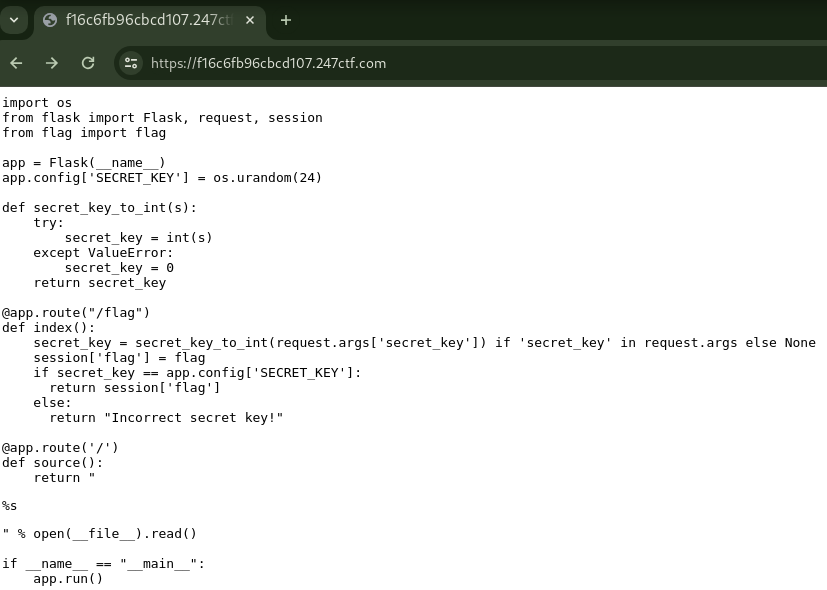

# SECURED SESSION [EASY]

## Description

> If you can guess our random secret key, we will tell you the flag securely stored in your session.

## Source Code



<details><summary>Click here for source code in text format</summary>

```python
import os
from flask import Flask, request, session
from flag import flag

app = Flask(__name__)
app.config['SECRET_KEY'] = os.urandom(24)

def secret_key_to_int(s):
    try:
        secret_key = int(s)
    except ValueError:
        secret_key = 0
    return secret_key

@app.route("/flag")
def index():
    secret_key = secret_key_to_int(request.args['secret_key']) if 'secret_key' in request.args else None
    session['flag'] = flag
    if secret_key == app.config['SECRET_KEY']:
      return session['flag']
    else:
      return "Incorrect secret key!"

@app.route('/')
def source():
    return "<pre>%s</pre>" % open(__file__).read()

if __name__ == "__main__":
    app.run()
```

</details>

## Short Solution Description / Tags

Information Leak by Flask Session Cookie

## Solution

The flag is stored as `session` object.
We can leak this by decoding Flask Session Cookie.

```console
$ curl -D- https://f16c6fb96cbcd107.247ctf.com/flag
...
Set-Cookie: session=ey[REDACTED]X0.ZY0M-w.c5Ba5P-GsrW3qvhUZiVWMDs_yPA; HttpOnly; Path=/

Incorrect secret key!

$ echo -n ey[REDACTED]X0 | base64 -d
{"flag":{" b":"Mj[REDACTED]fQ=="}}base64: invalid input

$ echo -n Mj[REDACTED]fQ== | base64 -d
247CTF{[REDACTED]}
```
