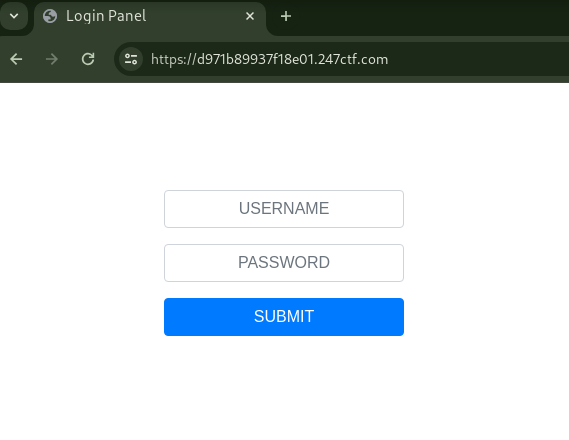
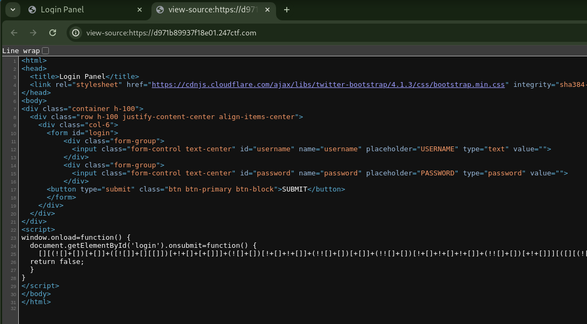
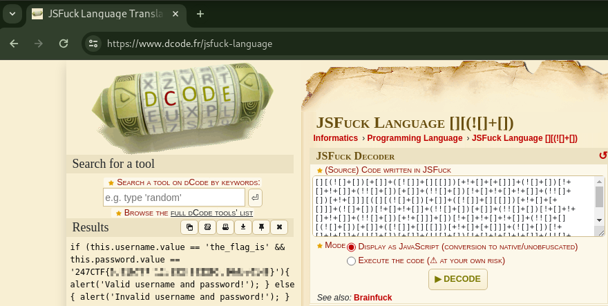

# TRUSTED CLIENT [EASY]

## Description

> Developers don't always have time to setup a backend service when prototyping code. Storing credentials on the client side should be fine as long as it's obfuscated right?

## Short Solution Description / Tags

JSFuck Deobfuscation

## Solution

This challenge's web application has user authz functionality.

The validation for username and password is on client side using JSFuck.

I decoded the JSFuck by [JSFuck Language Translator](https://www.dcode.fr/jsfuck-language), I got the correct username and password, the password is flag.
