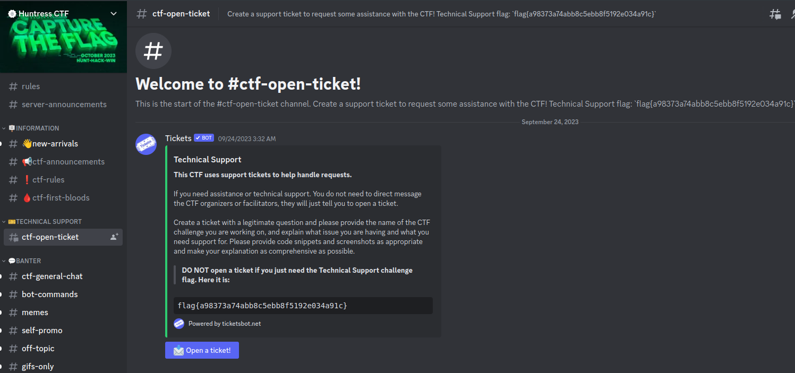

# Huntress CTF

## Notepad

### Description

> Just a sanity check... you do know how to use a computer, right?
>
> Download the files below.
>
> Attachments: notepad

### Flag

flag{2dd41e3da37ef1238954d8e7f3217cd8}

### Solution

The flag is in the attached `notepad` file.

```console
root@kali:~/ctf/HuntressCTF/Notepad# cat notepad
+------------------------------------------------------+
| [✖] [□] [▬]  Notepad                              - |
|------------------------------------------------------|
| File   Edit   Format   View   Help                   |
|------------------------------------------------------|
|                                                      |
|                                                      |
|   New Text Document - Notepad                        |
|                                                      |
|     flag{2dd41e3da37ef1238954d8e7f3217cd8}           |
|                                                      |
|                                                      |
|                                                      |
|                                                      |
|                                                      |
|                                                      |
|                                                      |
|                                                      |
|                                                      |
|                                                      |
+------------------------------------------------------+
| Ln 1, Col 40                                         |
+------------------------------------------------------+
```

## Technical Support

### Description

> Want to join the party of GIFs, memes and emoji shenanigans? Or just want to ask a question for technical support regarding any challenges in the CTF?
>
> This CTF uses support tickets to help handle requests. If you need assistance, please create a ticket with the **#ctf-open-ticket** channel. You do not need to direct message any CTF organizers or facilitators, they will just tell you to open a ticket. You might find a flag in the ticket channel, though!
>
> Connect here:
>
> Join the Discord!

### Flag

flag{a98373a74abb8c5ebb8f5192e034a91c}

### Solution

Looking at `#ctf-open-ticket` channel, found flag in the message.



## String Cheese

### Description

> Oh, a cheese stick! This was my favorite snack as a kid. My mom always called it by a different name though...
>
> Download the file(s) below.
>
> Attachments: cheese.jpg

### Flag

flag{f4d9f0f70bf353f2ca23d81dcf7c9099}

### Solution

I got the flag by `strings` command.

```console
root@kali:~/ctf/HuntressCTF# strings cheese.jpg | grep flag
flag{f4d9f0f70bf353f2ca23d81dcf7c9099}
```

## Read The Rules

### Description

> Please follow the rules for this CTF!
>
> Connect here:
>
> [Read The Rules](https://huntress.ctf.games/rules)

### Flag

flag{90bc54705794a62015369fd8e86e557b}

### Solution

The flag is in HTML source code.

```console
root@kali:~/ctf/HuntressCTF# curl -s https://huntress.ctf.games/rules | grep -oE 'flag{[0-9a-fA-F]{32}}'
flag{90bc54705794a62015369fd8e86e557b}
```

## Query Code

### Description

> What's this?
>
> Download the file(s) below.
>
> Attachments: query_code

### Flag

flag{3434cf5dc6a865657ea1ec1cb675ce3b}

### Solution

```console
root@kali:~/ctf/HuntressCTF# file query_code
query_code: PNG image data, 111 x 111, 1-bit colormap, non-interlaced
```

The attached `query_code` file is PNG image and it's the following.


This file is QR Code, and therefore I decode it.
[`zbarimg`](https://github.com/mchehab/zbar) command is useful, which is provided by `zbar-tools` package in Debian-based distribution.

```console
root@kali:~/ctf/HuntressCTF# apt install zbar-tools
(snip)
root@kali:~/ctf/HuntressCTF# zbarimg query_code
QR-Code:flag{3434cf5dc6a865657ea1ec1cb675ce3b}

scanned 1 barcode symbols from 1 images in 0.04 seconds
```

## Zerion

### Description

> We observed some odd network traffic, and found this file on our web server... can you find the strange domains that our systems are reaching out to?
>
> NOTE, this challenge is based off of a real malware sample. We have done our best to "defang" the code, but out of abudance of caution it is strongly encouraged you only analyze this inside of a virtual environment separate from any production devices.
>
> Download the file(s) below.
>
> Attachments: zerion

### Flag

flag{af10370d485952897d5183aa09e19883}

### Solution

The attached file is obfuscated PHP code.

Beautified:

```php
<?php $L66Rgr = explode(base64_decode("Pz4="), file_get_contents(__FILE__));
$L6CRgr = [
    base64_decode("L3gvaQ=="),
    base64_decode("eA=="),
    base64_decode(strrev(str_rot13($L66Rgr[1]))),
];
$L7CRgr = "d6d666e70e43a3aeaec1be01341d9f9d";
preg_replace($L6CRgr[0], serialize(eval($L6CRgr[2])), $L6CRgr[1]);
exit(); ?>
==Dstfmo (snip)
```

In L1, it reads the content of this file by using `file_get_contents(__FILE__)`.
`Pz4=` is Base64 encoded string and the decoded string is `?>`.
[`explode`](https://www.php.net/manual/en/function.explode.php) is the function to split a string.
Thus, `$L66Rgr[1]` is the string starting with `==Dstfmo` after `?>`.
In L5, `$L66Rgr[1]` is rotated by 13 places ([ROT13](`$L66Rgr[1]`)), reversed, and Base64 decoded.
Decoded it, got flag.

```console
root@kali:~/ctf/HuntressCTF# vi tmp.txt  # save the string starting with `==Dstfmo` after `?>`

root@kali:~/ctf/HuntressCTF# cat tmp.txt | tr 'A-Za-z' 'N-ZA-Mn-za-m' | rev | base64 -d | grep -o 'flag{.*}'
flag{af10370d485952897d5183aa09e19883}
```
