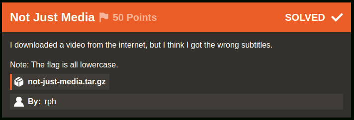
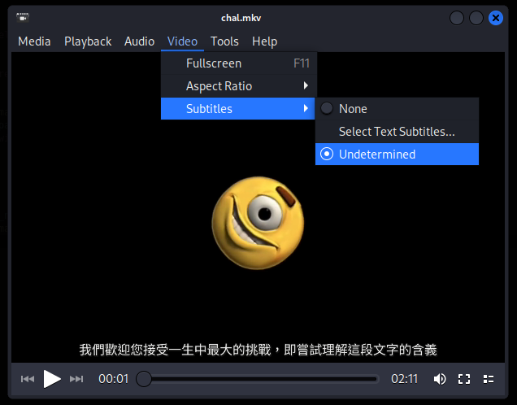
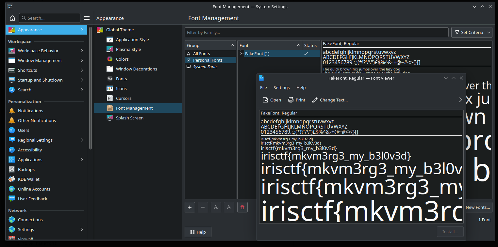

# Not Just Media [127 Solves]

## Description



> I downloaded a video from the internet, but I think I got the wrong subtitles.
>
> Note: The flag is all lowercase.
>
> `not-just-media.tar.gz`
>
> By: rph

## Short Solution

Read subtitle with FakeFont embbed with chal.mkv.

## Solution

```console
$ tar ztf not-just-media.tar.gz
not-just-media/
not-just-media/chal.mkv
not-just-media/credits.txt

cd not-just-media

$ file chal.mkv
chal.mkv: Matroska data

$ parole chal.mkv  # open chal.mkv with Parole Media Player
```



There is something written in the subtitle.
I will extract it from the video using [MKVToolNix](https://mkvtoolnix.download/).

```console
$ apt install -y mkvtoolnix
...
$ mkvmerge -i chal.mkv
File 'chal.mkv': container: Matroska
Track ID 0: video (AVC/H.264/MPEG-4p10)
Track ID 1: audio (AAC)
Track ID 2: subtitles (SubStationAlpha)
Attachment ID 1: type 'font/ttf', size 7110560 bytes, description 'Imported font from Untitled.ass', file name 'NotoSansTC-Regular_0.ttf'
Attachment ID 2: type 'font/ttf', size 64304 bytes, description 'Imported font from Untitled.ass', file name 'FakeFont_0.ttf'
Attachment ID 3: type 'font/ttf', size 582748 bytes, description 'Imported font from Untitled.ass', file name 'NotoSans-Regular_0.ttf'
Global tags: 1 entry

$ cat subtitle.txt
[Script Info]
; Script generated by Aegisub 3.3.3
; http://www.aegisub.org/
Title: Default Aegisub file
ScriptType: v4.00+
WrapStyle: 0
ScaledBorderAndShadow: yes
YCbCr Matrix: None
PlayResX: 1280
PlayResY: 720

[Aegisub Project Garbage]
Last Style Storage: Default
Video File: ?dummy:23.976000:40000:1280:720:47:163:254:
Video AR Value: 1.777778
Video Zoom Percent: 1.125000

[V4+ Styles]
Format: Name, Fontname, Fontsize, PrimaryColour, SecondaryColour, OutlineColour, BackColour, Bold, Italic, Underline, StrikeOut, ScaleX, ScaleY, Spacing, Angle, BorderStyle, Outline, Shadow, Alignment, MarginL, MarginR, MarginV, Encoding
Style: Default,Noto Sans,48,&H00FFFFFF,&H000000FF,&H00000000,&H00000000,0,0,0,0,100,100,0,0,1,2,2,2,10,10,10,1
Style: CJK,Noto Sans TC,48,&H00FFFFFF,&H000000FF,&H00000000,&H00000000,0,0,0,0,100,100,0,0,1,2,2,2,10,10,10,1

[Events]
Format: Layer, Start, End, Style, Name, MarginL, MarginR, MarginV, Effect, Text
Dialogue: 0,0:00:00.00,0:02:10.00,CJK,,0,0,0,,我們歡迎您接受一生中最大的挑戰，即嘗試理解這段文字的含義

```

Translated the Chinese `我們歡迎您接受一生中最大的挑戰，即嘗試理解這段文字的含義` by Google Translate, it meant `We welcome you to take on the greatest challenge of your life, which is to try to understand the meaning of this text` in English.

The output by mkvmerge command includes Attachment ID 2 FakeFont_0.ttf, which does not seem to be a common font.
I will extract FakeFont_0.ttf.

```console
$ mkvextract chal.mkv attachments 2:fakefont
The attachment #2, ID 13557627962983747543, MIME type font/ttf, size 64304, is written to 'fakefont'.

$ file fakefont
fakefont: TrueType Font data, 13 tables, 1st "GDEF", 14 names, Macintosh

$ strings -a -n 5 -t x fakefont
...
   e3d8 Copyright 2022 The Noto Project Authors (https://github.com/notofonts/latin-greek-cyrillic)
   e434 Modified for IrisCTF
   e45b FakeFont
   e474 Regular
```

This FakeFont is modified for this IrisCTF 2024 so I guess to need this FakeFont font for flag.
It seems the subtitle is rendering with Noto Sans Font so I will try to open `我們歡迎您接受一生中最大的挑戰，即嘗試理解這段文字的含義` with FakeFont.
There are various font management tools depending on the operating system and desktop environment.
My host machine is KDE so I used [KDE Font Viewer](https://docs.kde.org/stable5/en/plasma-desktop/kfontview/index.html).



Got the flag.

## Flag

irisctf{mkvm3rg3_my_b3l0v3d}

## References

- [MKVToolNix news – Matroska tools for Linux/Unix and Windows](https://mkvtoolnix.download/)
- [Extract subtitle from mkv files - Ask Ubuntu](https://askubuntu.com/questions/452268/extract-subtitle-from-mkv-files)
