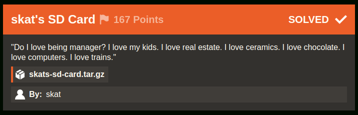

# skat's SD Card [86 Solves]

## Description



> "Do I love being manager? I love my kids. I love real estate. I love ceramics. I love chocolate. I love computers. I love trains."
>
> `skats-sd-card.tar.gz`
>
> By: skat

## Short Solution

- The attachment is Linux disk image
- Take a close look at skat user's .bash_history
- Crack skat's SSH key password and git clone the private repository with it, and get the flag.

## Solution

```console
$ tar ztf skats-sd-card.tar.gz
skats-sd-card/
skats-sd-card/mmcblk0p2.img.zip

$ cd skats-sd-card

$ unzip mmcblk0p2.img.zip
Archive:  mmcblk0p2.img.zip
  inflating: mmcblk0p2.img

$ file mmcblk0p2.img
mmcblk0p2.img: Linux rev 1.0 ext4 filesystem data, UUID=4aa56689-dcb4-4759-90e6-179beae559ac, volume name "rootfs" (extents) (large files)

$ mkdir mnt

$ mount mmcblk0p2.img mnt
$ cd mnt
$ tree -L 1
.
├── bin -> usr/bin
├── boot
├── dev
├── etc
├── home
├── initrd.img -> boot/initrd.img-6.1.0-rpi7-rpi-v8
├── initrd.img.old -> boot/initrd.img-6.1.0-rpi7-rpi-2712
├── lib -> usr/lib
├── lost+found
├── media
├── mnt
├── opt
├── proc
├── root
├── run
├── sbin -> usr/sbin
├── srv
├── sys
├── tmp
├── usr
├── var
├── vmlinuz -> boot/vmlinuz-6.1.0-rpi7-rpi-v8
└── vmlinuz.old -> boot/vmlinuz-6.1.0-rpi7-rpi-2712

20 directories, 4 files
```

I'ts Linux file structire.
By taking a close look, it seems /home/skat directory is specious.

```console
$ cd home/skat/

$ ls -la
total 88
drwx------ 16 1000 1000 4096 Jan  6 03:50 .
drwxr-xr-x  3 root root 4096 Dec  5 14:19 ..
-rw-------  1 1000 1000  263 Jan  6 03:50 .bash_history
-rw-r--r--  1 1000 1000  220 Dec  5 13:38 .bash_logout
-rw-r--r--  1 1000 1000 3523 Dec  5 13:38 .bashrc
drwxr-xr-x  2 1000 1000 4096 Dec  5 13:47 Bookshelf
drwxr-xr-x  7 1000 1000 4096 Jan  6 03:38 .cache
drwxr-xr-x  7 1000 1000 4096 Jan  6 03:24 .config
drwxr-xr-x  2 1000 1000 4096 Dec  5 14:19 Desktop
drwxr-xr-x  2 1000 1000 4096 Dec  5 14:19 Documents
drwxr-xr-x  2 1000 1000 4096 Jan  6 03:50 Downloads
drwxr-xr-x  4 1000 1000 4096 Dec  5 14:19 .local
drwx------  4 1000 1000 4096 Jan  6 03:37 .mozilla
drwxr-xr-x  2 1000 1000 4096 Dec  5 14:19 Music
drwxr-xr-x  2 1000 1000 4096 Dec  5 14:19 Pictures
-rw-r--r--  1 1000 1000  807 Dec  5 13:38 .profile
drwxr-xr-x  2 1000 1000 4096 Dec  5 14:19 Public
drwx------  2 1000 1000 4096 Jan  6 03:50 .ssh
-rw-r--r--  1 1000 1000    0 Dec  5 14:19 .sudo_as_admin_successful
drwxr-xr-x  2 1000 1000 4096 Dec  5 14:19 Templates
drwxr-xr-x  2 1000 1000 4096 Dec  5 14:19 Videos
-rw-------  1 1000 1000   56 Dec  5 14:19 .Xauthority
-rw-------  1 1000 1000 2426 Dec  5 14:19 .xsession-errors

$ cat .bash_history
ip a
ps -aux
ls */
tree
tree -a
ssh-keygen
cat .ssh/id_rsa.pub
cd Downloads/
git clone
git clone git@github.com:IrisSec/skats-interesting-things.git
cd skats-interesting-things/
ls
cat README.md
cat article6.txt
cd ../
ls
rm -rf skats-interesting-things/
exit
```

The skat user cloned the GitHub repository `git@github.com:IrisSec/skats-interesting-things.git`, which URL is [this](https://github.com/IrisSec/skats-interesting-things) and I cannot see it.
I see the public key being displayed with `cat` so I guess that they registered that public key on their GitHub and then executed a `git clone`.
I will try to do the same.

```console
$ ls -la .ssh/
total 24
drwx------  2 1000 1000 4096 Jan  6 03:50 .
drwx------ 16 1000 1000 4096 Jan  6 03:50 ..
-rw-------  1 1000 1000 2655 Jan  6 03:37 id_rsa
-rw-r--r--  1 1000 1000  570 Jan  6 03:37 id_rsa.pub
-rw-------  1 1000 1000  978 Jan  6 03:50 known_hosts
-rw-r--r--  1 1000 1000  142 Jan  6 03:49 known_hosts.old

$ file .ssh/id_rsa
.ssh/id_rsa: OpenSSH private key

$ GIT_SSH_COMMAND="ssh -i .ssh/id_rsa -F /dev/null" git clone git@github.com:IrisSec/skats-interesting-things.git
Cloning into 'skats-interesting-things'...
warning: templates not found in /root/.git-templates/git-secrets
Enter passphrase for key '.ssh/id_rsa':
```

SSH password is required so I see if I can cracked it.

```console
$ ssh2john .ssh/id_rsa > hash.txt

$ john hash.txt --wordlist=/usr/share/wordlists/rockyou.txt
Using default input encoding: UTF-8
Loaded 1 password hash (SSH, SSH private key [RSA/DSA/EC/OPENSSH 32/64])
Cost 1 (KDF/cipher [0=MD5/AES 1=MD5/3DES 2=Bcrypt/AES]) is 2 for all loaded hashes
Cost 2 (iteration count) is 16 for all loaded hashes
Will run 8 OpenMP threads
Press 'q' or Ctrl-C to abort, almost any other key for status
password         (.ssh/id_rsa)
1g 0:00:00:02 DONE (2024-01-08 14:57) 0.3584g/s 22.93p/s 22.93c/s 22.93C/s 123456..charlie
Use the "--show" option to display all of the cracked passwords reliably
Session completed.
```

Cracking was successful.
The password is password.

```console
$ GIT_SSH_COMMAND="ssh -i .ssh/id_rsa -F /dev/null" git clone git@github.com:IrisSec/skats-interesting-things.git
Cloning into 'skats-interesting-things'...
warning: templates not found in /root/.git-templates/git-secrets
Enter passphrase for key '.ssh/id_rsa':
remote: Enumerating objects: 30, done.
remote: Counting objects: 100% (30/30), done.
remote: Compressing objects: 100% (20/20), done.
remote: Total 30 (delta 9), reused 30 (delta 9), pack-reused 0
Receiving objects: 100% (30/30), 15.31 KiB | 1.09 MiB/s, done.
Resolving deltas: 100% (9/9), done.
```

`git clone` was successful so check it.

```console
$ cd skats-interesting-things

$ git log --stat
...
commit 680ec84ca3877b9a4083242a192eb4481050edc5
Author: shawnduong <me@shawnd.xyz>
Date:   Thu Dec 28 10:46:53 2023 -0800

    Fix.

 article4.txt | 2 --
 1 file changed, 2 deletions(-)
...
```

The deletions is only present in this commit so check it.

```console
$ git show 680ec84ca3877b9a4083242a192eb4481050edc5
commit 680ec84ca3877b9a4083242a192eb4481050edc5
Author: shawnduong <me@shawnd.xyz>
Date:   Thu Dec 28 10:46:53 2023 -0800

    Fix.

diff --git a/article4.txt b/article4.txt
index 846ad0e..3312ad2 100644
--- a/article4.txt
+++ b/article4.txt
@@ -18,7 +18,5 @@ As AI becomes increasingly pervasive, ethical considerations and societal impact
 The Future of AI:
 Looking ahead, the future of AI holds transformative possibilities. Advances in quantum computing, reinforcement learning, and explainable AI promise to elevate the capabilities and transparency of intelligent systems. Ethical AI frameworks and interdisciplinary collaboration will play a pivotal role in shaping the trajectory of AI development, ensuring that the benefits are equitably distributed, and potential risks are mitigated.

-irisctf{0h_cr4p_ive_left_my_k3ys_out_4nd_ab0ut}
-
 Conclusion:
 Artificial intelligence stands as a testament to humanity's capacity for innovation and exploration. From its historical roots to its diverse applications and ethical considerations, AI continues to reshape the landscape of technology. As we navigate the frontiers of intelligent machines, a thoughtful and ethical approach is essential to harnessing the full potential of AI for the betterment of society, opening the door to a future where human ingenuity and artificial intelligence coalesce to solve the challenges of our interconnected world.
```

Got the flag.

## Flag

irisctf{0h_cr4p_ive_left_my_k3ys_out_4nd_ab0ut}
