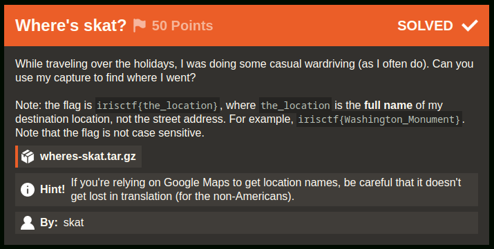
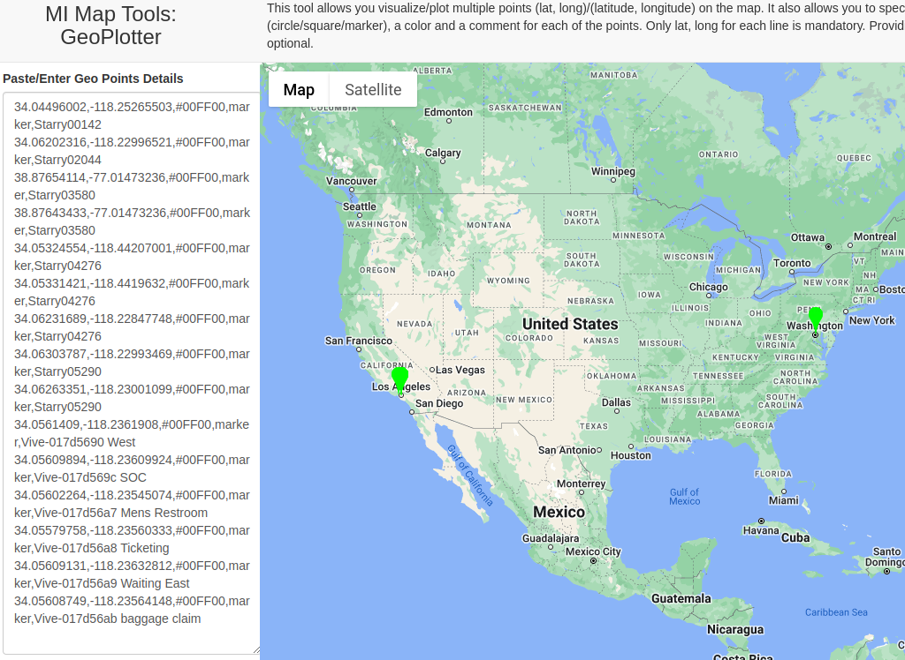
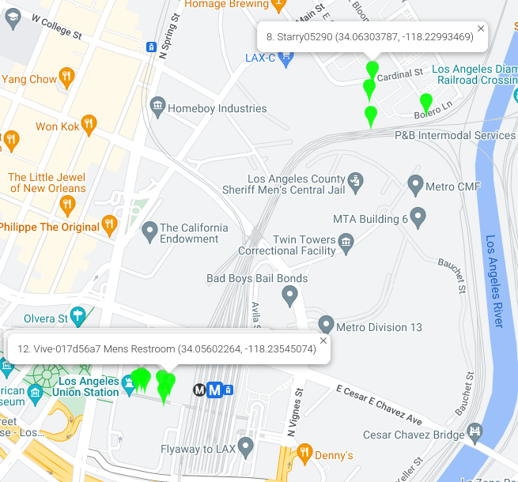

# Where's skat? [134 Solves]

## Description



> While traveling over the holidays, I was doing some casual wardriving (as I often do). Can you use my capture to find where I went?
>
> Note: the flag is `irisctf{the_location}`, where `the_location` is the full name of my destination location, not the street address. For example, `irisctf{Washington_Monument}`. Note that the flag is not case sensitive.
>
> `wheres-skat.tar.gz`
>
> Hint! If you're relying on Google Maps to get location names, be careful that it doesn't get lost in translation (for the non-Americans).
>
> By: skat

## Short Solution

- Extract SSID the packet capture
- Search SSID latitude and longitude by WiGLE
- Mapping by [MI Map Tools: GeoPlotter](https://mobisoftinfotech.com/tools/plot-multiple-points-on-map/).

## Solution

### Attachment / Source Code

```console
$ tar zxvf wheres-skat.tar.gz
wheres-skat/
wheres-skat/wheres-skat.zip

$ unzip wheres-skat/wheres-skat.zip
Archive:  wheres-skat/wheres-skat.zip
  inflating: wheres-skat.pcap

$ file wheres-skat.pcap
wheres-skat.pcap: pcap capture file, microsecond ts (little-endian) - version 2.4 (802.11, capture length 65535)
```

### Initial Analysis

[Wardriving](https://en.wikipedia.org/wiki/Wardriving)

> Wardriving is the act of searching for Wi-Fi wireless networks, usually from a moving vehicle, using a laptop or smartphone. Software for wardriving is freely available on the internet.

Looking at the provided wheres-skat.pcap file with Wireshark, a SSID is recorded.
We can get the latitude and longitude of SSID by [WiGLE](https://wigle.net/).

### SSID latitude and longitude

Extract SSID from the pcap file:

```bash
$ tshark -r wheres-skat.pcap | grep -Eo 'SSID=.*' | sort -u | sed -e 's/SSID=//g' | tr -d '"' > ssids.txt
$ wc -l ssids.txt
145 ssids.txt
```

Since there are multiple SSIDs, examining all the latitude and longitude could lead to noisy locations.
Therefore, I will try to investigate only distinctive SSIDs.
This time, I used distinctive SSIDs starting with `Starry` and `Vive-`.

```console
$ TZ=UTC tshark -r wheres-skat.pcap -t u -T fields -e frame.time | head -1
Dec 24, 2023 17:48:17.672803000 UTC

$ TZ=UTC tshark -r wheres-skat.pcap -t u -T fields -e frame.time | tail -1
Dec 24, 2023 17:55:46.619686000 UTC
```

The packets is captured on 2023/12/24.
Since the SSIDs recorded on this day may not have been uploaded to WiGLE, I will investigate the period from 2023/1/1 to 2023/12/26, instead of filtering only for 2023/12/24.

ssid2latlong.py

```python
import datetime
import os
import traceback
import requests
import requests_cache
from requests.auth import HTTPBasicAuth

requests.packages.urllib3.disable_warnings()
# s = requests.Session()

# Due to API limit on the WiGLE API, use requests-cache
# https://pypi.org/project/requests-cache/
s = requests_cache.CachedSession()

# s.proxies = {"http": "http://127.0.0.1:8080", "https": "http://127.0.0.1:8080"}
s.verify = False

# API_NAME and API_TOKEN is in https://wigle.net/account
basic = HTTPBasicAuth(os.environ["API_NAME"], os.environ["API_TOKEN"])
s.auth = basic


SSIDS = """\
Starry00142
Starry00142_extra2
Starry02044
Starry03580
Starry03656_extra2
Starry04276
Starry05290
Starry07822
Vive-017d5690 West
Vive-017d569c SOC
Vive-017d56a7 Mens Restroom
Vive-017d56a8 Ticketing
Vive-017d56a9 Waiting East
Vive-017d56ab baggage claim
"""
SSIDS = SSIDS.strip().split("\n")


def main():
    for ssid in SSIDS:
        r = s.get("https://api.wigle.net/api/v2/network/search", params={"ssid": ssid})

        try:
            r = r.json()
            if not r["success"]:
                continue

            for result in r["results"]:
                lastupdt = datetime.datetime.fromisoformat(result["lastupdt"])
                if lastupdt < datetime.datetime.fromisoformat(
                    "2023-01-01T00:00:000Z"
                ) or lastupdt > datetime.datetime.fromisoformat(
                    "2023-12-26T00:00:000Z"
                ):
                    continue

                lat = result["trilat"]
                long = result["trilong"]

                with open("ssids.csv", "a") as f:
                    output = f"{lat},{long},#00FF00,marker,{ssid}\n"
                    f.write(output)
                    # print(output)
        except Exception:
            print(traceback.format_exc())
            continue


if __name__ == "__main__":
    main()
```

ssids.csv

```csv
34.04496002,-118.25265503,#00FF00,marker,Starry00142
34.06202316,-118.22996521,#00FF00,marker,Starry02044
38.87654114,-77.01473236,#00FF00,marker,Starry03580
38.87643433,-77.01473236,#00FF00,marker,Starry03580
34.05324554,-118.44207001,#00FF00,marker,Starry04276
34.05331421,-118.4419632,#00FF00,marker,Starry04276
34.06231689,-118.22847748,#00FF00,marker,Starry04276
34.06303787,-118.22993469,#00FF00,marker,Starry05290
34.06263351,-118.23001099,#00FF00,marker,Starry05290
34.0561409,-118.2361908,#00FF00,marker,Vive-017d5690 West
34.05609894,-118.23609924,#00FF00,marker,Vive-017d569c SOC
34.05602264,-118.23545074,#00FF00,marker,Vive-017d56a7 Mens Restroom
34.05579758,-118.23560333,#00FF00,marker,Vive-017d56a8 Ticketing
34.05609131,-118.23632812,#00FF00,marker,Vive-017d56a9 Waiting East
34.05608749,-118.23564148,#00FF00,marker,Vive-017d56ab baggage claim
```

### Mapping SSID

Mapping lat-long by [MI Map Tools: GeoPlotter](https://mobisoftinfotech.com/tools/plot-multiple-points-on-map/).



There are many plots in Los Angeles.
I will take a closer look.



Many plots is in Los Angeles Union Station.

correct flag: irisctf{Los_Angeles_Union_Station}

## Flag

irisctf{Los_Angeles_Union_Station}

## Tools

- [WiGLE: Wireless Network Mapping](https://wigle.net/)
- [WiGLE API](https://api.wigle.net/swagger#/Network%20search%20and%20information%20tools/search_2)
- [MI Map Tools: GeoPlotter](https://mobisoftinfotech.com/tools/plot-multiple-points-on-map/).
- [Find GPS coordinates on Google maps \| Latitude Longitude Search](https://www.maps.ie/coordinates.html)
