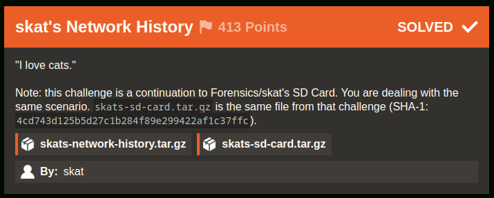
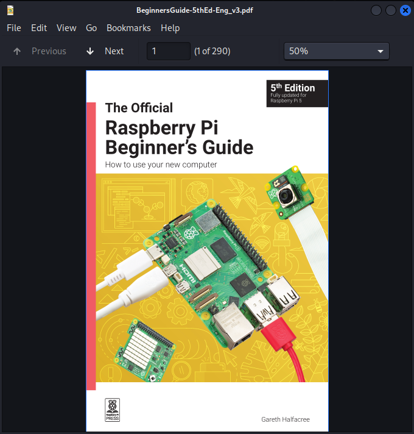
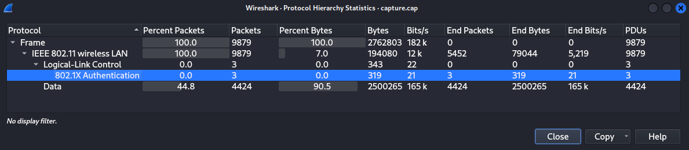
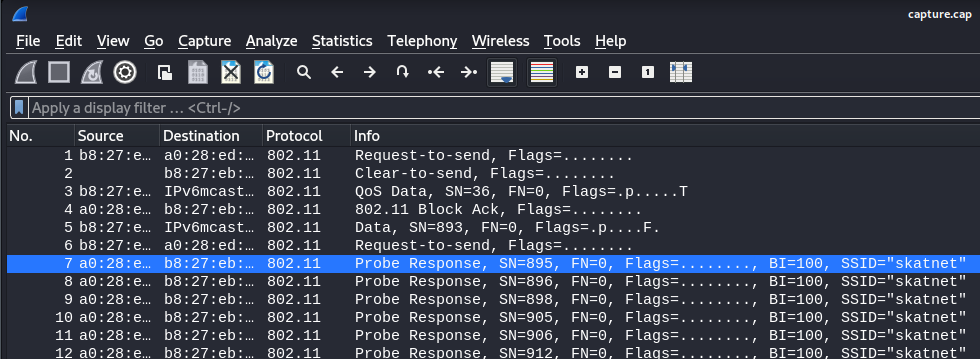
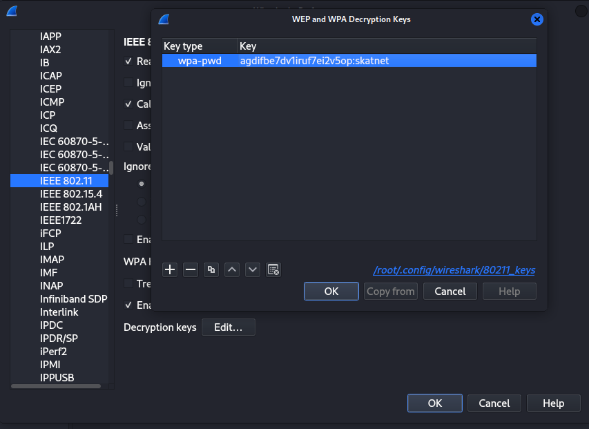
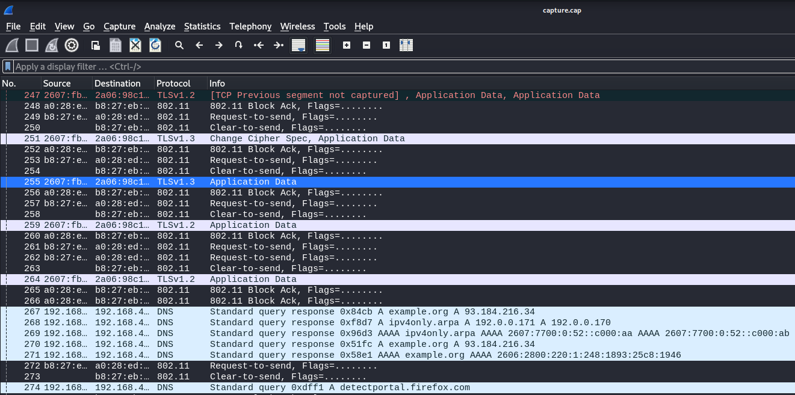
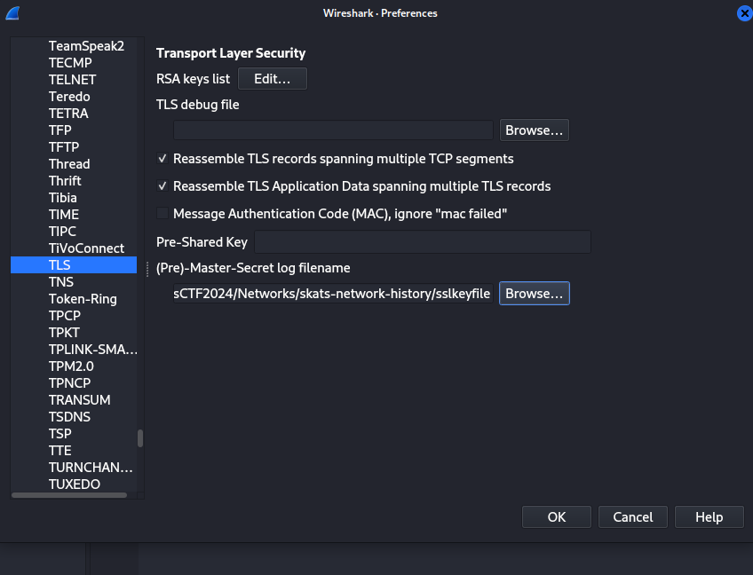
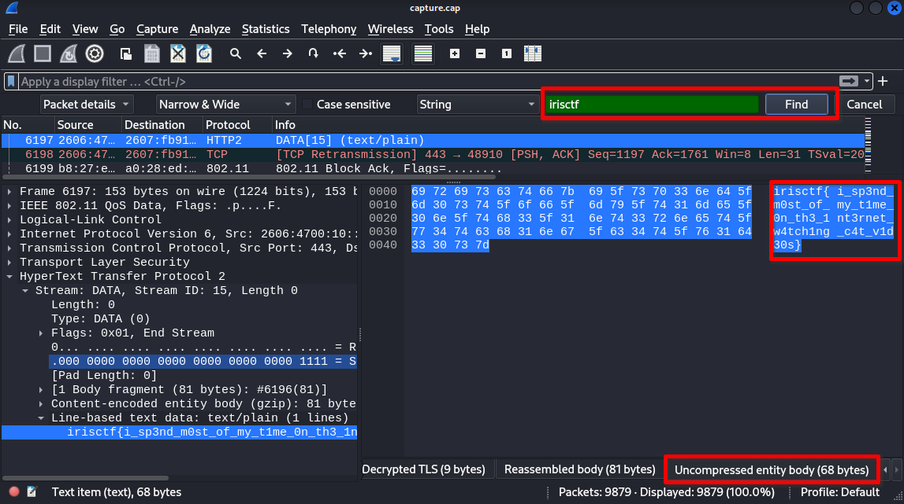
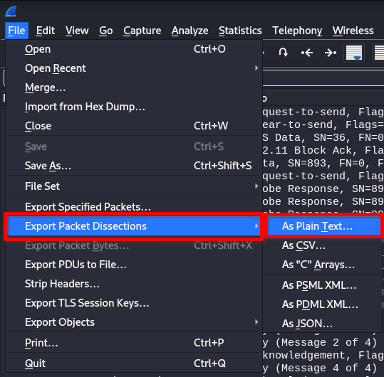
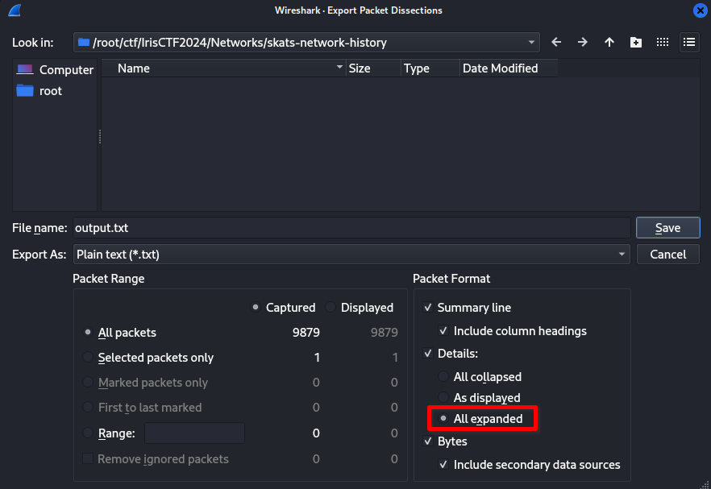

# skat's Network History [44 Solves]

## Description



> "I love cats."
>
> Note: this challenge is a continuation to Forensics/skat's SD Card. You are dealing with the same scenario. `skats-sd-card.tar.gz` is the same file from that challenge (SHA-1: `4cd743d125b5d27c1b284f89e299422af1c37ffc`).
>
> `skats-network-history.tar.gz` `skats-sd-card.tar.gz`
>
> By: skat

## Short Solution

- Leak WPA passphrase in the provided disk image and decrypt 802.11 packet
- Decrypt TLS packet by the provided sslkeyfile

## Solution

### Basic file checks

```console
$ tar ztf skats-network-history.tar.gz
skats-network-history/
skats-network-history/capture.cap
skats-network-history/sslkeyfile

$ file skats-network-history/*
skats-network-history/capture.cap: pcap capture file, microsecond ts (little-endian) - version 2.4 (802.11, capture length 65535)
skats-network-history/sslkeyfile:  ASCII text

$ tar ztf skats-sd-card.tar.gz
skats-sd-card/
skats-sd-card/mmcblk0p2.img.zip

$ unzip skats-sd-card/mmcblk0p2.img.zip
Archive:  skats-sd-card/mmcblk0p2.img.zip
  inflating: mmcblk0p2.img

$ file mmcblk0p2.img
mmcblk0p2.img: Linux rev 1.0 ext4 filesystem data, UUID=4aa56689-dcb4-4759-90e6-179beae559ac, volume name "rootfs" (extents) (large files)

$ mkdir mnt; mount mmcblk0p2.img mnt

$ tree -L 1 mnt
mnt
├── bin -> usr/bin
├── boot
├── dev
├── etc
├── home
├── initrd.img -> boot/initrd.img-6.1.0-rpi7-rpi-v8
├── initrd.img.old -> boot/initrd.img-6.1.0-rpi7-rpi-2712
├── lib -> usr/lib
├── lost+found
├── media
├── mnt
├── opt
├── proc
├── root
├── run
├── sbin -> usr/sbin
├── srv
├── sys
├── tmp
├── usr
├── var
├── vmlinuz -> boot/vmlinuz-6.1.0-rpi7-rpi-v8
└── vmlinuz.old -> boot/vmlinuz-6.1.0-rpi7-rpi-2712

20 directories, 4 files

$ cd mnt

$ cat etc/hostname
raspberrypi

$ tree -L 1 home/skat/
home/skat/
├── Bookshelf
├── Desktop
├── Documents
├── Downloads
├── Music
├── Pictures
├── Public
├── Templates
└── Videos

10 directories, 0 files

$ ls home/skat/Bookshelf
BeginnersGuide-5thEd-Eng_v3.pdf
```

BeginnersGuide-5thEd-Eng_v3.pdf is:



### Initial Analysis

In this challenge, the three main files are provided: capture.cap, sslkeyfile and mmcblk0p2.img.
The sslkeyfile is SSLKEYLOGFILE (see below) so it seems that it's expected to decrypt capture.cap by it.
The mmcblk0p2.img seems Rasbperry Pi SD Card disk image.

<details><summary>sslkeyfile</summary>

```console
$ head sslkeyfile
# SSL/TLS secrets log file, generated by NSS
CLIENT_HANDSHAKE_TRAFFIC_SECRET dd44eae934ca8680a374856e99c27ab431662327e59701d777708a0a131e3f33 b4f5bd4e7f93c0b042bb11d020e170c1ee4409fbb8ce63c0bc2f80c6fe23e735
SERVER_HANDSHAKE_TRAFFIC_SECRET dd44eae934ca8680a374856e99c27ab431662327e59701d777708a0a131e3f33 2d637ef7470bcd41bb916f39d9acf4015c17f429dd44bf612ccbcca210a94c48
CLIENT_HANDSHAKE_TRAFFIC_SECRET efe524b421a1dde30f71fd9d482575ba0aba618f36b765f8ed77f1a97168a0ee 89583bff0979029a9be40ebb10a718ef97f9d384e45941689de82959c4ceeeea
SERVER_HANDSHAKE_TRAFFIC_SECRET efe524b421a1dde30f71fd9d482575ba0aba618f36b765f8ed77f1a97168a0ee 599ea92ecd9ee99cc8676e901cbf03b1d8fa39e135453585074f4d264d4baa2d
CLIENT_TRAFFIC_SECRET_0 efe524b421a1dde30f71fd9d482575ba0aba618f36b765f8ed77f1a97168a0ee ca5821a2c7c4a8c3ad497ecd60148e493fcc2da5d5ef3c689289c8d1fd45cf4d
SERVER_TRAFFIC_SECRET_0 efe524b421a1dde30f71fd9d482575ba0aba618f36b765f8ed77f1a97168a0ee 7687d0320a8477beda7943dc5af091aa316f0e6079efc2fc5b923949a8c13921
EXPORTER_SECRET efe524b421a1dde30f71fd9d482575ba0aba618f36b765f8ed77f1a97168a0ee f2113d637d7a99f0cfad47700a2796b409d52dbdf40f8f9e4910139ec39bab25
CLIENT_TRAFFIC_SECRET_0 dd44eae934ca8680a374856e99c27ab431662327e59701d777708a0a131e3f33 9733bb2bd0df15e45e7a8f55abf123386e8e003363930d259688b4d05aa3a566
SERVER_TRAFFIC_SECRET_0 dd44eae934ca8680a374856e99c27ab431662327e59701d777708a0a131e3f33 8703339a14e94fc3673ffb66cef07df35048cedb204a1229ec86e33b03680afb
```

</details>

- [The SSLKEYLOGFILE Format for TLS](https://www.ietf.org/archive/id/draft-thomson-tls-keylogfile-00.html)
- [TLS Decryption](https://wiki.wireshark.org/TLS#tls-decryption)

### Decrypt 802.11

Looking at the capture.cap with Wireshark and open [Protocol Hierarchy](https://www.wireshark.org/docs/wsug_html_chunked/ChStatHierarchy.html).



There are only 802.11 protocol packets, and there are no TLS or HTTP packets.
The 802.11 packets are encrypted so we cannot see the data.
Google with [`wireshark 802.11 decrypt`](https://www.google.com/search?q=wireshark+802.11+decrypt), I found [HowToDecrypt802.11](https://wiki.wireshark.org/HowToDecrypt802.11) document.
Based on this, we can decrypt the data if we have wpa-pwd (the password and SSID).



I found the SSID skatnet in capture.cap.

I will try to search the wpa password in mmcblk0p2.img.

```console
$ grep skatnet -R . 2>/dev/null
./home/skat/.cache/lxsession/LXDE-pi/run.log:** Message: 21:22:19.803: No keyring secrets found for skatnet/802-11-wireless-security; asking user.
./etc/NetworkManager/system-connections/skatnet.nmconnection:id=skatnet
./etc/NetworkManager/system-connections/skatnet.nmconnection:ssid=skatnet

$ cat ./etc/NetworkManager/system-connections/skatnet.nmconnection
[connection]
id=skatnet
uuid=470a7376-d569-444c-a135-39f5e57ea095
type=wifi
interface-name=wlan0

[wifi]
mode=infrastructure
ssid=skatnet

[wifi-security]
auth-alg=open
key-mgmt=wpa-psk
psk=agdifbe7dv1iruf7ei2v5op

[ipv4]
method=auto

[ipv6]
addr-gen-mode=default
method=auto

[proxy]
```

Got `psk=agdifbe7dv1iruf7ei2v5op`.
Referred to NetworkManager document, it is the passphrase for WPA-PSK.

[802-11-wireless-security: NetworkManager Reference Manual](https://developer-old.gnome.org/NetworkManager/stable/settings-802-11-wireless-security.html)

> Pre-Shared-Key for WPA networks. For WPA-PSK, it's either an ASCII passphrase of 8 to 63 characters that is (as specified in the 802.11i standard) hashed to derive the actual key, or the key in form of 64 hexadecimal character. The WPA3-Personal networks use a passphrase of any length for SAE authentication.

I will try to decrypt by `agdifbe7dv1iruf7ei2v5op:skatnet`.

Wireshark > Edit > Preferences > Protocols in left pane > IEEE 802.11 > Decryption Keys Edit button > add wpa-pwd





The decryption was successful so I can see the packets that were previously invisible due to encryption.

### TLS Decryption

I used the provided sslkeyfile file to decrypt TLS packet.

Wireshark > Edit > Preferences > Protocols in left pane > TLS > (Pre)-Master-Secret log filenames > add sslkeyfile



TLS Decryption was completed so I will try to find the flag.

Ctrl + F, input irisctf, Enter:



The flag is in No.6197.

Or we can export the decrypted packets to a file and search for the flag by grep.

Wireshark > File > Export Packet Dissections > As Plain Text...



Select All expanded and Save



```console
$ grep -n irisctf output.txt
803341:            irisctf{i_sp3nd_m0st_of_my_t1me_0n_th3_1nt3rnet_w4tch1ng_c4t_v1d30s}
803372:0000  69 72 69 73 63 74 66 7b 69 5f 73 70 33 6e 64 5f   irisctf{i_sp3nd_
```

## Flag

irisctf{i_sp3nd_m0st_of_my_t1me_0n_th3_1nt3rnet_w4tch1ng_c4t_v1d30s}

## References

- [Decrypt WPA2-PSK using Wireshark \| mrn-cciew](https://mrncciew.com/2014/08/16/decrypt-wpa2-psk-using-wireshark/)
