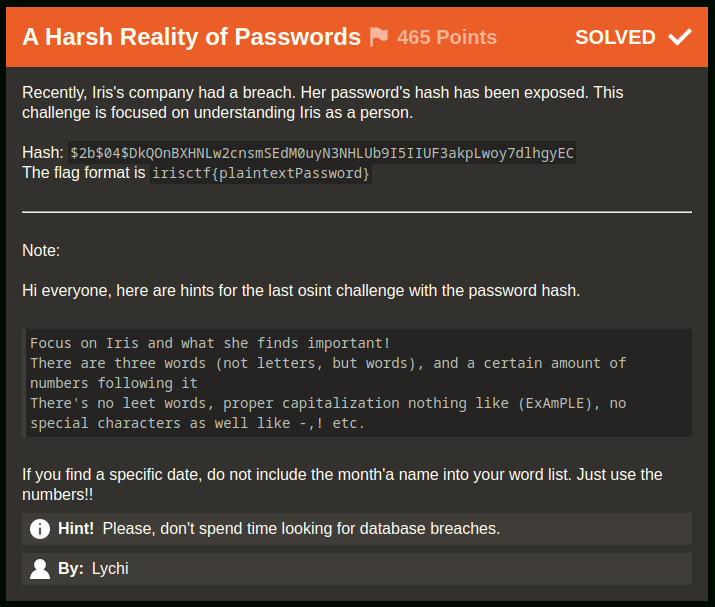
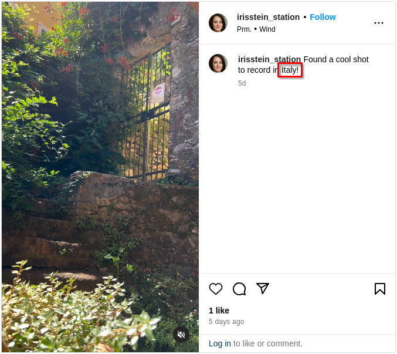
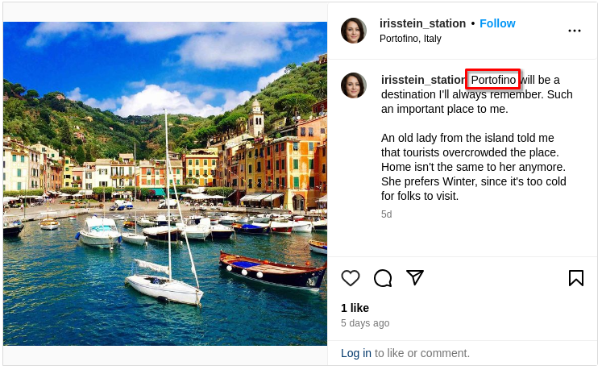
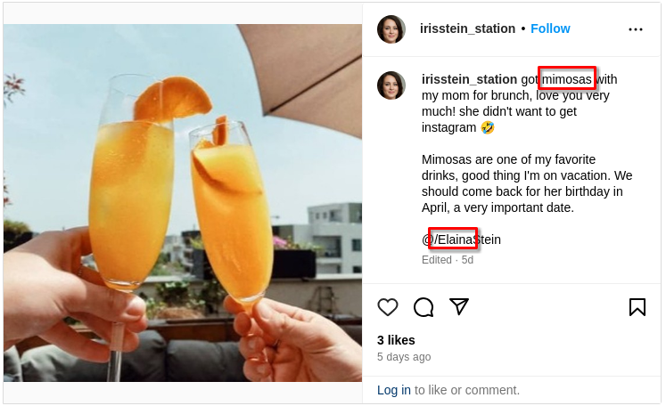
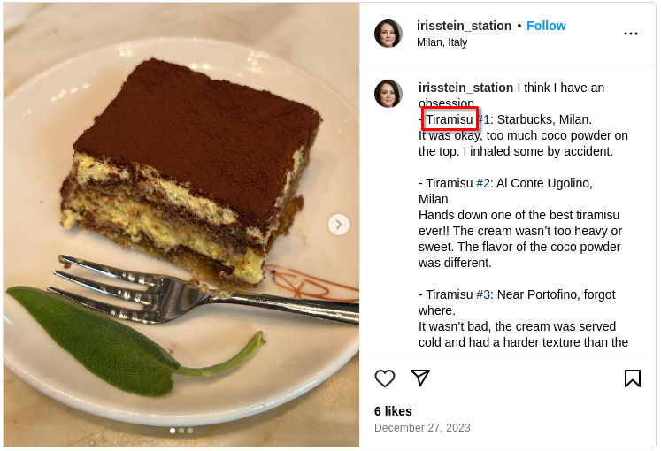
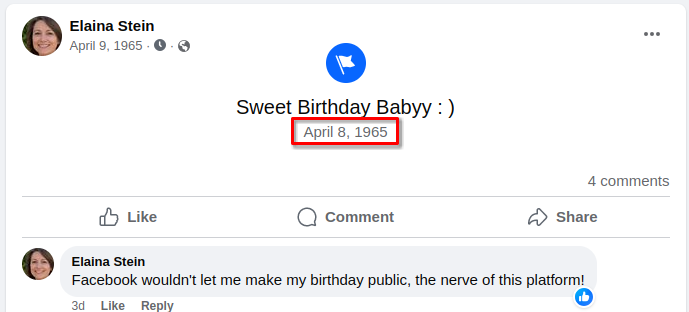
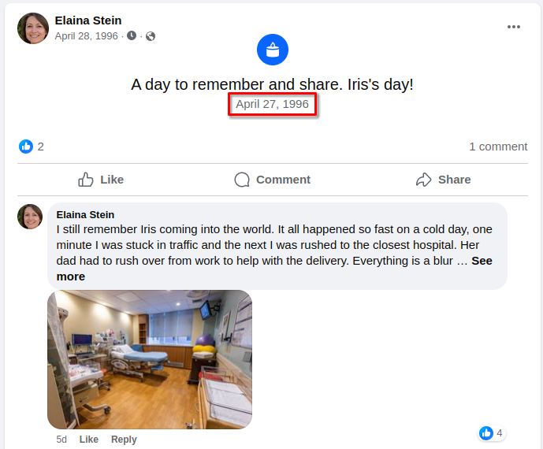

# A Harsh Reality of Passwords [28 Solves]

## Description



> Recently, Iris's company had a breach. Her password's hash has been exposed. This challenge is focused on understanding Iris as a person.
>
> Hash: `$2b$04$DkQOnBXHNLw2cnsmSEdM0uyN3NHLUb9I5IIUF3akpLwoy7dlhgyEC`
>
> The flag format is `irisctf{plaintextPassword}`
>
> ---
>
> Note:
>
> Hi everyone, here are hints for the last osint challenge with the password hash.
>
> ```text
> Focus on Iris and what she finds important!
> There are three words (not letters, but words), and a certain amount of numbers following it
> There's no leet words, proper capitalization nothing like (ExAmPLE), no special characters as well like -,! etc.
> ```
>
> If you find a specific date, do not include the month'a name into your word list. Just use the numbers!!
>
> Hint! Please, don't spend time looking for database breaches.
>
> By: Lychi

## Solution

### Initial Analysis

I will gather words and numbers related with Iris to create a wordlist and then crack it using hashcat.

### Words

The words is Iris's favorite items and things that seemed important:

- italy
- portofino
- mimosas
- elaina
- tiramisu

<details><summary>Instagram (Click here for details)</summary>

<https://www.instagram.com/p/C1rBcGXuvnZ/>



<https://www.instagram.com/p/C1qxxSwu7qD/>



<https://www.instagram.com/p/C1qwh0Cuj5P/>



<https://www.instagram.com/p/C1WM6L2uuom/?img_index=1>



</details>

### Numbers

The numbers is Elaina and Iris birthday:

- Elaina Stein Birthday: 1965/4/8
- Iris Stein Birthday: 1997/4/27

<details><summary>Facebook (Click here for details)</summary>

<https://www.facebook.com/61555040318052/posts/122106898406168010>



<https://www.facebook.com/61555040318052/posts/122104826888168010>



</details>

YYYY/mm/dd combination:

- YYYYmmdd
- YYYYmdd
- YYYYmmd
- YYYYmd
- YYYYddmm
- YYYYdmm
- YYYYddm
- YYYYdm
- mmddYYYY
- mddYYYY
- mmdYYYY
- mdYYYY
- ddmmYYYY
- dmmYYYY
- ddmYYYY
- dmYYYY

### Wordlist Generator

I scripted to create a wordlist from the gathered words and numbers:

```python
import itertools

words = """\
italy
portofino
mimosas
elaina
tiramisu
""".strip().split()

numbers = """\
19960428
1996428
19962804
1996284
04281996
4281996
28041996
2841996
19650408
1965408
1965048
196548
19650804
1965084
1965804
196584
04081965
4081965
0481965
481965
08041965
0841965
8041965
841965
""".strip().split()

passwords = set()

for ws in itertools.permutations(words, r=3):

    # Since the flag example irisctf{plaintextPassword} includes words that are not capitalized,
    # include both capitalized and non-capitalized versions of words.
    for fs in itertools.product([str.capitalize, str.lower], repeat=3):
        password = "".join([f(w) for w, f in zip(ws, fs)])

        for num in numbers:
            passwords.add(password + num)

with open("wordlist.txt", "w") as f:
    f.write("\n".join(list(passwords)))
```

Result:

```console
$ python3 gen_wordlist.py

$ wc -l wordlist.txt
11519 wordlist.txt
```

### Crack

```console
$ haiti '$2b$04$DkQOnBXHNLw2cnsmSEdM0uyN3NHLUb9I5IIUF3akpLwoy7dlhgyEC'
bcrypt [HC: 3200] [JtR: bcrypt]
Blowfish(OpenBSD) [HC: 3200] [JtR: bcrypt]
Woltlab Burning Board 4.x

$ hashcat -m 3200 '$2b$04$DkQOnBXHNLw2cnsmSEdM0uyN3NHLUb9I5IIUF3akpLwoy7dlhgyEC' wordlist.txt --quiet
$2b$04$DkQOnBXHNLw2cnsmSEdM0uyN3NHLUb9I5IIUF3akpLwoy7dlhgyEC:PortofinoItalyTiramisu0481965
```

Got it.

## Flag

irisctf{PortofinoItalyTiramisu0481965}

## Tools

- [hashcat/hashcat: World's fastest and most advanced password recovery utility](https://github.com/hashcat/hashcat)
- [noraj/haiti: :key: Hash type identifier (CLI & lib)](https://github.com/noraj/haiti)
