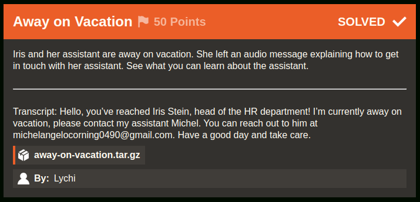
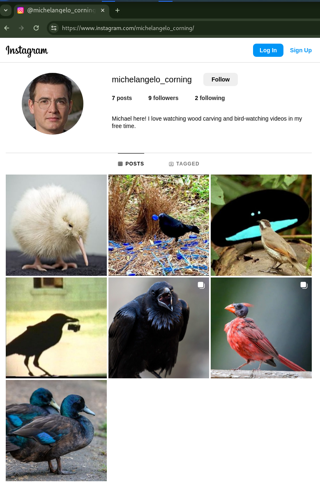
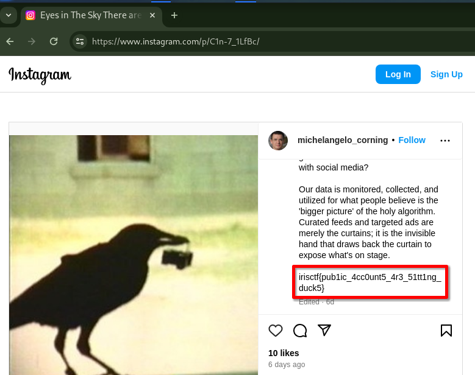

# Away on Vacation [255 Solves]

## Description



> Iris and her assistant are away on vacation. She left an audio message explaining how to get in touch with her assistant. See what you can learn about the assistant.
>
> ---
>
> Transcript: Hello, you’ve reached Iris Stein, head of the HR department! I’m currently away on vacation, please contact my assistant Michel. You can reach out to him at <michelangelocorning0490@gmail.com>. Have a good day and take care.
>
> `away-on-vacation.tar.gz`
>
> By: Lychi

## Solution

### Attachment

```console
$ tar ztf away-on-vacation.tar.gz
away-on-vacation/
away-on-vacation/beepboopbeep.mp3
```

### Initial Analysis

The provided beepboopbeep.mp3 file is the audio of the read transcript.
It seems that we need to search Michel's stuff, which is Iris Stein's assistant.
Michel's e-mail address is <michelangelocorning0490@gmail.com> so let's search.

### Investigation

I sent email to <michelangelocorning0490@gmail.com> and its response was:

```text
Dear,

Thank you for the email, I'm currently away on vacation to celebrate New Years! If you would like a quicker response, feel free to reach out to my social media. I mostly talk about birds on it. 

Have a great start to the year, and take care!
```

I searched DuckDuckGo `michelangelo corning bird` query: <https://duckduckgo.com/?q=michelangelo+corning+bird&ia=web> and found Michel's Instagram account.

- Michel's Instagram account: <https://www.instagram.com/michelangelo_corning/>



The flag is in them post:

<https://www.instagram.com/p/C1n-7_1LfBc/>



## Flag

irisctf{pub1ic_4cc0unt5_4r3_51tt1ng_duck5}
