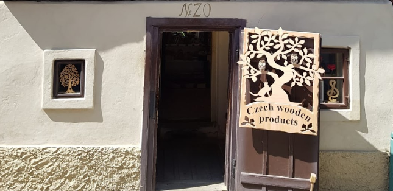

# Czech Where? [401 Solves]

## Description


> Iris visited this cool shop a while back, but forgot where it was! What street is it on?
>
> `czech-where.tar.gz`
>
> Hint! FYI: flag is all lowercase and _ for spaces. Please remove all accent marks if there are any. Wrap your answer in `irisctf{}`.
>
> By: Lychi

## Solution

### Attachment

```console
$ tar ztf czech-where.tar.gz
czech-where/
czech-where/image.png
```



### Initial Analysis

Let's find the location of this photo.

### Investigation

Google search `czech wooden products`:

Found: <https://trudymason.com/category/prague/>


Google search `Golden Lane`:

- <https://en.wikipedia.org/wiki/Golden_Lane>
- <https://www.google.com/maps?hl=en&q=Golden+Lane> redirects to `Zlatá ulička u Daliborky`

While exploring this street, I found the same building as in the photo: <https://maps.app.goo.gl/v7F5W8US733Hb5Pu7>

Thus, the answser street name is `Zlatá ulička u Daliborky`.

lowercase, spaces to _, no accent and wrap irisctf{}: `irisctf{zlata_ulicka_u_daliborky}`

## Flag

irisctf{zlata_ulicka_u_daliborky}
