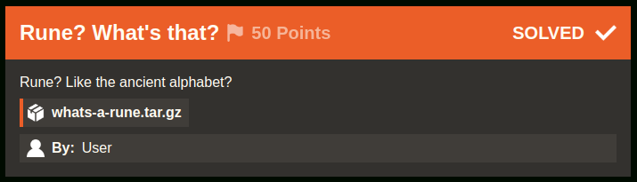

# Rune? What's that? [282 Solves]

## Description



> Rune? Like the ancient alphabet?
>
> `whats-a-rune.tar.gz`
>
> By: User

## Attachment / Source Code

```console
$ tar ztf whats-a-rune.tar.gz
whats-a-rune/
whats-a-rune/main.go
whats-a-rune/the
```

main.go

```go
package main

import (
	"fmt"
	"os"
	"strings"
)

var flag = "irisctf{this_is_not_the_real_flag}"

func init() {
	runed := []string{}
	z := rune(0)

	for _, v := range flag {
		runed = append(runed, string(v+z))
		z = v
	}

	flag = strings.Join(runed, "")
}

func main() {
	file, err := os.OpenFile("the", os.O_RDWR|os.O_CREATE, 0644)
	if err != nil {
		fmt.Println(err)
		return
	}

	defer file.Close()
	if _, err := file.Write([]byte(flag)); err != nil {
		fmt.Println(err)
		return
	}
}
```

```console
$ hd the
00000000  69 c3 9b c3 9b c3 9c c3  96 c3 97 c3 9a c3 a1 c3  |i...............|
00000010  a4 c3 88 c3 91 c2 a5 67  65 62 c2 aa c3 98 c2 90  |.......geb......|
00000020  c2 9a c3 94 c2 9e c2 92  c3 8d c3 a3 c3 a2 c2 a3  |................|
00000030  69 c2 a5 c2 a7 c2 b2 c3  8b c3 85 c3 92 c3 8d c3  |i...............|
00000040  88 c3 a4                                          |...|
00000043
```

## Solution

The flag is encrypted by `encrypted[i] = flag[i]+flag[i-1]`.
Thus, the original flag is decrypted by `flag[i] = encrypted[i]-flag[i-1]` with `flag[0] = 'i'`

```python
with open("the") as f:
    decrypted = f.read()

flag = ""
previous = 0
for v in decrypted:
    previous = ord(v) - previous
    flag += chr(previous)

print(flag)
```

Result:

```console
$ python3 solver.py
irisctf{i_r3411y_1ik3_num63r5}Nw[rV
```

Or golang version solver:

```go
package main

import (
	"fmt"
	"os"
	"strings"
)

func main() {
	decrypted, err := os.ReadFile("the")
	if err != nil {
		fmt.Println(err)
		return
	}

	flag := []string{}
	var previous  = rune(0)

	// convert it to a string avoid reading at the bytes level, iterating in the order of 0x69, 0xc3, 0x9b, 0xc3, 0x9b, ...
	// https://stackoverflow.com/a/71716955/10819876
	for _, v := range string(decrypted) {
		previous = v - previous
		flag = append(flag, string(previous))
	}

	fmt.Print(strings.Join(flag, ""))
}
```

Result:

```console
$ go run solver.go
irisctf{i_r3411y_1ik3_num63r5}Nw[rV 
```

## Flag

irisctf{i_r3411y_1ik3_num63r5}

## References

- [builtin package - builtin - Go Packages](https://pkg.go.dev/builtin#rune)
- [The Go Programming Language Specification - The Go Programming Language](https://go.dev/ref/spec#For_range)
