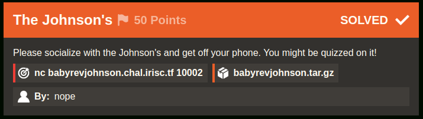

# The Johnson's [316 Solves]

## Description



> Please socialize with the Johnson's and get off your phone. You might be quizzed on it!
>
> `nc babyrevjohnson.chal.irisc.tf 10002` `babyrevjohnson.tar.gz`
>
> By: nope

## Solution

### Basic file checks

```console
$ tar ztf babyrevjohnson.tar.gz
babyrevjohnson/
babyrevjohnson/main

$ cd babyrevjohnson

$ file main
main: ELF 64-bit LSB pie executable, x86-64, version 1 (SYSV), dynamically linked, interpreter /lib64/ld-linux-x86-64.so.2, BuildID[sha1]=f9dc64e1f81cfd02193274da700f1de05742fd83, for GNU/Linux 3.2.0, not stripped
```

### Investigation

<details><summary>Decompiled main and check function with Ghidra:</summary>

```c
undefined8 main(void)

{
  int iVar1;
  long in_FS_OFFSET;
  int local_84;
  int local_80;
  int local_7c;
  char local_78 [104];
  long local_10;
  
  local_10 = *(long *)(in_FS_OFFSET + 0x28);
  puts("Welcome to the Johnson\'s family!");
  puts(
      "You have gotten to know each person decently well, so let\'s see if you remember all of the f acts."
      );
  puts("(Remember that each of the members like different things from each other.)");
  local_84 = 0;
  while (local_84 < 4) {
    printf("Please choose %s\'s favorite color: ",*(undefined8 *)(names + (long)local_84 * 8));
    __isoc99_scanf(&DAT_0010217c,local_78);
    iVar1 = strcmp(local_78,colors);
    if (iVar1 == 0) {
      local_80 = 1;
LAB_00101449:
      if ((((local_80 == chosenColors) || (local_80 == DAT_00104094)) || (local_80 == DAT_00104098))
         || (local_80 == DAT_0010409c)) {
        puts("That option was already chosen!");
      }
      else {
        (&chosenColors)[local_84] = local_80;
        local_84 = local_84 + 1;
      }
    }
    else {
      iVar1 = strcmp(local_78,PTR_DAT_00104048);
      if (iVar1 == 0) {
        local_80 = 2;
        goto LAB_00101449;
      }
      iVar1 = strcmp(local_78,PTR_s_green_00104050);
      if (iVar1 == 0) {
        local_80 = 3;
        goto LAB_00101449;
      }
      iVar1 = strcmp(local_78,PTR_s_yellow_00104058);
      if (iVar1 == 0) {
        local_80 = 4;
        goto LAB_00101449;
      }
      puts("Invalid color!");
    }
  }
  local_84 = 0;
  do {
    while( true ) {
      if (3 < local_84) {
        check();
        if (local_10 != *(long *)(in_FS_OFFSET + 0x28)) {
                    /* WARNING: Subroutine does not return */
          __stack_chk_fail();
        }
        return 0;
      }
      printf("Please choose %s\'s favorite food: ",*(undefined8 *)(names + (long)local_84 * 8));
      __isoc99_scanf(&DAT_0010217c,local_78);
      iVar1 = strcmp(local_78,foods);
      if (iVar1 != 0) break;
      local_7c = 1;
LAB_0010159c:
      if (((local_7c == chosenFoods) || (local_7c == DAT_001040a4)) ||
         ((local_7c == DAT_001040a8 || (local_7c == DAT_001040ac)))) {
        puts("That option was already chosen!");
      }
      else {
        (&chosenFoods)[local_84] = local_7c;
        local_84 = local_84 + 1;
      }
    }
    iVar1 = strcmp(local_78,PTR_s_pasta_00104068);
    if (iVar1 == 0) {
      local_7c = 2;
      goto LAB_0010159c;
    }
    iVar1 = strcmp(local_78,PTR_s_steak_00104070);
    if (iVar1 == 0) {
      local_7c = 3;
      goto LAB_0010159c;
    }
    iVar1 = strcmp(local_78,PTR_s_chicken_00104078);
    if (iVar1 == 0) {
      local_7c = 4;
      goto LAB_0010159c;
    }
    puts("Invalid food!");
  } while( true );
}
```

```c
void check(void)

{
  byte bVar1;
  bool bVar2;
  
  if ((DAT_001040a8 == 2) || (DAT_001040ac == 2)) {
    bVar2 = false;
  }
  else {
    bVar2 = true;
  }
  if ((chosenColors == 3) || (DAT_00104094 == 3)) {
    bVar1 = 0;
  }
  else {
    bVar1 = 1;
  }
  if (DAT_0010409c == 2 &&
      (DAT_00104098 != 4 &&
      (DAT_001040ac != 3 && (chosenFoods == 4 && (bool)((DAT_00104094 != 1 && bVar2) & bVar1))))) {
    puts("Correct!");
    system("cat flag.txt");
  }
  else {
    puts("Incorrect.");
  }
  return;
}
```

</details>

The numbers assigned to color and food are as follows.

color:

- 1 red
- 2 blue
- 3 green
- 4 yellow

food:

- 1 pizza
- 2 pasta
- 3 steak
- 4 chicken

The input color and food are assigned to the numbers respectively in the following order: `chosenColors`, `DAT_00104094`, `DAT_00104098`, `DAT_0010409c`, `chosenFoods`, `DAT_001040a4`, `DAT_001040a8`, `DAT_001040ac`.
For example, if we input red first, 1 will be assigned to `chosenColors`.

The correct order of color and food for the `check` function is as follows.

```text
chosenColors: not 3        -> 1 red
DAT_00104094: not 3, not 1 -> 4 yellow
DAT_00104098: not 4        -> 3 green
DAT_0010409c: 2            -> 2 blue

chosenFoods : 4            -> 4 chicken
DAT_001040a4: ?            -> 2 pasta
DAT_001040a8: not 2        -> 3 steak
DAT_001040ac: not 3        -> 1 pizza
```

To get the flag, sending colors and foods in the above order.

solver.py

```python
from pwn import *

context.log_level = "ERROR"
elf = ELF("./main", checksec=False)


def conn() -> pwnlib.tubes:
    if args.REMOTE:
        io = remote("babyrevjohnson.chal.irisc.tf", 10002)
    else:
        pty = process.PTY
        io = elf.process(stdin=pty, stdout=pty)

    return io


def main():
    colors = [b"red", b"yellow", b"green", b"blue"]
    foods = [b"chicken", b"pasta", b"steak", b"pizza"]

    with conn() as io:
        for x in colors + foods:
            io.sendlineafter(b":", x)

        io.interactive("")


if __name__ == "__main__":
    main()
```

Result:

```console
$ python3 solver.py REMOTE
 Please choose William's favorite food: Correct!
irisctf{m0r3_th4n_0n3_l0g1c_puzzl3_h3r3}
```

## Flag

irisctf{m0r3_th4n_0n3_l0g1c_puzzl3_h3r3}
