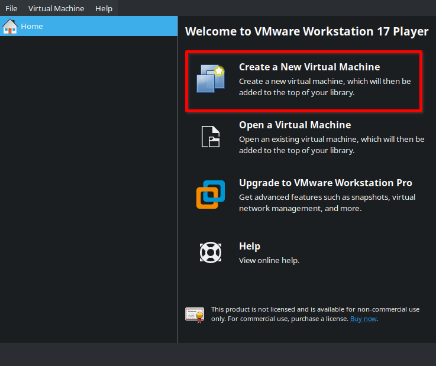
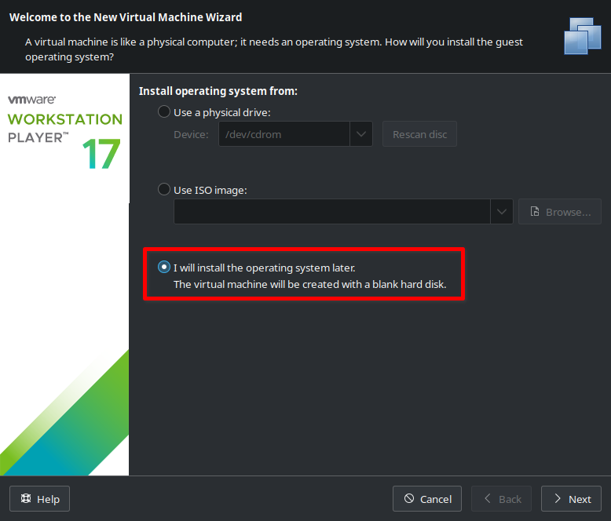
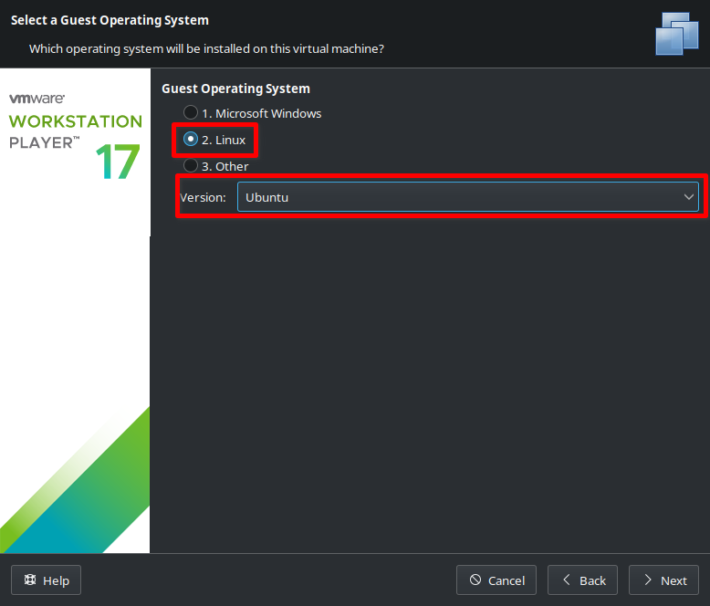
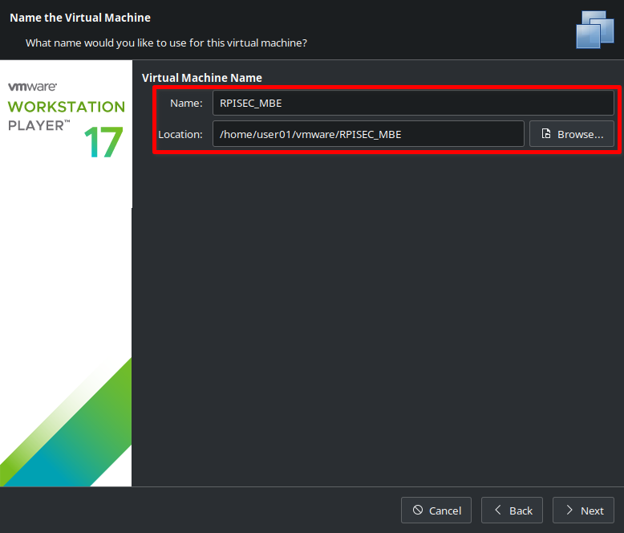
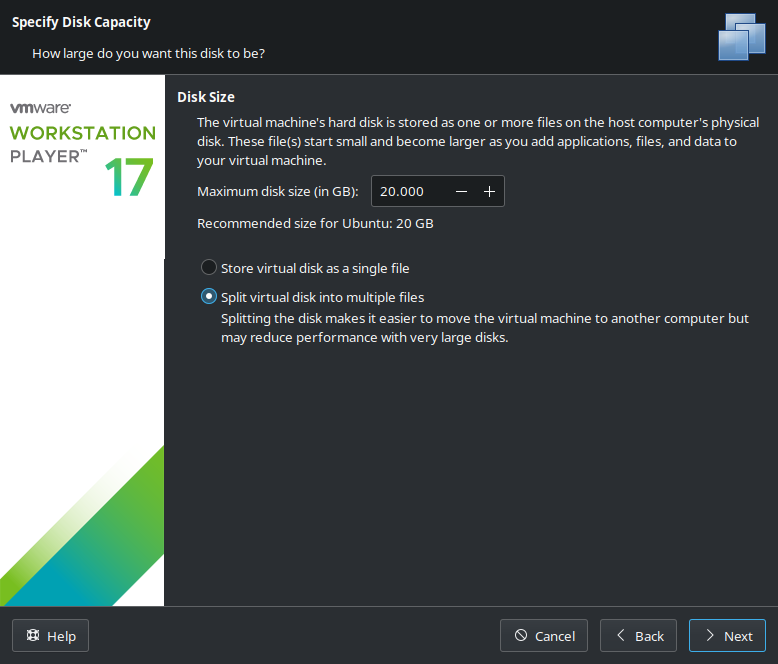
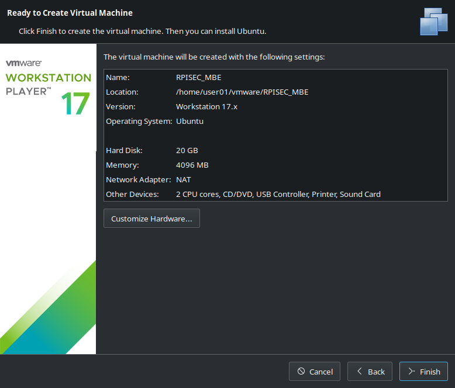
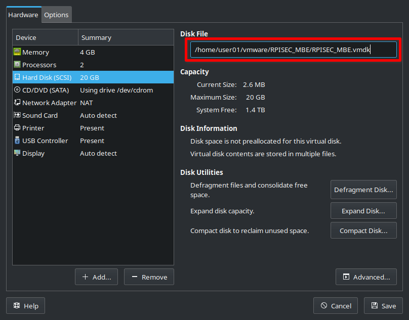
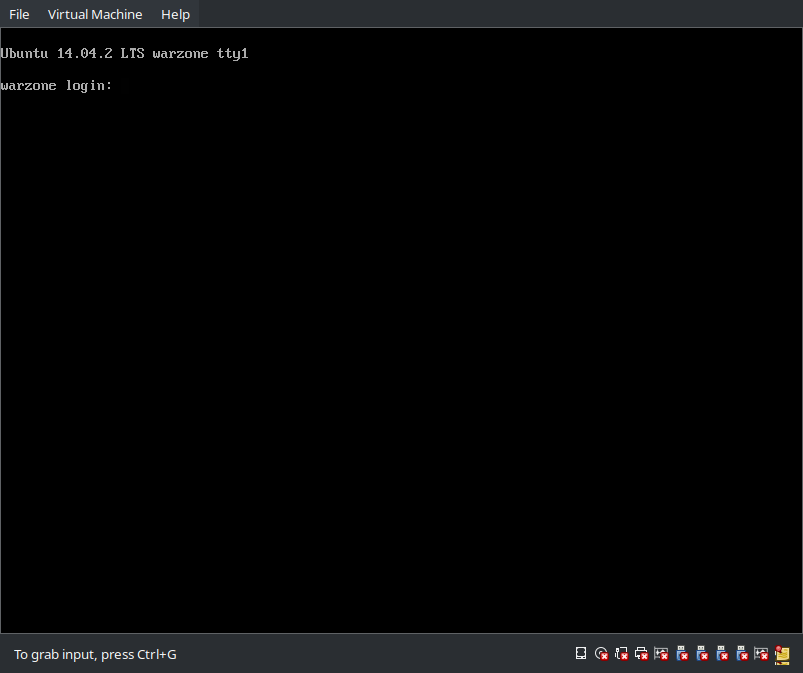
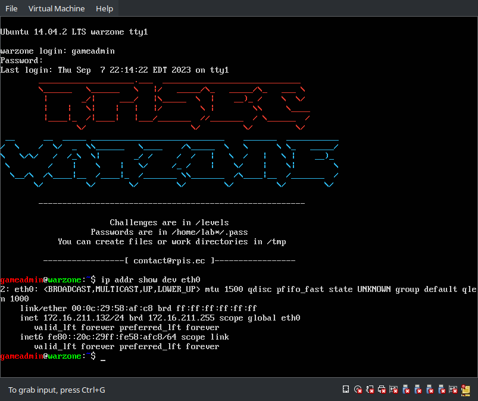

# Setup Warzone VM

MBE provides a Warzone VM, which includes tools and executable binaries that can be used in lecture, lab, and project.
In here, I will setup it with vmware.

## Environment

I have setup in the following environment:

```text
Product Information
    Product: VMware® Workstation 17 Player
    Version: 17.0.2 build-21581411
```

## Step

1. Download [MBE_VM.vmdk.gz](https://github.com/RPISEC/MBE/releases/download/v1.1_release/MBE_VM.vmdk.gz) in [Release MBE v1.1 Release page](https://github.com/RPISEC/MBE/releases/tag/v1.1_release)

    ```console
    $ md5sum MBE_VM.vmdk
    241a6db03706ce8285087a0cf610ed37  MBE_VM.vmdk
    ```

2. Click `Create a New Virtual Machine`

   

3. Select `I will install the operating system later.` and click `Next`

   
   
4. Select `2. Linux` and `Ubuntu`, then click `Next`

   
   
5. Input your Virtual Machine name and Location, then click `Next`

   

6. Click `Next` in Specify Disk Capacity, 

   

7. Click `Finish`

   

8. Right click created VM and select `Virtual Machine Settings`

9. In `Hardware` tab, select `Hard Disk (SCSI)` and note `Disk File` location  
   e.g. `/home/user01/vmware/RPISEC_MBE/RPISEC_MBE.vmdk`

   


10. Copy downloaded `MBE_VM.vmdk` file to `Hard Disk (SCSI)` location

    ```bash
    cp MBE_VM.vmdk /home/user01/vmware/RPISEC_MBE/RPISEC_MBE.vmdk
    ```

11. Power On VM and wait a minute, then you will see `warzone login:` prompt

    

12. Login with `gameadmin:gameadmin` credential, and run `ip addr show dev eth0` command, then it show VM's IP address.

    

## References

- [RPISEC/MBE: Virtual Machine Setup](https://github.com/RPISEC/MBE#virtual-machine-setup)
- [RPISEC/MBE: VM information](https://github.com/RPISEC/MBE#vm-information)
