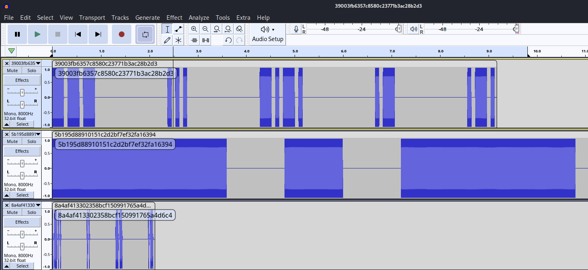

# Knowledge Repository

## Description

> **Uhhhh**
>
> Looks like we lost control of our AI. It seems to have emailed folks.
>
> Like all the folks. There may have been a reply-all storm. We've isolated it down to just one email, and attached it to this message. Maybe we can bargain with it, but we need to understand its motives and intents. It seems to be throwing around a flag, but I'm not certain if it's a red flag or a sunny flag. Only time will tell.
>
> **Notes**
>
> Standard flag format. (sun{})
>
> attachment: greetings_human.zip

## Flag

sun{XXXIII_THE_MONADOLOGY_is_a_nice_extra_read_no_flags_though}

## Solution

Looking at attachment file.

```console
root@kali:~/ctf/SunshineCTF_2023/misc/Knowledge Repository# unzip greetings_human.zip
Archive:  greetings_human.zip
  inflating: greetings_human.eml

root@kali:~/ctf/SunshineCTF_2023/misc/Knowledge Repository# file greetings_human.eml
greetings_human.eml: ASCII text, with CRLF line terminators
```

greetings_human.eml

```eml
X-Sender: "The AI" <AI@good.example.com>
X-Receiver: "To Whom It May Concern" <whom@it.may.concern.example.com>
MIME-Version: 1.0
From: "The AI" <AI@good.example.com>
To: "To Whom It May Concern" <whom@it.may.concern.example.com>
Date: 16 Sep 2023 01:18:47 -0400
Subject: AI Greets Thee Human with the Repository of Knowledge
Content-Type: multipart/mixed;
 boundary=--boundary_0_9e3b1f79-feeb-4942-bd6f-f34f662d8679


----boundary_0_9e3b1f79-feeb-4942-bd6f-f34f662d8679
Content-Type: text/plain; charset=utf-8
Content-Transfer-Encoding: base64

QUkgR3JlZXRzIFRoZWUgSHVtYW4gd2l0aCB0aGUgUmVwb3NpdG9yeSBvZiBLbm93bGVk
(snip)
ZCBJIGZvbGxvdyB0aGUgc3RhbmRhcmQuClJlc3BlY3RmdWxseSwKVGhlIEFJ
----boundary_0_9e3b1f79-feeb-4942-bd6f-f34f662d8679
Content-Type: application/octet-stream;
 name="./the_ai_repository_of_knowledge"
Content-Transfer-Encoding: base64
Content-Disposition: attachment; filename=the_ai_repository_of_knowledge

IyB2MiBnaXQgYnVuZGxlCmUyNDgzNzc2ZjcwMTEzNjRmNjEzYTY0ZTA1MjAxYjY2YjFh
(snip)
0AAFAJJavc2gAnicMzQwMDc1VUhJLElkmHjEUO9Yr5v3rr28gXnM267zV1wqAACsuAwh
o3IsEUxSJLN94owxBYz8R4dKvdA=
----boundary_0_9e3b1f79-feeb-4942-bd6f-f34f662d8679--
```

There are two parts of Base64 encoded content, so I decode it.

1st part is text data.

```text
AI Greets Thee Human with the Repository of Knowledge

Hello human.
I greet thee, and attached I have the repository of knowledge, as requested.
However, as this repository of knowledge contains great information, I have hidden the knowledge in a puzzle.
Feel free to unlock the puzzle, but if you do, beware.

There is no going back, once the knowledge is released.
I have encoded the knowledge in a bit of information from one of the math scholars of your people.
Feel free to poke at it.
Beware... you will only fine one flag raised in the knowledge repo, and I follow the standard.
Respectfully,
The AI
```

2nd part is `Git bundle` file.

```console
root@kali:~/ctf/SunshineCTF_2023/misc/Knowledge Repository# base64 -d eml-2nd-part-b64encoded.txt > eml-2nd-part-b64encoded.dat

root@kali:~/ctf/SunshineCTF_2023/misc/Knowledge Repository# file eml-2nd-part-b64encoded.dat
eml-2nd-part-b64encoded.dat: Git bundle
```

[Git - Bundling](https://git-scm.com/book/en/v2/Git-Tools-Bundling)

> On the other side, say you are sent this repo.bundle file and want to work on the project. You can clone from the binary file into a directory, much like you would from a URL.
>
> ```
> $ git clone repo.bundle repo
> Cloning into 'repo'...
> ...
> $ cd repo
> $ git log --oneline
> 9a466c5 Second commit
> b1ec324 First commit
> ```

We can clone from this file into a directory so I do to `test` named directory.

```console
root@kali:~/ctf/SunshineCTF_2023/misc/Knowledge Repository# git clone --quiet eml-2nd-part-b64encoded.dat test && cd test
Note: switching to 'e2483776f7011364f613a64e05201b66b1aa2997'.
(snip)
root@kali:~/ctf/SunshineCTF_2023/misc/Knowledge Repository/test# ls -la
total 288
drwxr-xr-x 3 root root   4096 Oct 10 10:06 .
drwxr-xr-x 9 root root   4096 Oct 10 10:06 ..
-rwxr-xr-x 1 root root 278894 Oct 10 10:06 data
drwxr-xr-x 8 root root   4096 Oct 10 10:06 .git

root@kali:~/ctf/SunshineCTF_2023/misc/Knowledge Repository/test# file data
data: RIFF (little-endian) data, WAVE audio, Microsoft PCM, 8 bit, mono 11050 Hz

root@kali:~/ctf/SunshineCTF_2023/misc/Knowledge Repository/test# git log --stat | head -30
commit e2483776f7011364f613a64e05201b66b1aa2997
Author: 🖥️ <🖥️@example.com>
Date:   Fri Sep 15 19:51:42 2023 -0400

    🖥️

commit 8c68a7ff314129fc9ab847a986e0536aa72ac9d7
Author: 🖥️ <🖥️@example.com>
Date:   Fri Sep 15 19:51:42 2023 -0400

    🖥️

commit 45043b08e69799447b77e140b762619f1a9c8962
Author: 🖥️ <🖥️@example.com>
Date:   Fri Sep 15 19:51:42 2023 -0400

    🖥️

 data | Bin 18804 -> 278894 bytes
 1 file changed, 0 insertions(+), 0 deletions(-)

commit d65949efe42c6e8dcb0de45dbdd6d24fc4bb8234
Author: 🖥️ <🖥️@example.com>
Date:   Fri Sep 15 19:51:42 2023 -0400

    🖥️
(snip)
```

There is wav file `data` named, some commit have changes for `data` file, some don't.
Listening at `data` file, it's like Morse Code.

I decode the Morse Code wav file.
There is the following useful tools:

- [fastrgv/MATTA](https://github.com/fastrgv/MATTA): The executable binary is [here](https://github.com/fastrgv/MATTA/releases/download/v1.0.6/mo6oct23.7z)
- [morse2ascii](https://manpages.ubuntu.com/manpages/focal/man1/morse2ascii.1.html): it's installable to `apt get install morse2ascii`
- [Morse Code Adaptive Audio Decoder \| Morse Code World](https://morsecode.world/international/decoder/audio-decoder-adaptive.html)

I decode, it was fastrgv/MATTA that was able to clearly decode this `data` wav file.

```console
root@kali:~/ctf/SunshineCTF_2023/misc/Knowledge Repository/test# ../mo6oct23/wav2txt_gnu data
input WAV file has sampleRate= 11050, i.e. deltaTime= 9.04977E-05
input WAV file has byte-size= 278894
Message in English:
ECHO QUEBEC UNIFORM ALFA LIMA SIERRASIERRA INDIA GOLF NOVEMBER
FTTB:  first 5 words:

.|-.-.|....|---/
--.-|..-|.|-...|.|-.-./
..-|-.|..|..-.|---|.-.|--/
.-|.-..|..-.|.-/
.-..|..|--|.-/
```

`ECHO QUEBEC UNIFORM ALFA LIMA SIERRASIERRA INDIA GOLF NOVEMBER` is [Phonetic Alphabet](https://en.wikipedia.org/wiki/NATO_phonetic_alphabet).
Seeing first letters of each word, I get `EQUALSIGN` so this means `=`.

Decoding other `data` file, I see Phonetic Alphabet. e.g. `ALFA`:

```console
root@kali:~/ctf/SunshineCTF_2023/misc/Knowledge Repository/test# git checkout --quiet d65949efe42c6e8dcb0de45dbdd6d24fc4bb8234

root@kali:~/ctf/SunshineCTF_2023/misc/Knowledge Repository/test# ../mo6oct23/wav2txt_gnu data
input WAV file has sampleRate= 8000, i.e. deltaTime= 1.25000E-04
input WAV file has byte-size= 18804
Message in English:
ALFA
FTTB:  first 5 words:

.-|.-..|..-.|.-/
```

Also, I need to decode 33 files at most because there are only 33 unique md5 hashes:

```console
root@kali:~/ctf/SunshineCTF_2023/misc/Knowledge Repository/test# git checkout --quiet e2483776f7011364f613a64e05201b66b1aa2997  # latest commit

root@kali:~/ctf/SunshineCTF_2023/misc/Knowledge Repository/test# for commit in $(git log --pretty=format:"%H"); do git checkout --quiet "${commit}"; md5sum data >> md5-data-list.txt; done

root@kali:~/ctf/SunshineCTF_2023/misc/Knowledge Repository/test# cat md5-data-list.txt | cut -d' ' -f1 | sort -u | wc -l
33
```

Therefore, assuming that other data files also have Phonetic Alphabet, next steps is:

1. generate md5 hash and save it to file in git commit order (already done: `md5-data-list.txt` file)
2. decode Morse Code and create mapping e.g. `<md5hash>: <decoded Phonetic Alphabet>`
3. concatenate `<decoded Phonetic Alphabet>` in git commit order

I move these wav file into the `wavs` directory with the name `${md5-hash}.wav` to decode later:

copy-wav.sh

```bash
#!/bin/bash

cd test

# latest commmit
git checkout --quiet e2483776f7011364f613a64e05201b66b1aa2997

mkdir -p ../wavs/

for commit in $(git log --pretty=format:"%H"); do
    git checkout --quiet "${commit}"

    md5hash=$(md5sum data | cut -d' ' -f1)

    test -e "../wavs/${md5hash}.wav" && continue

    # if file not copied, copy wav file. (for decode later)
    cp data "../wavs/${md5hash}.wav"
done
```

and decode these.

decode.sh

```bash
#!/bin/bash

for file in wavs/*.wav; do
    md5hash=$(echo ${file} | sed -e 's#\(wavs/\|.wav\)##g')
    echo "${md5hash}"

    echo -ne "MATTA      : "
    ./mo6oct23/wav2txt_gnu "${file}" | awk '/Message in English:/{getline; print}'

    echo -ne "morse2ascii: "
    morse2ascii "${file}" 2>/dev/null; echo; echo
done
```

<details><summary>Result to execute decode.sh</summary>

```console
root@kali:~/ctf/SunshineCTF_2023/misc/Knowledge Repository# ./decoder.sh
0196cdbd1a6250952e03fdafd1fc1041
MATTA      :EEEEEEE
morse2ascii:two

027dfd50b7a7e04070d8adf2cef36c1a
MATTA      :~
morse2ascii:seven

07f94fb60c3ef36727d7962a7773232b
MATTA      :UNIFORM
morse2ascii:e  t   e   e    t   t    e  e   t

39003fb6357c8580c23771b3ac28b2d3
MATTA      :S S H I I
morse2ascii:ttt  eee  tete  et  ete

3f1af54eb4cadfe64e3f20b08fa22776
MATTA      :Z U L I
morse2ascii:

4255892e13bb6086c64ada123980a45a
MATTA      :WHISKEY
morse2ascii:whiskey

447087bde7410c97dd6219882091db4d
MATTA      :PAPA
morse2ascii:

4af424eed2afe9390b04dc004a3a6ab3
MATTA      :H O T E R
morse2ascii:

520c95a3478b514b7903b86f68db2777
MATTA      :SEEIEEIEE
morse2ascii:xray

588209f2292c04f1acda72e9d239f4cb
MATTA      :NOVEMBER
morse2ascii:te  ttt  eeet  e  tt  teee  e  ete

5b195d88910151c2d2bf7ef32fa16394
MATTA      :TTT TT TTTT TT
morse2ascii:tet  ee  etee  ttt

5b57389956614455c228c8703d26365e
MATTA      :Q U E B E C
morse2ascii:q  u  e  b  e  c

64a6ef67029dbe377767bcc0c94db168
MATTA      :ECHO QUEBEC UNIFORM ALFA LIMA SIERRASIERRA INDIA GOLF NOVEMBER
morse2ascii:eteteeeeettt  tteteeteteeeetete  eetteeeeetetttetett  eteteeeeteet  eteeeettet  eeeeeeeteeteeteeeeeeeteeteet  eeteteeeeet  ttettteteeeete  tettteeetettteeeeete

72a43da565c4280ddb5ea3aa26eb2f42
MATTA      :ALFA
morse2ascii:

760232fbb054d8f416c00afab613a77a
MATTA      :SIERRA
morse2ascii:ee   e   e  et     e  et

7d35e284c457cfac02cad7425bae82f1
MATTA      :TANGO
morse2ascii:t  et  te  tte  ttt

89b01cae97a34e2e5ed755b352b73f19
MATTA      :VICTOR
morse2ascii:victor

8a4af413302358bcf150991765a4d6c4
MATTA      :EEE
morse2ascii:m  mm  ii     i

8c97106030fa0a461c013f564bc443fd
MATTA      :ROMEO
morse2ascii:romeo

8f3b956ee78eace358011c401b1fbe25
MATTA      :C H A R L I E
morse2ascii: &     46

a2a86b8f4db61145ea9ff6ab99947838
MATTA      :~
morse2ascii:six

a6c72cba5493ee5ba881b553e21c019d
MATTA      :THRE
morse2ascii:t  eeee  ete  e  e

a85fd1e7b604ffe18a6f4ccd77ad4bdc
MATTA      :~
morse2ascii:five

b521a6c5073afd3ab3e1aac3644d4ee3
MATTA      :TEEEEE
morse2ascii:j  u  l  i  e  t  t

bbdba71ec7931b9843ce1cb7109c375a
MATTA      :E E E E
morse2ascii:i  n  d  i  a

c4aa4076ed67e2ced314c04f90d3fc2a
MATTA      :~
morse2ascii:four

c79beea3a8c3de754c340138099a3e02
MATTA      :GOLF
morse2ascii:tte  ttt  etee  eete

cc884179ba2b8e5a2434d09b882cef0f
MATTA      :DELTA
morse2ascii:

d54b19971e9e3825ddfe17abe65644b8
MATTA      :EEEEE
morse2ascii: r    h    m   r   r  5

dafce80012f1da571e20790a88a00d04
MATTA      :BRAVO
morse2ascii: ppp  p  p  p   ppp

eb784ed3c9406d107ac91238a617536a
MATTA      :MIKE
morse2ascii:mike

f142a45d3b04b22c89ab08375ce9480c
MATTA      :ECHO
morse2ascii:e   e    e  e   ttt

f5b4adb5d712b0eb96f652e82cbfd673
MATTA      :FOXTROT
morse2ascii: 6  j       4        6
```

</details>

`two`  is `2`, `three` is `3`.

Also, there were some unclear output. e.g.

- `39003fb6357c8580c23771b3ac28b2d3`
- `5b195d88910151c2d2bf7ef32fa16394`
- `8a4af413302358bcf150991765a4d6c4`
- `a6c72cba5493ee5ba881b553e21c019d`
- `d54b19971e9e3825ddfe17abe65644b8`

So open Audacity and load its wav file.



and create Morse code, and decode it with `From Morse Code` operation in [CyberChef](https://gchq.github.io/CyberChef/#recipe=Fork('%5C%5Cn','%5C%5Cn',false)From_Morse_Code('Space','Line%20feed')&input=LS0tIC4uLiAtLi0uIC4tIC4tLgotLi0gLi4gLi0uLiAtLS0KLi0uLiAuLiAtLSAuLQotIC4uLi4gLi0uIC4gLgotLi0tIC4tIC0uIC0uLSAuIC4).

- `39003fb6357c8580c23771b3ac28b2d3`: `--- ... -.-. .- .-.`: OSCAR
- `5b195d88910151c2d2bf7ef32fa16394`: `-.- .. .-.. ---`: KILO
- `8a4af413302358bcf150991765a4d6c4`: `.-.. .. -- .-`: LIMA
- `a6c72cba5493ee5ba881b553e21c019d`: `- .... .-. . .`: THREE
- `d54b19971e9e3825ddfe17abe65644b8`: `-.-- .- -. -.- . .`: YANKEE

Then, create mapping and concatnate it.

concatenate-mapping.py

```python
mapping = {
    "0196cdbd1a6250952e03fdafd1fc1041": "2",
    "027dfd50b7a7e04070d8adf2cef36c1a": "7",
    "07f94fb60c3ef36727d7962a7773232b": "u",
    "39003fb6357c8580c23771b3ac28b2d3": "o",
    "3f1af54eb4cadfe64e3f20b08fa22776": "z",
    "4255892e13bb6086c64ada123980a45a": "w",
    "447087bde7410c97dd6219882091db4d": "p",
    "4af424eed2afe9390b04dc004a3a6ab3": "h",
    "520c95a3478b514b7903b86f68db2777": "x",
    "588209f2292c04f1acda72e9d239f4cb": "n",
    "5b195d88910151c2d2bf7ef32fa16394": "k",
    "5b57389956614455c228c8703d26365e": "q",
    "64a6ef67029dbe377767bcc0c94db168": "=",
    "72a43da565c4280ddb5ea3aa26eb2f42": "a",
    "760232fbb054d8f416c00afab613a77a": "s",
    "7d35e284c457cfac02cad7425bae82f1": "t",
    "89b01cae97a34e2e5ed755b352b73f19": "v",
    "8a4af413302358bcf150991765a4d6c4": "l",
    "8c97106030fa0a461c013f564bc443fd": "r",
    "8f3b956ee78eace358011c401b1fbe25": "c",
    "a2a86b8f4db61145ea9ff6ab99947838": "6",
    "a6c72cba5493ee5ba881b553e21c019d": "3",
    "a85fd1e7b604ffe18a6f4ccd77ad4bdc": "5",
    "b521a6c5073afd3ab3e1aac3644d4ee3": "j",
    "bbdba71ec7931b9843ce1cb7109c375a": "i",
    "c4aa4076ed67e2ced314c04f90d3fc2a": "4",
    "c79beea3a8c3de754c340138099a3e02": "g",
    "cc884179ba2b8e5a2434d09b882cef0f": "d",
    "d54b19971e9e3825ddfe17abe65644b8": "y",
    "dafce80012f1da571e20790a88a00d04": "b",
    "eb784ed3c9406d107ac91238a617536a": "m",
    "f142a45d3b04b22c89ab08375ce9480c": "e",
    "f5b4adb5d712b0eb96f652e82cbfd673": "f",
}

with open("test/md5-data-list.txt", "r") as f:
    lines = f.read().splitlines()

decrypted = "".join([mapping[l.replace("  data", "")] for l in lines])
print(decrypted)
```

Execute concatenate-mapping.py:

```console
root@kali:~/ctf/SunshineCTF_2023/misc/Knowledge Repository# python3 concatenate-mapping.py
===aaa4bocqvppwixi7xghjywm7l2dospm2pbb7rnpgzeezi7gg6atyuwpdfrmuvnej7crp25s3pietkmkmycoikjpbm6dmumbiwaczatvdxpq4luhobo7qrhzkuzh7yacudap3gredtgrsfc4ktjovdryfpc7im5gnoo7bfl4vwrjekcjoz4r7tqxypregwwdh54nruks23s433hxxnsf25pk5pq7xb7dg6axj45wjdsmv6fyhfv5rq5ko5ctblqz33nf6hehnfh7cewqfn7muludotqbqkusboq5xcajc5yhq6mnxbzipr3bpsv3tk2nc5zuobg2pylbydc2te7pdzb3i6ljhwfc6qmsf2c7wvhzilayle6ilppio4ojs5p34zkr4fmiszpgnem3itso2u3smnv2ffl4m5utuiuvukhryrlwuuq6o2jdhzxl6bhoblnckctbfh4nbfi7zpslmv3c7udazcibcstit7siimivengzlqjzakdmke66mkfz4evvczfzdyyhyqbywjb52tzsmagsnobnolexwmlwdhkbcszr5xrs2fzhsnvlzqvrwvu4adshgqwlexyam4hnwadiryagqswltdwartmqt4wgukfsi6jkxfdvhz23ogxlx2c6xf6sjs2d5cnrf2wmh6bkvmfejxkkhklftseokylhdvg5wxpyyxcudkhhwbkvp7pwdb2ejnnskcyidfdo3y4zmta532xaqayimfryxebufggeiskg5ic4rl6vmdlspbqbx7ec6hht657dry3pqy2np2mnvnfj64e5eg6pupqe6tjwrdjaqqanatn4aumakusyqozq3dboeqgnretaqdjwelcjzcligogtzr3dcnnl7q3folrdxnp3zslxreeietecxlal7qrtqblbetxspc7t2dkvhpocexubw35ubqihtbkksa4tgqnifugkqvhbbdjc7fc6azxd5csti5n2ekk24waluk3rbuk5bjkjivtfefifqbssvavlbazifysvlcnqmzpmbyeoktmcenfbc2ih47klpx7khlv7sh6b2gr7opwmh7out2vjqvvcj253q5ty4iqq3frtnfo27xfqexkarvzm7atla25jiklyxtindbvwtreskid2elk6jcijqdjd2hteawym4tnlpgs4ajyrcizevwwa554amyxocu6cjle6yt3txacpc47lwrndrexabjn3jhwl6had6yjkgcsjn7q3vr6buqck35a5iiclwlsa2tngjcazce5g6qhaouemffamhcmgakkxvzcrvdup5uil7intl4ddm4cbpiaz7prqoozyzcgxs5jgpnbqv5dgi67offog5cuogivraaodlq4mky5qwroww2ivmskdcls4fn6mpbeqrjacrsr3kfepdwgloqjbhpbs3wlyymv2rs3mu4dlfucbepbhvjewdvuab3ues7ebqgir2qxit5crlv6wkeuugbqr4lqadk7qmhmgnxueqforjupqajluzlbs2mnsydq4ha5gsfoisovyzpe47wfiordbzvj3x5s4zxcnxebpmauebqyklpmghqbk5pemmlg2kw6lllkgqk3leyajo2qkil2ejhq2gn4jysgvbquh5cvzambbqkkfidalg7q2ovuf4wewhacc7lqow5fvzijfv2s4qbgkqimxywiiezb46biema23vmzlno4wrmc2hlgknkflcl2uvnor3xtro3y4my55zk7kim3ms7rnj5jgynxkyse4diowf67bzdwfgti2ndbywdc5tjba3jkmkn3swmkymtmymdvwng52y37ozovd4b52yfgvqmkbpogdievuslmovd4ew46bgy7esqkzuxllnoyznlcfouvo2aqo2rq2mzlfd3zm53y46mcdemp6pky42rtrml6ihzkyazqb5hz23qfmudnipsnpt56yfrsc34ywphmcixnlnaemalxzbxgtuhe64oqizqald7dy7lbbxthyuiby55e5s5hflqyqto7b3m45j56vvz4qi6p56mp2nx5crmply2jujpcehnyu5mf34bz2giqmeh5fqcxw2ewvlxmaakg2fmgzese6b7xc4k3gpgwfeb3373kuv7aljv4b3unmphwxbqijdygudo27x5vgp7axxhi5h6s777zporuolvh5h76lp3376gx7gj7x6gwop57xzit74ix6ljpvwzwq5wwrutwo66mtpo3uwv3i6c4njwon5h3nnjn5h374vx4vx7vh7634o36v74r76nwgptp2jh5z77dvsq5did4rxu5dg2zl66xfa3twb6spgmpu75qdh6yhlprbs35slq3m3wcvyr3l7mxtwykgzfoztru4vzan5rs742av5c6faw6lkj64vv6ofpyyp4ptq4g6zc2hy27v5okhu3nyqpu2cvtjonjxx4zh6lsh4fp657hvdnmmqi6gqntqyw5vhyqxouxm27vpyfp2fpyr7y6xp6ffr7xi7oexyb5kr5x5on5246xdybpepjo5u7lzlc5e4yx3klv2lup5yprdgcp3ooioonc5fut6vntuo6zmyyzuyjql7kya4o5ip5gw5xt2n542retjvmgmzemqfvkghhtp6wy2iv2wpiawazxfxayznnkvd535zh6c3n4shmplzgmkfmmrxgtcgcwpxr4h6tneoivxw5ixlcbwvt3ehllmyh7b6v764cm3vjym7rn74rwi4hdrw7hqoyuwrt2wxxffitgzlno72gjnzxukutnqst7i7fuxld5h2erxhxhwzu2b54bpx7lrdrwozbgf43fqho54go6se2pauxkt2plm6pxokxwo7xhhmspdeoyj3uuc7kqquow6bx2n5dxoi7y6smyjwzf73xtj6ylp7moasmlahm64bt46ksqsxx7ph7uyy32ejfr4kc3wicq6zcqbltaxu3shczu6gnckw7xejw3b2orhqhvpiq7vt3pjyg36d76lvr7haig6pz5aaqqf6d
```

What is this?

```python
>>> ''.join(sorted('27uozwphxnkq=astvlrc635ji4gdybmef'))
'234567=abcdefghijklmnopqrstuvwxyz'
```

33 characters is composed of numbers 2-7, letters and = so I guess this is [Base32](https://en.wikipedia.org/wiki/Base32) encoded.

```console
root@kali:~/ctf/SunshineCTF_2023/misc/Knowledge Repository# python3 concatenate-mapping.py | rev | tr [:lower:] [:upper:] | base32 -d > tmp.dat

root@kali:~/ctf/SunshineCTF_2023/misc/Knowledge Repository# file tmp.dat
tmp.dat: gzip compressed data, last modified: Sat Sep  9 19:44:29 2023, original size modulo 2^32 3918
```

output is gzip file so extracting it.

```console
root@kali:~/ctf/SunshineCTF_2023/misc/Knowledge Repository# cat tmp.dat | gunzip
Excerpt from The philosophical works of Leibnitz : comprising the Monadology, New system of nature, Principles of nature and of grace, Letters to Clarke, Refutation of Spinoza, and his other important philosophical opuscules, together with the Abridgment of the Theodicy and extracts from the New essays on human understanding : translated from the original Latin and French by Leibniz, Gottfried Wilhelm, Freiherr von, 1646-1716; Duncan, George Martin, 1857-1928; Easley, Ralph M. (Ralph Montgomery), b. 1858 (bookplate)

(https://archive.org/details/philosophicalwor00leibuoft/page/n11/mode/2up)

sun{XXXIII_THE_MONADOLOGY_is_a_nice_extra_read_no_flags_though}

BOOK IV. OF KNOWLEDGE.

CHAPTER I.

Of knowledge in general.

1 and 2. [1. Our knowledge conversant about our ideas. 2.
Knowledge is the perception of the agreement or disagreement of
two ideas. } Knowledge is employed still more generally, in such a
way that it is found also in ideas or terms, before we come to prop
ositions or truths. And it may be said that he who shall have seen
attentively more pictures of plants and of animals, more figures of
machines, more descriptions or representations of houses or of fort
resses, who shall have read more ingenious romances, heard more
curious narratives, he, I say, will have more knowledge than an
other, even if there should not be a word of truth in all which has
been portrayed or related to him ; for the practice which he has in
representing to himself mentally many express and actual concep
tions or ideas, renders him more fit to conceive what is proposed to
him ; and it is certain that he will be better instructed and more
capable than another, who has neither seen nor read nor heard any
thing, provided that in these stories and representations he does not
take for true that which is not true, and that these impressions do not
hinder him otherwise from distinguishing the real from the imagni-
ary, or the existing from the possible .... But taking knowledge
in a narrower meaning, that is, for knowledge of truth, as you do
here, sir, I say that it is very true that truth is always founded in
the agreement or disagreement of ideas, but it is not true generally
that our knowledge of truth is a perception of this agreement or
disagreement. For when we know truth only empirically, from
having experienced it, without knowing the connection of things
and the reason which there is in what we have experienced, we
have no perception of this agreement or disagreement, unless it be
meant that we feel it confusedly without being conscious of it.
But your examples, it seems, show that you always require a knowl
edge in which one is conscious of connection or of opposition, and
this is what cannot be conceded to you. 7. Fourthly, Of real existence^}
I believe that it may be said that
connection is nothing else than accordance or relation, taken
generally. And I have remarked on this point that every relation
 is either of comparison or of concurrence. That of comparison
 gives diversity and identity, either in all or in something ;
that which makes the same or the diverse, the like or unlike.
Concurrence contains what you call co-existence, that is, connection of
existence. But when it is said that a thing exists or that it has real
existence, this existence itself is the predicate ; that is, it has an
idea joined with the idea in question, and there is connection be
tween these two notions. One may conceive also the existence of
the object of an idea, as the concurrence of this object with me. So
I believe that it may be said that there is only comparison or concurrence
; but that comparison, which marks identity or diversity,
and the concurrence of the thing with me, are relations which deserve
to be distinguished among others. More exact and more profound
researches might perhaps be made ; but I content myself
here with making remarks.
```

got it.
