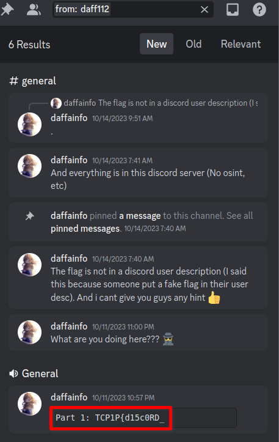

# Another Discord

## Description

> Author: daffainfo
>
> TCP1P has another discord server?
>
> <https://discord.gg/kzrryCUutP>

## Flag

TCP1P{d15c0RD_d0cUM3n74710n_W45_r341ly_H31pFu1}

## Solution

The flag of this challenge is 4 parts.
Part 1 and 3 can be found in Discord GUI application.
Part 2 and 4 can be found to call Discord API.

Part 1: TCP1P{d15c0RD_

- VOICE CHANNELS > General > Open Chat
- Or, I can find by searching this challenge author.

    

Part 3: 45_r341ly

- There is it in Event page (no screenshot)

Part 2: d0cUM3n74710n_W

Part 4: _H31pFu1}

Call Discord API to get channels list and guilds details.
Authorization token can be obtained from an existing request with Browser Developer Tools (e.g. Chrome Developer Tools).

```console
$ TOKEN=(snip)
$ curl -sH "Authorization: $TOKEN" https://discordapp.com/api/v6/guilds/1154468492259627008 | jq
(snip)
      "name": "Part 2: d0cUM3n74710n_W",

$ curl -sH "Authorization: $TOKEN" https://discordapp.com/api/v6/guilds/1154468492259627008/channels | jq
(snip)
    "name": "Part 4: _H31pFu1}",
```

## References

- similar challenge: <https://hackmd.io/@8sthe671QdO-yQmAR_4ZJw/SJBOjTAUI#First-Chall>
