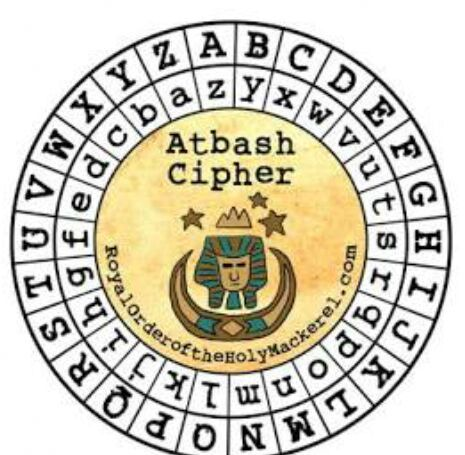

# What Are You Doing In My Swamp? [209 Solves]

## Description

> This challenge is like ogres, it has **layers**
>
> Attachments: layers.jpg

## Flag

TUCTF{OgRes_aRe_lIke_oniLns}

## Solution

Tools: [stegseek](https://github.com/RickdeJager/stegseek)

```console
$ file layers.jpg
layers.jpg: data

$ hd layers.jpg | head -1
00000000  00 00 00 e0 00 10 4a 46  49 46 00 01 01 00 00 01  |......JFIF......|

$ hd layers.jpg | tail -2
0000c950  00 14 51 45 00 7f 00 00                           |..QE....|
0000c958
```

- [pics/binary/JPG.png at master · corkami/pics](https://github.com/corkami/pics/blob/master/binary/JPG.png)

It looks like JPEG file, but the first 4 bytes and last 2 bytes of the file are filled with \x00.
Fix it.

```console
$ printf "\xff\xd8\xff\xe0" | dd conv=notrunc of=layers.jpg bs=1 seek=0
4+0 records in
4+0 records out
4 bytes copied, 0.000103813 s, 38.5 kB/s

$ printf "\xff\xd9" | dd conv=notrunc of=layers.jpg bs=1 seek=$((0x0000c956))
2+0 records in
2+0 records out
2 bytes copied, 0.000128065 s, 15.6 kB/s

$ hd layers.jpg | head -1
00000000  ff d8 ff e0 00 10 4a 46  49 46 00 01 01 00 00 01  |......JFIF......|

$ hd layers.jpg | tail -2
0000c950  00 14 51 45 00 7f ff d9                           |..QE....|
0000c958

$ file layers.jpg
layers.jpg: JPEG image data, JFIF standard 1.01, aspect ratio, density 1x1, segment length 16, baseline, precision 8, 465x455, components 3
```

Fixed layers.jpg is:



It's Atbash Cipher, but there is no cipher message at the moment.

```console
$ stegseek layers.jpg
StegSeek 0.6 - https://github.com/RickdeJager/StegSeek

[i] Found passphrase: "layers"
[i] Original filename: "secret_message.txt".
[i] Extracting to "layers.jpg.out".

$ file layers.jpg.out
layers.jpg.out: ASCII text

$ cat layers.jpg.out

GFXGU{LtIvh_zIv_oRpv_lmrOmh}


######################################################################################
#                                                                                    #
#                            ,.--------._                                            #
#                           /            ''.                                         #
#                         ,'                \     |"\                /\          /\  #
#                /"|     /                   \    |__"              ( \\        // ) #
#               "_"|    /           z#####z   \  //                  \ \\      // /  #
#                 \\  #####        ##------".  \//                    \_\\||||//_/   #
#                  \\/-----\     /          ".  \                      \/ _  _ \     #
#                   \|      \   |   ,,--..       \                    \/|(O)(O)|     #
#                   | ,.--._ \  (  | ##   \)      \                  \/ |      |     #
#                   |(  ##  )/   \ `-....-//       |///////////////_\/  \      /     #
#                     '--'."      \                \              //     |____|      #
#                  /'    /         ) --.            \            ||     /      \     #
#               ,..|     \.________/    `-..         \   \       \|     \ 0  0 /     #
#            _,##/ |   ,/   /   \           \         \   \       U    / \_//_/      #
#          :###.-  |  ,/   /     \        /' ""\      .\        (     /              #
#         /####|   |   (.___________,---',/    |       |\=._____|  |_/               #
#        /#####|   |     \__|__|__|__|_,/             |####\    |  ||                #
#       /######\   \      \__________/                /#####|   \  ||                #
#      /|#######`. `\                                /#######\   | ||                #
#     /++\#########\  \                      _,'    _/#########\ | ||                #
#    /++++|#########|  \      .---..       ,/      ,'##########.\|_||  Donkey By     #
#   //++++|#########\.  \.              ,-/      ,'########,+++++\\_\\ Hard'96       #
#  /++++++|##########\.   '._        _,/       ,'######,''++++++++\                  #
# |+++++++|###########|       -----."        _'#######' +++++++++++\                 #
# |+++++++|############\.     \\     //      /#######/++++ S@yaN +++\                #
#      ________________________\\___//______________________________________         #
#     / ____________________________________________________________________)        #
#    / /              _                                             _                #
#    | |             | |                                           | |               #
#     \ \            | | _           ____           ____           | |  _            #
#      \ \           | || \         / ___)         / _  )          | | / )           #
#  _____) )          | | | |        | |           (  __ /          | |< (            #
# (______/           |_| |_|        |_|            \_____)         |_| \_)           #
#                                                                           19.08.02 #
######################################################################################
```

[CyberChef | Atbash Cipher](https://gchq.github.io/CyberChef/#recipe=Atbash_Cipher()&input=R0ZYR1V7THRJdmhfekl2X29ScHZfbG1yT21ofQ)

TUCTF{OgRes_aRe_lIke_oniLns}
