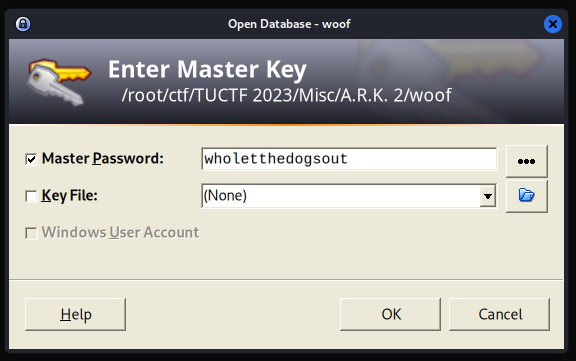
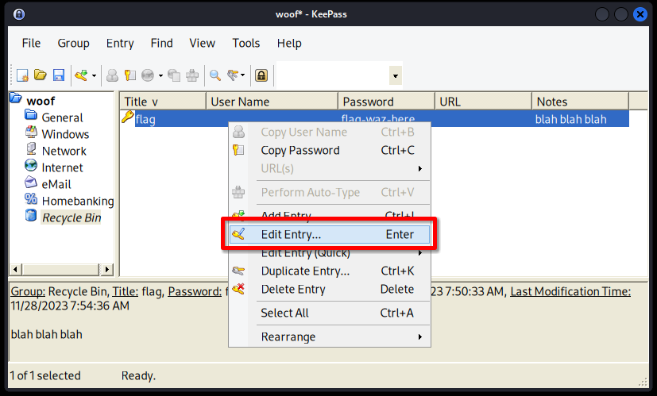
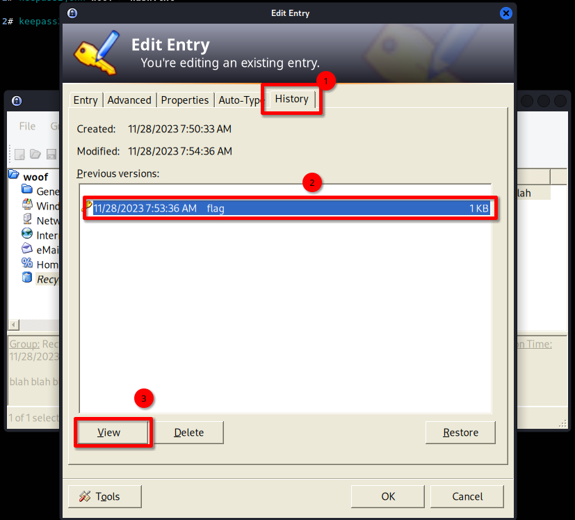
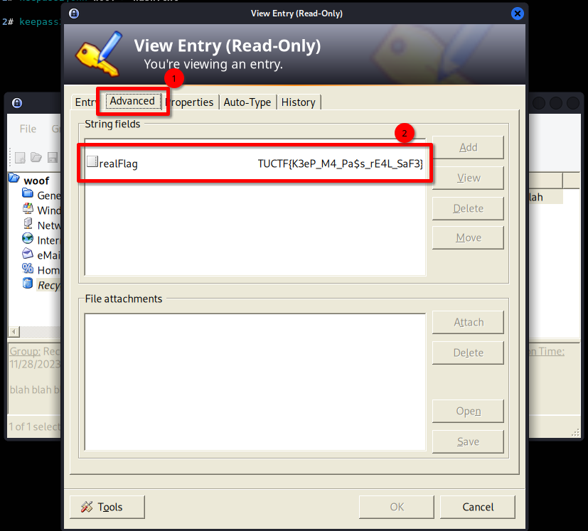

# A.R.K. 2 [151 Solves]

## Description

> Woof woof bark bark (Note: to speed up the process, only include entries containing "dog" in your attempts)
>
> Attachments: woof

## Flag

TUCTF{K3eP_M4_Pa$s_rE4L_SaF3}

## Solution

Tools:

- [keepass2john](https://github.com/openwall/john/blob/bleeding-jumbo/src/keepass2john.c)
- [John the Ripper](https://github.com/openwall/john)
- [KeePass](https://keepass.info/)

```console
$ file woof
woof: Keepass password database 2.x KDBX

$ keepass2john woof > hash.txt

$ grep dog /usr/share/wordlists/rockyou.txt > dog.txt

$ john hash.txt --wordlist=dog.txt
Using default input encoding: UTF-8
Loaded 1 password hash (KeePass [SHA256 AES 32/64])
Cost 1 (iteration count) is 60000 for all loaded hashes
Cost 2 (version) is 2 for all loaded hashes
Cost 3 (algorithm [0=AES 1=TwoFish 2=ChaCha]) is 0 for all loaded hashes
Will run 8 OpenMP threads
Press 'q' or Ctrl-C to abort, almost any other key for status
wholetthedogsout (woof)
1g 0:00:00:05 DONE (2023-12-02 02:49) 0.1769g/s 169.9p/s 169.9c/s 169.9C/s bulldogs00..the dog
Use the "--show" option to display all of the cracked passwords reliably
Session completed.

$ keepass2 --version
KeePass 2.47
Copyright © 2003-2021 Dominik Reichl

$ keepass2 woof
```



unhide password Ctrl-H.



`flag-waz-here` is "flag was here".
This means that the flag is not present here now, but it was present in the past.

Checking Recycle Bin and history:



Restoring an old password from the Recycle Bin:



View button in right, and it can copy the flag.
