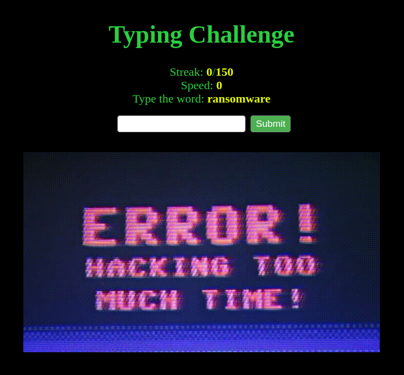

# Hacker Typer [292 Solves]

## Description

> Only the most leet hackers can type faster than my bot. Can you beat it?
>
> <https://hacker-typer.tuctf.com>

## Flag

TUCTF{SuP3R_Typ3R}

## Solution



Iterate the process of entering the string displayed on `Type the word` in 150 times.
First Time, extract the correct word from the HTML.
From the second time onward, extract it from the JSON since the response after submission is JSON.

```python
# solver.py
import requests
import re

requests.packages.urllib3.disable_warnings()
s = requests.Session()
# s.proxies = {"http": "http://127.0.0.1:8080", "https": "http://127.0.0.1:8080"}
s.verify = False


def main():
    BASE_URL = "https://hacker-typer.tuctf.com"

    res = s.get(BASE_URL)
    m = re.findall(r'Type the word: <strong name="word-title">(.*?)</strong>', res.text)
    if not m:
        print("not matched.")
        return

    word = m[0]

    try:
        for _ in range(151):
            res = s.post(f"{BASE_URL}/check_word", data={"word": word})
            res = res.json()
            word = res["next_word"]
    except:
        print(res)

    print(res)


if __name__ == "__main__":
    main()
```

result:

```console
$ python3 solver.py
{'next_word': ' ', 'status': "You're fast! TUCTF{SuP3R_Typ3R}", 'typing_speed': 0}
```
