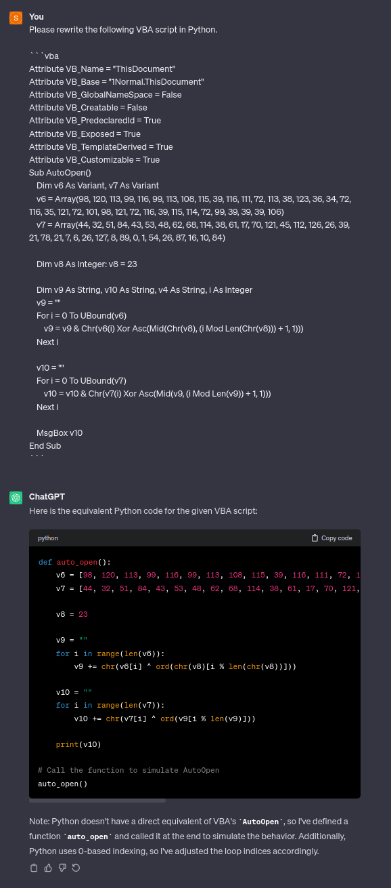

# EnableMe [150 Solves]

## Description

> You've received a confidential document! Follow the instructions to unlock it.
>
> Note: This is not malware
>
> Author: SteakEnthusiast
>
> Attachments: invoice.docm

## Short Solution

- VBA macro

## Solution

```console
$ file invoice.docm
invoice.docm: Microsoft Word 2007+
```

The extension is doc**m** and this is a Microsoft Word macro-enabled document.
I used [oledump](https://github.com/DidierStevens/DidierStevensSuite/blob/master/oledump.py) to dump a VBA macro.

```console
$ python3 ~/tools/DidierStevensSuite/oledump.py invoice.docm -v
A: word/vbaProject.bin
 A1:       410 'PROJECT'
 A2:        65 'PROJECTwm'
 A3: m     689 'VBA/Module1'
 A4: M    4487 'VBA/ThisDocument'
 A5:      2889 'VBA/_VBA_PROJECT'
 A6:      2055 'VBA/__SRP_0'
 A7:       182 'VBA/__SRP_1'
 A8:      3188 'VBA/__SRP_2'
 A9:       156 'VBA/__SRP_3'
A10:       572 'VBA/dir'

$ python3 ~/tools/DidierStevensSuite/oledump.py invoice.docm -v -s 4
```

Output:

```vba
Attribute VB_Name = "ThisDocument"
Attribute VB_Base = "1Normal.ThisDocument"
Attribute VB_GlobalNameSpace = False
Attribute VB_Creatable = False
Attribute VB_PredeclaredId = True
Attribute VB_Exposed = True
Attribute VB_TemplateDerived = True
Attribute VB_Customizable = True
Sub AutoOpen()
    Dim v6 As Variant, v7 As Variant
    v6 = Array(98, 120, 113, 99, 116, 99, 113, 108, 115, 39, 116, 111, 72, 113, 38, 123, 36, 34, 72, 116, 35, 121, 72, 101, 98, 121, 72, 116, 39, 115, 114, 72, 99, 39, 39, 39, 106)
    v7 = Array(44, 32, 51, 84, 43, 53, 48, 62, 68, 114, 38, 61, 17, 70, 121, 45, 112, 126, 26, 39, 21, 78, 21, 7, 6, 26, 127, 8, 89, 0, 1, 54, 26, 87, 16, 10, 84)

    Dim v8 As Integer: v8 = 23

    Dim v9 As String, v10 As String, v4 As String, i As Integer
    v9 = ""
    For i = 0 To UBound(v6)
        v9 = v9 & Chr(v6(i) Xor Asc(Mid(Chr(v8), (i Mod Len(Chr(v8))) + 1, 1)))
    Next i

    v10 = ""
    For i = 0 To UBound(v7)
        v10 = v10 & Chr(v7(i) Xor Asc(Mid(v9, (i Mod Len(v9)) + 1, 1)))
    Next i

    MsgBox v10
End Sub
```

I don't have the environment to execute a VBA script and cannot execute it so I have ChatGPT rewrite it in Python:



This generated Python script only prints `YOU HAVE BEEN HACKED! Just kidding :)` not flag.

```python
>>> v6 = [98, 120, 113, 99, 116, 99, 113, 108, 115, 39, 116, 111, 72, 113, 38, 123, 36, 34, 72, 116, 35, 121, 72, 101, 98, 121, 72, 116, 39, 115, 114, 72, 99, 39, 39, 39, 106]
>>> ''.join([chr(c) for c in v6])
'bxqctcqls\'toHq&{$"Ht#yHebyHt\'srHc\'\'\'j'
>>> v7 = [44, 32, 51, 84, 43, 53, 48, 62, 68, 114, 38, 61, 17, 70, 121, 45, 112, 126, 26, 39, 21, 78, 21, 7, 6, 26, 127, 8, 89, 0, 1, 54, 26, 87, 16, 10, 84]  # fmt: skip
>>> ''.join([chr(c) for c in v7])
", 3T+50>Dr&=\x11Fy-p~\x1a'\x15N\x15\x07\x06\x1a\x7f\x08Y\x00\x016\x1aW\x10\nT"
```

The `v6` and `v7` variables are arrays and joining their respective values will not yeld the flag.
I append a one line to print the `v9` variable:

```python
def auto_open():
    v6 = [98, 120, 113, 99, 116, 99, 113, 108, 115, 39, 116, 111, 72, 113, 38, 123, 36, 34, 72, 116, 35, 121, 72, 101, 98, 121, 72, 116, 39, 115, 114, 72, 99, 39, 39, 39, 106]
    v7 = [44, 32, 51, 84, 43, 53, 48, 62, 68, 114, 38, 61, 17, 70, 121, 45, 112, 126, 26, 39, 21, 78, 21, 7, 6, 26, 127, 8, 89, 0, 1, 54, 26, 87, 16, 10, 84]

    v8 = 23

    v9 = ""
    for i in range(len(v6)):
        v9 += chr(v6[i] ^ ord(chr(v8)[i % len(chr(v8))]))

    print(v9)  # add here

    v10 = ""
    for i in range(len(v7)):
        v10 += chr(v7[i] ^ ord(v9[i % len(v9)]))

    print(v10)


if __name__ == "__main__":
    auto_open()
```

Execution Result:

```console
$ python3 autoopen.py
uoftctf{d0cx_f1l35_c4n_run_c0de_t000}
YOU HAVE BEEN HACKED! Just kidding :)
```

Got the flag.

## Flag

uoftctf{d0cx_f1l35_c4n_run_c0de_t000}
