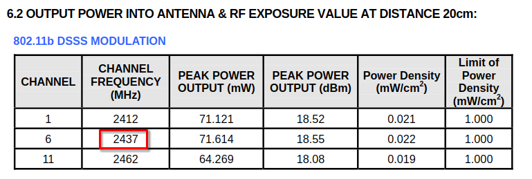

# Baby's First IoT Flag 1 [303 Solves]

## Description

> See introduction for complete context.
>
> - Part 1 - Here is an FCC ID, Q87-WRT54GV81, what is the frequency in MHz for Channel 6 for that device? Submit the answer to port 3895.

## Solution

- [RF Exposure Info Q87-WRT54GV81 RF Exposure Info](https://fcc.report/FCC-ID/Q87-WRT54GV81/861595)



```console
$ printf '2437\n\0' | nc 35.225.17.48 3895
Enter the frequency in MHZ for channel 6: Access granted! The Flag is {FCC_ID_Recon}! 
```

## Flag

{FCC_ID_Recon}
