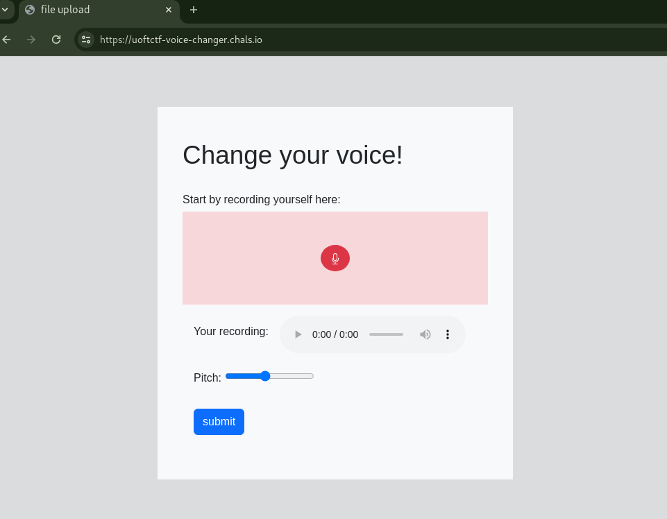
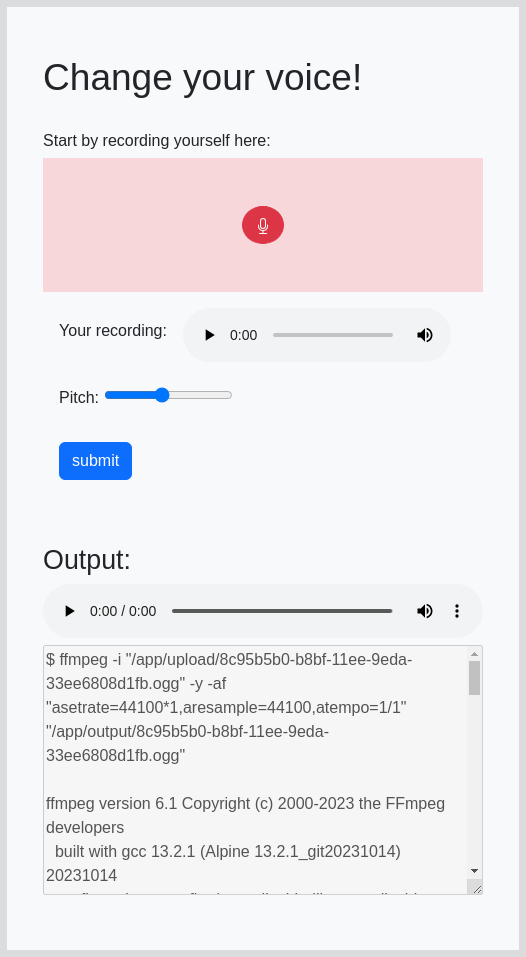
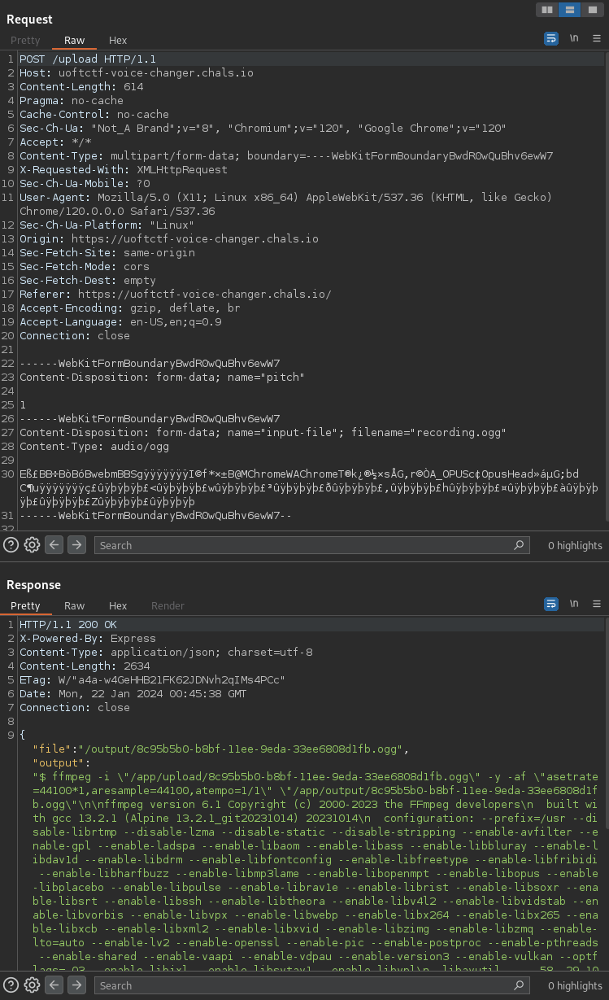
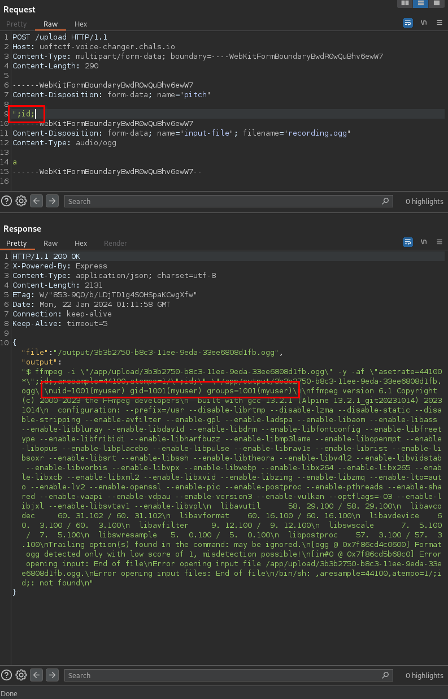
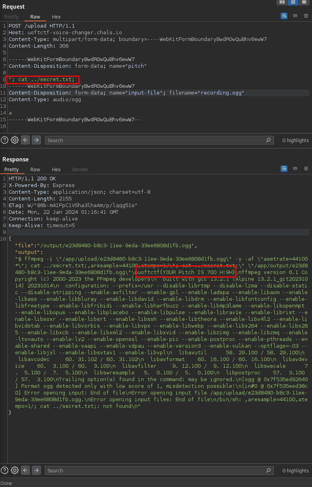

# Voice Changer [206 Solves]

## Description

> I made a cool app that changes your voice.
>
> Author: Ido
>
> `https://uoftctf-voice-changer.chals.io/`

## Short Solution

Argument Injection in [POST] /upload pitch parameter.

## Solution

### Explore functionality

Recording and submitting:

The ffmpeg command that appears to have been executed on the server side has been output.
At this time, [POST] /upload request was sent:

### Argument Injection

I send the previous request to Burp Repeater and remove unnecessary headers.
And, I inject `id` command in the pitch parameter:

The result of `id` command is got so exploit Argument Injection.
Now, all that's left is to retrieve the flag.

## Flag

uoftctf{Y0UR Pitch IS 70O H!9H}
